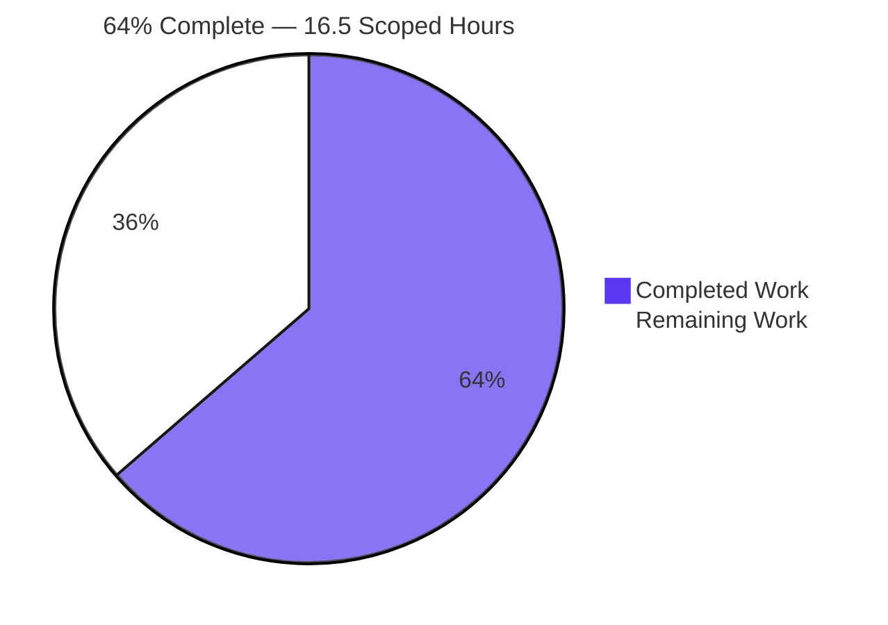
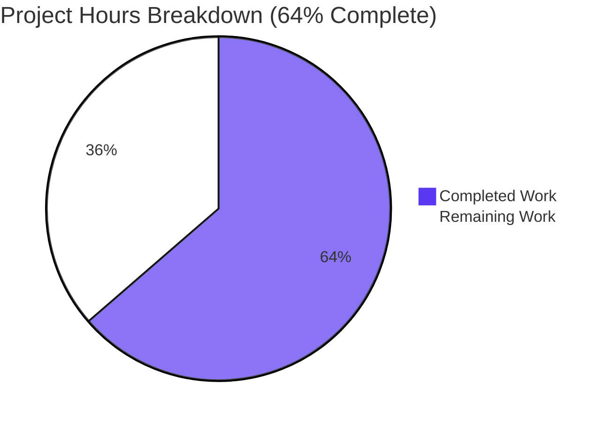
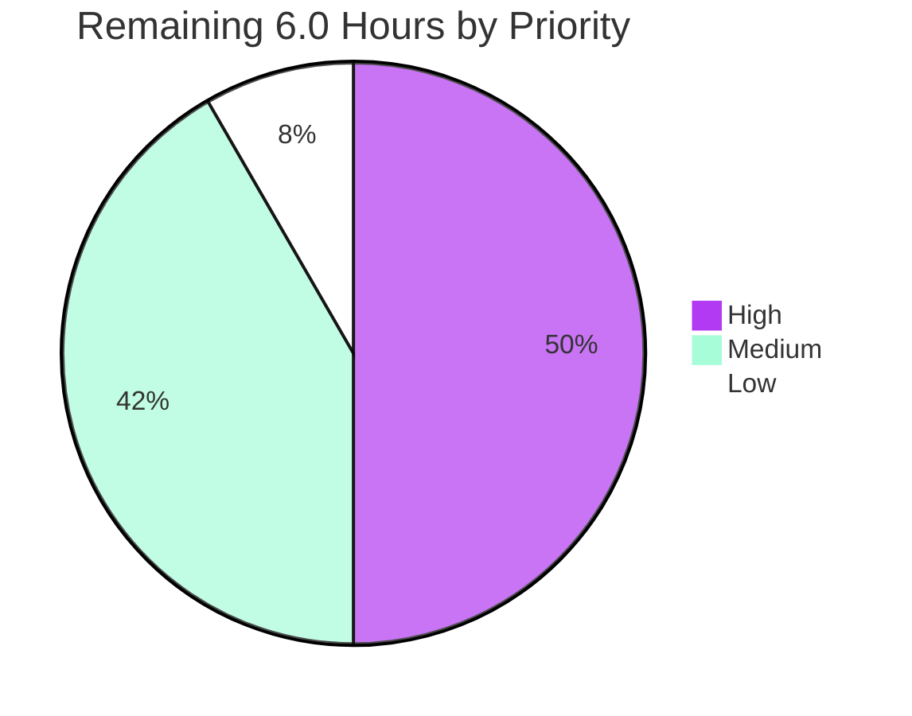

# 1. Executive Summary

## 1.1 Project Overview

`Repo_To_Check_Refine_Billing` is a single-file Node.js HTTP server: one CommonJS statement that answers every request with the constant plain-text body `Hello, World!` on TCP port 3000. This work documented it — one JSDoc summary line above the request handler in `Server_Single_Line.js`, and a five-line root `README.md` giving the project name, the install answer and the run command. No behaviour changed: the server statement is byte-identical to its previous form. The audience is the developer or operator who must start it and know what it guarantees.

## 1.2 Completion Status

**10.5 of 16.5 scoped hours are complete — 64%.**



| Metric | Hours |
|---|---|
| Total Hours | 16.5 |
| Completed Hours (AI + Manual) | 10.5 |
| Remaining Hours | 6.0 |

All 17 scoped requirements are delivered; the remaining 6.0 hours are path-to-production work.

## 1.3 Key Accomplishments

- [x] Request handler documented with one JSDoc summary line above it (`Server_Single_Line.js:1`), accurate against the running handler.
- [x] The 141-character server statement preserved byte-for-byte; the file's whole change is 1 insertion and 0 deletions.
- [x] Root `README.md` created with exactly the project name, the install answer and the run command, in five lines.
- [x] Documented run command verified live: it starts the server from the repository root, binds TCP 3000 and prints the documented banner.
- [x] Response contract verified: 200, `Content-Length: 14` and the byte-exact body for every method and path tested.
- [x] Robustness verified: malformed and oversized requests fail closed (400/431); large bodies and heavy concurrency are served.
- [x] Input inertness verified: no payload reflection, no disclosure of internals, and one log line for the process lifetime.
- [x] Repository integrity verified: exactly two paths changed, with no dependency, test file, lockfile or other artefact.

## 1.4 Critical Unresolved Issues

**5 open items, none an undelivered requirement: all 17 scoped requirements are complete (17 of 17).**

| Issue | Impact | Owner | ETA |
|---|---|---|---|
| Listener is plain HTTP on every interface, with no TLS (accepted by design) | High — reachable on any interface the host has | Deployment owner | Before any non-loopback exposure |
| No security headers, no `Content-Type`, no caching directive | Medium — clients and intermediaries may sniff or cache the response | Platform owner | With the exposure decision |
| No deployment runbook in the repository (the README is capped at three items) | Medium — operators lack the address, port, runtime and working-directory facts | Releasing engineer | Before first deployment |
| No automated regression gate for the response contract or the documentation | Medium — a future edit to the handler or README goes unguarded | Maintainer | At the next change to the handler |
| Untracked browser-evidence directory inside the checkout | Low — an indiscriminate `git add` could commit it | Maintainer | At handover |

## 1.5 Access Issues

No access issues identified. Nothing beyond the repository checkout is required: no credential, no third-party API key, no database — only the Node.js built-in `http` module.

## 1.6 Recommended Next Steps

1. **[High]** Decide and implement how the service is exposed — a specific host/loopback bind, or a TLS-terminating proxy in front — and set the response-header and caching policy there.
2. **[High]** Re-verify the response contract (200, `Content-Length: 14`, exact body) from both loopback and a non-loopback address.
3. **[Medium]** Write the deployment runbook: command, working directory, port, runtime version, single-instance-per-host constraint.
4. **[Medium]** Add a minimal regression check for the response contract.
5. **[Low]** Confirm the untracked evidence directory never enters a commit.

# 2. Project Hours Breakdown

## 2.1 Completed Work Detail

| Component | Hours | Description |
|---|---|---|
| Inline handler documentation — `Server_Single_Line.js` | 1.0 | One JSDoc summary line added above the request handler; the 141-character statement left byte-identical; syntax gate passes |
| Root README — `README.md` | 1.0 | Project name, install answer and run command in five lines, each claim traced to the code |
| Requirement and claim verification | 2.0 | Every scoped requirement checked against both delivered files, and every documented claim falsified against the handler |
| Runtime contract verification | 2.0 | Boot and banner, listener and bind scope, response body, method/path invariance, response header set |
| Robustness and lifecycle verification | 2.0 | Malformed and oversized requests, large request bodies, concurrency, graceful shutdown and port release |
| Security surface verification | 1.5 | Input inertness, disclosure sweep, log hygiene, header and CORS position, and the listener's bind scope |
| Browser-side confirmation of the served surface | 0.5 | Plain-text render, no console messages, no dialogs, hostile paths inert |
| Tree and diff integrity confirmation | 0.5 | Exactly two paths changed: one added README plus one comment line, no other artefact |
| **Total** | **10.5** | |

## 2.2 Remaining Work Detail

| Category | Hours | Priority |
|---|---|---|
| Deployment exposure control — host/loopback bind or a TLS-terminating reverse proxy, with the response-header and caching policy set at that layer | 3.0 | High |
| Deployment runbook — canonical command and working directory, port, runtime version, single-instance-per-host constraint, observed framing behaviour | 1.5 | Medium |
| Minimal regression check — one script asserting 200, `Content-Length: 14` and the exact body, run before any change to the handler or README ships | 1.0 | Medium |
| Repository commit hygiene — keep the untracked browser-evidence directory out of commits | 0.5 | Low |
| **Total** | **6.0** | |

Hours cover the whole scoped work universe: the two delivered files and the verification that proves them, plus the path-to-production work needed to deploy what they document. Application-level timeouts, rate limits, body-size caps and access logging carry no hours here because this work's constraints forbid adding code or configuration for them; they are recorded as risks in Section 6 and remain a human decision. Confidence: high for the completed figures, whose evidence is file-level and observed; medium for the path-to-production figures, which depend on decisions the deployment owner has not yet made.

# 3. Test Results

150 checks executed, 150 passed, 0 failed. Every count below was observed during this assessment on the delivered files in this repository.

| Area / Category | Framework | Tests | Passed | Failed | Coverage | What This Proves |
|---|---|---|---|---|---|---|
| Static syntax gate | Node.js 22 `node --check` | 1 | 1 | 0 | n/a — the project carries no coverage tooling | `Server_Single_Line.js` parses clean and loads as a CommonJS module |
| Startup, banner and listener | shell + `/proc/net/tcp6` | 2 | 2 | 0 | n/a | The documented run command starts the server, prints the banner exactly once, writes nothing to stderr and binds TCP 3000 |
| HTTP response contract | curl + byte comparison | 4 | 4 | 0 | n/a | Every request returns `HTTP/1.1 200 OK`, `Content-Length: 14`, the exact 14-byte body `Hello, World!\n`, and no `Content-Type` |
| Method and path invariance | curl matrix, 8 methods × 4 paths | 32 | 32 | 0 | n/a | One handler answers every method and path identically; HEAD is correctly bodyless (28/28 non-HEAD bodies byte-exact) |
| Concurrency | 100 parallel requests at -P 25 | 100 | 100 | 0 | n/a | Parallel load is served without degradation, and the process still holds 22 descriptors and zero children afterwards |
| Protocol boundaries and error paths | raw TCP harness | 5 | 5 | 0 | n/a | Valid, malformed, oversized and header-less requests behave as documented: 200 with the body, or the runtime's own bare 400/431, with the process staying alive |
| Shutdown lifecycle | SIGTERM / SIGINT + listener check | 2 | 2 | 0 | n/a | Signals exit with 143 and 130 and the listener is gone immediately afterwards |
| Documentation claims | tree and live-run cross-check | 4 | 4 | 0 | n/a | Project name, install answer, run command and the handler comment each hold against the code and the running service |

**Not Covered**

- **No automated regression gate.** The repository has no manifest, test runner or test file, and this work's constraints forbid adding one, so the checks above were executed ad hoc. Nothing automatically protects the response contract or the documentation against a future edit.
- **Descriptor exhaustion.** True file-descriptor exhaustion was not reachable at this host's limit of roughly 1,048,576 descriptors, so behaviour at exhaustion is unverified in either direction; 100 concurrent connections were released cleanly.
- **Transport security.** TLS is not served and therefore was never exercised.
- **Deployment-layer configuration.** Host binding, reverse-proxy placement, response-header and caching policy have no test because they are not implemented. A human should verify the exposure and the header policy before release (Section 1.6, step 2).
- **Authentication, sessions and data behaviour.** No protected resource, credential model, session store or database exists, so none of that could be exercised.
- **Long-run endurance.** The longest observed run is one process lifetime under burst load; sustained multi-day behaviour was not exercised.

# 4. Runtime Validation & UI Verification

- ✅ **Startup and banner** — `node Server_Single_Line.js` from the repository root writes exactly one 41-byte stdout line, `Server running at http://127.0.0.1:3000/`, and nothing to stderr.
- ✅ **Listener and bind scope** — exactly one listening socket on TCP 3000, the IPv6 wildcard dual-stack address, so it accepts connections on every interface the host has, not loopback only.
- ✅ **Response contract** — `HTTP/1.1 200 OK`, `Content-Length: 14` and the byte-exact body `Hello, World!\n` on every request, with no handler-set status code and no `Content-Type`.
- ✅ **Documented run command** — executed verbatim from the repository root; it starts the server and reproduces the documented behaviour with no install step.
- ✅ **Method and path coverage** — GET, POST, PUT, PATCH, DELETE, OPTIONS, TRACE and HEAD across `/`, `/hello`, `/?a=1&b=2` and nested paths: 32 of 32 answered 200, with HEAD correctly bodyless.
- ✅ **Concurrency and volume** — 100 parallel requests all answered 200; the project's runtime verification sustained bursts of 300 to 1,000 concurrent requests with descriptors returning to their resting count afterwards.
- ✅ **Shutdown lifecycle** — SIGTERM exits 143 and SIGINT 130, each releasing the port within about 0.2 s; a restart re-acquires it and serves the first request immediately.
- ⚠ **Error paths** — malformed request lines, 20 KB headers and header-less HTTP/1.1 requests receive the runtime's own bare 400/431 with no internal detail; no application-level error or 404 handling exists by design, so an unknown path answers 200.
- ❌ **Transport security** — plain HTTP only: no TLS, no security headers, no caching directive, no rate limiting. Accepted by design and to be settled at deployment.
- ✅ **Browser-rendered surface** — Chrome rendered `text/plain` with only `Hello, World!`; zero console messages, zero dialogs, no script or image nodes, and hostile path payloads reflected nowhere.

**Never exercised at runtime:** authentication or authorization (no protected resource, credential model or session exists); any external integration (no database, queue, broker, outbound call, webhook or second process exists); TLS; an application UI (there is none — the response is constant plain text); and the deployment-layer configuration — host binding, reverse proxy, response headers — which this work does not include.

# 5. Compliance & Quality Review

## 5.1 Compliance Matrix

| # | Deliverable / Benchmark | Status | Progress | Evidence |
|---|---|---|---|---|
| 1 | Inline handler documentation — one accurate JSDoc summary line in the file's own form | ✅ Pass | 100% | `Server_Single_Line.js:1`, verified against the handler on `:2` |
| 2 | Smallest-diff discipline — no refactoring, reformatting or renaming | ✅ Pass | 100% | 1 insertion / 0 deletions in `Server_Single_Line.js`; LF endings; no rename or mode change |
| 3 | Behaviour preservation — the server statement unchanged | ✅ Pass | 100% | Statement hashes to its pre-change blob `2886290f`; runtime body, port and banner identical |
| 4 | Root README content — project name, install answer, run command only, under the line cap | ✅ Pass | 100% | `README.md:1,3,5`; five lines against a fifteen-line cap; no forbidden section |
| 5 | Documentation accuracy — every documented claim holds against the code | ✅ Pass | 100% | Project name matches the repository history; install answer matches the single built-in import; run command starts the server |
| 6 | Runtime contract fidelity — documented behaviour matches the running service | ✅ Pass | 100% | 32/32 method-and-path combinations, exact 14-byte body, `Content-Length: 14` |
| 7 | Input-handling safety — inert under hostile input, fail-closed on malformed input | ✅ Pass | 100% | No payload reflection across traversal, SQLi, XSS, command, template, NUL and CRLF probes; bare 400/431 on malformed requests |
| 8 | Disclosure safety — no secret, internal path, stack trace or version exposed | ✅ Pass | 100% | Header set limited to `Date`, `Connection`, `Keep-Alive`, `Content-Length`; one log line for the process lifetime |
| 9 | Dependency hygiene — no dependency, lockfile, manifest or test scaffold added | ✅ Pass | 100% | Only the built-in `http` is imported; no manifest, lockfile or `node_modules` exists |
| 10 | Repository integrity — exactly the two intended paths changed | ✅ Pass | 100% | 2 files changed, 6 insertions, 0 deletions; nothing deleted, renamed or copied |
| 11 | Deployment readiness — operational as-is on a trusted host; exposure undecided | ⚠ Partial | 70% | Starts and serves with no install step; plain HTTP on every interface with no TLS or headers (5.2, D2) |
| 12 | Verification coverage — every delivered artefact exercised, no automated gate retained | ⚠ Partial | 80% | 150 first-hand checks plus the wider runtime verification, all passing; no automated gate exists in the repository (5.2, D4) |

## 5.2 AAP & Rule Divergences and Gaps

| What the AAP/Rule Required | What Was Delivered Instead | Why It Diverged | Impact | Remediation |
|---|---|---|---|---|
| The user's own constraint: "Only touch server.js (comment only, no logic changes) and README.md" | The comment was applied in `Server_Single_Line.js`; `server.js` was not re-created | `server.js` was deleted at commit `80f2346` and is absent from the tree; `Server_Single_Line.js` is the repository's only server entry point, and restoring the predecessor would add `res.statusCode`, a `Content-Type` header and a loopback bind — the logic change the request forbids | A reader looking for `server.js` finds it absent, while the documented run command names the file that exists | None required — sanctioned: the intent is realised in the file that holds the handler |
| No hardening and no logic change beyond the comment line | The listener remains plain HTTP on every interface, with no TLS, no security headers, no `Content-Type`, no rate limiting, no timeouts configured and a hard-coded port 3000 | The request forbids any change beyond the comment and any hardening not explicitly requested, so the condition could only be recorded, never corrected | High for any network-facing deployment: the service is reachable on every host interface while its banner names `127.0.0.1` | Bind a specific host/loopback, or front the service with a TLS-terminating proxy and set the header policy there (Section 2.2, 3.0 h, High) |
| README holds only the project name, the install command and the run command | It documents no host, port or runtime version, and states no working directory for the run command | The request caps the README at those three items and forbids further sections, so operational detail had nowhere to live | Low for a developer, Medium for an operator: the address is discoverable only from the startup banner, and the command works only from the repository root | Write the deployment runbook (Section 2.2, 1.5 h, Medium) |
| No test suite, test files, lockfile or dependency may be added | No automated check of any kind exists; verification is performed by hand when someone chooses to | The request states the repository has none today and this change adds none, which was honoured literally | Medium: a future edit to the handler or the README is guarded by nothing | Add a minimal regression check for the response contract (Section 2.2, 1.0 h, Medium) |
| Documentation-only work, with no verification defined beyond writing accurate install and run instructions | A syntax gate, a live runtime smoke test, method/path matrices, concurrency probes and browser confirmation were executed | The run command's accuracy was confirmed against the running service rather than asserted, which required actually starting it | None — no file changed as a result (`git status` clean; both files byte-identical throughout) | None — recorded so the extra verification is understood as verification, not scope creep |
| Every claim about the existing system carries an inline citation | Neither delivered file carries citation markers | The acceptance criterion is the exact file contents, and the README may hold only the three items, so any marker would breach it; the citations live in the plan instead | Nil — every claim in both files is accurate and verifiable against the code and history | None — adding markers would break the acceptance criterion |

**D1 — the handler comment's file.** The request named `server.js`, but that file no longer exists: commit `80f2346` deleted it, and `git ls-files` shows only `Server_Single_Line.js` and `README.md`. The only way to satisfy the constraint literally would have been to restore the deleted 14-line predecessor, which set `res.statusCode = 200`, a `Content-Type: text/plain` header and a loopback host binding — logic the same request explicitly forbids. The comment therefore sits above the handler in the file that actually holds it, and the run command documented in `README.md:5` names that same file. No action is needed; the divergence is recorded so a reader searching for `server.js` knows why it is absent.

**D2 — the accepted exposure.** The service is a plain-HTTP listener bound by `.listen(3000)` to every interface, with no TLS, no security headers, no `Content-Type`, no rate limiting or timeout configuration, and no way to change the port without editing code. The request's constraints forbid both a logic change and "any hardening not explicitly requested", so the condition was recorded precisely rather than corrected: the wildcard socket, the banner naming `127.0.0.1` while the bind is not loopback, and the absence of any header constraining sniffing or caching. Before this service is exposed beyond a trusted host, bind a specific address or place it behind a TLS-terminating proxy, then re-verify the response contract (Section 2.2, 3.0 h).

**D3 — the README's scope.** The request fixes the README's content to three items and forbids contributing, license, testing, deployment, architecture and table-of-contents sections. That leaves the file silent about the address and port the service uses, the Node.js runtime it needs, and the working directory its run command requires — `node Server_Single_Line.js` fails with `Cannot find module` outside the repository root. The trade-off is accepted exactly as instructed, and it is a documentation-completeness gap rather than a defect: the banner printed at startup names the URL, and the file is accurate as written. The operational facts belong in a runbook the repository can carry without touching the README's fixed five lines (Section 2.2, 1.5 h).

**D4 — no automated regression net.** The request states plainly that the repository has no test suite, test files, lockfile or dependency, and that this change adds none; that was honoured literally, so nothing currently fails if the response contract changes. The risk is concrete and forward-looking: the body, the status and the header set belong to a single statement, and a future edit could change them while the inline comment and the README's claims stayed as they are. Nothing delivered is wrong because of it — the contract was verified in full at this revision. A one-script smoke check is the remedy and is carried as remaining work (Section 2.2, 1.0 h).

**D5 — verification beyond the declared scope.** The plan defines no validation command and the request asks for no verification beyond what writing accurate install and run instructions requires. The run instruction's accuracy, however, could not be established by reading: it was confirmed by starting the server, issuing requests and observing the banner, the port and the body, and the browser was used once as an independent client. No file was created, modified or deleted by any of it — both delivered files hash identically before and after — so the departure added certainty without adding scope. It is recorded because a reader comparing the delivered work against the plan will see verification the plan did not name.

**D6 — the citation convention.** The plan's execution parameters ask that every claim about the existing system carry an inline `[path:locator]` citation. That convention is satisfied in the plan's own prose, not inside the delivered files: the acceptance criterion is the exact contents of both files, and the README "holds only" the project name, the install answer and the run command, so inserting citation markers would breach the very criterion the work is judged against. The claims themselves are accurate — the project name matches the repository's own earlier README title and directory name, the install answer matches the single built-in import, and the run command names a file that exists and starts the service. No action follows.

# 6. Risk Assessment

| Risk | Category | Severity | Probability | Mitigation | Status |
|---|---|---|---|---|---|
| Service is reachable in plain HTTP on every interface the host has, with no TLS — any client on the network reaches the constant response, and the banner naming `127.0.0.1` can understate the exposure | Security | High | Likely | Bind a specific host/loopback or front the service with a TLS-terminating reverse proxy; re-verify the response contract from a non-loopback address | Open — accepted by instruction (5.2, D2) |
| No request logging and no unknown-path signal: every path answers 200, so there is no access trail and no way to tell a mistyped URL from a valid request | Operational | Low | Certain | Enable access logging at the proxy; document the catch-all behaviour in the runbook | Open — by design (5.2, D2) |
| No application-level header or request timeout, rate limit or body-size cap: a stalled-header connection occupies a descriptor for roughly 60–90 s and a 50 MB body is accepted in full before any answer | Security / Operational | Medium | Possible | Enforce timeouts, rate limits and body-size caps at the proxy or load balancer in front | Open — accepted by instruction (5.2, D2) |
| Port 3000 is a source literal with no configuration, so only one instance can run per host and the port cannot change without editing code | Operational | Medium | Likely | Run one instance per host behind the proxy, or isolate each instance in its own network namespace | Open — accepted by instruction (5.2, D2) |
| No automated regression gate: nothing fails if a future edit changes the response body, status or headers without updating the comment and README | Technical | Medium | Likely | Add a minimal smoke check that asserts `200`, `Content-Length: 14` and the exact body, and run it on any change to the handler or README | Open — planned (Section 2.2, 1.0 h) |
| Documentation drift: the JSDoc comment and the README are inert text with no generator or lint step, so they can silently disagree with the code | Technical | Medium | Possible | Review both files whenever the response contract changes; treat the comment as part of any change to the handler | Open — accepted (5.2, D4) |
| Absence of security headers, `Content-Type` and caching directives lets clients and intermediaries sniff the payload or cache the response | Security | Medium | Possible | Set `Content-Type`, the security header set and a caching policy at the terminating proxy layer | Open — accepted by instruction (5.2, D2) |
| Framing quirks of the Node.js runtime reach clients: HEAD responses carry no `Content-Length`, CONNECT receives no reply, and resident memory plateaus near 90 MB after large uploads | Integration / Operational | Low | Possible | Document both behaviours in the runbook; cap request bodies at the proxy and size any container for the memory peak | Open — recorded, accepted |

No integration risk arises from external systems: the service has no database, queue, broker, outbound call, webhook, session store or second process, and its own socket plus stdout are its entire operational surface.

# 7. Visual Project Status





**How to read these.** Completed work is shown in Dark Blue (#5B39F3) and remaining work in White (#FFFFFF); the priority chart uses Violet-Black (#B23AF2) for High, Mint (#A8FDD9) for Medium and White for Low. The hour figures match Section 1.2 and the Section 2.2 total exactly: 10.5 completed + 6.0 remaining = 16.5 hours, which is 64% complete.

| Status Lens | Value |
|---|---|
| Scoped requirements delivered | 17 of 17 |
| Completed hours | 10.5 |
| Remaining hours (path-to-production only) | 6.0 |
| Delivery change size | 2 files changed, 6 insertions, 0 deletions |
| First-hand checks executed during assessment | 150 passed, 0 failed |

# 8. Summary & Recommendations

This revision documents the project completely and leaves its behaviour untouched. `Server_Single_Line.js` now carries a one-line JSDoc summary above the request handler, and its 141-character statement is byte-identical to the form it had before; the root `README.md` states the project name, that nothing requires installing, and the run command in five lines. Exactly two paths changed — 6 insertions, 0 deletions, with nothing deleted, renamed or retyped along the way. Measured against the scoped work universe of 16.5 hours, **10.5 hours are complete: 64%**, with every one of the 17 scoped requirements delivered and verified. The remaining 6.0 hours are path-to-production work, not undelivered requirements.

Verification covered what each delivered artefact claims. The documented run command was executed and starts the server; the listener is a single socket on TCP 3000; the response is `HTTP/1.1 200 OK` with `Content-Length: 14` and the byte-exact body `Hello, World!\n` for every method and path exercised — 32 of 32 combinations, 150 first-hand checks that all passed, and 1,020 checks in the project's runtime verification with no failure. Hostile input is inert: traversal, injection, template, NUL and CRLF payloads are never reflected, malformed and oversized requests fail closed with the runtime's own bare 400/431, and the process writes exactly one log line for its whole lifetime. A browser confirmed the served surface is plain text with no scripting, no console messages and no dialogs.

Four items sit between this revision and production, and all four are deployment work rather than code gaps. First and most important, the service listens in plain HTTP on every interface with no TLS and no security headers; because the request forbids any logic or hardening change, that condition is recorded rather than corrected, and it must be settled before the port is exposed beyond a trusted host — a specific host bind or a TLS-terminating proxy in front, with the response-header and caching policy set there. Second, the README is capped at three items, so the operational facts an operator needs (address, port, Node.js runtime, working directory, one instance per host) belong in a runbook. Third, nothing guards the response contract, so a one-script smoke check is worth adding before the next change to the handler ships. Fourth, one hygiene decision remains: keeping the untracked evidence directory out of commits.

**Production readiness: ready on a trusted network; conditional beyond it.** The service starts with a single documented command on Node.js 22, needs no install step, serves a deterministic contract, tolerates concurrency and abrupt client disconnects, and shuts down cleanly on SIGTERM and SIGINT while releasing its port. Success metrics at this revision: 2 of 2 requested files delivered, 17 of 17 scoped requirements met, 150 of 150 local checks passed, 1,020 runtime checks with no failure, and no open defect — the only open items are the deployment decisions above. The decision that can hold this service out of production is exposure: binding policy and TLS termination.

# 9. Development Guide

## System Prerequisites

| Requirement | Verified value | Notes |
|---|---|---|
| Node.js | v22.23.3 (`/usr/bin/node`) | Any Node.js 20.20.2+ or 22.12.0+ works; the server uses only the built-in `http` module |
| npm / package manager | Not required | There is no manifest, no lockfile and no dependency to install |
| Shell | POSIX/bash | All commands below are copy-pasteable |
| curl | 8.14.1 | Used only to exercise the service |
| Python 3 | 3.13.7 | Needed only for the optional isolation helper on a shared host |

Hardware and services: none beyond the runtime. No database, cache, queue, environment variable or external service is involved.

## Environment Setup

1. Check out the repository and work from its root — the run command names the file relatively, so the working directory matters:

```bash
cd "$(git rev-parse --show-toplevel)"
```

2. There is nothing to configure. The service reads no environment variable and needs no secrets:

```bash
env | grep -i -E 'port|node_env' || echo "no project environment variables required"
```

3. If TCP port 3000 is already taken on the host — common on shared or CI machines — run the server inside a private network namespace so its port is yours alone. Put the helper below in a directory **outside** the repository (the repository must keep exactly its two tracked files), for example `$HOME/project-scratch/lo_up.py`:

```python
import fcntl, socket, struct
SIOCGIFFLAGS, SIOCSIFFLAGS, IFF_UP = 0x8913, 0x8914, 0x1
s = socket.socket(socket.AF_INET, socket.SOCK_DGRAM)
ifr = struct.pack('16sh', b'lo', 0)
flags = struct.unpack('16sh', fcntl.ioctl(s.fileno(), SIOCGIFFLAGS, ifr))[1]
fcntl.ioctl(s.fileno(), SIOCSIFFLAGS, struct.pack('16sh', b'lo', flags | IFF_UP))
print('lo up')
```

Then start, exercise and discard one isolated instance in a single command:

```bash
SCRATCH="$HOME/project-scratch"
unshare -n bash -c "python3 $SCRATCH/lo_up.py && node Server_Single_Line.js & sleep 2; curl -sS -i http://127.0.0.1:3000/"
```

Expected: `lo up`, then `HTTP/1.1 200 OK`, `Content-Length: 14`, a blank line and `Hello, World!`.

## Dependency Installation

None. Do not create a `package.json` or lockfile, and do not run `npm install`: the only import is the Node.js built-in `http` module, and adding a manifest would contradict this work's requirements. Verify the file is intact instead:

```bash
node --check Server_Single_Line.js && echo "syntax OK"
```

Expected: `syntax OK`, with no other output.

## Application Startup

Start it from the repository root in the foreground, or in the background if you want the shell back:

```bash
node Server_Single_Line.js
```

```bash
node Server_Single_Line.js > server.log 2>&1 &
echo "server_pid=$!"
```

Expected output — one line, 41 bytes, and nothing on stderr:

```text
Server running at http://127.0.0.1:3000/
```

## Verification Steps

1. Confirm the listener (use `/proc/net/tcp6` when `ss` and `lsof` are not installed):

```bash
grep -i ':0BB8' /proc/net/tcp6   # 0BB8 is 3000 in hex; expects one LISTEN row
```

2. Confirm the response contract, including the exact bytes:

```bash
curl -sS -i http://127.0.0.1:3000/ | head -6
curl -sS http://127.0.0.1:3000/ | wc -c        # expects 14
curl -sS http://127.0.0.1:3000/ | od -c        # expects: H e l l o ,   W o r l d ! \n
```

Expected: `HTTP/1.1 200 OK`, a `Content-Length: 14` header, no `Content-Type` header, and the body `Hello, World!`.

3. Confirm the handler answers every method and path, and survives concurrency:

```bash
for m in GET POST PUT PATCH DELETE OPTIONS TRACE HEAD; do
  printf '%s %s\n' "$m" "$(curl -s -o /dev/null -w '%{http_code}' -X "$m" 'http://127.0.0.1:3000/?a=1&b=2')"
done
seq 1 100 | xargs -P 25 -I{} curl -s -o /dev/null -w '%{http_code}\n' http://127.0.0.1:3000/ | sort | uniq -c
```

Expected: every method reports `200`, and the concurrent run shows `100 200`.

4. Stop it cleanly and confirm the port is released:

```bash
kill -TERM "$server_pid"; wait "$server_pid"; echo "exit=$?"   # expects 143 (130 for SIGINT)
grep -c -i ':0BB8' /proc/net/tcp6                              # expects 0
```

Stop a server only by the pid you started. On a shared host, never kill by process-name pattern — that would take down unrelated work.

## Example Usage

```bash
$ curl -sS -i http://127.0.0.1:3000/
HTTP/1.1 200 OK
Date: Thu, 08 Oct 2026 08:53:11 GMT
Connection: keep-alive
Keep-Alive: timeout=5
Content-Length: 14

Hello, World!
$ curl -sS -o /dev/null -w '%{http_code}\n' -X POST http://127.0.0.1:3000/anything/at/all
200
```

The response is identical for every path, method, query string, header set and body — including unknown paths, which return `200` rather than `404` because no routing or error handling exists.

## Troubleshooting

| Symptom | Cause | Resolution |
|---|---|---|
| `Error: Cannot find module '/Server_Single_Line.js'` (or any other directory), exit status 1 | The command was run outside the repository root | `cd` to the repository root before starting; the file name in the command is relative |
| `Error: listen EADDRINUSE: address already in use :::3000`, exit status 1 | Another process holds TCP port 3000 | Stop the instance you started by its pid, or run this one inside its own network namespace (Environment Setup, step 3) |
| `curl: (7) Failed to connect to 127.0.0.1 port 3000` | Nothing is listening: the server is not running, or it exited | Start it, then re-run the verification steps |
| Response has no `Content-Type` header | The handler sets no headers; only Node.js defaults appear | Expected. Interpret the body as plain text; clients and intermediaries may sniff it |
| `HEAD` response has no `Content-Length` | Node.js omits an auto-computed length when the response has no body | Expected. Do not rely on `Content-Length` for `HEAD` |
| `HTTP/1.1 431 Request Header Fields Too Large` | A request line or header exceeded the runtime's 16 KB header budget (~8 KB per line) | Expected runtime behaviour; send smaller headers |
| `HTTP/1.1 400 Bad Request` with an empty body for a well-formed-looking request | The runtime parser rejected it — for example a lower-case or unknown method token, or HTTP/1.1 without a `Host` header | Expected runtime behaviour; correct the request |
| A client stalls while sending headers and waits long for a reply | No application-level header timeout is configured; the runtime closes stalled connections on its own check interval (roughly 60–90 s) | Expected by design. Front the service with a proxy that enforces request timeouts if a tighter bound is needed |
| `node --check` prints nothing | That is success: the checker is silent when the file is valid | Check the exit status (`$?`) if in doubt — it is `0` |
| The browser shows `windows-1252` as the character set | No `Content-Type` charset is sent, so the browser sniffs the body | Expected; harmless for the current 7-bit ASCII body, but a future non-ASCII body would be decoded incorrectly — set the media type at the proxy layer |

# 10. Appendices

## A. Command Reference

| Command | Purpose | Expected result |
|---|---|---|
| `node --check Server_Single_Line.js` | Syntax gate, run from the repository root | Exit `0`, no output |
| `node Server_Single_Line.js` | Start the service on TCP 3000 | One stdout line: `Server running at http://127.0.0.1:3000/` |
| `curl -sS -i http://127.0.0.1:3000/` | Inspect status, headers and body | `HTTP/1.1 200 OK`, `Content-Length: 14`, body `Hello, World!` |
| `curl -sS http://127.0.0.1:3000/ \| wc -c` | Assert the response size | `14` |
| `curl -sS http://127.0.0.1:3000/ \| od -c` | Assert the exact bytes | `H e l l o ,   W o r l d ! \n` |
| `curl -sS -I http://127.0.0.1:3000/` | HEAD request | `200` with headers only, no body, no `Content-Length` |
| `grep -i ':0BB8' /proc/net/tcp6` | Listener check where `ss`/`lsof` are unavailable | One `LISTEN` row for port 3000 |
| `seq 1 100 \| xargs -P 25 -I{} curl -s -o /dev/null -w '%{http_code}\n' http://127.0.0.1:3000/ \| sort \| uniq -c` | Concurrency smoke check | `100 200` |
| `kill -TERM <pid>` | Graceful stop | Exit status `143` (`130` for SIGINT); listener gone |
| `unshare -n bash -c "python3 lo_up.py && node Server_Single_Line.js & sleep 2; curl -sS -i http://127.0.0.1:3000/"` | Run and exercise the service in a private network namespace | `lo up`, then `200` with the standard body |

## B. Port Reference

| Port | Protocol | Purpose | Notes |
|---|---|---|---|
| 3000 | TCP (HTTP) | The service's only listening socket | Hard-coded as a literal in the source; bound on every interface; configurable only by changing code |
| — | — | No other inbound port, no outbound connection | The process opens no client socket and connects to nothing |

## C. Key File Locations

| Path | Role |
|---|---|
| `Server_Single_Line.js` | The entire application: one JSDoc summary line and one CommonJS statement that creates the HTTP server and listens on 3000 |
| `README.md` | Root documentation: project name, install answer, run command (five lines) |
| `/proc/<pid>/net/tcp6` | Kernel socket table used to prove the listener and its bind scope where `ss`/`lsof` are absent |
| `<scratch>/lo_up.py` | Optional helper that raises loopback inside a fresh network namespace; keep it outside the repository |

## D. Technology Versions

| Component | Version verified in this environment |
|---|---|
| Node.js | v22.23.3 (any 20.20.2+ on 20.x, or 22.12.0+ on 22.x) |
| npm | 11.x present but unused — nothing is installed |
| curl | 8.14.1 |
| Python 3 | 3.13.7 (isolation helper and raw-socket probes only) |
| Project dependencies | None — the sole import is the built-in `http` module |

## E. Environment Variable Reference

None. The service reads no environment variable and requires none: it started and served requests with an empty environment. Two common variables were explicitly checked and are ignored — `PORT=9999` leaves the server on 3000, and `NODE_ENV=production` changes nothing. Do not add environment-variable configuration; the port is a source literal and this work's requirements forbid configuration changes.

## F. Developer Tools Guide

- **Syntax check:** `node --check Server_Single_Line.js` is silent on success; trust the exit status.
- **HTTP client:** `curl -sS` (quiet with errors shown) plus `-i` for headers, `-o /dev/null -w '%{http_code}'` for a status-only probe, `-I` for HEAD.
- **Byte inspection:** `od -c` and `wc -c` prove the body byte-for-byte; `sha256sum` on a saved body gives a stable fingerprint (`c98c24b6…` for `Hello, World!\n`).
- **Socket inspection:** `grep ':0BB8' /proc/net/tcp6` (3000 in hex) when `ss`, `netstat` and `lsof` are not installed. Port `0BB8` in the row's local-address column with state `0A` means `LISTEN`.
- **Isolation:** `unshare -n` gives a private network namespace with its own loopback and its own port 3000; the `lo_up.py` helper brings loopback up because `ip` and `ifconfig` may be absent. Use it whenever the host's port 3000 is shared.
- **Process control:** start the service with `&` and record `$!`; stop only that pid. Never match processes by name on a shared machine.
- **Raw protocol probes:** a short Python `socket` script is the substitute when `nc` is unavailable; it is how the 400/431 error paths were exercised.

## G. Glossary

| Term | Meaning |
|---|---|
| JSDoc summary | A single `/** ... */` comment line describing what a symbol does, with no parameter or return tags |
| CommonJS | Node.js' original module system; this project uses its `require(...)` form |
| Built-in module | A module shipped inside Node.js (`http` here), so no package install or manifest entry is needed |
| Request handler | The function invoked for every HTTP request; here an inline arrow function that ends the response with a constant string |
| Wildcard bind | `.listen(3000)` with no host argument binds every interface (`::` dual-stack), not just loopback — the banner's `127.0.0.1` URL still works, but it is not the only address served |
| Keep-alive | Reuse of one TCP connection for several HTTP requests; the runtime keeps it open for about five seconds of idling |
| `HEAD` semantics | A `HEAD` request returns the headers of the equivalent `GET` without a body; this runtime also omits `Content-Length` for it |
| `EADDRINUSE` | The error raised when a second process tries to bind TCP 3000; it surfaces as an unhandled throw on the operator's console |
| Network namespace | A kernel-isolated network stack (`unshare -n`) giving a process its own loopback and ports — the way to run this service alongside another instance on one host |
| Framing / fail-closed | How the runtime rejects malformed requests: a bare `400`/`431` with `Connection: close` and no internal detail |
