# Technical Specification

# 1. Introduction

## 1.1 Executive Summary

### 1.1.1 Project Overview

The repository `Repo_To_Check_Refine_Billing` (remote `https://github.com/lakshya-blitzy/Repo_To_Check_Refine_Billing.git`) is a nearly empty Node.js codebase. Its entire implementation is one 142-byte file, `Server_Single_Line.js`, holding a single JavaScript statement. That statement starts an HTTP server on TCP port 3000 and answers every request with the fixed plain-text body `Hello, World!\n`.

```javascript
require('http').createServer((req,res)=>res.end('Hello, World!\n'))
  .listen(3000,()=>console.log('Server running at http://127.0.0.1:3000/'));
```

The file itself is one line; the snippet above is wrapped only for readability.

| Attribute | Value | Evidence |
|---|---|---|
| Source files | 1 (`Server_Single_Line.js`) | Repository root listing |
| Code size | 1 statement, 1 line, 142 bytes | `Server_Single_Line.js` |
| Language and module system | JavaScript, CommonJS (`require`), no exports | `Server_Single_Line.js` |
| Runtime | Node.js. The repository pins no version. Behaviour was verified on v22.23.3 | No manifest; runtime check |
| Dependencies | Node.js built-in `http` module only | `Server_Single_Line.js` |
| Manifest, README, license, tests, CI | None present | Repository root listing |
| Branches | `main` and `0810_01`, with identical content | Git history |

### 1.1.2 Core Business Problem

The repository does not document a business problem. The only README ever committed (commit `638cf62`, "Initial commit") contained just the title `# Repo_To_Check_Refine_Billing`, and commit `f433f8e` deleted it. The name mentions billing, but neither the current tree nor any commit contains billing logic, pricing, invoicing, customer data or payment code.

What the code does solve is a technical problem: providing the smallest runnable HTTP service. It gives a reachable endpoint with a deterministic response, no third-party dependencies, no configuration and no build step. Its practical uses are:

- a "hello world" baseline for the Node.js `http` module
- a smoke-test or reachability target that always returns the same response
- a minimal subject repository. The "Repo_To_Check" prefix suggests the repository exists to be checked or evaluated rather than shipped as a product. This is inferred from the name only and is not stated anywhere in the repository.

### 1.1.3 Key Stakeholders and Users

The repository defines no user personas, business roles or accounts. The stakeholders below are the only ones the evidence supports.

| Stakeholder | Relationship to the System | Evidence |
|---|---|---|
| Repository owner / maintainer | GitHub account `lakshya-blitzy`, author of all 7 commits | Git history |
| Developer / operator | Starts the process with `node Server_Single_Line.js` and reads the startup message on stdout | `Server_Single_Line.js` |
| HTTP clients | Any client that can reach port 3000 on the host. No identity is required | Runtime verification |
| Repository reviewers or evaluation tooling | Implied by the repository name only | Repository name (inference) |

### 1.1.4 Business Impact and Value Proposition

The repository states no business metrics, revenue goals or impact claims. Its value comes from properties of the code that can be observed directly:

| Value Driver | Observed Basis |
|---|---|
| No installation | No `package.json` and no third-party imports; nothing to install before running |
| Deterministic behaviour | Every request gets `200 OK` with the same 14-byte body, which makes the response easy to assert |
| Minimal maintenance surface | No dependencies to patch, no state, no configuration and no secrets |
| Reference value | Git history holds three versions of the same server (14 lines, 5 lines, 1 line); only the single-line version is kept |

Keeping the code to one line came at a cost. Compared with its 14-line predecessor, the current file no longer sets a `Content-Type` header and no longer limits the listener to the loopback interface. Section 1.2.1 covers both points.

## 1.2 System Overview

### 1.2.1 Project Context

#### Business Context and Market Positioning

The system is not a market-facing product. It is a single-file repository under the personal GitHub account `lakshya-blitzy`, with no product documentation, license or release tags. It works as a minimal reference or demonstration server. It is not a component of a larger offering.

#### Evolution and Current System Limitations

The current file replaced two earlier versions of the same server. Both were added and then deleted within the repository's seven-commit history.

| Version | Commits | Characteristics | Status |
|---|---|---|---|
| `server.js` (14 lines) | Added `67d0b30`, deleted `80f2346` | Named constants `hostname = '127.0.0.1'` and `port = 3000`; explicit `res.statusCode = 200` and `Content-Type: text/plain`; `server.listen(port, hostname, ...)` binds to loopback only | Deleted |
| `server (1).js` (5 lines) | Added `d3a331f`, deleted `cf5854a` | Adds `const _ = require('lodash');`, which is never used and has no manifest declaring it; chained server on port 3000 with no host argument | Deleted |
| `Server_Single_Line.js` (1 line) | Added `1231a3a` | One chained statement with no host, status or header settings | Current |

Running the current file shows these limitations:

| Limitation | Observed Behaviour |
|---|---|
| Startup message does not match the real binding | The banner prints `http://127.0.0.1:3000/` from a hard-coded string, but the listener binds to every interface (`:::3000`, shown in the address-in-use error) |
| No `Content-Type` header | Responses carry only `Date`, `Connection: keep-alive`, `Keep-Alive: timeout=5` and `Content-Length: 14`. The predecessor sent `text/plain` |
| Hard-coded port | Port `3000` is a literal; no environment variable or configuration file is read |
| Port conflict crashes the process | A second instance fails with `Error: listen EADDRINUSE: address already in use :::3000` as an unhandled `'error'` event and exits with code 1 |
| No routing | HTTP method, path, query string and body are ignored. `GET /` and `POST /any/path?x=1` return the same response |
| No operational support | No logging of requests, no graceful shutdown, no health or metrics endpoint and no tests |

#### Integration with the Existing Enterprise Landscape

The system connects to nothing outside itself. It makes no outbound network calls and uses no database, message broker, identity provider, configuration service or deployment descriptor (container, process manager or reverse proxy). It has two interfaces: inbound HTTP/1.1 on TCP port 3000 and the process's standard output.

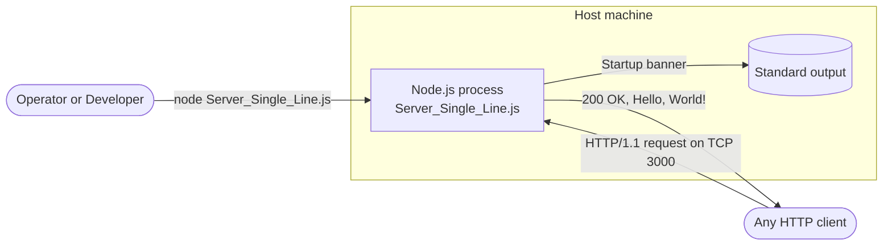
```mermaid
flowchart LR
    Operator([Operator or Developer]) -->|node Server_Single_Line.js| Proc
    Client([Any HTTP client]) -->|HTTP/1.1 request on TCP 3000| Proc
    subgraph HostMachine["Host machine"]
        Proc[Node.js process<br/>Server_Single_Line.js]
        Stdout[(Standard output)]
        Proc -->|Startup banner| Stdout
    end
    Proc -->|200 OK, Hello, World!| Client
```

### 1.2.2 High-Level Description

#### Primary System Capabilities

| Capability | Implementation | Verified Result |
|---|---|---|
| Start an HTTP listener | `.listen(3000, ...)` with no host argument | Listener on `:::3000` (all interfaces) |
| Answer every request | `res.end('Hello, World!\n')` | `HTTP/1.1 200 OK`, `Content-Length: 14`, body `Hello, World!\n` |
| Report startup | `console.log('Server running at http://127.0.0.1:3000/')` in the listen callback | Banner printed to stdout once the port is bound |
| Keep connections alive | Node.js `http` defaults | `Connection: keep-alive`, `Keep-Alive: timeout=5` |
| Handle `HEAD` requests | Node.js `http` defaults | `200 OK` with headers and no body |

#### Major System Components

All components sit inside one expression in `Server_Single_Line.js`. None is assigned to a variable or exported.

| Component | Code Element | Responsibility |
|---|---|---|
| HTTP module | `require('http')` | Node.js built-in that provides the server |
| Request listener | `(req,res)=>res.end('Hello, World!\n')` | Ends every response with a constant body. `req` is never read |
| Server instance | Return value of `createServer(...)` | Unnamed `http.Server`, never stored, closed or inspected |
| Port binding | `.listen(3000, callback)` | Binds TCP port 3000 on all interfaces |
| Ready callback | `()=>console.log(...)` | Prints the fixed startup banner |

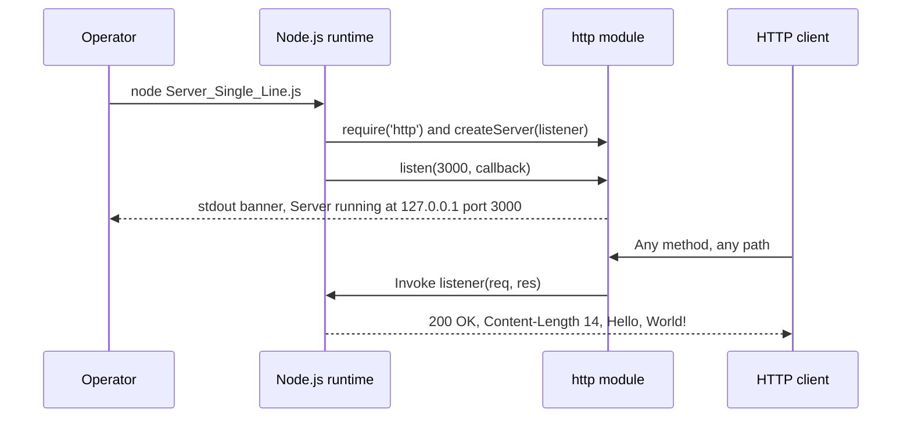
```mermaid
sequenceDiagram
    participant Op as Operator
    participant Node as Node.js runtime
    participant Http as http module
    participant Cli as HTTP client
    Op->>Node: node Server_Single_Line.js
    Node->>Http: require('http') and createServer(listener)
    Node->>Http: listen(3000, callback)
    Http-->>Op: stdout banner, Server running at 127.0.0.1 port 3000
    Cli->>Http: Any method, any path
    Http->>Node: Invoke listener(req, res)
    Node-->>Cli: 200 OK, Content-Length 14, Hello, World!
```

#### Core Technical Approach

- **Single expression.** Method chaining and anonymous arrow functions replace named variables. The file has no declarations.
- **Event-driven runtime.** The Node.js event loop handles each request. The process stays alive only because the listening socket is open.
- **Platform defaults over explicit settings.** Status code, `Date`, `Content-Length` and keep-alive headers all come from Node.js defaults. The code sets none of them.
- **Starting the server is a side effect of loading the module.** The file is CommonJS and does not touch `module.exports`, so loading it with `require` also starts the server.
- **No toolchain.** There is no transpiler, bundler, linter, test runner or package manifest. Node.js runs the source as it is.

### 1.2.3 Success Criteria

The repository defines no success criteria, SLAs or KPIs, and has no tests. The objectives below come from the code's observable contract, and each was checked by running the file.

#### Measurable Objectives

| Objective | Measure | Target | Verified |
|---|---|---|---|
| Successful startup | Stdout output after bind | Exactly `Server running at http://127.0.0.1:3000/` | Yes |
| Request served | HTTP status for any method and path | `200 OK` | Yes (`GET`, `POST`, `HEAD`) |
| Correct body | Response bytes | `Hello, World!\n`, `Content-Length: 14` | Yes |
| No dependencies | Third-party packages required | 0 | Yes |
| No setup | Steps before first request | One command: `node Server_Single_Line.js` | Yes |

#### Critical Success Factors

| Factor | Consequence if Not Met |
|---|---|
| A Node.js runtime is installed | The script cannot run. The repository does not state a minimum version |
| TCP port 3000 is free | The process exits with code 1 on `EADDRINUSE` |
| Clients can reach port 3000 on the host | Requests fail. The listener accepts any interface, so firewall rules decide exposure |
| The file still parses as a single valid statement | Any syntax error stops startup, because nothing else in the repository can serve requests |

#### Key Performance Indicators

The code has no metrics, request logging or health endpoint, so it measures no KPIs. The only indicators visible from outside are whether the process is running, the HTTP status code and the response body.

## 1.3 Scope

### 1.3.1 In-Scope

#### Core Features and Functionalities

**Must-have capabilities** (everything `Server_Single_Line.js` implements):

| Feature | Description |
|---|---|
| HTTP listener | Binds TCP port 3000 on all interfaces using the Node.js built-in `http` module |
| Fixed response | Every request, whatever its method, path, query or body, gets `200 OK` with body `Hello, World!\n` (14 bytes) |
| Startup notification | Writes `Server running at http://127.0.0.1:3000/` to stdout once the port is bound |
| Persistent connections | Uses Node.js default keep-alive (`Keep-Alive: timeout=5`) |

**Primary user workflows:**

| Workflow | Actor | Steps and Outcome |
|---|---|---|
| Start the server | Operator | Run `node Server_Single_Line.js`. The banner appears on stdout and the process keeps running |
| Send a request | HTTP client | Send any request to port 3000. The client receives `200 OK` and `Hello, World!\n` |
| Stop the server | Operator | End the process from outside (for example, with an interrupt signal). The code has no shutdown handler |

**Essential integrations:**

| Integration | Direction | Purpose |
|---|---|---|
| Node.js `http` module | Internal (built-in) | Creates the server and handles HTTP parsing and response framing |
| TCP port 3000 | Inbound | The only network interface |
| Standard output | Outbound | The only output channel, used once for the startup banner |

**Key technical requirements:**

- A Node.js runtime that supports CommonJS `require` and ES2015 arrow functions. The repository pins no version; v22.23.3 was used for verification.
- TCP port 3000 must be free on the host.
- No package installation, build step, environment variables or configuration files are needed.

#### Implementation Boundaries

| Boundary | Definition |
|---|---|
| System boundary | One Node.js process started from `Server_Single_Line.js`. It accepts HTTP on TCP 3000 on all interfaces and writes only to stdout |
| User groups covered | Anonymous HTTP clients and the operator who starts the process. No roles, accounts or authentication |
| Geographic / market coverage | None defined. No localisation, region settings or time-zone handling. The response is a fixed English string |
| Data domains included | None. Request data is never read, nothing is stored, and the only data produced is one constant string |

### 1.3.2 Out-of-Scope

#### Excluded Features and Capabilities

None of the following exists in the current tree or in any commit:

| Category | Excluded Capability |
|---|---|
| Business domain | Billing, pricing, invoicing or payments, despite the repository name `Repo_To_Check_Refine_Billing` |
| Request handling | Routing, multiple endpoints, method-specific behaviour, reading the request body or query, dynamic content |
| Security | Authentication, authorisation, TLS/HTTPS, CORS, security headers, rate limiting |
| Content handling | `Content-Type` and content negotiation (the deleted `server.js` set `text/plain`; the current file does not) |
| Configuration | Configurable port, host binding, environment variables, configuration files |
| Resilience | Handling of `'error'` events, graceful shutdown, restart supervision |
| Observability | Request logging, metrics, tracing, dedicated health-check endpoint |
| Engineering infrastructure | `package.json`, lockfile, Node.js `engines` field, tests, linting, CI/CD, container images |
| Third-party libraries | None used. The `lodash`-importing version (`server (1).js`) was deleted |

#### Future Phase Considerations

The repository contains no roadmap, TODO comments, issue references or documented planned work. The gaps found in this section point to these candidate items. They come from analysis, not from any stated plan:

- Restore the explicit `Content-Type: text/plain` header and loopback-only binding that the deleted `server.js` had.
- Build the startup banner from the actual bound address so it no longer misreports `127.0.0.1`.
- Handle the server `'error'` event so a port conflict does not crash the process without a clear message.
- Make the port configurable instead of hard-coding `3000`.
- Add a `package.json` that declares the supported Node.js version.

#### Integration Points Not Covered

- Databases, caches and file storage
- External or third-party APIs, including payment or billing gateways
- Message queues and event streams
- Identity providers and single sign-on
- Service discovery, reverse proxies, load balancers and orchestration platforms
- Centralised logging and monitoring systems

#### Unsupported Use Cases

| Use Case | Reason Unsupported |
|---|---|
| Production or internet-facing traffic | No TLS, no authentication, no error handling, and the listener binds to every interface |
| Loopback-only local deployment as the banner states | The listener binds to `::` (all interfaces); the `127.0.0.1` in the banner is only a string |
| Several instances on one host | The fixed port 3000 causes `EADDRINUSE`, and the second process exits with code 1 |
| Use as an importable library | The file exports nothing. Loading it with `require` starts a server as a side effect |
| Serving dynamic, user-specific or file-based content | The response body is a constant, and the request object is never read |

## 1.4 References

#### Repository Files and Folders

- `Server_Single_Line.js` - The whole current implementation: one CommonJS statement that uses the built-in `http` module, listens on port 3000, answers every request with `Hello, World!\n` and prints the startup banner. Running it confirmed status `200 OK`, `Content-Length: 14`, no `Content-Type`, keep-alive defaults, binding on `:::3000`, and an `EADDRINUSE` crash with exit code 1.
- `` (repository root) - Holds only `Server_Single_Line.js` (plus `.git`). Confirms there is no package manifest, README, license, tests, CI or configuration files.

#### Git History (repository `lakshya-blitzy/Repo_To_Check_Refine_Billing`, branches `main` and `0810_01`)

- `README.md` at commit `638cf62` (deleted in `f433f8e`) - Only content was the title `# Repo_To_Check_Refine_Billing`. Shows that no business purpose was ever documented.
- `server.js` at commit `67d0b30` (deleted in `80f2346`) - 14-line predecessor with explicit `127.0.0.1` host binding, status 200 and `Content-Type: text/plain`.
- `server (1).js` at commit `d3a331f` (deleted in `cf5854a`) - 5-line version that imported `lodash` without using it and had no manifest.
- Commit `1231a3a` - Added the current `Server_Single_Line.js`.

#### Web Sources

- None. Web search was unavailable, so every statement rests on repository contents, git history and running the code locally.

# 2. Product Requirements

## 2.1 Feature Catalog

The product is the HTTP server in `Server_Single_Line.js`, a single 142-byte CommonJS statement. It has four features. F-001 to F-003 are code in that statement. F-004 covers protocol behaviour that the Node.js built-in `http` module supplies by default; no repository code implements it. F-004 is still listed because clients see it at the system boundary and Section 1.3.1 counts it as in scope. The repository documents no features, priorities or statuses of its own. This section assigns them, and Section 2.6.1 explains how.

```javascript
require('http').createServer((req,res)=>res.end('Hello, World!\n'))
  .listen(3000,()=>console.log('Server running at http://127.0.0.1:3000/'));
```

*(The file is one line. It is wrapped here only to fit the page.)*

| ID | Feature Name | Category | Priority / Status |
|---|---|---|---|
| F-001 | HTTP Listener on TCP Port 3000 | Server Lifecycle and Network Binding | Critical / Completed |
| F-002 | Fixed "Hello, World!" Response | Request Handling | Critical / Completed |
| F-003 | Startup Notification Banner | Operational Feedback | Medium / Completed |
| F-004 | Inherited HTTP/1.1 Protocol Handling | Protocol Handling (platform-provided) | Medium / Completed |

All four features exist in the tree as it stands. `Server_Single_Line.js` was added in commit `1231a3a` and has not changed since, up to HEAD `80f2346` on branches `main` and `0810_01`. The repository has no features with Proposed, Approved or In Development status. Section 1.3.2 lists candidate improvements, but those come from analysis and are not repository requirements, so this catalog leaves them out.

### 2.1.1 F-001 — HTTP Listener on TCP Port 3000

| Attribute | Value |
|---|---|
| Feature ID | F-001 |
| Feature Name | HTTP Listener on TCP Port 3000 |
| Feature Category | Server Lifecycle and Network Binding |
| Priority Level | Critical |
| Status | Completed |
| Source Element | `require('http').createServer(...).listen(3000, ...)` in `Server_Single_Line.js` |

#### Description

| Aspect | Detail |
|---|---|
| Overview | Creates an `http.Server` with the Node.js built-in `http` module and binds TCP port 3000 on all interfaces. The process keeps running until something outside it stops the process. |
| Business Value | Gives the smallest runnable HTTP service: an endpoint you can reach with no installation, build step or configuration (Section 1.1.2). |
| User Benefits | The operator starts the service with one command, `node Server_Single_Line.js`. HTTP clients get a fixed, known port. |
| Technical Context | `.listen(3000, callback)` is called with no host argument, so Node.js binds the unspecified address `::`. The resulting `http.Server` is never assigned to a variable, so it has no `'error'` listener and no `close()` call. The file never touches `module.exports`, so loading it with `require` starts the server as a side effect and returns `{}`. |

#### Dependencies

| Dependency Type | Detail |
|---|---|
| Prerequisite Features | None. F-001 is the root feature. |
| System Dependencies | A Node.js runtime that supports CommonJS `require` and arrow functions (no version is pinned; verified on v22.23.3). TCP port 3000 must be free on the host. |
| External Dependencies | None. There are no third-party packages and no package manifest. |
| Integration Requirements | Inbound TCP port 3000. Process control by the operator, such as signals. Node.js writes its default crash trace to stderr if binding fails. |

### 2.1.2 F-002 — Fixed "Hello, World!" Response

| Attribute | Value |
|---|---|
| Feature ID | F-002 |
| Feature Name | Fixed "Hello, World!" Response |
| Feature Category | Request Handling |
| Priority Level | Critical |
| Status | Completed |
| Source Element | Request listener `(req,res)=>res.end('Hello, World!\n')` |

#### Description

| Aspect | Detail |
|---|---|
| Overview | Ends every HTTP response with the constant 14-byte body `Hello, World!\n` and the default status `200 OK`, whatever the request contains. |
| Business Value | Gives a deterministic response suitable for smoke tests, reachability checks and "hello world" baselines (Sections 1.1.2 and 1.1.4). |
| User Benefits | Clients and test tooling can check a single known status and body without knowing any routes. |
| Technical Context | The listener never reads `req`. Node.js supplies the status code and `Content-Length`. The code sets no headers, so responses have no `Content-Type`. The deleted predecessor `server.js` (commit `67d0b30`) set `Content-Type: text/plain`. |

#### Dependencies

| Dependency Type | Detail |
|---|---|
| Prerequisite Features | F-001, because requests arrive only after the port is bound. F-004 frames the response on the wire. |
| System Dependencies | The `ServerResponse` object from the Node.js `http` module. |
| External Dependencies | None. |
| Integration Requirements | Any HTTP/1.1 client that can reach port 3000. No authentication or headers are required. |

### 2.1.3 F-003 — Startup Notification Banner

| Attribute | Value |
|---|---|
| Feature ID | F-003 |
| Feature Name | Startup Notification Banner |
| Feature Category | Operational Feedback |
| Priority Level | Medium |
| Status | Completed |
| Source Element | Listen callback `()=>console.log('Server running at http://127.0.0.1:3000/')` |

#### Description

| Aspect | Detail |
|---|---|
| Overview | Writes `Server running at http://127.0.0.1:3000/` to standard output once, after the port is bound. |
| Business Value | Tells the operator the service is ready. This is the application's only output. |
| User Benefits | The operator sees that startup worked and gets a URL to try. |
| Technical Context | The banner is a hard-coded string literal. It does not reflect the real binding, which is `::` (all interfaces) (Section 1.2.1). The predecessor `server.js` built the banner from its `hostname` and `port` constants with a template literal. Requests are not logged. |

#### Dependencies

| Dependency Type | Detail |
|---|---|
| Prerequisite Features | F-001. The callback runs only when `listen` succeeds. |
| System Dependencies | The process's standard output stream (`console.log`). |
| External Dependencies | None. |
| Integration Requirements | Whatever captures stdout: a terminal or a process supervisor. No log shipping is configured. |

### 2.1.4 F-004 — Inherited HTTP/1.1 Protocol Handling

| Attribute | Value |
|---|---|
| Feature ID | F-004 |
| Feature Name | Inherited HTTP/1.1 Protocol Handling |
| Feature Category | Protocol Handling (platform-provided) |
| Priority Level | Medium |
| Status | Completed (Node.js defaults; no repository code) |
| Source Element | Default `http.Server` behaviour; the repository sets no server options |

#### Description

| Aspect | Detail |
|---|---|
| Overview | HTTP/1.1 behaviour that Node.js provides by default: the `Date` header, `Content-Length` calculation, keep-alive with `Keep-Alive: timeout=5`, `HEAD` responses without a body, and `400 Bad Request` for malformed requests. |
| Business Value | Gives standards-conformant HTTP framing without any application code. |
| User Benefits | Clients can reuse connections, `HEAD` probes work, and malformed input is rejected before it reaches the listener. |
| Technical Context | The repository sets no options such as `keepAliveTimeout`, so all of these values are Node.js defaults and depend on which Node.js version runs the file. The version is not pinned, and these values were verified on v22.23.3. |

#### Dependencies

| Dependency Type | Detail |
|---|---|
| Prerequisite Features | F-001 (the server instance). It applies to every F-002 response. |
| System Dependencies | The HTTP parser and response framing in the Node.js `http` module. |
| External Dependencies | None. |
| Integration Requirements | HTTP/1.1 clients. Keep-alive reuse is optional for the client. |

## 2.2 Functional Requirements

Each requirement below describes behaviour that `Server_Single_Line.js` shows today. Every acceptance criterion was checked by running the file on Node.js v22.23.3 and sending requests with `curl` or a raw TCP socket. The repository has no automated tests, so no test suite enforces these criteria (Section 2.6.2, C-004).

Priority scale: **Must-Have** means the feature does not work without it. **Should-Have** is a defined behaviour that operators or clients rely on. **Could-Have** is a secondary characteristic. Complexity rates the implementation as it stands. Every requirement is Low, because each one maps to a single expression or to a platform default.

### 2.2.1 F-001 Requirements — HTTP Listener on TCP Port 3000

#### Requirement Details

| Requirement ID | Description | Acceptance Criteria | Priority / Complexity |
|---|---|---|---|
| F-001-RQ-001 | Start with `node Server_Single_Line.js` alone: no package install, build step, environment variable or configuration file | In a checkout that holds only `Server_Single_Line.js`, the command binds port 3000 and the process keeps running | Must-Have / Low |
| F-001-RQ-002 | Listen on TCP port `3000`, a literal in the source | A TCP connection to port 3000 succeeds after startup. No argument or environment variable changes the port | Must-Have / Low |
| F-001-RQ-003 | Bind with no host argument, so Node.js uses the unspecified address `::` (all interfaces) | Requests to `127.0.0.1:3000` succeed, and bind diagnostics report `address: '::'` | Should-Have / Low |
| F-001-RQ-004 | Keep running while the listening socket is open. Install no signal or shutdown handlers | The process stays up while idle. `SIGTERM` ends it with exit status 143 and prints nothing more | Must-Have / Low |
| F-001-RQ-005 | Fail fast when port 3000 is taken: the unhandled `'error'` event ends the process | A second instance writes `Error: listen EADDRINUSE: address already in use :::3000` to stderr, prints no banner and exits with code 1 | Should-Have / Low |
| F-001-RQ-006 | Loading the module with `require` starts the server and exports nothing | `require('./Server_Single_Line.js')` returns `{}` | Could-Have / Low |

#### Technical Specifications

| Specification | Detail |
|---|---|
| Input Parameters | None. No CLI arguments, environment variables or configuration files are read. The port (`3000`) is a literal, and the host is the Node.js default. |
| Output/Response | A listening socket on `:::3000`. If binding fails, Node.js writes its default stack trace (code `EADDRINUSE`, errno `-98`, syscall `listen`) to stderr and the process exits with code 1. |
| Performance Criteria | The repository defines none. In verification, the banner appeared within the 1.5 s wait before the first request. |
| Data Requirements | None. Nothing is kept in state or persisted. |

#### Validation Rules

| Rule Type | Rule |
|---|---|
| Business Rules | One process creates exactly one server. Because the port is fixed, a host can run only one instance on port 3000. |
| Data Validation | Not applicable, because the feature takes no input. |
| Security Requirements | None are implemented: no TLS, no authentication, and the listener accepts every interface. Only the host firewall controls exposure (Section 1.2.3). The `127.0.0.1` in the banner says nothing about the actual binding. |
| Compliance Requirements | None defined. The repository has no license file and no compliance documentation. |

### 2.2.2 F-002 Requirements — Fixed "Hello, World!" Response

#### Requirement Details

| Requirement ID | Description | Acceptance Criteria | Priority / Complexity |
|---|---|---|---|
| F-002-RQ-001 | Return status `200 OK` for every well-formed request, whatever the method | `GET`, `POST`, `PUT` and `HEAD` each return `HTTP/1.1 200 OK` | Must-Have / Low |
| F-002-RQ-002 | Return the constant body `Hello, World!\n` | The body matches `Hello, World!\n` byte for byte, with `Content-Length: 14` | Must-Have / Low |
| F-002-RQ-003 | Ignore request content: method, path, query, headers and body are never read | `POST /x/y?q=1` with a form body and `PUT /upload` with a 100,000-byte body get the same response as `GET /` | Must-Have / Low |
| F-002-RQ-004 | Set no headers in application code; send only the Node.js defaults (no `Content-Type`) | Response headers are exactly `Date`, `Connection: keep-alive`, `Keep-Alive: timeout=5` and `Content-Length: 14` | Should-Have / Low |
| F-002-RQ-005 | Serve concurrent requests independently | 50 parallel `GET` requests to different paths all return `200` | Should-Have / Low |

#### Technical Specifications

| Specification | Detail |
|---|---|
| Input Parameters | Any well-formed HTTP/1.1 request on port 3000, with any method, path, query, headers or body. None of it is read. |
| Output/Response | `HTTP/1.1 200 OK`. Headers: `Date`, `Connection: keep-alive`, `Keep-Alive: timeout=5`, `Content-Length: 14`. Body: `Hello, World!\n`. |
| Performance Criteria | The repository defines none. Indicative local figures: 200 sequential requests averaged about 4 ms each, including `curl` process startup, and 50 concurrent requests all succeeded. These are not service levels. |
| Data Requirements | The body is a string literal written into the code. Nothing is stored, and no personal data is handled. |

#### Validation Rules

| Rule Type | Rule |
|---|---|
| Business Rules | Every well-formed request gets the same response. There is no routing and no method-specific behaviour. |
| Data Validation | The application validates nothing. Node.js checks request syntax before the listener runs (F-004-RQ-004). |
| Security Requirements | Request data never appears in the response, a command, a query or a file path, so the application code has no injection surface. There is no authentication, no CORS policy and no security header. |
| Compliance Requirements | None defined. No personal data is processed or retained. |

### 2.2.3 F-003 Requirements — Startup Notification Banner

#### Requirement Details

| Requirement ID | Description | Acceptance Criteria | Priority / Complexity |
|---|---|---|---|
| F-003-RQ-001 | Write the exact banner `Server running at http://127.0.0.1:3000/` to stdout | The first stdout line equals that string | Must-Have / Low |
| F-003-RQ-002 | Print the banner once, and only after a successful bind | Each process prints exactly one banner line. A failed bind (`EADDRINUSE`) prints nothing to stdout | Must-Have / Low |
| F-003-RQ-003 | Produce no output per request | After 50 or more requests, stdout still holds only the banner | Should-Have / Low |

#### Technical Specifications

| Specification | Detail |
|---|---|
| Input Parameters | None. The callback receives no arguments and runs when `listen` completes. |
| Output/Response | One line on standard output. |
| Performance Criteria | None defined. One write per process lifetime. |
| Data Requirements | A string literal. It is not built from `server.address()` or from the port literal. |

#### Validation Rules

| Rule Type | Rule |
|---|---|
| Business Rules | The banner signals readiness only. It is not a health check and is never repeated. |
| Data Validation | Nothing checks the banner against the real binding. It reports `127.0.0.1` while the listener uses `::`, a deviation documented in Section 1.2.1. |
| Security Requirements | Operators must not read the banner as proof of loopback-only exposure. |
| Compliance Requirements | None defined. |

### 2.2.4 F-004 Requirements — Inherited HTTP/1.1 Protocol Handling

#### Requirement Details

| Requirement ID | Description | Acceptance Criteria | Priority / Complexity |
|---|---|---|---|
| F-004-RQ-001 | Support persistent connections using the Node.js default keep-alive | Responses carry `Connection: keep-alive` and `Keep-Alive: timeout=5`. A client that sends two requests reuses one TCP connection | Should-Have / Low |
| F-004-RQ-002 | Answer `HEAD` with headers and no body | `HEAD /` returns `200 OK` with headers and an empty body | Should-Have / Low |
| F-004-RQ-003 | Include a `Date` header in every response | `Date` is present on every verified response | Could-Have / Low |
| F-004-RQ-004 | Reject malformed requests before they reach the listener | Sending the request line `GARBAGE` returns `HTTP/1.1 400 Bad Request` with `Connection: close` and no `Hello, World!` body | Should-Have / Low |

#### Technical Specifications

| Specification | Detail |
|---|---|
| Input Parameters | Raw HTTP/1.1 bytes on an accepted TCP connection. |
| Output/Response | Framing headers (`Date`, `Content-Length`, `Connection`, `Keep-Alive`), body suppressed for `HEAD`, and `400 Bad Request` for requests that do not parse. |
| Performance Criteria | Idle keep-alive connections close after the default 5 s. The repository tunes no timeouts. |
| Data Requirements | None. |

#### Validation Rules

| Rule Type | Rule |
|---|---|
| Business Rules | Platform defaults apply unchanged, because the repository passes no options to `createServer` or `listen`. |
| Data Validation | The Node.js HTTP parser validates request syntax. |
| Security Requirements | All parser limits and timeouts are Node.js defaults for the runtime version in use. None is overridden. |
| Compliance Requirements | None defined. |

## 2.3 Feature Relationships

All four features live in the single expression in `Server_Single_Line.js` or in the Node.js `http` module it loads. The relationships below follow from the order in which that expression runs. Section 1.2.1 has the system context diagram and Section 1.2.2 has the startup and request sequence diagram.

### 2.3.1 Feature Dependency Map

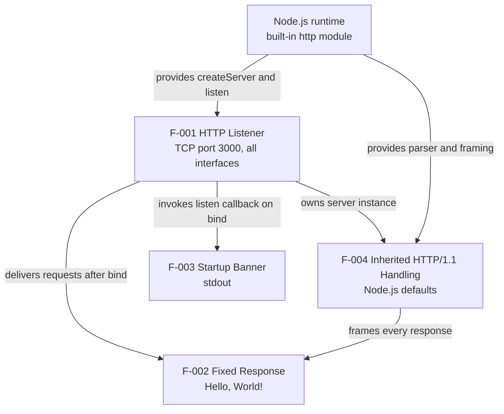
```mermaid
flowchart TD
    RT[Node.js runtime<br/>built-in http module]
    F001[F-001 HTTP Listener<br/>TCP port 3000, all interfaces]
    F002[F-002 Fixed Response<br/>Hello, World!]
    F003[F-003 Startup Banner<br/>stdout]
    F004[F-004 Inherited HTTP/1.1 Handling<br/>Node.js defaults]
    RT -->|provides createServer and listen| F001
    RT -->|provides parser and framing| F004
    F001 -->|delivers requests after bind| F002
    F001 -->|invokes listen callback on bind| F003
    F001 -->|owns server instance| F004
    F004 -->|frames every response| F002
```

| Feature | Depends On | Depended On By |
|---|---|---|
| F-001 | Node.js runtime | F-002, F-003, F-004 |
| F-002 | F-001, F-004 | None |
| F-003 | F-001 | None |
| F-004 | F-001, Node.js runtime | F-002 |

### 2.3.2 Integration Points

| Integration Point | Direction | Features | Evidence |
|---|---|---|---|
| TCP port 3000 on `::` (all interfaces) | Inbound | F-001, F-002, F-004 | `.listen(3000, ...)`; `EADDRINUSE` diagnostic reports `address: '::'` |
| Standard output | Outbound | F-003 | `console.log(...)` in the listen callback |
| Standard error | Outbound | F-001 (failure path only) | Node.js default trace from the unhandled `'error'` event |
| Process signals | Inbound (operator) | F-001 | `SIGTERM` exits with status 143; no handler is installed |

There are no outbound network calls, databases, message brokers or third-party services (Section 1.2.1).

### 2.3.3 Shared Components and Common Services

| Component | Type | Used By | Notes |
|---|---|---|---|
| `require('http')` | Node.js built-in module | F-001, F-002, F-004 | The only dependency. There are no npm packages |
| Unnamed `http.Server` instance | Runtime object | F-001, F-002, F-003, F-004 | Never stored in a variable, so no other code can reach it |
| Node.js event loop | Runtime service | All features | Runs startup, the listen callback and every request on one thread |
| Literal `3000` | Shared constant (inline) | F-001; F-003 repeats it in the banner text | The two copies are separate literals, so changing the port needs edits in both places |

### 2.3.4 Feature Interaction Flows

The startup flow shows how F-001 decides whether F-003 runs.

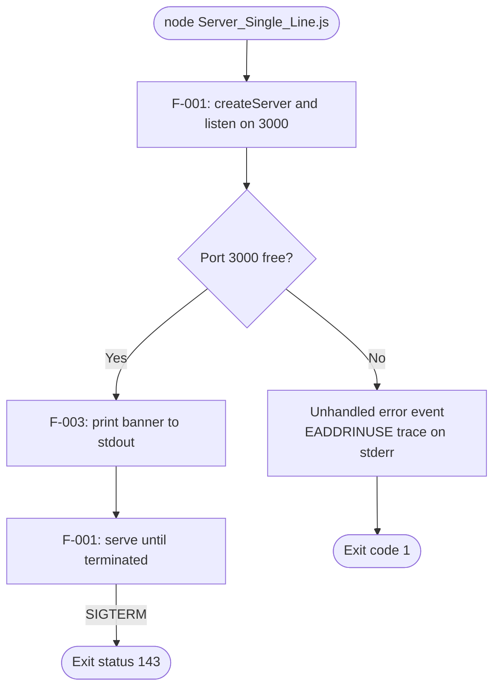
```mermaid
flowchart TD
    Start([node Server_Single_Line.js]) --> Create[F-001: createServer and listen on 3000]
    Create --> PortFree{Port 3000 free?}
    PortFree -->|Yes| Banner[F-003: print banner to stdout]
    Banner --> Serving[F-001: serve until terminated]
    Serving -->|SIGTERM| ExitSig([Exit status 143])
    PortFree -->|No| Crash[Unhandled error event<br/>EADDRINUSE trace on stderr]
    Crash --> ExitErr([Exit code 1])
```

The request flow shows where F-004 framing surrounds the F-002 listener.

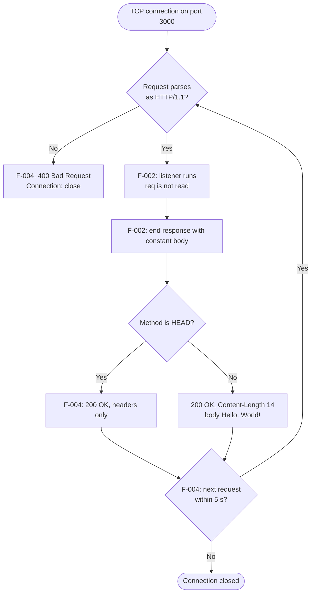
```mermaid
flowchart TD
    Conn([TCP connection on port 3000]) --> Parse{Request parses<br/>as HTTP/1.1?}
    Parse -->|No| Reject[F-004: 400 Bad Request<br/>Connection: close]
    Parse -->|Yes| Listener[F-002: listener runs<br/>req is not read]
    Listener --> EndCall[F-002: end response with constant body]
    EndCall --> IsHead{Method is HEAD?}
    IsHead -->|Yes| HeadResp[F-004: 200 OK, headers only]
    IsHead -->|No| FullResp[200 OK, Content-Length 14<br/>body Hello, World!]
    HeadResp --> KeepAlive{F-004: next request<br/>within 5 s?}
    FullResp --> KeepAlive
    KeepAlive -->|Yes| Parse
    KeepAlive -->|No| Closed([Connection closed])
```

## 2.4 Implementation Considerations

Everything below applies to the current one-statement implementation in `Server_Single_Line.js`. The repository sets no performance targets, so the performance rows describe how the code is built rather than any requirement. Section 1.3.2 lists the candidate improvements these considerations point to.

### 2.4.1 F-001 — HTTP Listener on TCP Port 3000

| Consideration | Detail |
|---|---|
| Technical Constraints | Port `3000` is a literal and the host is never set, so neither can be configured. The `http.Server` is not stored in a variable, so an `'error'` listener, `close()` or graceful shutdown would require breaking up the chained statement. Loading the file with `require` starts a server. |
| Performance Requirements | None defined. One Node.js process runs one event loop. Startup only loads a built-in module and binds a socket. |
| Scalability Considerations | The fixed port allows one instance per host; a second instance exits on `EADDRINUSE`. Neither `cluster` nor worker threads are used. The process holds no shared state, but the repository provides no load balancer or orchestration configuration for running more instances. |
| Security Implications | The listener accepts unauthenticated plaintext HTTP on every interface. The host firewall alone controls exposure. There is no TLS, rate limiting or connection limit beyond Node.js defaults. |
| Maintenance Requirements | No `package.json` or `engines` field records the supported Node.js version, and no tests cover startup. The previous `server.js` used named `hostname` and `port` constants, which were easier to maintain than the single-line form. |

### 2.4.2 F-002 — Fixed "Hello, World!" Response

| Consideration | Detail |
|---|---|
| Technical Constraints | The response is fixed in the source code. Changing the status, headers or body means editing the arrow listener. `req` is never read, so routing would require new code. |
| Performance Requirements | None defined. Each request does a constant amount of work: one `res.end` with a 14-byte literal and no I/O beyond the socket. Section 2.2.2 gives indicative timings. |
| Scalability Considerations | The handler is stateless, so throughput depends only on the single event loop and the host's network stack. |
| Security Implications | The response never includes request data, so the application code has no reflection or injection path. Responses have no `Content-Type` and no `X-Content-Type-Options`, so clients have to work out the media type themselves. There are no CORS or security headers. |
| Maintenance Requirements | No tests protect the response contract (status `200`, `Content-Length: 14`, body `Hello, World!\n`). Restoring `Content-Type: text/plain`, which the deleted `server.js` set, means editing the listener. |

### 2.4.3 F-003 — Startup Notification Banner

| Consideration | Detail |
|---|---|
| Technical Constraints | The banner is a literal and does not come from the actual bound address or port. It reports `127.0.0.1` even though the listener binds `::`. |
| Performance Requirements | Negligible: one `console.log` per process. |
| Scalability Considerations | Not applicable. Requests are not logged, so output volume stays the same no matter how much traffic arrives. |
| Security Implications | The banner understates exposure. An operator could wrongly conclude the service listens only on loopback. |
| Maintenance Requirements | If the port changes, someone must update the port inside the banner text by hand. The previous `server.js` built the banner from its constants, which kept the two in step. |

### 2.4.4 F-004 — Inherited HTTP/1.1 Protocol Handling

| Consideration | Detail |
|---|---|
| Technical Constraints | Behaviour depends on the Node.js version that runs the file. No version is pinned, and no server options such as `keepAliveTimeout` are set. |
| Performance Requirements | Keep-alive lets clients reuse connections instead of opening a new TCP connection per request. Idle connections close after the default 5 s. |
| Scalability Considerations | Each idle keep-alive connection keeps its socket open for up to 5 s, which adds to concurrent connection counts under load. |
| Security Implications | The Node.js parser rejects malformed requests (`400 Bad Request`) before they reach application code. Every parser limit and timeout is a platform default. |
| Maintenance Requirements | A Node.js upgrade could change these defaults without warning. No tests would catch the change. |

## 2.5 Traceability Matrix

The matrix maps each requirement to the code element that implements it, how it was verified, and the related specification sections. Every row was verified by running `Server_Single_Line.js` on Node.js v22.23.3.

| Requirement ID | Source Element in `Server_Single_Line.js` | Verification Evidence | Related Sections |
|---|---|---|---|
| F-001-RQ-001 | The whole file; no imports besides `require('http')` | `node Server_Single_Line.js` starts in a checkout with no manifest | 1.1.1, 1.3.1, 2.1.1 |
| F-001-RQ-002 | `.listen(3000, ...)` | Connection to port 3000 succeeds | 1.2.2, 2.1.1 |
| F-001-RQ-003 | `.listen` called without a host argument | `EADDRINUSE` diagnostic shows `address: '::'` | 1.2.1, 2.4.1 |
| F-001-RQ-004 | Listening socket keeps the event loop alive; no signal handlers | `SIGTERM` gives exit status 143 | 1.3.1, 2.3.4 |
| F-001-RQ-005 | No `'error'` listener on the unnamed server | Second instance exits with code 1 and prints `EADDRINUSE` on stderr | 1.2.1, 2.3.4 |
| F-001-RQ-006 | No `module.exports` or `exports` assignment | `require(...)` returns `{}` | 1.2.2, 1.3.2 |
| F-002-RQ-001 | `(req,res)=>res.end(...)`, default status | `GET`, `POST`, `PUT` and `HEAD` return `200 OK` | 1.2.3, 2.1.2 |
| F-002-RQ-002 | Literal `'Hello, World!\n'` | Body is 14 bytes with `Content-Length: 14` | 1.2.2, 2.1.2 |
| F-002-RQ-003 | `req` is never referenced | `POST /x/y?q=1` and a 100 KB `PUT` get the same response as `GET /` | 1.2.1, 2.3.4 |
| F-002-RQ-004 | No `setHeader` or `writeHead` calls | Headers are only `Date`, `Connection`, `Keep-Alive` and `Content-Length` | 1.2.1, 2.4.2 |
| F-002-RQ-005 | Stateless listener on the Node.js event loop | 50 parallel requests all return `200` | 2.4.2 |
| F-003-RQ-001 | `console.log('Server running at http://127.0.0.1:3000/')` | Exact banner seen on stdout | 1.2.2, 2.1.3 |
| F-003-RQ-002 | The callback is the `listen` success callback | One banner per process; none on a failed bind | 2.3.4 |
| F-003-RQ-003 | Listener contains no logging | Stdout holds only the banner after more than 50 requests | 1.2.1, 2.4.3 |
| F-004-RQ-001 | Node.js `http` default, no repository code | `Keep-Alive: timeout=5`; `curl` reuses the connection | 1.2.2, 1.3.1 |
| F-004-RQ-002 | Node.js `http` default, no repository code | `HEAD /` returns `200` with no body | 1.2.2, 2.3.4 |
| F-004-RQ-003 | Node.js `http` default, no repository code | `Date` header present on every response | 1.2.1 |
| F-004-RQ-004 | Node.js HTTP parser, no repository code | `GARBAGE` request line returns `400 Bad Request` with `Connection: close` | 2.3.4, 2.4.4 |

| Feature | Requirements | Introduced In | Process Flow Reference |
|---|---|---|---|
| F-001 | F-001-RQ-001 to RQ-006 | Commit `1231a3a` | Startup flow, Section 2.3.4; context diagram, Section 1.2.1 |
| F-002 | F-002-RQ-001 to RQ-005 | Commit `1231a3a` | Request flow, Section 2.3.4; sequence diagram, Section 1.2.2 |
| F-003 | F-003-RQ-001 to RQ-003 | Commit `1231a3a` | Startup flow, Section 2.3.4; sequence diagram, Section 1.2.2 |
| F-004 | F-004-RQ-001 to RQ-004 | Inherited from the Node.js runtime | Request flow, Section 2.3.4 |

## 2.6 Assumptions, Constraints, and Requirement Versioning

### 2.6.1 Assumptions

| ID | Assumption | Impact on This Section |
|---|---|---|
| A-001 | The repository documents no priorities, statuses or requirements. This section assigned them from each feature's role: Critical for features without which no response is served, Medium for operator feedback and platform-provided behaviour | Priorities reflect analysis, not stakeholder decisions |
| A-002 | "Completed" means present in the current tree and verified by running it. `Server_Single_Line.js` was added in commit `1231a3a`, and the tree is unchanged through HEAD `80f2346` on `main` and `0810_01` | No feature is in progress or planned in the repository |
| A-003 | A Node.js runtime is available. No version is pinned; every acceptance criterion was verified on v22.23.3 | F-004 values (for example `Keep-Alive: timeout=5`) may differ on other versions |
| A-004 | The performance figures in Section 2.2.2 come from one local run that included `curl` process startup | They are indicative, not targets or service levels |
| A-005 | F-004 is listed as a feature because its behaviour is visible at the system boundary and Section 1.3.1 counts it as in scope, even though no repository code implements it | Changes to the Node.js runtime, not to the repository, are what affect F-004 |
| A-006 | No billing feature is assumed, despite the repository name `Repo_To_Check_Refine_Billing`. No commit contains billing logic (Section 1.1.2) | The catalog has no business-domain features |

### 2.6.2 Constraints

| ID | Constraint | Affected Features |
|---|---|---|
| C-001 | Port `3000` is hard-coded in both `.listen` and the banner text, and no configuration surface exists (arguments, environment variables or files) | F-001, F-003 |
| C-002 | There is no `package.json`, lockfile or `engines` field, so the runtime version is not controlled | F-001, F-004 |
| C-003 | The implementation is one chained statement with an unnamed server instance. Adding error, shutdown or header handling means restructuring it | F-001, F-002, F-003 |
| C-004 | There are no automated tests or CI. Acceptance criteria can only be checked by running the file manually | All |
| C-005 | The verification environment had no IPv6 interfaces, so the `::` binding was exercised only over IPv4 (`127.0.0.1`). IPv6 reachability is unverified | F-001 |

### 2.6.3 Requirement Versioning

Requirement IDs (`F-XXX-RQ-YYY`) stay fixed. When behaviour changes, the change should be recorded as a new baseline row below, with the IDs it affects.

| Version | Baseline | Scope | Status |
|---|---|---|---|
| 1.0 | `Server_Single_Line.js` as added in commit `1231a3a`, unchanged through HEAD `80f2346` (`main`, `0810_01`) | All requirements in Section 2.2 | Current |

Earlier implementations in the git history behaved differently from Baseline 1.0. They were deleted and are not requirement baselines:

| Commit | File | Difference from Baseline 1.0 | Affected Requirements |
|---|---|---|---|
| `67d0b30` (deleted in `80f2346`) | `server.js`, 14 lines | Bound to `127.0.0.1` only; set `res.statusCode = 200` and `Content-Type: text/plain`; built the banner from `hostname` and `port` constants | F-001-RQ-003, F-002-RQ-004, F-003-RQ-001 |
| `d3a331f` (deleted in `cf5854a`) | `server (1).js`, 5 lines | Same server behaviour as 1.0, plus an unused `require('lodash')` that needed a third-party package no manifest declared | F-001-RQ-001 |

## 2.7 References

#### Repository Files and Folders

- `Server_Single_Line.js` - The whole implementation of F-001 to F-003: one CommonJS statement that uses the built-in `http` module, listens on port 3000 with no host argument, answers every request with `Hello, World!\n` and prints the fixed startup banner. Running it on Node.js v22.23.3 confirmed `200 OK` for `GET`, `POST`, `PUT` and `HEAD`, `Content-Length: 14`, no `Content-Type`, keep-alive reuse with `Keep-Alive: timeout=5`, 50 concurrent requests served, `400 Bad Request` for a malformed request line, an `EADDRINUSE` failure on `::` with exit code 1, `SIGTERM` exit status 143, and `{}` exports.
- `` (repository root) - Contains only `Server_Single_Line.js` (plus `.git`). Confirms there is no package manifest, README, license, tests, CI or configuration (constraints C-002 and C-004).

#### Git History (repository `lakshya-blitzy/Repo_To_Check_Refine_Billing`, branches `main` and `0810_01`)

- Commit `1231a3a` - Added `Server_Single_Line.js`, the start of requirement Baseline 1.0. HEAD `80f2346` leaves it unchanged.
- `server.js` at commit `67d0b30` (deleted in `80f2346`) - 14-line predecessor with `127.0.0.1` binding, explicit status 200, `Content-Type: text/plain` and a banner built from constants. Source for the version differences in Section 2.6.3.
- `server (1).js` at commit `d3a331f` (deleted in `cf5854a`) - 5-line version with an unused `require('lodash')` and no manifest.
- `README.md` at commit `638cf62` (deleted in `f433f8e`) - Contained only the title `# Repo_To_Check_Refine_Billing`. Shows that no product requirements were ever documented (assumption A-001).

#### Related Technical Specification Sections

- Section 1.1 Executive Summary - Repository profile and value drivers referenced by the feature business-value entries.
- Section 1.2 System Overview - System context diagram, startup and request sequence diagram, and current limitations (banner mismatch, missing `Content-Type`).
- Section 1.3 Scope - In-scope features and workflows that match F-001 to F-004, and candidate improvements left out of the catalog.
- Section 1.4 References - Evidence base shared with this section.

#### Web Sources

- None. Every statement rests on repository contents, git history and running the code locally.

# 3. Technology Stack

## 3.1 Programming Languages

The whole system is one JavaScript source file, `Server_Single_Line.js`, which Node.js runs directly. Nothing in the repository is written in any other language: no markup, stylesheets, shell scripts, SQL, infrastructure-as-code or configuration formats. Sections 1.2.2 and 1.3.1 describe what the file does; this section covers what it is written in.

### 3.1.1 Language Inventory by Component

| Component | Language | Module System / Level | Evidence |
|---|---|---|---|
| HTTP server process | JavaScript | CommonJS (`require`); ES2015 syntax (arrow functions) | `Server_Single_Line.js` (142 characters, one statement) |
| Web frontend, mobile, desktop or native clients | None | — | Repository root holds no other files |
| Build, deployment or infrastructure scripts | None | — | No scripts, Dockerfiles, workflows or IaC in any commit |

The file uses only a few language features:

| Feature | Where Used | Minimum Language Level |
|---|---|---|
| CommonJS `require()` | `require('http')` | Node.js CommonJS loader (not part of ECMAScript) |
| Arrow functions | Request listener `(req,res)=>...` and ready callback `()=>...` | ES2015 |
| Method chaining on return values | `createServer(...).listen(...)` | ES5 |
| String literal with escape sequence | `'Hello, World!\n'` | ES3 |

The file uses no template literals, `const`/`let`, classes, `async`/`await`, destructuring or type annotations. The deleted predecessor `server.js` (commit `67d0b30`) used `const` declarations and a template literal for the banner. The current file dropped both when it was condensed to one statement.

### 3.1.2 Selection Rationale

The repository has no architecture decision records or documentation. The reasons below follow from what the code shows:

| Criterion | How JavaScript on Node.js Meets It |
|---|---|
| No dependencies | Node.js ships an HTTP server in its standard library (`http`), so no third-party package is needed |
| No build step | JavaScript runs from source; nothing is compiled, transpiled or bundled |
| One-command startup | `node Server_Single_Line.js` is the only step before the first request (Section 1.2.3) |
| Small size | The language's terse arrow-function syntax lets the whole server fit in one 142-character statement |

The repository does not use TypeScript, even though it is the default stack's frontend language. Adding it would require a compiler and configuration, which would contradict the zero-toolchain approach described in Section 1.2.2.

### 3.1.3 Constraints and Dependencies

| Constraint | Detail | Consequence |
|---|---|---|
| Must load as CommonJS | The file calls `require`, which ES modules do not provide. Loaded as `.mjs`, it fails with `ReferenceError: require is not defined in ES module scope` | A future `package.json` must not set `"type": "module"` unless the file is converted to `import` syntax |
| No runtime version declared | No `package.json` `engines` field, `.nvmrc` or `.node-version` exists (Constraint C-002, Section 2.6.2) | The language level the host provides is not controlled. All verification used Node.js v22.23.3 |
| Loading the file starts a server | `module.exports` is never assigned, so `require('./Server_Single_Line.js')` returns `{}` and binds port 3000 as a side effect | The file cannot be imported as a library or unit-tested without starting a listener |
| Syntax check is manual | `node --check Server_Single_Line.js` passes, but no linter or CI runs it | One syntax error stops the only component the system has |

### 3.1.4 Default Stack Languages Not Adopted

None of the default stack's languages appears in any commit. The existing JavaScript/Node.js implementation is the architectural decision this section documents.

| Default Stack Language | Intended Platform | Status in Repository |
|---|---|---|
| Python | Backend | Not used. The backend is Node.js |
| TypeScript | Web and React Native | Not used. No `.ts` files and no `tsconfig.json` |
| Swift, Kotlin, Objective-C | iOS, Android, macOS | Not used. No native clients exist |

## 3.2 Frameworks & Libraries

The system uses no application framework and no external library. The Node.js runtime and its built-in `http` module do the job a web framework would otherwise do. The single import in `Server_Single_Line.js` is `require('http')`.

### 3.2.1 Core Runtime and Built-in Modules

The repository pins no version anywhere. Every version below is the one present in the environment used for verification; the runtime reports these values through `process.versions` and `process.release`.

| Component | Version | Role in This System | Supplied By |
|---|---|---|---|
| Node.js | v22.23.3 (LTS line, codename `Jod`) | Runs the script and hosts the event loop | Host installation (NodeSource package `22.23.3-1nodesource1`) |
| `http` core module | Bundled with Node.js v22.23.3 | `createServer(listener)`, `listen(3000, callback)`, `res.end(body)` | Node.js standard library |
| `console` global | Bundled with Node.js v22.23.3 | `console.log` writes the startup banner to stdout | Node.js standard library |
| V8 | 12.4.254.21-node.57 | JavaScript engine that runs the file | Bundled in Node.js |
| llhttp | 9.4.3 | HTTP/1.1 request parser behind `http`. It rejects malformed requests with `400 Bad Request` | Bundled in Node.js |
| libuv | 1.51.0 | Event loop and TCP socket I/O for the listener on port 3000 | Bundled in Node.js |

The code calls only four APIs: `http.createServer`, `Server.prototype.listen`, `ServerResponse.prototype.end` and `console.log`. The runtime supplies everything else the client sees: status `200`, the `Date` and `Content-Length` headers, `Connection: keep-alive` with `Keep-Alive: timeout=5`, and `HEAD` handling (Section 2.4.4, feature F-004).

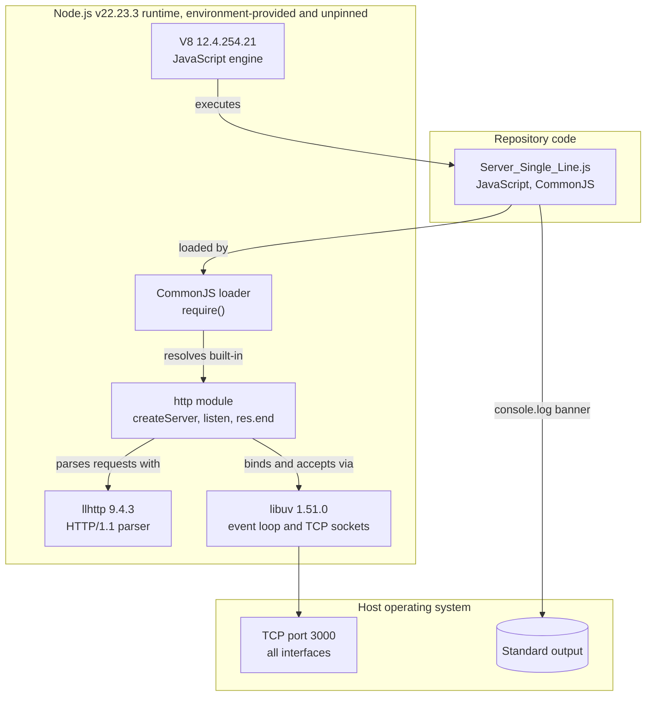
```mermaid
flowchart TB
    subgraph RepoCode["Repository code"]
        App["Server_Single_Line.js<br/>JavaScript, CommonJS"]
    end
    subgraph NodeRuntime["Node.js v22.23.3 runtime, environment-provided and unpinned"]
        Loader["CommonJS loader<br/>require()"]
        Engine["V8 12.4.254.21<br/>JavaScript engine"]
        HttpMod["http module<br/>createServer, listen, res.end"]
        Parser["llhttp 9.4.3<br/>HTTP/1.1 parser"]
        Loop["libuv 1.51.0<br/>event loop and TCP sockets"]
    end
    subgraph HostOS["Host operating system"]
        Port["TCP port 3000<br/>all interfaces"]
        Out[("Standard output")]
    end
    App -->|loaded by| Loader
    Engine -->|executes| App
    Loader -->|resolves built-in| HttpMod
    HttpMod -->|parses requests with| Parser
    HttpMod -->|binds and accepts via| Loop
    Loop --> Port
    App -->|console.log banner| Out
```

### 3.2.2 Justification for the Built-in HTTP Module

| Factor | Effect of Using `http` Directly |
|---|---|
| Nothing to install | No `npm install`, manifest or lockfile is needed, which is why the deleted `lodash` variant's `MODULE_NOT_FOUND` failure cannot happen with the current file (Section 3.3.2) |
| Fits the scope | Every request gets the same response, so routing, middleware and templating would go unused (Section 1.3.1) |
| Supply-chain exposure | No code from the package registry runs. The only party trusted is the Node.js distribution |
| Trade-off: implicit behaviour | Protocol behaviour (keep-alive timeout, parser limits, default headers) follows the runtime version rather than code in the repository, and nothing records which version that is (Constraint C-002) |
| Trade-off: no conveniences | Error handling, a `Content-Type` header and graceful shutdown each need hand-written code. A framework would not supply any of them for this file without a rewrite either (Constraint C-003) |

### 3.2.3 Compatibility Requirements

| Requirement | Detail |
|---|---|
| Runtime | Node.js with the CommonJS loader and ES2015 arrow-function support. Verified only on v22.23.3. The repository states no minimum or maximum version |
| Module format | The file must load as CommonJS: either a `.js` file with no `package.json` setting `"type": "module"`, or a `.cjs` file |
| Native addons | None. Node-API (reported as `napi` 10) and the module ABI (`modules` 127) do not matter, because no compiled modules are loaded |
| Version-sensitive behaviour | Default headers, the 5 s keep-alive timeout and parser limits come from the bundled `http`/llhttp implementation. A runtime upgrade can change them without any change to the repository (Section 2.4.4) |

### 3.2.4 Default Stack Frameworks Not Adopted

| Default Stack Item | Status in Repository |
|---|---|
| Flask (backend framework) | Not used. The backend is Node.js `http` |
| Langchain (AI framework) | Not used. There is no AI or LLM functionality |
| React with TypeScript, TailwindCSS (web) | Not used. There is no frontend; responses are plain bytes |
| React Native (mobile) | Not used |
| ElectronJS (desktop) | Not used |

Third-party Node.js web frameworks such as Express are not present either. The only framework-like code is the Node.js standard library.

## 3.3 Open Source Dependencies

The current tree declares and uses no third-party packages. The only open-source software the system relies on is the Node.js runtime, together with the libraries bundled inside it.

### 3.3.1 Declared Package Dependencies

| Artifact | Present | Implication |
|---|---|---|
| `package.json` | No | No dependencies, scripts or `engines` constraint are declared |
| Lockfile (`package-lock.json`, `yarn.lock`, `pnpm-lock.yaml`) | No | No dependency versions are pinned |
| `node_modules/` | No | Nothing is installed locally |
| Registry configuration (`.npmrc`) | No | No package registry is used, public or private |

npm 11.18.0 is present in the verification environment, but the repository never calls it. The file's only `require` target, `http`, is a Node.js core module and never comes from a registry.

### 3.3.2 Runtime-Level Open Source Components

These components ship inside the Node.js binary and are not repository dependencies. Upgrading Node.js changes their versions.

| Component | Version | License / Source | Used by This Code |
|---|---|---|---|
| Node.js | 22.23.3 | MIT-style permission notice ("Copyright Node.js contributors") in `/usr/share/doc/nodejs/copyright`; distributed from `https://nodejs.org` | Yes: runtime, `http`, `console` |
| V8 | 12.4.254.21-node.57 | Bundled in Node.js | Yes: executes JavaScript |
| llhttp | 9.4.3 | Bundled in Node.js | Yes: parses HTTP/1.1 requests |
| libuv | 1.51.0 | Bundled in Node.js | Yes: event loop and TCP |
| OpenSSL | 3.5.8 | Bundled in Node.js | No: the server uses no TLS |
| undici, nghttp2, zlib, sqlite | 6.28.1, 1.69.0, 1.3.1-e00f703, 3.51.3 | Bundled in Node.js | No: there is no outbound HTTP, HTTP/2, compression or storage |

### 3.3.3 Historical Dependency: lodash

Commit `d3a331f` added `server (1).js`, which began with `const _ = require('lodash');`. The `_` binding was never used, and no manifest declared `lodash` or a version for it. Run on its own, that file fails at startup with `Error: Cannot find module 'lodash'` (`MODULE_NOT_FOUND`, exit code 1). Commit `cf5854a` deleted the file, and no commit since has used a third-party package.

### 3.3.4 Security and Maintenance Implications

| Aspect | Implication |
|---|---|
| Vulnerability surface | No third-party packages means nothing for `npm audit` to check. Vulnerability exposure comes entirely from the Node.js release on the host |
| Patching | Security fixes for the HTTP parser (llhttp) and socket layer (libuv) arrive only through Node.js upgrades, and the repository has no mechanism that requires or records one |
| Reproducibility | No lockfile is needed today. If dependencies are added, a `package.json` with an `engines` field and a committed lockfile would be needed to keep builds reproducible (Section 1.3.2, future candidates) |

## 3.4 Third-Party Services

Not applicable. `Server_Single_Line.js` makes no outbound network calls, loads no service SDK, reads no environment variables and holds no credentials or API keys. Section 1.2.1 states that the system connects to nothing outside itself. Its only interfaces are inbound HTTP on TCP port 3000 and standard output.

| Category | Status | Evidence and Security Implication |
|---|---|---|
| External APIs and integrations | None | The file requires only `http` and calls only server-side APIs (`createServer`, `listen`, `end`). It has no client requests, webhooks or payment/billing gateways, despite the repository name |
| Authentication services | None (Auth0 in the default stack is not adopted) | The listener is unauthenticated, and any client that can reach port 3000 gets the response. The body is a constant and request data is never read, so there is nothing to protect beyond availability |
| Monitoring and observability | None | The only output is the one-time startup banner on stdout. There is no request logging, metrics, tracing, APM agent or health endpoint |
| Cloud services | None (AWS in the default stack is not adopted) | No SDK, deployment descriptor or IaC exists. The process runs wherever Node.js is installed |
| Source hosting | GitHub | Covered under Development & Deployment (Section 3.6), because the running system does not depend on it |

No secrets exist anywhere in the tree, so no secret store, key management or credential rotation is needed.

## 3.5 Databases & Storage

Not applicable. The system stores nothing and connects to no data store. Section 1.3.1 says it has no data domains.

| Concern | Status | Evidence |
|---|---|---|
| Primary and secondary databases | None (MongoDB in the default stack is not adopted) | No database driver is required and no connection string exists. Node.js v22.23.3 bundles SQLite 3.51.3, but the code never loads `node:sqlite` |
| Data persistence | None | No filesystem access (`fs` is never required). The response body `Hello, World!\n` is a literal in the source |
| Caching | None | No in-process cache, no Redis or Memcached client, and no HTTP caching headers (`Cache-Control`, `ETag`) are set |
| Storage services | None | No object or blob storage, no uploads. Request bodies are never read |
| Process state | Transient only | The unnamed `http.Server` object and open sockets live in process memory and disappear when the process exits. A restart loses nothing, because nothing is kept |

Since no data persists, the system needs no backup, migration, retention or encryption-at-rest measures.

## 3.6 Development & Deployment

The repository has no toolchain: no build system, tests, linter, container definition, CI/CD pipeline or infrastructure-as-code. Development consists of editing one file in Git, and deployment consists of running it with Node.js.

### 3.6.1 Development Tools

| Tool | Version | Use | Evidence |
|---|---|---|---|
| Git | 2.43.0 (verification environment) | Version control. The repository has 7 commits, all on 2026-10-08, between 10:28:43 and 10:31:20 +0530 | `.git` history |
| GitHub | Hosted service | Remote `origin` at `github.com/lakshya-blitzy/Repo_To_Check_Refine_Billing`, with branches `main` and `0810_01` (identical trees) | `git remote -v`, `git branch -a` |
| GitHub web upload | — | Files were added through the browser. The three file-adding commits (`67d0b30`, `d3a331f`, `1231a3a`) carry GitHub's default message, "Add files via upload" | Commit messages |
| Node.js CLI | v22.23.3 (unpinned) | Runs the file. `node --check` can be used for a manual syntax check | Runtime verification |
| Linter, formatter, type checker | None | No `.eslintrc`, `.prettierrc`, `.editorconfig` or `tsconfig.json` | Repository root contents |
| Test framework | None | No test files or test runner (Constraint C-004) | Repository root contents |

### 3.6.2 Build System

There is no build. Node.js runs `Server_Single_Line.js` exactly as committed: nothing is transpiled, bundled, minified or bundled as an asset, and no `npm` scripts exist. The file in the repository is also the deployable artifact.

### 3.6.3 Runtime Execution and Deployment

| Aspect | Detail |
|---|---|
| Start command | `node Server_Single_Line.js` |
| Prerequisites | Node.js on `PATH` and TCP port 3000 free on the host. No installation step, environment variables or configuration files |
| Network binding | Port `3000` is hard-coded and the server binds to all interfaces (`::`). Anything that wraps the process, such as a reverse proxy or port mapping, must target port 3000 |
| Process supervision | None. There is no process manager, service unit or restart policy. A port conflict ends the process (`EADDRINUSE`, exit code 1) |
| Shutdown | External signal only. `SIGTERM` ends the process with exit code 143 and no cleanup output, because the code registers no shutdown handler |
| Environment separation | None. No development, staging or production configuration exists |

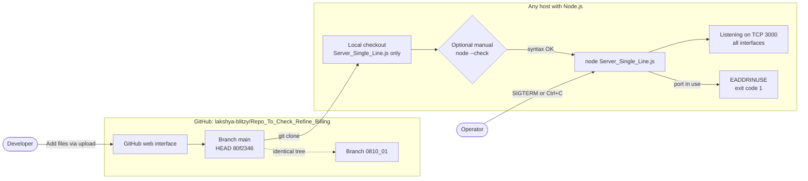
```mermaid
flowchart LR
    Dev([Developer]) -->|Add files via upload| WebUI["GitHub web interface"]
    subgraph GitHubHost["GitHub: lakshya-blitzy/Repo_To_Check_Refine_Billing"]
        WebUI --> MainBr["Branch main<br/>HEAD 80f2346"]
        MainBr -.->|identical tree| WorkBr["Branch 0810_01"]
    end
    MainBr -->|git clone| Checkout["Local checkout<br/>Server_Single_Line.js only"]
    subgraph RunHost["Any host with Node.js"]
        Checkout --> Check{"Optional manual<br/>node --check"}
        Check -->|syntax OK| Run["node Server_Single_Line.js"]
        Run --> Listen["Listening on TCP 3000<br/>all interfaces"]
        Run -->|port in use| Crash["EADDRINUSE<br/>exit code 1"]
    end
    Op([Operator]) -->|SIGTERM or Ctrl+C| Run
```

### 3.6.4 Containerization

None. No commit contains a `Dockerfile`, `.dockerignore` or Compose file, and Docker from the default stack is not adopted. No base image, image tag or Node.js version is defined for a container build.

### 3.6.5 CI/CD and Infrastructure as Code

| Capability | Status | Evidence |
|---|---|---|
| Continuous integration | None. GitHub Actions from the default stack is not adopted | No `.github/workflows/` directory |
| Automated testing or quality gates | None. Section 1.2.3's acceptance criteria can only be checked by running the file by hand (Constraint C-004) | No tests or CI configuration |
| Continuous delivery / release | None. The repository has no tags, releases or deployment workflows | `git` history shows no tags |
| Infrastructure as Code | None. Terraform from the default stack is not adopted | No `.tf` files or other IaC |

### 3.6.6 Security Considerations for Deployment

| Risk | Source in the Stack | Current Mitigation |
|---|---|---|
| Unencrypted, unauthenticated exposure on every interface | Plain `http` module, `listen(3000)` with no host argument | None in code. The host firewall decides who can reach the port (Section 2.4.1) |
| Banner understates exposure | Hard-coded `127.0.0.1` in the `console.log` text | None. Operators should not take the banner as proof of loopback-only binding |
| Unknown runtime patch level | No `engines` field or version file | None. Security fixes depend on the host's Node.js installation |
| Changes go to the branch unreviewed | Direct web uploads to the branch, with no CI checks | None configured in the repository |

## 3.7 References

**Repository files and folders**

- `` (repository root) - Contains only `Server_Single_Line.js` and `.git`: no manifest, lockfile, Dockerfile, CI workflow, IaC, linter config or tests
- `Server_Single_Line.js` - Language (JavaScript, CommonJS, ES2015 arrow functions), sole import (`http`), port 3000, banner text and the four APIs used

**Git history (deleted files and metadata)**

- `server.js` (commit `67d0b30`, deleted in `80f2346`) - Predecessor using `const`, a template literal, `127.0.0.1` binding and `Content-Type: text/plain`
- `server (1).js` (commit `d3a331f`, deleted in `cf5854a`) - Historical undeclared `lodash` dependency; fails with `MODULE_NOT_FOUND` when run
- `README.md` (commit `638cf62`, deleted in `f433f8e`) - Contained only the title `# Repo_To_Check_Refine_Billing`
- Commit log and remotes - 7 commits on 2026-10-08, "Add files via upload" messages, GitHub remote, branches `main` and `0810_01`, no tags

**Verification environment (outside the repository)**

- Node.js runtime (`process.versions`, `process.release`) - v22.23.3, LTS `Jod`; V8 12.4.254.21-node.57, llhttp 9.4.3, libuv 1.51.0, OpenSSL 3.5.8, undici 6.28.1, nghttp2 1.69.0, zlib 1.3.1-e00f703, SQLite 3.51.3, `napi` 10, `modules` 127
- `/usr/share/doc/nodejs/copyright` - Node.js MIT-style permission notice; NodeSource package `22.23.3-1nodesource1`
- npm 11.18.0 and Git 2.43.0 - Present in the environment; the repository does not use npm
- Runtime checks - `node --check` passes; the live response has no `Content-Type`; ES-module loading fails with `require is not defined`; `SIGTERM` exit code 143; `EADDRINUSE` exit code 1

**Related Technical Specification sections**

- 1.2 System Overview - Version history, integration landscape, components and core technical approach
- 1.3 Scope - Key technical requirements, out-of-scope engineering infrastructure and future candidates
- 2.4 Implementation Considerations - Per-feature constraints and security implications (F-001 to F-004)
- 2.6 Assumptions, Constraints, and Requirement Versioning - Assumption A-003 and Constraints C-002, C-003, C-004

**Web sources**

- None. Web search was unavailable, so all version data comes from the runtime itself.

# 4. Process Flowchart

## 4.1 System Workflows

The whole system is the single CommonJS statement in `Server_Single_Line.js`:

```javascript
require('http').createServer((req,res)=>res.end('Hello, World!\n'))
  .listen(3000,()=>console.log('Server running at http://127.0.0.1:3000/'));
```

All of its workflows are operational: starting the service, answering HTTP requests, managing connections, and stopping. None of them is a business-domain process. Despite the repository name `Repo_To_Check_Refine_Billing`, no commit contains billing logic (Assumption A-006, Section 2.6.1). The application code contains no conditional statement. Every decision point below belongs to the Node.js `http` module or the host operating system, acting on the defaults the file leaves in place (F-004). Every behaviour in this section was verified by running the file on Node.js v22.23.3. No version is pinned (Assumption A-003, Constraint C-002), so the platform-provided values may differ on other runtimes. Section 2.3.4 shows simplified startup and request flows. This section adds the timing, rejection, and termination paths.

### 4.1.1 Core Business Processes

#### Workflow Inventory

| ID | Workflow | Trigger / Actor | Features | End States |
|---|---|---|---|---|
| WF-01 | Service startup | Operator runs `node Server_Single_Line.js` (or code loads the file with `require`, F-001-RQ-006) | F-001, F-003 | Listening on `:::3000` with banner printed, or crash with exit code 1 |
| WF-02 | Request–response exchange | HTTP client sends any request to port 3000 | F-002, F-004 | `200 OK` with body `Hello, World!\n`, or a `400`, `431`, or `408` rejection from the platform |
| WF-03 | Connection lifecycle | HTTP client opens a TCP connection | F-004 | Connection reused for more requests, closed after idling, or closed straight after the response (HTTP/1.0) |
| WF-04 | Service termination | Operator or external process sends `SIGTERM` or `SIGINT` | F-001 | Process exits with status 143 (`SIGTERM`) or 130 (`SIGINT`) and the port is released |

#### End-to-End User Journeys

The system has two human-facing actors: the operator, who runs the process, and the HTTP client, which consumes the endpoint.

**Operator journey (WF-01 → WF-04)**

1. Get a checkout that contains `Server_Single_Line.js`. There is nothing to install or build (F-001-RQ-001, Section 3.6.2).
2. Make sure Node.js is on `PATH` and TCP port 3000 is free (Section 3.6.3).
3. Run `node Server_Single_Line.js`.
4. Watch the terminal. Success prints `Server running at http://127.0.0.1:3000/` on stdout about 25 ms after the process starts. Failure prints an `EADDRINUSE` stack trace on stderr and exits with code 1 about 28 ms after start.
5. Optionally check the endpoint with an HTTP client such as `curl http://127.0.0.1:3000/`.
6. Stop the service with Ctrl+C (`SIGINT`, exit 130) or `SIGTERM` (exit 143). Nothing is printed on shutdown.

**HTTP client journey (WF-02, WF-03)**

1. Open a TCP connection to port 3000 on any host interface. The server binds `::`, not only loopback (F-001-RQ-003).
2. Send a request with any method, path, query, headers, or body. No authentication or particular header is needed.
3. Receive `HTTP/1.1 200 OK` with `Date`, `Connection: keep-alive`, `Keep-Alive: timeout=5`, and `Content-Length: 14`, plus the body `Hello, World!\n`. The response has no `Content-Type` header (F-002-RQ-004).
4. Optionally send more requests on the same connection while it is still within the keep-alive window (F-004-RQ-001).
5. Stop sending. The server closes the idle connection about 6 s after the last response.

#### System Interactions

| Interaction | From → To | Mechanism | Workflow |
|---|---|---|---|
| Start command | Operator → Node.js process | Shell command `node Server_Single_Line.js` | WF-01 |
| Server construction | Application code → `http` module | `createServer(listener)`, then `.listen(3000, callback)` | WF-01 |
| Port binding | `http` module → host OS | Bind and listen on the unspecified address `::`, port 3000 | WF-01 |
| Readiness notice | Listen callback → operator | `console.log` banner on stdout, once | WF-01 |
| Request delivery | Client → `http` module → listener | TCP bytes parsed by Node.js, then the `'request'` event | WF-02 |
| Response delivery | Listener → `http` module → client | `res.end('Hello, World!\n')`; Node.js adds status and framing | WF-02 |
| Connection reuse or close | `http` module ↔ client | Keep-alive negotiation and idle timer | WF-03 |
| Failure notice | Node.js runtime → operator | Default unhandled-`'error'` stack trace on stderr, exit code 1 | WF-01 |
| Termination | Operator → process → operator | OS signal in, exit status out | WF-04 |

#### Decision Points

| ID | Decision | Decided By | Outcomes |
|---|---|---|---|
| D-01 | Is TCP port 3000 free to bind? | Host OS via `server.listen` | Yes: `'listening'` event, banner, serving. No: `'error'` event with no listener, crash, exit 1 |
| D-02 | Did the header block arrive within `headersTimeout` (60,000 ms)? | Node.js `http` module | Yes: continue parsing. No: `408 Request Timeout`, connection closed |
| D-03 | Is the header block within `http.maxHeaderSize` (16,384 bytes)? | Node.js HTTP parser | Yes: continue. No: `431 Request Header Fields Too Large`, connection closed |
| D-04 | Does the request parse as valid HTTP? | Node.js HTTP parser (llhttp 9.4.3) | Yes: the `'request'` event runs the listener. No: `400 Bad Request`, connection closed |
| D-05 | Is the method `HEAD`? | Node.js response framing | Yes: status and headers only. No: status, headers, and the 14-byte body |
| D-06 | Is it HTTP/1.1 with keep-alive, or HTTP/1.0 without it? | Node.js `http` module | HTTP/1.1: `Connection: keep-alive`, socket kept open. HTTP/1.0: `Connection: close`, no `Content-Length`, socket closed straight away |
| D-07 | Does the next request arrive within the keep-alive window? | Node.js keep-alive timer | Yes: socket reused. No: server closes the socket about 6 s after the last response |
| D-08 | Which termination signal arrived? | OS default signal disposition | `SIGINT`: exit 130. `SIGTERM`: exit 143. The code registers no handler for either |

D-02 to D-04 run while bytes arrive, not one after another. Any of them can end the exchange before the listener runs. Section 4.4.3 shows the full flow.

#### Error Handling Paths

| Path | Trigger | Outcome | Process Survives? |
|---|---|---|---|
| Bind failure | Port 3000 already in use (`EADDRINUSE`, errno `-98`) | Stack trace on stderr, no banner, exit code 1 | No |
| Malformed request | Request line that does not parse, such as `GARBAGE` | `400 Bad Request`, `Connection: close` | Yes |
| Oversized headers | Header block larger than 16,384 bytes | `431 Request Header Fields Too Large`, `Connection: close` | Yes |
| Slow or incomplete headers | Header block never completed | `408 Request Timeout`, `Connection: close`, measured at 89.1 s | Yes |
| Client abort | Client resets the connection mid-request | Socket discarded. The next request is served normally | Yes |
| Operator stop | `SIGTERM` or `SIGINT` | Immediate exit (143 or 130) with no cleanup | No (intended) |

Section 4.3.2 covers retry, fallback, notification, and recovery for each path. Section 4.4.5 shows them as flowcharts.

### 4.1.2 Integration Workflows

#### Data Flow Between Systems

The system calls no external services, databases, message brokers, or third-party APIs (Sections 2.3.2 and 3.5). It exchanges data only through the four process-boundary channels below.

| Channel | Direction | Data Exchanged | Volume and Timing |
|---|---|---|---|
| TCP port 3000 on `::` (all interfaces) | Inbound and outbound | In: raw HTTP request bytes, which the application never reads. Out: status line, Node.js default headers, 14-byte body | Per request, on the single event loop |
| Standard output | Outbound | One line: `Server running at http://127.0.0.1:3000/` | Once per process, only after a successful bind (F-003-RQ-002). Requests are not logged (F-003-RQ-003) |
| Standard error | Outbound | Node.js default stack trace with `code`, `errno`, `syscall`, `address`, `port` | Only when the bind fails |
| Process signals and exit status | In: signals. Out: exit code | In: `SIGTERM`, `SIGINT`. Out: 0 never occurs. 1 means bind failure, 130 `SIGINT`, 143 `SIGTERM` | At the end of the process |

Request data never moves anywhere. It does not reach the response, the console, or any storage. Section 4.4.1 shows the high-level flow of all four channels.

#### API Interactions

The service has one implicit endpoint. The listener does not route, so every path and method is the same endpoint.

| Aspect | Contract (verified) |
|---|---|
| Address | Any path, with any query string, on TCP port 3000, on any interface the host exposes |
| Methods | All methods tried (`GET`, `POST`, `PUT`, `HEAD`) behave the same, except that `HEAD` responses have no body (F-004-RQ-002) |
| Request requirements | None beyond valid HTTP syntax and a header block of at most 16,384 bytes |
| Request body | Never read. A `POST` that declared `Content-Length: 100` but sent 3 bytes got its `200 OK` at once; the server did not wait for the rest |
| Response status | `200 OK`, the Node.js default. The code never sets `statusCode` |
| Response headers (HTTP/1.1) | `Date`, `Connection: keep-alive`, `Keep-Alive: timeout=5`, `Content-Length: 14` |
| Response headers (HTTP/1.0) | `Date`, `Connection: close`, with no `Content-Length`. The body ends when the connection closes |
| Response body | `Hello, World!\n` (14 bytes), a literal in the source code |
| Authentication and versioning | None |

The deleted predecessor `server.js` (commit `67d0b30`) set `res.statusCode = 200` and `Content-Type: text/plain`, and bound only to `127.0.0.1`. The current file has none of these (Section 2.6.3).

#### Event Processing Flows

Node.js drives the system through events. All of them are handled on one event-loop thread (Section 2.3.3).

| Event (Emitter) | Emitted When | Handler in Repository | Effect |
|---|---|---|---|
| `'listening'` (`http.Server`) | The bind on port 3000 succeeds | The `.listen` callback, registered once | Banner written to stdout (F-003) |
| `'request'` (`http.Server`) | A request's headers have been parsed | The arrow listener passed to `createServer` | `res.end('Hello, World!\n')` (F-002) |
| `'error'` (`http.Server`) | `listen` fails, for example with `EADDRINUSE` | None (0 listeners) | Node.js throws "Unhandled 'error' event" and the process exits with code 1 |
| `'clientError'` (`http.Server`) | Parse error, header overflow, or header timeout | None. The Node.js default handler runs | Writes `400`, `431`, or `408` with `Connection: close` and destroys the socket |
| `SIGTERM` / `SIGINT` (process) | The operator or OS sends the signal | None | Default termination: exit 143 or 130 |

#### Batch Processing Sequences

None. The repository has no scheduled jobs, timers, queues, or batch steps. The only recurring activity is inside Node.js: every 30,000 ms (`connectionsCheckingInterval`) it checks open connections against `headersTimeout` and `requestTimeout`. That check is why the header timeout fired at 89.1 s, not exactly at 60 s (Section 4.2.2).

## 4.2 Flowchart Requirements

This section gives the flowchart elements for each workflow in Section 4.1.1: start and end points, process steps, decision points, system boundaries, user touchpoints, error states, and timing. It also lists the validation rules that apply at each step. The diagrams are in Section 4.4.

### 4.2.1 Workflow Flowchart Elements

#### WF-01 — Service Startup (F-001, F-003)

| Element | Specification |
|---|---|
| Start point | `node Server_Single_Line.js`. Loading the file with `require` from other code starts the same flow (F-001-RQ-006) |
| Process steps | 1. Node.js loads the file as CommonJS. With no `package.json`, a `.js` file defaults to CommonJS. 2. `require('http')` loads the built-in module. 3. `createServer` registers the request listener. 4. `.listen(3000, callback)` asks the OS to bind `::` port 3000. 5. On success the server emits `'listening'` and the callback prints the banner |
| Decision points | D-01 (is port 3000 free?) |
| System boundaries | Operator shell → Node.js process (application code and `http` module) → host OS TCP stack |
| User touchpoints | The start command. The banner on stdout. The stack trace on stderr and the exit code on failure |
| End points | Success: listening, with the event loop kept alive by the open socket. Failure: exit code 1 |
| Error states and recovery | `EADDRINUSE` is thrown as an unhandled `'error'` event. The operator must free the port and start the process again. There is no automatic retry (Section 4.3.2) |
| Timing | Banner about 24–26 ms after start. A failed bind exits about 28 ms after start |
| Diagram | Section 4.4.2 |

#### WF-02 — Request–Response Exchange (F-002, F-004)

| Element | Specification |
|---|---|
| Start point | Bytes arrive on an accepted TCP connection to port 3000 |
| Process steps | 1. The Node.js parser reads the request line and headers. 2. Node.js emits `'request'`. 3. The listener ignores `req` and calls `res.end('Hello, World!\n')`. 4. Node.js adds the status line (`200 OK`), `Date`, `Content-Length` and the connection headers. 5. The response is written. The body is left out for `HEAD` |
| Decision points | D-02 (header timeout), D-03 (header size), D-04 (syntax), D-05 (`HEAD`?), D-06 (HTTP version) |
| System boundaries | HTTP client ↔ Node.js `http` module ↔ application listener. The listener never crosses into storage or other services |
| User touchpoints | The HTTP client's request and the response it receives |
| End points | `200 OK` with the fixed body or headers only, or a platform rejection (`400`, `431`, `408`) |
| Error states and recovery | Rejections close the connection and do not affect the process. The client has to fix the request and send it again |
| Timing | First response about 27–49 ms after the process starts. Steady state averaged about 4 ms per request, including `curl` startup (Section 2.2.2, Assumption A-004) |
| Diagram | Sections 4.4.3 and 4.4.6 |

#### WF-03 — Connection Lifecycle (F-004)

| Element | Specification |
|---|---|
| Start point | The client opens a TCP connection |
| Process steps | 1. The connection is accepted. 2. One or more WF-02 exchanges run on it. 3. The idle timer starts after each response. 4. The socket closes when the timer expires, when the client closes it, or straight away for HTTP/1.0 |
| Decision points | D-06 (keep-alive or close), D-07 (next request within the window?) |
| System boundaries | HTTP client ↔ Node.js `http` module (connection management) |
| User touchpoints | Whether the client reuses the connection, which is its choice. The server advertises `Keep-Alive: timeout=5` |
| End points | Socket closed by the server (idle timeout, HTTP/1.0, or rejection) or by the client |
| Error states and recovery | A client reset mid-request discards the socket and nothing else. Later connections are served normally |
| Timing | The idle socket was closed 6.01 s after the last response (Section 4.2.2). `maxRequestsPerSocket` is `0`, so a connection has no request limit |
| Diagram | Sections 4.4.3 and 4.4.7 |

#### WF-04 — Service Termination (F-001)

| Element | Specification |
|---|---|
| Start point | The process is listening and receives `SIGINT` (Ctrl+C) or `SIGTERM` |
| Process steps | 1. The signal arrives. 2. No handler is registered, so the OS default action ends the process. 3. The OS closes the listening and connected sockets |
| Decision points | D-08 (which signal?) |
| System boundaries | Operator or external process manager → OS → Node.js process |
| User touchpoints | The signal, and the exit status that comes back |
| End points | Exit 130 (`SIGINT`) or 143 (`SIGTERM`). Port 3000 then refuses connections (`curl` exit code 7) |
| Error states and recovery | No graceful drain. In-flight exchanges end abruptly. Run WF-01 again to recover; nothing is lost, because nothing is stored (Section 3.5) |
| Timing | Immediate. No shutdown delay or timeout is configured |
| Diagram | Sections 4.4.4 and 4.4.7 |

### 4.2.2 Timing and SLA Considerations

The repository defines no SLAs, latency targets, or throughput targets, and it overrides no server timeouts. Every value below is either measured or a Node.js v22.23.3 default read from a newly created `http.Server`. A different runtime version may change them (Section 2.4.4).

| Parameter | Value | Source | Observed Effect |
|---|---|---|---|
| Startup to banner | about 24–26 ms | Measured, 3 runs | Banner is the first stdout line |
| Startup to first response | about 27–49 ms | Measured, 3 runs | First request after the banner succeeded |
| Bind failure to exit | about 28 ms | Measured | Exit code 1, stack trace on stderr |
| `keepAliveTimeout` | 5,000 ms | Node.js default | Advertised as `Keep-Alive: timeout=5` |
| `keepAliveTimeoutBuffer` | 1,000 ms | Node.js default | Idle socket actually closed 6.01 s after the last response |
| `headersTimeout` | 60,000 ms | Node.js default | Incomplete headers got `408 Request Timeout` |
| `connectionsCheckingInterval` | 30,000 ms | Node.js default | Timeouts are checked every 30 s, so the `408` came at 89.1 s |
| `requestTimeout` | 300,000 ms | Node.js default | Not reached in verification. The listener answers as soon as headers are parsed |
| `timeout` (socket inactivity) | 0 (disabled) | Node.js default | No general socket inactivity timeout |
| `maxRequestsPerSocket` | 0 (unlimited) | Node.js default | Keep-alive connections are never closed for request count |
| HTTP/1.0 close | Immediate | Measured | Socket closed straight after the response |
| Shutdown | Immediate | Measured | No drain period on `SIGTERM` or `SIGINT` |

**Conflicting statements on idle close.** Sections 2.2.4 and 2.4.4 say idle keep-alive connections close after the default 5 s. That matches the advertised `Keep-Alive: timeout=5` header. On the wire, though, the server closed an idle socket 6.01 s after the response, consistent with the 1,000 ms `keepAliveTimeoutBuffer` default. Clients should plan for the advertised 5 s, and capacity planning for idle sockets should allow about 6 s each.

### 4.2.3 Validation Rules

#### Business Rules at Each Step

| Workflow Step | Rule | Enforced By |
|---|---|---|
| WF-01 bind | One server per process on fixed port `3000`. A second instance on the same host fails (Constraint C-001) | Literal in `.listen(3000, ...)` |
| WF-01 readiness | The banner prints once, only after a successful bind, and is always the hard-coded `127.0.0.1` text (F-003-RQ-001, F-003-RQ-002) | Listen callback |
| WF-02 dispatch | Every well-formed request gets the same response, whatever its method, path, headers, or body (F-002-RQ-003) | The listener never reads `req` |
| WF-02 response | Status is always the default `200`. The code sets no headers (F-002-RQ-001, F-002-RQ-004) | Node.js defaults |
| WF-02 logging | No output per request (F-003-RQ-003) | No logging code |
| WF-03 reuse | HTTP/1.1 connections stay open by default with no request limit (F-004-RQ-001) | Node.js defaults |
| WF-04 stop | No cleanup, drain, or final message (F-001-RQ-004) | No signal handlers |

#### Data Validation Requirements

The application validates no input. All validation happens in Node.js before the listener runs.

| Check | Limit | Failure Response | Layer |
|---|---|---|---|
| Request line and header syntax | HTTP grammar enforced by llhttp 9.4.3 | `400 Bad Request`, `Connection: close` (F-004-RQ-004) | Node.js parser |
| Header block size | 16,384 bytes (`http.maxHeaderSize`) | `431 Request Header Fields Too Large`, `Connection: close` | Node.js parser |
| Header arrival time | 60,000 ms (`headersTimeout`) | `408 Request Timeout`, `Connection: close` | Node.js `http` module |
| Whole-request arrival time | 300,000 ms (`requestTimeout`) | Not reached in verification | Node.js `http` module |
| Method, path, query, header values | None | Not applicable. Never read | Application |
| Request body (content, size, type) | None | Not applicable. Never read, and the response does not wait for it. Bodies of 100,000 bytes were accepted | Application |

#### Authorization Checkpoints

There are none. Every request on any interface is served.

| Checkpoint | Status |
|---|---|
| Authentication (credentials, tokens, sessions) | Not implemented |
| Authorization (roles, scopes, per-path rules) | Not implemented. There are no paths to protect |
| Transport security (TLS) | Not implemented. Plain `http` module |
| Network restriction | None in code. The server binds `::` (all interfaces), and the banner's `127.0.0.1` does not limit exposure. Only the host firewall controls reachability (Section 3.6.6) |
| Rate or connection limiting | None beyond Node.js defaults |

#### Regulatory Compliance Checks

None are defined or implemented. The workflows touch no personal data: request content is never read, logged, or stored, and the response is a constant. The repository has no license file, audit logging, data-retention policy, or compliance documentation (Section 2.2.1, Compliance Requirements). It handles no regulated data such as payment, health, or personal data. That includes billing data, whatever the repository name suggests (Assumption A-006).

## 4.3 Technical Implementation

### 4.3.1 State Management

The application holds no data of its own. The only state is runtime state in Node.js: the unnamed `http.Server` instance, its listening handle, and the open client sockets. All of it is in process memory and disappears when the process exits (Section 3.5). The server object is never assigned to a variable, so application code cannot read or change this state (Constraint C-003).

#### Process State Transitions

| State | Entered When | Leaves To |
|---|---|---|
| Not running | Initial state, or after any exit | Loading, on `node Server_Single_Line.js` |
| Loading | Node.js evaluates the CommonJS file and calls `require('http')` and `createServer` | Binding, when `.listen(3000, ...)` is called |
| Binding | A listen request for `::` port 3000 is pending | Listening (bind succeeded) or Crashed (`'error'` event) |
| Listening / Serving | `'listening'` fired and the banner was printed. Requests are served as they arrive | Terminated, on `SIGTERM` or `SIGINT` |
| Crashed | Unhandled `'error'` event, for example `EADDRINUSE` | Not running (exit code 1) |
| Terminated | Default signal disposition | Not running (exit 143 or 130) |

#### Connection State Transitions

| State | Entered When | Leaves To |
|---|---|---|
| Accepted | The TCP connection to port 3000 is established | Receiving headers |
| Receiving headers | Bytes are arriving and the parser is building the request | Dispatched (valid) or Rejected (`400`, `431`, `408`) |
| Dispatched | `'request'` fired and the listener is running | Responded, through the single `res.end` call |
| Responded | Status, headers, and body (none for `HEAD`) were written | Idle keep-alive (HTTP/1.1) or Closed (HTTP/1.0, or the client closed) |
| Idle keep-alive | The response is finished and the idle timer is running | Receiving headers (next request) or Closed (about 6 s idle) |
| Rejected | The default `'clientError'` handler wrote an error response | Closed (`Connection: close`) |
| Closed | Either side closed the socket, or the process exited | Final |

Section 4.4.7 shows both state machines as diagrams.

#### Data Persistence Points, Caching, and Transactions

| Concern | Implementation | Evidence |
|---|---|---|
| Data persistence points | None. No file, database, or remote store is written. `fs` is never required | `Server_Single_Line.js`; Section 3.5 |
| Caching | None. No in-process cache, no cache client, and no `Cache-Control` or `ETag` headers | Verified response headers: `Date`, `Connection`, `Keep-Alive`, `Content-Length` only |
| Session state | None. Requests carry no cookies or tokens and none are issued | The listener never reads `req` |
| Transaction boundaries | There are no data transactions. The only unit of work is one `res.end('Hello, World!\n')` per request, which hands over status, headers, and body in a single call. It has no side effects, so nothing ever needs to be committed, rolled back, or compensated | Listener body |
| Idempotency | Every request is idempotent in practice. Repeating any request, with any method, gives the same bytes apart from the `Date` header | F-002-RQ-003 |
| Restart semantics | Stateless. A restart loses nothing, and a restarted process serves exactly the same responses | Section 3.5, Process state row |

### 4.3.2 Error Handling

The file contains no error-handling code: no `try`/`catch`, no `'error'` or `'clientError'` listener, no signal handlers, and no process-level handlers such as `uncaughtException`. The deleted `server.js` (commit `67d0b30`) had none either. Two things handle all errors: the defaults built into Node.js, and the operator.

#### Error Catalog

| Condition | Detection | Handling | Outcome |
|---|---|---|---|
| Port 3000 in use | OS returns `EADDRINUSE` (errno `-98`, syscall `listen`, address `::`) | The `'error'` event has no listener, so Node.js throws it | Stack trace on stderr, no banner, exit code 1 |
| Any other listen failure | `'error'` event from `listen` | Same unhandled path, because no listener exists for any error code | Exit code 1 |
| Malformed request | Node.js parser error | Default `'clientError'` handling | `400 Bad Request`, connection closed, process unaffected |
| Header block over 16,384 bytes | Parser header-overflow error | Default `'clientError'` handling | `431 Request Header Fields Too Large`, connection closed |
| Headers not completed in time | `headersTimeout`, checked every 30 s | Default `'clientError'` handling | `408 Request Timeout`, connection closed, measured at 89.1 s |
| Client resets connection | Socket error on that connection | Node.js destroys the socket | Process unaffected. The next request returned `Hello, World!\n` |
| Listener exception | Not reachable in practice. The listener only calls `res.end` with a literal | — | — |
| Termination signal | `SIGTERM` or `SIGINT` | OS default action. There is no handler | Exit 143 or 130, with no cleanup and no output |

#### Retry Mechanisms

None in the system. The process does not retry a failed bind, try another port, or restart itself. The repository has no process supervisor, service unit, or restart policy (Section 3.6.3). The response has no side effects and never changes (Section 4.3.1), so clients can retry any failed request safely, and any HTTP client retry policy works without extra measures.

#### Fallback Processes

None. There is no alternate port, degraded mode, cached response, or secondary instance. A bind failure ends the service. Rejected requests get only Node.js's minimal error responses, which carry no `Hello, World!` body.

#### Error Notification Flows

| Error Class | Where It Surfaces | Who Is Notified |
|---|---|---|
| Startup failure | stderr stack trace with `code`, `errno`, `syscall`, `address`, `port`, and exit code 1. The missing banner on stdout is a further signal (F-003-RQ-002) | The operator, or whatever captures the process streams |
| Request rejection (`400`, `431`, `408`) | Only in the HTTP response to that client. Nothing is written to stdout or stderr | The requesting client only |
| Client abort | Nowhere | No one |
| Termination | Exit status 143 or 130 only | The process that sent the signal or waits on the process |

The repository has no logging framework, metrics, health endpoint separate from the fixed response, or alerting integration (Section 1.3.2). Operators cannot see request-level failures.

#### Recovery Procedures

1. **Bind failure (`EADDRINUSE`).** Find and stop the process holding TCP port 3000, or wait for it to release the port. Then run `node Server_Single_Line.js` again and check for the banner. The port is a literal, so the service cannot be moved to another port without editing the source in two places: the `.listen` argument and the banner text (Constraint C-001).
2. **Unexpected exit or host restart.** Start the process again. No data, session, or cache needs restoring, because none exists.
3. **Clients receiving `400`, `431`, or `408`.** Fix the request on the client side: valid HTTP syntax, headers of at most 16,384 bytes, and the full header block sent promptly. Nothing needs recovering on the server side.
4. **Planned stop.** Send `SIGTERM` or `SIGINT`. Requests in flight are not drained, so stop routing traffic to the host first if you need zero dropped requests. The repository has no tooling for this.

Section 4.4.5 shows these paths as flowcharts.

## 4.4 Required Diagrams

The diagrams below follow the behaviour verified on Node.js v22.23.3. Swim lanes are drawn as subgraphs, one per actor or system. Timing annotations come from Section 4.2.2. Diagrams covered elsewhere in the specification: the system context (Section 1.2.1), the overview sequence (Section 1.2.2), the feature dependency and interaction flows (Sections 2.3.1 and 2.3.4), and the development and deployment flow (Section 3.6.3).

### 4.4.1 High-Level System Workflow

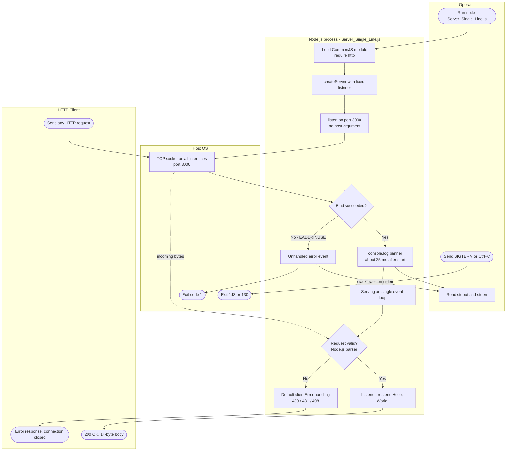
```mermaid
flowchart TB
    subgraph OperatorLane["Operator"]
        OpStart(["Run node Server_Single_Line.js"])
        OpRead["Read stdout and stderr"]
        OpStop(["Send SIGTERM or Ctrl+C"])
    end
    subgraph ProcessLane["Node.js process - Server_Single_Line.js"]
        Load["Load CommonJS module<br/>require http"]
        Create["createServer with fixed listener"]
        Listen["listen on port 3000<br/>no host argument"]
        Bound{"Bind succeeded?"}
        Banner["console.log banner<br/>about 25 ms after start"]
        Serve["Serving on single event loop"]
        Parser{"Request valid?<br/>Node.js parser"}
        Handler["Listener: res.end Hello, World!"]
        Reject["Default clientError handling<br/>400 / 431 / 408"]
        Crash["Unhandled error event"]
    end
    subgraph HostLane["Host OS"]
        Port["TCP socket on all interfaces<br/>port 3000"]
        ExitSignal(["Exit 143 or 130"])
        ExitFail(["Exit code 1"])
    end
    subgraph ClientLane["HTTP Client"]
        Req(["Send any HTTP request"])
        RespOk(["200 OK, 14-byte body"])
        RespErr(["Error response, connection closed"])
    end
    OpStart --> Load --> Create --> Listen --> Port
    Port --> Bound
    Bound -->|Yes| Banner
    Banner --> OpRead
    Banner --> Serve
    Bound -->|No - EADDRINUSE| Crash
    Crash -->|stack trace on stderr| OpRead
    Crash --> ExitFail
    Req --> Port
    Serve --> Parser
    Port -.->|incoming bytes| Parser
    Parser -->|Yes| Handler --> RespOk
    Parser -->|No| Reject --> RespErr
    OpStop --> ExitSignal
```

### 4.4.2 Detailed Process Flow — Service Startup (F-001, F-003)

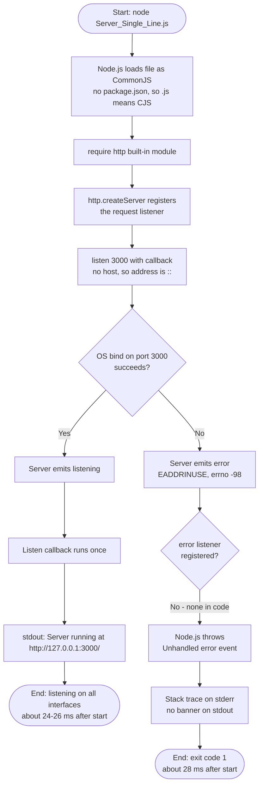
```mermaid
flowchart TD
    S1(["Start: node Server_Single_Line.js"]) --> S2["Node.js loads file as CommonJS<br/>no package.json, so .js means CJS"]
    S2 --> S3["require http built-in module"]
    S3 --> S4["http.createServer registers<br/>the request listener"]
    S4 --> S5["listen 3000 with callback<br/>no host, so address is ::"]
    S5 --> S6{"OS bind on port 3000<br/>succeeds?"}
    S6 -->|Yes| S7["Server emits listening"]
    S7 --> S8["Listen callback runs once"]
    S8 --> S9["stdout: Server running at http://127.0.0.1:3000/"]
    S9 --> S10(["End: listening on all interfaces<br/>about 24-26 ms after start"])
    S6 -->|No| S11["Server emits error<br/>EADDRINUSE, errno -98"]
    S11 --> S12{"error listener<br/>registered?"}
    S12 -->|No - none in code| S13["Node.js throws<br/>Unhandled error event"]
    S13 --> S14["Stack trace on stderr<br/>no banner on stdout"]
    S14 --> S15(["End: exit code 1<br/>about 28 ms after start"])
```

The banner always reads `127.0.0.1` even though the listener binds `::`, because the text is a literal rather than built from `server.address()` (F-003, Section 2.4.3).

### 4.4.3 Detailed Process Flow — Request Handling and Connection Reuse (F-002, F-004)

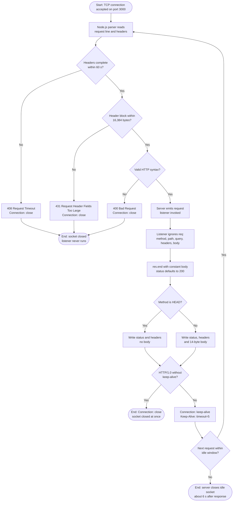
```mermaid
flowchart TD
    R1(["Start: TCP connection accepted on port 3000"]) --> R2["Node.js parser reads<br/>request line and headers"]
    R2 --> R3{"Headers complete<br/>within 60 s?"}
    R3 -->|No| R4["408 Request Timeout<br/>Connection: close"]
    R3 -->|Yes| R5{"Header block within<br/>16,384 bytes?"}
    R5 -->|No| R6["431 Request Header Fields Too Large<br/>Connection: close"]
    R5 -->|Yes| R7{"Valid HTTP syntax?"}
    R7 -->|No| R8["400 Bad Request<br/>Connection: close"]
    R7 -->|Yes| R9["Server emits request<br/>listener invoked"]
    R9 --> R10["Listener ignores req:<br/>method, path, query, headers, body"]
    R10 --> R11["res.end with constant body<br/>status defaults to 200"]
    R11 --> R12{"Method is HEAD?"}
    R12 -->|Yes| R13["Write status and headers<br/>no body"]
    R12 -->|No| R14["Write status, headers<br/>and 14-byte body"]
    R13 --> R15{"HTTP/1.0 without<br/>keep-alive?"}
    R14 --> R15
    R15 -->|Yes| R16(["End: Connection: close<br/>socket closed at once"])
    R15 -->|No| R17["Connection: keep-alive<br/>Keep-Alive: timeout=5"]
    R17 --> R18{"Next request within<br/>idle window?"}
    R18 -->|Yes| R2
    R18 -->|No| R19(["End: server closes idle socket<br/>about 6 s after response"])
    R4 --> R20(["End: socket closed<br/>listener never runs"])
    R6 --> R20
    R8 --> R20
```

In practice the three checks before dispatch (R3, R5, R7) run while bytes arrive, so any one of them can fire first. The listener does not wait for a request body. A `POST` that declared 100 body bytes got its response after sending only 3.

### 4.4.4 Detailed Process Flow — Service Termination (F-001)

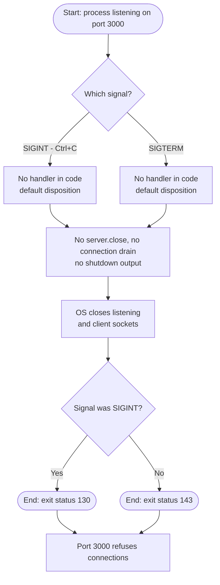
```mermaid
flowchart TD
    T1(["Start: process listening on port 3000"]) --> T2{"Which signal?"}
    T2 -->|SIGINT - Ctrl+C| T3["No handler in code<br/>default disposition"]
    T2 -->|SIGTERM| T4["No handler in code<br/>default disposition"]
    T3 --> T5["No server.close, no connection drain<br/>no shutdown output"]
    T4 --> T5
    T5 --> T6["OS closes listening<br/>and client sockets"]
    T6 --> T7{"Signal was SIGINT?"}
    T7 -->|Yes| T8(["End: exit status 130"])
    T7 -->|No| T9(["End: exit status 143"])
    T8 --> T10["Port 3000 refuses connections"]
    T9 --> T10
```

### 4.4.5 Error Handling Flowcharts

**Startup error handling (process level)**

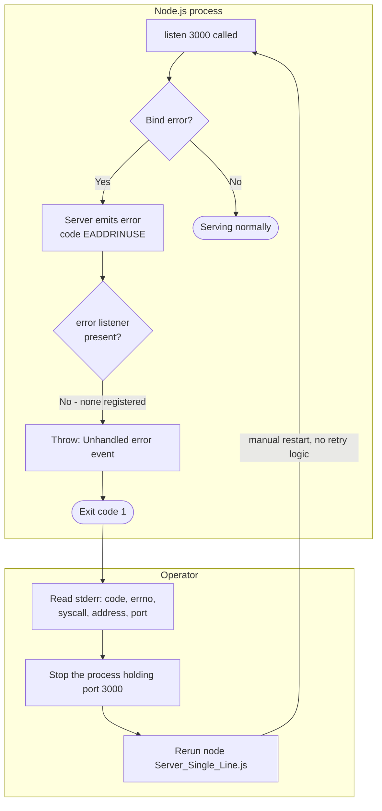
```mermaid
flowchart TD
    subgraph StartupLane["Node.js process"]
        E1["listen 3000 called"]
        E2{"Bind error?"}
        E3["Server emits error<br/>code EADDRINUSE"]
        E4{"error listener<br/>present?"}
        E5["Throw: Unhandled error event"]
        E6(["Exit code 1"])
        E7(["Serving normally"])
    end
    subgraph OperatorRecovery["Operator"]
        E8["Read stderr: code, errno,<br/>syscall, address, port"]
        E9["Stop the process holding port 3000"]
        E10["Rerun node Server_Single_Line.js"]
    end
    E1 --> E2
    E2 -->|No| E7
    E2 -->|Yes| E3 --> E4
    E4 -->|No - none registered| E5 --> E6
    E6 --> E8 --> E9 --> E10
    E10 -->|manual restart, no retry logic| E1
```

**Request error handling (connection level)**

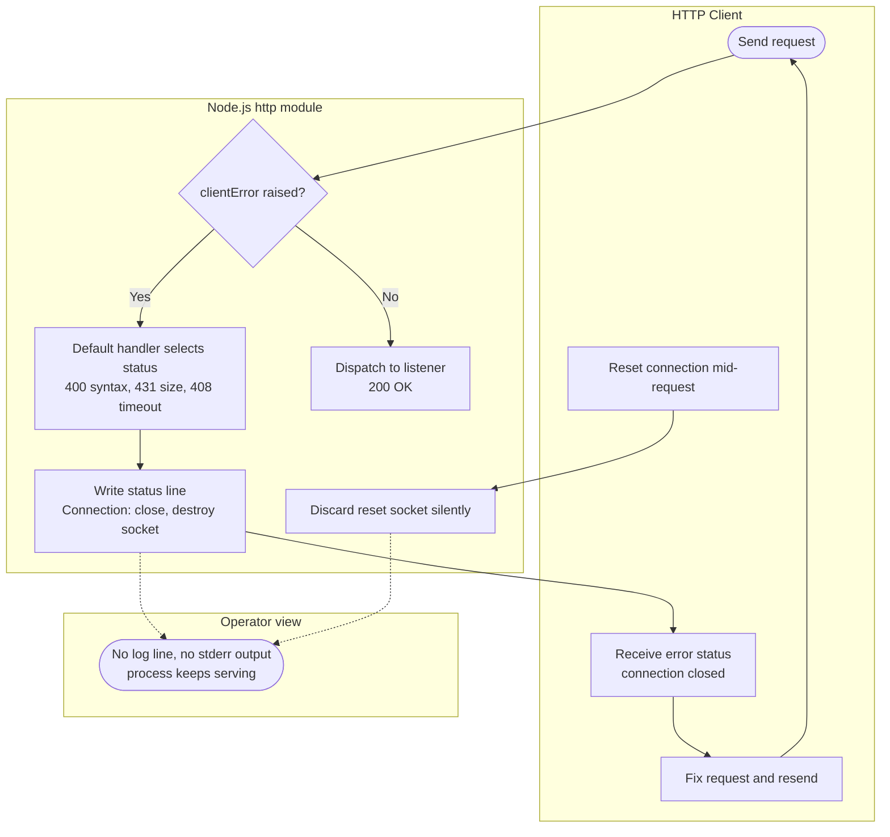
```mermaid
flowchart TD
    subgraph ClientSide["HTTP Client"]
        C1(["Send request"])
        C2["Receive error status<br/>connection closed"]
        C3["Fix request and resend"]
        C4["Reset connection mid-request"]
    end
    subgraph PlatformSide["Node.js http module"]
        P1{"clientError raised?"}
        P2["Default handler selects status<br/>400 syntax, 431 size, 408 timeout"]
        P3["Write status line<br/>Connection: close, destroy socket"]
        P4["Discard reset socket silently"]
        P5["Dispatch to listener<br/>200 OK"]
    end
    subgraph OpsSide["Operator view"]
        O1(["No log line, no stderr output<br/>process keeps serving"])
    end
    C1 --> P1
    P1 -->|No| P5
    P1 -->|Yes| P2 --> P3 --> C2 --> C3 --> C1
    P3 -.-> O1
    C4 --> P4 -.-> O1
```

### 4.4.6 Integration Sequence Diagrams

**Startup and readiness (WF-01)**

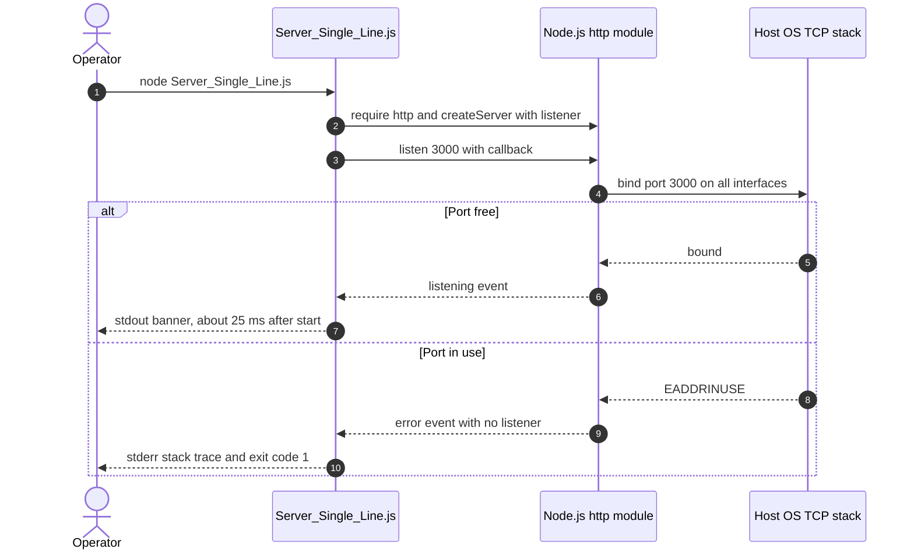
```mermaid
sequenceDiagram
    autonumber
    actor Op as Operator
    participant App as Server_Single_Line.js
    participant Http as Node.js http module
    participant OS as Host OS TCP stack
    Op->>App: node Server_Single_Line.js
    App->>Http: require http and createServer with listener
    App->>Http: listen 3000 with callback
    Http->>OS: bind port 3000 on all interfaces
    alt Port free
        OS-->>Http: bound
        Http-->>App: listening event
        App-->>Op: stdout banner, about 25 ms after start
    else Port in use
        OS-->>Http: EADDRINUSE
        Http-->>App: error event with no listener
        App-->>Op: stderr stack trace and exit code 1
    end
```

**Request exchange with keep-alive (WF-02, WF-03)**

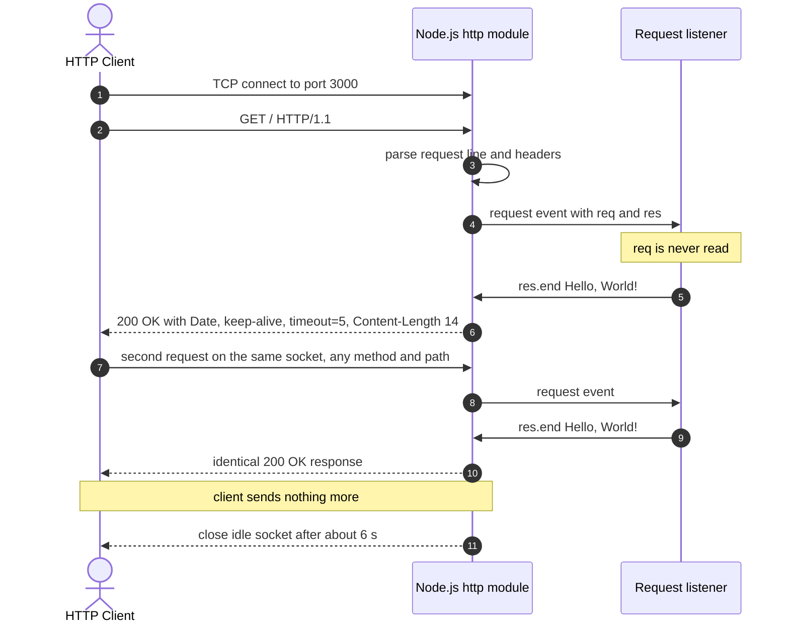
```mermaid
sequenceDiagram
    autonumber
    actor Cl as HTTP Client
    participant Http as Node.js http module
    participant L as Request listener
    Cl->>Http: TCP connect to port 3000
    Cl->>Http: GET / HTTP/1.1
    Http->>Http: parse request line and headers
    Http->>L: request event with req and res
    Note over L: req is never read
    L->>Http: res.end Hello, World!
    Http-->>Cl: 200 OK with Date, keep-alive, timeout=5, Content-Length 14
    Cl->>Http: second request on the same socket, any method and path
    Http->>L: request event
    L->>Http: res.end Hello, World!
    Http-->>Cl: identical 200 OK response
    Note over Cl,Http: client sends nothing more
    Http-->>Cl: close idle socket after about 6 s
```

**Platform rejections (F-004)**

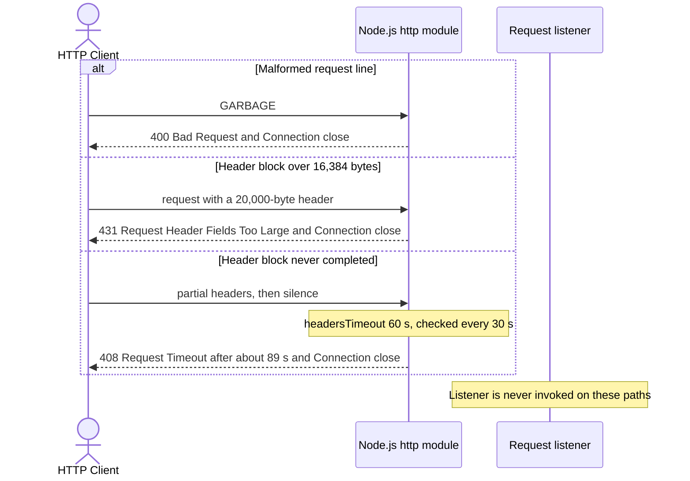
```mermaid
sequenceDiagram
    actor Cl as HTTP Client
    participant Http as Node.js http module
    participant L as Request listener
    alt Malformed request line
        Cl->>Http: GARBAGE
        Http-->>Cl: 400 Bad Request and Connection close
    else Header block over 16,384 bytes
        Cl->>Http: request with a 20,000-byte header
        Http-->>Cl: 431 Request Header Fields Too Large and Connection close
    else Header block never completed
        Cl->>Http: partial headers, then silence
        Note over Http: headersTimeout 60 s, checked every 30 s
        Http-->>Cl: 408 Request Timeout after about 89 s and Connection close
    end
    Note over L: Listener is never invoked on these paths
```

### 4.4.7 State Transition Diagrams

**Process lifecycle**

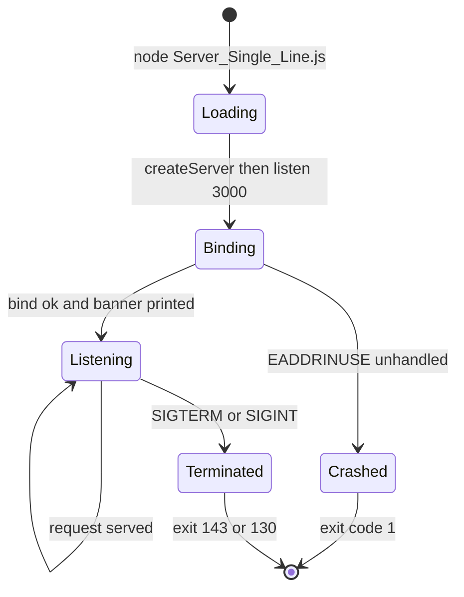
```mermaid
stateDiagram-v2
    [*] --> Loading : node Server_Single_Line.js
    Loading --> Binding : createServer then listen 3000
    Binding --> Listening : bind ok and banner printed
    Binding --> Crashed : EADDRINUSE unhandled
    Listening --> Listening : request served
    Listening --> Terminated : SIGTERM or SIGINT
    Crashed --> [*] : exit code 1
    Terminated --> [*] : exit 143 or 130
```

**Client connection lifecycle**

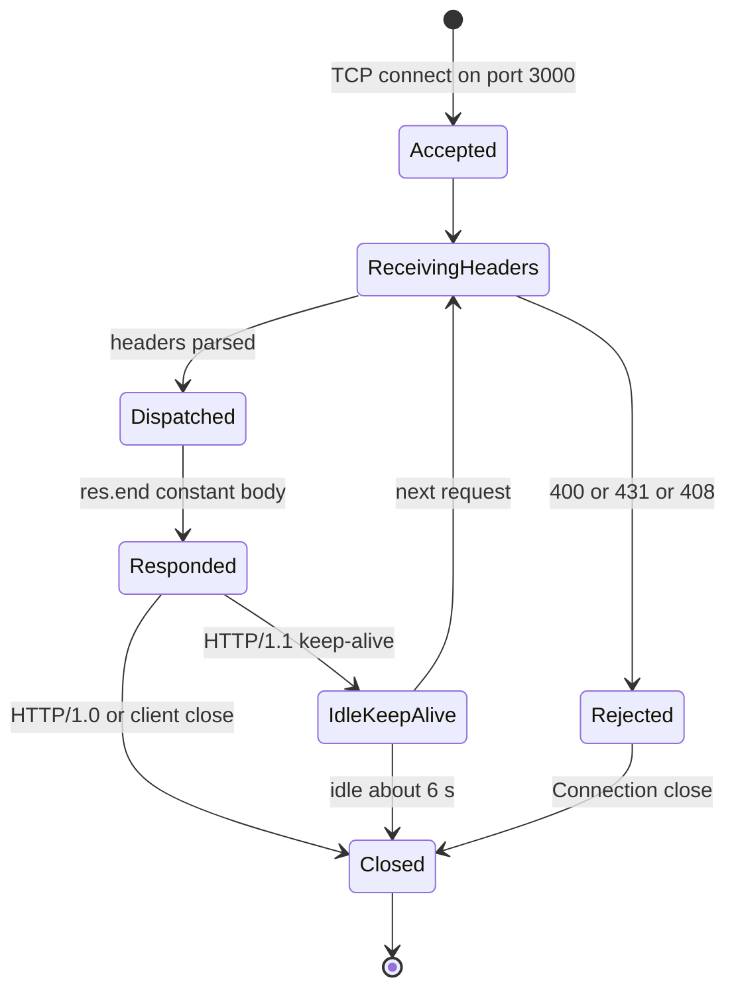
```mermaid
stateDiagram-v2
    [*] --> Accepted : TCP connect on port 3000
    Accepted --> ReceivingHeaders
    ReceivingHeaders --> Rejected : 400 or 431 or 408
    ReceivingHeaders --> Dispatched : headers parsed
    Dispatched --> Responded : res.end constant body
    Responded --> Closed : HTTP/1.0 or client close
    Responded --> IdleKeepAlive : HTTP/1.1 keep-alive
    IdleKeepAlive --> ReceivingHeaders : next request
    IdleKeepAlive --> Closed : idle about 6 s
    Rejected --> Closed : Connection close
    Closed --> [*]
```

## 4.5 References

#### Repository Files and Folders

- `Server_Single_Line.js` - The whole system, a single 142-byte CommonJS statement. Source of every workflow (WF-01 to WF-04), the request listener, the port-3000 binding with no host argument, the banner text, and the absence of error, signal and `'clientError'` handlers.
- `/` (repository root) - Contains only `Server_Single_Line.js`. Shows there is no `package.json`, configuration, test, CI, persistence or logging code, and no `.blitzyignore`.

#### Git History

- Commit `67d0b30`, `server.js` (deleted in `80f2346`) - The predecessor set `res.statusCode = 200` and `Content-Type: text/plain`, bound `127.0.0.1`, and built its banner from constants. It had no error handling either.
- Commits `1231a3a` and `80f2346` - `Server_Single_Line.js` added and unchanged through HEAD.

#### Runtime Verification (Node.js v22.23.3, not pinned)

- Default `http.Server` settings read from a new instance: `keepAliveTimeout` 5,000 ms, `keepAliveTimeoutBuffer` 1,000 ms, `headersTimeout` 60,000 ms, `requestTimeout` 300,000 ms, `connectionsCheckingInterval` 30,000 ms, `timeout` 0, `maxRequestsPerSocket` 0, `http.maxHeaderSize` 16,384 bytes. Zero `'error'` listeners.
- Measured behaviour:
  - Banner at about 24–26 ms after start. `EADDRINUSE` exit 1 at about 28 ms.
  - `200 OK` for valid requests, sent without waiting for the declared body.
  - Idle keep-alive close at 6.01 s. Immediate close for HTTP/1.0.
  - `400`, `431` and `408` (at 89.1 s) rejections.
  - The process survives a client reset.
  - `SIGTERM` exits 143 and `SIGINT` exits 130.

#### Related Technical Specification Sections

- Section 1.2.1 System Overview, Project Context - System context diagram, and the banner deviating from the actual `::` binding.
- Section 1.2.2 System Overview, High-Level Description - Overview sequence diagram.
- Section 1.3.2 Scope, Out-of-Scope - Logging, monitoring and error handling listed as not implemented.
- Section 2.1 Feature Catalog - Feature IDs F-001 to F-004 that the workflows map to.
- Section 2.2 Functional Requirements - Requirement IDs (F-001-RQ-001 to F-004-RQ-004) cited in the validation rules.
- Section 2.3 Feature Relationships - Integration points and the simplified startup and request flows (Section 2.3.4) that this section extends.
- Section 2.4 Implementation Considerations - The 5 s idle-close statement that Section 4.2.2 refines with the measured 6.01 s.
- Section 2.6 Assumptions, Constraints, and Requirement Versioning - Assumptions A-003, A-004 and A-006, constraints C-001 to C-005, and the predecessor-file baselines.
- Section 3.5 Databases & Storage - No persistence, no caching, transient process state.
- Section 3.6 Development & Deployment - Start command, absence of a supervisor, shutdown behaviour, and security risks.

# 5. System Architecture

## 5.1 High-Level Architecture

The whole system is one JavaScript statement in `Server_Single_Line.js`, running in one Node.js process:

```javascript
require('http').createServer((req,res)=>res.end('Hello, World!\n'))
  .listen(3000,()=>console.log('Server running at http://127.0.0.1:3000/'));
```

The statement is shown split over two lines here; the file holds it on one. Everything else in this section is either behaviour that statement sets in motion or behaviour the Node.js runtime adds by default. Every runtime figure was measured on Node.js v22.23.3, the version installed in the verification environment. The repository pins no version (Assumption A-003, Constraint C-002).

### 5.1.1 System Overview

#### Architecture Style and Rationale

The system is a **single-process, single-tier, event-driven HTTP server**. It has no layers: no routing, no service logic, no data access and no presentation. One anonymous callback produces every response, and the libuv event loop in Node.js, a single thread, drives all I/O.

The repository records no rationale. It has no README, design notes, comments or architecture decision records. The style can be read from the code and the git history (Section 1.2.1):

- **Minimal runnable form.** The file is about the smallest program that can start a Node.js HTTP server: one built-in module, two arrow functions and one chained call.
- **Convergence by reduction.** In the history, the server shrank from the 14-line `server.js` (commit `67d0b30`) to the 142-character current file (commit `1231a3a`). Along the way it lost its named constants, its loopback-only binding, the explicit status code and `Content-Type` header, and an unused `lodash` import (commit `d3a331f`). Section 5.3 treats these changes as inferred decisions.
- **Demonstration scope.** Nothing in the code relates to the repository name `Repo_To_Check_Refine_Billing`, and no business domain is implemented (Assumption A-006).

#### Key Architectural Principles and Patterns

| Principle or Pattern | How the Code Applies It | Architectural Consequence |
|---|---|---|
| Zero dependencies | `require('http')` is the only import. No manifest, lockfile or npm package exists | Nothing to install, but no `engines` field controls the runtime version (C-002) |
| Platform defaults over configuration | The code sets no status code, headers, timeouts, host or limits | All protocol behaviour comes from the installed Node.js version (A-003) |
| Stateless request handling | The listener never reads `req` and always returns the same literal | Responses are identical apart from `Date`. Any number of identical instances could serve traffic interchangeably |
| Reactor (event-driven, non-blocking I/O) | The request listener and the listen callback are event handlers on one event loop | One thread multiplexes every connection |
| Fluent method chaining | `createServer(...).listen(...)` with no variable assignment | No code can reach the server to configure, observe or close it (C-003) |
| Side effect on module load | Neither `module.exports` nor `exports` is touched | `require('./Server_Single_Line.js')` returns `{}` and starts the server |
| Fail-fast | No `'error'` listener on the server | Any bind failure ends the process at once with exit code 1 |

#### System Boundaries and Major Interfaces

The boundary is the Node.js process that evaluates the file. Outside it are HTTP clients, the operator or launching shell, whatever captures the process's output streams, and the host operating system's network stack. The system opens no outbound connections and touches no filesystem, database or remote service (Sections 1.2.1 and 3.5).

| Interface | Direction | Contract | Evidence |
|---|---|---|---|
| TCP port 3000, HTTP/1.1 | Inbound | Any method and path returns `200 OK` with body `Hello, World!\n` (`Content-Length: 14`) | `.listen(3000, ...)`; the `EADDRINUSE` diagnostic reports `address: '::'` (all interfaces) |
| Process launch | Inbound | `node Server_Single_Line.js`. Arguments, environment variables and configuration files are not read | No `process.argv`, `process.env` or `fs` usage |
| POSIX signals | Inbound | `SIGTERM` ends the process with exit 143 and `SIGINT` with exit 130, through the default action | No signal handlers in the file |
| Standard output | Outbound | One line, `Server running at http://127.0.0.1:3000/`, written once after the bind succeeds | `console.log` in the listen callback |
| Standard error | Outbound | A Node.js stack trace when an `'error'` event goes unhandled, followed by exit code 1 | Second-instance run: `Error: listen EADDRINUSE: address already in use :::3000` |
| CommonJS module interface | In-process | `require` returns an empty object and starts the server as a side effect | No exports |

### 5.1.2 Core Components Table

None of the components is named in the code. They are the logical parts of the single statement, plus the runtime services it relies on. The five standard columns are split across two tables.

**Responsibilities and dependencies**

| Component | Primary Responsibility | Key Dependencies |
|---|---|---|
| Node.js Runtime Platform | Runs the event loop, parses HTTP/1.1 with llhttp, frames responses, enforces protocol limits and handles uncaught errors and signals | Host OS and a Node.js installation (v22.23.3 verified, not pinned) |
| Bootstrap Expression | Loads `http`, builds the server, starts listening. This is the whole of `Server_Single_Line.js` | CommonJS loader. The file fails as `.mjs` because `require` is undefined there |
| HTTP Server Instance | The unnamed `http.Server` returned by `createServer`. Owns the listening handle and all connections | Built-in `http` module |
| Network Listener | Binds TCP port 3000 on `::` (all interfaces) and accepts connections | Host network stack; port 3000 must be free |
| Request Listener | `(req,res)=>res.end('Hello, World!\n')`. Ends every response with a constant 14-byte body | `ServerResponse` from the runtime |
| Startup Notifier | `()=>console.log(...)`. Prints the fixed banner once the bind succeeds | `'listening'` event; `console` writing to stdout |

**Integration points and critical considerations**

| Component | Integration Points | Critical Considerations |
|---|---|---|
| Node.js Runtime Platform | Every component; OS sockets; stdio; signals | Defaults such as `keepAliveTimeout` 5000 ms and `headersTimeout` 60000 ms belong to the version and may differ elsewhere (A-003) |
| Bootstrap Expression | Process launch or `require` by another module | One statement with no named bindings. Adding error, shutdown or header handling means restructuring it (C-003) |
| HTTP Server Instance | `'request'`, `'listening'` and `'error'` events | No `'error'` or `'clientError'` listener, and no reference kept for `close()` |
| Network Listener | Inbound TCP from any interface | All interfaces are exposed, although the banner suggests loopback. The port is a literal (C-001). IPv6 reachability is unverified (C-005) |
| Request Listener | `'request'` event | Ignores method, path, query, headers and body. No `Content-Type` is sent |
| Startup Notifier | stdout | Hard-coded text does not reflect the real bind address. Its absence is the only sign of a startup failure on stdout |

### 5.1.3 Data Flow Description

#### Primary Data Flows

**Startup flow.** The CommonJS loader evaluates the file. `require('http')` returns the built-in module, `createServer` registers the request listener, and `.listen(3000, callback)` asks the OS to bind `::` port 3000. When the `'listening'` event fires, the Startup Notifier writes the literal banner to stdout. Nothing is read from the environment, the arguments or the disk at any point.

**Request flow.** Bytes arriving on port 3000 go from libuv to the llhttp parser, which builds an `IncomingMessage` (`req`) and a `ServerResponse` (`res`) and emits `'request'`. The listener ignores `req` and calls `res.end('Hello, World!\n')` once. The runtime then writes the status line `HTTP/1.1 200 OK` and the default headers `Date`, `Connection: keep-alive`, `Keep-Alive: timeout=5` and `Content-Length: 14`, followed by the body. Request bodies are never read. A `POST` that declared `Content-Length: 100` but sent only 3 bytes got its `200` straight away. On HTTP/1.1 the connection then stays open for later requests.

**Failure flow.** If the bind fails, the server emits `'error'`. No listener exists, so Node.js throws the error object, prints its stack trace with `code`, `errno`, `syscall`, `address` and `port` to stderr, and exits with code 1. Requests the parser rejects never reach the listener. The runtime answers them directly (Section 5.4.3).

#### Integration Patterns and Protocols

- **Synchronous request/response** over plain HTTP/1.1 on TCP, with persistent connections. There is no TLS. Only HTTP/1.x is served: HTTP/2 would need the separate `http2` module, which the file does not load.
- **One-way text streams** on stdout (the banner) and stderr (fatal diagnostics).
- **POSIX signals** for termination, with the default disposition.
- No messaging, events, webhooks, RPC or outbound calls of any kind.

#### Data Transformation Points

| Point | Input | Output | Performed By |
|---|---|---|---|
| Request parsing | Raw TCP bytes | `req` and `res` objects, or a rejection when headers exceed 16,384 bytes or the syntax is invalid | llhttp parser in the runtime |
| Body encoding | JavaScript string literal `'Hello, World!\n'` | 14 UTF-8 bytes and a computed `Content-Length: 14` | `ServerResponse.end` |
| Method- and version-dependent framing | Request method and HTTP version | `HEAD`: headers only. HTTP/1.0: `Connection: close` and no `Content-Length` | Runtime defaults |
| Protocol rejection | Invalid, oversized or slow requests | `400`, `431` or `408` with `Connection: close` | Default `'clientError'` handling |
| Startup notification | String literal | One stdout line | `console.log` |
| Fatal error reporting | `Error` object from `listen` | stderr stack trace and exit code 1 | Node.js uncaught-error handling |

#### Key Data Stores and Caches

There are none. The only state is transient and held in process memory: the server and its listening handle, the open sockets, the parser state for each connection, and the keep-alive timers. All of it disappears when the process exits (Sections 3.5 and 4.3.1). There is no in-process cache, no external cache, and no `Cache-Control` or `ETag` header.

### 5.1.4 External Integration Points

All external parties connect through process-level or network-level interfaces. None is configured in the repository. The five standard columns are split across two tables.

**Integration type and exchange pattern**

| System Name | Integration Type | Data Exchange Pattern |
|---|---|---|
| HTTP clients (browsers, `curl`, probes, proxies) | Inbound network service | Synchronous request/response on persistent connections; one constant response per request |
| Operator or launching shell | Process control | Start by command; stop by signal (fire-and-forget) |
| Output stream consumer (terminal or whatever captures stdio) | Process output | One banner line on success; one stack trace on fatal error |
| Host OS network stack and firewall | Platform resource | One bind and listen on `::` port 3000 at startup, then accepted connections |
| Node.js runtime installation | Execution platform | Loaded once per process; provides `http`, the event loop and all defaults |
| GitHub remote `lakshya-blitzy/Repo_To_Check_Refine_Billing` | Source hosting (development time only) | `git clone` or pull of the single file; no runtime interaction |

**Protocol, format and service levels**

| System Name | Protocol/Format | SLA Requirements |
|---|---|---|
| HTTP clients | HTTP/1.1 over TCP, no TLS; response body `text` with no declared `Content-Type` | None defined. Runtime limits: 16,384-byte header limit, `headersTimeout` 60 s, `requestTimeout` 300 s, keep-alive idle 5 s advertised |
| Operator or launching shell | Command line; `SIGTERM` and `SIGINT` | None defined. Exit codes: 1 on bind failure, 143 on `SIGTERM`, 130 on `SIGINT` |
| Output stream consumer | Plain-text lines on stdout and stderr | None defined. No structured format, log levels or per-request lines |
| Host OS network stack | TCP socket on `::` port 3000 (IPv4 verified; IPv6 unverified, C-005) | Port 3000 must be free at startup |
| Node.js runtime | CommonJS JavaScript (ES2015 arrow functions) | Version not pinned; behaviour verified only on v22.23.3 |
| GitHub remote | Git over HTTPS | None defined |

## 5.2 Component Details

The components below are the ones listed in Section 5.1.2. The HTTP Server Instance and the Network Listener are covered together because they are one runtime object. Scaling figures come from one indicative local run on the verification host (44 CPUs): a Node.js keep-alive client with 50 concurrent sockets ran for 3 seconds on the same host, three times. These figures are not targets (Assumption A-004).

### 5.2.1 Node.js Runtime Platform

**Purpose and responsibilities.** The runtime does all the protocol and process work the file does not. It runs the event loop, accepts connections, parses requests, frames responses, applies timeouts and size limits, rejects bad requests, prints uncaught errors and applies the default signal handling.

| Aspect | Detail |
|---|---|
| Technologies | Node.js v22.23.3 (LTS line "Jod"), with the bundled V8 12.4.254.21-node.57, libuv 1.51.0 and llhttp 9.4.3. None is pinned by the repository |
| Key interfaces | `http.createServer`, `Server.listen`, `ServerResponse.end`, `console.log`; the `'request'`, `'listening'`, `'error'` and `'clientError'` events |
| Data persistence | None |
| Scaling considerations | The main thread did almost all the CPU work. The other six OS threads in the process were nearly idle. Throughput is therefore bounded by one core per process |

**Effective defaults.** The file overrides none of these values.

| Setting | Value | Effect |
|---|---|---|
| `keepAliveTimeout` / `keepAliveTimeoutBuffer` | 5000 ms / 1000 ms | `Keep-Alive: timeout=5` is advertised; an idle socket was closed after about 6 s |
| `headersTimeout` / `connectionsCheckingInterval` | 60000 ms / 30000 ms | Incomplete headers get `408`; measured at 89.1 s |
| `requestTimeout` | 300000 ms | Upper bound for receiving a whole request |
| `timeout` / `maxRequestsPerSocket` | 0 / 0 | No socket inactivity timeout; unlimited requests per connection |
| `http.maxHeaderSize` | 16384 bytes | Larger header blocks get `431` |

### 5.2.2 Bootstrap Expression

**Purpose and responsibilities.** `Server_Single_Line.js` is the entry point, the whole application and the deployable artifact, all in one. Evaluating it once wires every component together.

| Aspect | Detail |
|---|---|
| Technologies | JavaScript (ES2015 arrow functions), CommonJS module system. There is no build step, transpiler or bundler (Section 3.6.2) |
| Key interfaces | The CLI command `node Server_Single_Line.js`, or `require('./Server_Single_Line.js')`, which returns `{}` |
| Data persistence | None. Nothing is read from or written to disk |
| Scaling considerations | Because loading the file is enough to start a server, it can be reused without changes as the worker script under the Node.js `cluster` module. A temporary wrapper outside the repository forked two workers with `exec` set to this file. Both bound the shared port 3000, both printed the banner and both served requests. The repository contains no such wrapper |

### 5.2.3 HTTP Server Instance and Network Listener

**Purpose and responsibilities.** The unnamed `http.Server` returned by `createServer` owns the listening socket on `::` port 3000 and every accepted connection. It dispatches each parsed request to the Request Listener.

| Aspect | Detail |
|---|---|
| Technologies | Built-in `http` module (`http.Server`, a subclass of `net.Server`) |
| Key interfaces | Inbound TCP on port 3000, all interfaces. The listener and the listen callback are the only handlers registered |
| Data persistence | None. Connection and parser state lives only in memory |
| Scaling considerations | One process can bind port 3000 per network namespace; a second plain instance fails with `EADDRINUSE`. More capacity on one host needs `cluster` (Section 5.2.2) or separate network namespaces or port mappings, because the port is a literal (C-001). Across hosts, instances are interchangeable behind any load balancer, since responses do not depend on state |

**Resource observations.** RSS was 48.7 MB after startup and peaked at 66.6 MB (`VmHWM`) under load. The process ran 7 OS threads. Over three runs it served about 43,900 to 45,000 requests per second with no errors, a p50 latency of about 1.0 ms and a p99 of about 2.3 ms, while using about 0.75 of one core.

### 5.2.4 Request Listener

**Purpose and responsibilities.** It produces the response body. `(req,res)=>res.end('Hello, World!\n')` ends every response with the same 14 bytes, whatever the method, path, query, headers or body.

| Aspect | Detail |
|---|---|
| Technologies | Anonymous arrow function; `ServerResponse.end` |
| Key interfaces | Called by the runtime on `'request'` with `(req, res)`. `req` is never read |
| Data persistence | None. The body is a source-code literal |
| Scaling considerations | Constant work for every request, with no I/O, allocation-heavy logic or blocking calls, so the listener adds almost nothing to event-loop latency. It sets neither `Content-Type` nor a status code, so status `200` comes from the default |

### 5.2.5 Startup Notifier

**Purpose and responsibilities.** It tells the operator that the bind succeeded. The callback passed to `.listen` runs once, on `'listening'`, and prints `Server running at http://127.0.0.1:3000/`.

| Aspect | Detail |
|---|---|
| Technologies | Anonymous arrow function; `console.log` writing to stdout |
| Key interfaces | stdout. It runs 0.024–0.026 s after spawn in the verification runs |
| Data persistence | None |
| Scaling considerations | Under `cluster`, each worker prints its own banner. The text is hard-coded, so it reports `127.0.0.1` even though the server binds all interfaces |

### 5.2.6 Component Interaction Diagram

Solid arrows are data or control flow. Dashed arrows are the event-loop drive, signals, and the failure path.

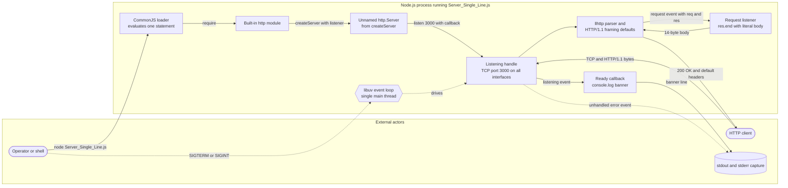
```mermaid
flowchart LR
    subgraph Actors["External actors"]
        Op([Operator or shell])
        Cli([HTTP client])
        Sink[(stdout and stderr capture)]
    end
    subgraph NodeProc["Node.js process running Server_Single_Line.js"]
        Loader[CommonJS loader<br/>evaluates one statement]
        HttpMod[Built-in http module]
        Srv[Unnamed http.Server<br/>from createServer]
        Bind[Listening handle<br/>TCP port 3000 on all interfaces]
        Parser[llhttp parser and<br/>HTTP/1.1 framing defaults]
        Handler[Request listener<br/>res.end with literal body]
        Ready[Ready callback<br/>console.log banner]
        Loop{{libuv event loop<br/>single main thread}}
    end
    Op -->|node Server_Single_Line.js| Loader
    Loader -->|require| HttpMod
    HttpMod -->|createServer with listener| Srv
    Srv -->|listen 3000 with callback| Bind
    Bind -->|listening event| Ready
    Ready -->|banner line| Sink
    Bind -.->|unhandled error event| Sink
    Cli -->|TCP and HTTP/1.1 bytes| Bind
    Bind --> Parser
    Parser -->|request event with req and res| Handler
    Handler -->|14-byte body| Parser
    Parser -->|200 OK and default headers| Cli
    Loop -.->|drives| Bind
    Op -.->|SIGTERM or SIGINT| Loop
```

### 5.2.7 State Transition Diagram

The process lifecycle contains the connection lifecycle as a composite state. Section 4.3.1 lists each state's entry and exit conditions.

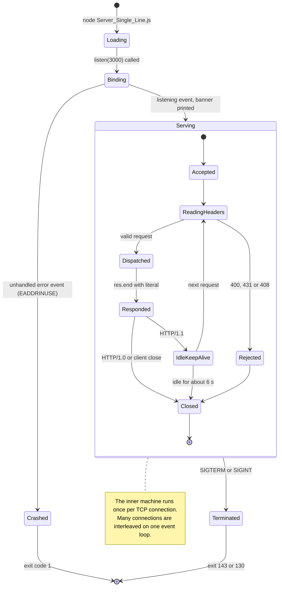
```mermaid
stateDiagram-v2
    [*] --> Loading: node Server_Single_Line.js
    Loading --> Binding: listen(3000) called
    Binding --> Serving: listening event, banner printed
    Binding --> Crashed: unhandled error event (EADDRINUSE)
    Crashed --> [*]: exit code 1
    state Serving {
        [*] --> Accepted
        Accepted --> ReadingHeaders
        ReadingHeaders --> Dispatched: valid request
        ReadingHeaders --> Rejected: 400, 431 or 408
        Dispatched --> Responded: res.end with literal
        Responded --> IdleKeepAlive: HTTP/1.1
        Responded --> Closed: HTTP/1.0 or client close
        IdleKeepAlive --> ReadingHeaders: next request
        IdleKeepAlive --> Closed: idle for about 6 s
        Rejected --> Closed
        Closed --> [*]
    }
    note right of Serving
        The inner machine runs once per TCP connection.
        Many connections are interleaved on one event loop.
    end note
    Serving --> Terminated: SIGTERM or SIGINT
    Terminated --> [*]: exit 143 or 130
```

### 5.2.8 Sequence Diagrams for Key Flows

#### Startup, Bind Outcome and Readiness

```mermaid
sequenceDiagram
    participant Op as Operator
    participant Proc as Node.js process
    participant Srv as http.Server
    participant OS as Host OS network stack
    Op->>Proc: node Server_Single_Line.js
    Proc->>Srv: createServer(listener) then listen(3000, readyCallback)
    Srv->>OS: Bind and listen on address :: port 3000
    alt Port 3000 free
        OS-->>Srv: Socket bound
        Srv->>Srv: Emit listening, run ready callback
        Srv-->>Op: stdout banner
        Note over Proc: Event loop stays alive on the open handle
    else Port 3000 in use
        OS-->>Srv: EADDRINUSE, errno -98
        Srv->>Proc: Emit error event, no listener registered
        Proc-->>Op: stderr stack trace, exit code 1, no banner
    end
```

#### Request Handling on a Persistent Connection and Shutdown

```mermaid
sequenceDiagram
    autonumber
    participant Op as Operator
    participant Proc as Node.js process
    participant Srv as http.Server
    participant Lst as Request listener
    participant Cli as HTTP client
    Op->>Proc: node Server_Single_Line.js
    Proc->>Srv: createServer(listener)
    Proc->>Srv: listen(3000, readyCallback)
    Srv-->>Op: stdout banner, Server running at 127.0.0.1 port 3000
    Cli->>Srv: TCP connect to port 3000
    loop Each request on the kept-alive connection
        Cli->>Srv: Request line and headers, any method and path
        Srv->>Lst: request event (req, res)
        Lst->>Srv: res.end with constant body
        Srv-->>Cli: 200 OK, Date, keep-alive headers, Content-Length 14
    end
    Note over Srv,Cli: No further request for about 6 s, 5 s advertised plus 1 s buffer
    Srv-->>Cli: Server closes the idle socket
    Op->>Proc: SIGTERM
    Proc-->>Op: Exit status 143, no output
```

## 5.3 Technical Decisions

The repository documents no decisions. It has no README, comments, issues or ADR files, and every file-adding commit carries GitHub's default message, "Add files via upload". The decisions below are **inferred** from the current code and from the two deleted earlier versions (Section 1.2.1). Each tradeoff describes what the code actually does, not a stated intent.

### 5.3.1 Architecture Style Decisions and Tradeoffs

| Decision Area | Current Choice | Alternative Seen or Not Taken | Tradeoff |
|---|---|---|---|
| Server implementation | Built-in `http` module only | `server (1).js` (`d3a331f`) imported `lodash`, which was unused and undeclared, and was deleted in `cf5854a`. No framework appears in any commit | Nothing to install and no supply-chain exposure, but no routing, middleware or content negotiation |
| Code structure | One chained expression with anonymous callbacks | `server.js` (`67d0b30`) used the constants `hostname` and `port` and a `server` variable | As short as possible, but nothing can configure, observe or close the server (C-003) |
| Process model | One process with one event-loop thread | `cluster` and `worker_threads` are not used | Simple, but throughput is capped at roughly one core per process (Section 5.2.1) |
| Deployment unit | The raw source file | No manifest, container image or service unit exists (Section 3.6) | Runs anywhere Node.js is installed, but the runtime version and supervision are left to the host |
| Configuration | Literals in source | `server.js` collected the same values in named constants. Neither version read the environment | No configuration drift, but changing the port means editing two literals (C-001) |

### 5.3.2 Communication Pattern Choices

| Concern | Choice | Effect | Tradeoff |
|---|---|---|---|
| Client protocol | Plain HTTP/1.1 through `http` | Any HTTP client works without setup | No TLS; HTTP/2 not offered |
| Interaction style | Synchronous request/response with a single `res.end` call | One response per request, written in one call | No streaming, push or asynchronous callbacks to clients |
| Connection management | Runtime keep-alive defaults | Connections are reused; idle ones close after about 6 s | Each open socket holds memory, and there is no connection cap (`maxConnections` is unset) |
| Operator signalling | stdout banner, stderr trace, POSIX signals | Readiness and failure can be seen without extra tooling | Plain text with no structure. The banner shows the wrong address |
| Service-to-service | None | No outbound dependencies, so no cascading failures | Cannot be composed with other services without new code |

### 5.3.3 Data Storage Solution Rationale

The system has no storage, because it holds no data. The response body is a literal in the source, the request is never read, and no state lasts beyond one response.

| Storage Option | Status | Justification |
|---|---|---|
| Relational or document database | Not used | No entity, record or query exists |
| Filesystem | Not used | `fs` is never loaded; the code and the content are the same file |
| Embedded store (SQLite bundled with Node.js v22.23.3) | Not used | `node:sqlite` is never loaded (Section 3.5) |
| In-memory state | Transient runtime state only | Server handle, sockets and timers; lost on exit with no effect (Section 4.3.1) |

Because nothing persists, there is nothing to back up, migrate, retain or encrypt at rest.

### 5.3.4 Caching Strategy Justification

The system caches nothing, at any layer.

| Layer | Status | Justification |
|---|---|---|
| Application (in-process) | None | The body is a constant literal produced with no computation or I/O, so a cache would only add memory and code |
| Distributed cache (Redis, Memcached) | None | There is no shared data to cache and no client library |
| HTTP caching | No explicit policy | No `Cache-Control`, `ETag`, `Last-Modified` or `Expires` header is sent. Clients and intermediaries get no freshness or validation information |
| Connection reuse | Runtime default | Keep-alive reuse is the only performance optimisation, and it comes from Node.js, not the code |

### 5.3.5 Security Mechanism Selection

The code selects no security mechanism. The only protections come from the runtime defaults and from the request never being read.

| Mechanism | Status in Code | Effective Protection | Residual Risk |
|---|---|---|---|
| Transport encryption | None; `http`, not `https` | None | Traffic is plaintext on every interface |
| Authentication and authorization | None | None; any peer that can reach the port gets a response | Unrestricted access (Section 5.4.4) |
| Network exposure control | `listen(3000)` binds `::` | Host firewall only | The banner's `127.0.0.1` understates the exposure (Section 3.6.6) |
| Input handling | `req` is never read | No injection, deserialization or path-traversal surface in application code | Parser vulnerabilities depend on the unpinned runtime |
| Protocol limits | Runtime defaults | Headers limited to 16,384 bytes (`431`); slow headers closed (`408`); a missing `Host` on HTTP/1.1 is rejected with `400` | No rate limiting and no cap on connections |
| Response security headers | None | No `Content-Type`, `X-Content-Type-Options`, CSP or HSTS | Clients have to guess the media type of a fixed, harmless body |
| Supply chain | No third-party packages | The unused `lodash` import was removed | Security patching depends on the host's Node.js installation |

### 5.3.6 Decision Tree

Read the tree top to bottom. At each node the current file takes the "No" branch. Branches labelled with commit `67d0b30` are the paths taken by the deleted `server.js`.

```mermaid
flowchart TD
    Need([Need: answer HTTP requests with a fixed message]) --> Q1{Routing, middleware or<br/>third-party helpers needed?}
    Q1 -->|Yes, not taken| Fw[Add framework or npm packages<br/>requires package.json]
    Q1 -->|No| BuiltIn[ADR-001: Node.js built-in http only]
    BuiltIn --> Q2{Need a handle to configure,<br/>close or observe the server?}
    Q2 -->|Yes, as in server.js 67d0b30| Named[Named constants and server variable]
    Q2 -->|No| Chain[ADR-002: one chained expression]
    Chain --> Q3{Restrict exposure or<br/>make the port configurable?}
    Q3 -->|Yes, as in server.js 67d0b30| Loopback[listen on 127.0.0.1 with constants]
    Q3 -->|No| AllIf[ADR-003: literal port 3000, all interfaces]
    AllIf --> Q4{Response metadata<br/>set explicitly?}
    Q4 -->|Yes, as in server.js 67d0b30| Explicit[statusCode 200 and Content-Type text/plain]
    Q4 -->|No| Defaults[ADR-004: Node.js defaults only]
    Defaults --> Q5{Data that must outlive<br/>a request or the process?}
    Q5 -->|Yes, not present| Store[Add a datastore or cache]
    Q5 -->|No| Stateless[ADR-005: stateless, no storage or cache]
    Stateless --> Q6{Errors, signals or restarts<br/>handled in code?}
    Q6 -->|Yes, not present| Handlers[error, clientError and signal handlers]
    Q6 -->|No| Delegate[ADR-006: delegate to Node.js defaults and operator]
    Delegate --> Current([Current Server_Single_Line.js])
```

### 5.3.7 Architecture Decision Records

The repository contains no ADR files. The register below reconstructs ADRs from the code. "Inferred – in effect" means the current tree shows the decision but no record of it exists.

| ID | Decision | Status | Evidence |
|---|---|---|---|
| ADR-001 | Use only the Node.js built-in `http` module | Inferred – in effect | `require('http')` is the only import; the `lodash` variant was deleted (`cf5854a`) |
| ADR-002 | Write the server as one chained expression | Inferred – in effect | `Server_Single_Line.js` added in `1231a3a`; the 14-line `server.js` was deleted in `80f2346` |
| ADR-003 | Hard-code port 3000 and bind all interfaces | Inferred – in effect | `.listen(3000, cb)` with no host; `server.js` had used `'127.0.0.1'` |
| ADR-004 | Rely on runtime defaults for status and headers | Inferred – in effect | No `statusCode` or `setHeader`; `server.js` had set `Content-Type: text/plain` |
| ADR-005 | Stateless; no storage or caching | Inferred – in effect | No `fs`, database or cache usage; the body is a literal |
| ADR-006 | Leave error handling, shutdown and restarts to the runtime and the operator | Inferred – in effect | No `'error'`, `'clientError'` or signal handlers; no supervisor (Section 3.6.3) |

**ADR-001 — Built-in `http` only.** *Context:* the server only has to return a fixed message. *Decision:* use no framework and no npm packages. *Consequences:* nothing to install and no third-party attack surface. Any routing or middleware would have to be built by hand or would need a manifest.

**ADR-002 — Single chained expression.** *Context:* the 14-line `server.js` and the shorter `server (1).js` both existed before the current file. *Decision:* keep only the one-line form. *Consequences:* the code is as short as it can be, but no reference to the server exists, so `close()`, `'error'` listeners and timeout tuning cannot be added without restructuring (C-003).

**ADR-003 — Literal port, all interfaces.** *Context:* `server.js` bound to loopback through a `hostname` constant. *Decision:* the current file passes only the port. *Consequences:* the server is reachable from every interface and the banner reports the wrong address. One plain instance per network namespace (Section 5.2.3).

**ADR-004 — Platform default headers.** *Context:* `server.js` set the status and `Content-Type` explicitly. *Decision:* set neither. *Consequences:* the response carries `Date`, `Connection`, `Keep-Alive` and `Content-Length` only, and the protocol details depend on the runtime version (A-003).

**ADR-005 — Stateless with no storage.** *Context:* the response depends on no data. *Decision:* use no persistence or cache. *Consequences:* restarts lose nothing, any number of instances are interchangeable, and there is nothing to back up.

**ADR-006 — Delegated error handling.** *Context:* no version in the history handled errors. *Decision:* use the Node.js defaults. *Consequences:* bind failures crash the process (fail-fast), protocol errors get minimal runtime responses, and shutdown drops requests still in flight (Section 5.4.3).

The diagram below links each ADR to the commits that support it.

```mermaid
flowchart LR
    subgraph History["Git history on 2026-10-08, +0530"]
        C1["638cf62 10:28:43<br/>Initial commit, README.md"]
        C2["f433f8e 10:28:59<br/>Delete README.md"]
        C3["67d0b30 10:29:22<br/>Add server.js, 14 lines"]
        C4["d3a331f 10:30:05<br/>Add server (1).js with lodash"]
        C5["1231a3a 10:30:54<br/>Add Server_Single_Line.js"]
        C6["cf5854a 10:31:10<br/>Delete server (1).js"]
        C7["80f2346 10:31:20<br/>Delete server.js, HEAD"]
        C1 --> C2 --> C3 --> C4 --> C5 --> C6 --> C7
    end
    subgraph Records["Inferred architecture decision records"]
        A1[ADR-001 Built-in http only]
        A2[ADR-002 Single chained expression]
        A3[ADR-003 Literal port, all interfaces]
        A4[ADR-004 Platform default headers]
        A5[ADR-005 Stateless, no storage]
        A6[ADR-006 Delegated error handling]
    end
    C6 -->|lodash variant removed| A1
    C4 -->|chained style first appears| A2
    C5 -->|only surviving form| A2
    C7 -->|loopback variant deleted| A3
    C7 -->|explicit-header variant deleted| A4
    C5 --> A5
    C5 --> A6
```

## 5.4 Cross-Cutting Concerns

`Server_Single_Line.js` contains no code for any cross-cutting concern. Each concern below is therefore either a Node.js default or something left to whatever runs the process. Section 4.3.2 has the full error catalog and recovery steps; this section covers the architectural view.

### 5.4.1 Monitoring and Observability Approach

The process is not instrumented. It exposes no metrics, no separate health endpoint, no APM agent and no tracing. Its state can only be observed from outside.

| Signal | Source | What It Indicates | Limitation |
|---|---|---|---|
| Process running or exit status | OS process table | Running, or exited with 1 (bind failure), 143 (`SIGTERM`) or 130 (`SIGINT`) | No supervisor in the repository watches or reports it |
| Startup banner on stdout | Startup Notifier | The bind succeeded | Printed once; the address in it is hard-coded |
| HTTP probe to any path | Request Listener | Port reachable, event loop responsive, `200` with body `Hello, World!\n` | Every path answers the same way, so a probe cannot tell health from normal traffic and cannot report degradation |
| TCP connect to port 3000 | Host network stack | A listener is bound | Does not prove that HTTP processing works |
| stderr stack trace | Node.js runtime | Fatal startup error, with `code`, `errno`, `syscall`, `address` and `port` | Appears only on the crash path |

Since every path returns `200`, any URL can serve as the liveness or readiness check for an external orchestrator or load balancer. The repository configures neither.

### 5.4.2 Logging and Tracing Strategy

There is no logging framework, no log levels, no structured format and no tracing.

| Event | Recorded | Destination | Format |
|---|---|---|---|
| Startup success | Yes | stdout | Fixed text: `Server running at http://127.0.0.1:3000/` |
| Startup failure | Yes, by the runtime | stderr | Node.js stack trace and error properties |
| Each request served | No | — | — |
| Protocol rejection (`400`, `431`, `408`) | No | Sent only to that client | Minimal runtime response with `Connection: close` |
| Client connection reset | No | — | — |
| Shutdown by signal | No | Exit status only | — |

- **Tracing.** No request IDs or correlation IDs are generated. Incoming trace context, such as a `traceparent` header, is never read and so never propagated.
- **Retention and rotation.** Rotation, shipping and retention are left to whatever captures the process streams. The repository defines no capture mechanism.

### 5.4.3 Error Handling Patterns

| Pattern | Where Applied | Behaviour |
|---|---|---|
| Fail-fast crash | `'error'` from `listen`, with no listener (for example `EADDRINUSE`) | Thrown as an uncaught error: stack trace on stderr, no banner, exit code 1 |
| Runtime default rejection | Parser and timeout errors through the default `'clientError'` handling | `400` (malformed, or `Host` missing on HTTP/1.1), `431` (headers over 16,384 bytes), `408` (headers incomplete); then `Connection: close`. The listener is not called |
| Per-socket fault isolation | A client resets the connection | Only that socket is destroyed; later requests are served normally |
| Default signal disposition | `SIGTERM`, `SIGINT` | The process exits at once (143 or 130) without draining requests in flight |
| Retry and fallback | Not implemented | There is no bind retry, alternate port or degraded mode. Clients can safely retry any request, because the response is constant and has no side effects |

#### Error Handling Flow

```mermaid
flowchart TD
    subgraph StartupErrors["Startup errors"]
        ListenCall[listen 3000 called] --> BindOk{Bind succeeded?}
        BindOk -->|Yes| BannerOut[Banner written to stdout]
        BindOk -->|No, EADDRINUSE or other| ErrEvent[Server emits error event]
        ErrEvent --> HasListener{error listener<br/>registered?}
        HasListener -->|No, none in code| Throw[Thrown as unhandled error]
        Throw --> StackOut[Stack trace with code, errno,<br/>syscall, address, port on stderr]
        StackOut --> ExitOne([Exit code 1, no banner])
    end
    subgraph RequestErrors["Request-level errors"]
        Bytes[Bytes arrive on a connection] --> ParseOk{Parser accepts<br/>the request?}
        ParseOk -->|Yes| Listener[Listener ends response<br/>with constant body]
        Listener --> Ok200([200 OK])
        ParseOk -->|Malformed| E400[400 Bad Request]
        ParseOk -->|Headers over 16384 bytes| E431[431 Request Header Fields Too Large]
        ParseOk -->|Headers incomplete after headersTimeout| E408[408 Request Timeout]
        E400 --> CloseConn(["Connection closed, nothing logged"])
        E431 --> CloseConn
        E408 --> CloseConn
        Bytes -->|Client reset| Destroy([Socket destroyed, process continues])
    end
    subgraph TerminationErrors["Termination"]
        Sig[SIGTERM or SIGINT received] --> SigHandler{Signal handler<br/>registered?}
        SigHandler -->|No, none in code| DefaultAct([OS default action, exit 143 or 130,<br/>in-flight requests dropped])
    end
    BannerOut --> Bytes
    BannerOut --> Sig
```

### 5.4.4 Authentication and Authorization Framework

There is none. Every request is anonymous and receives the same response.

| Concern | Status | Evidence |
|---|---|---|
| Authentication (credentials, tokens, API keys, mTLS) | None | `req` is never read, so an `Authorization` header or cookie is ignored |
| Authorization (roles, scopes, policies) | None | No routing exists, so there are no resources to protect separately |
| Sessions | None | No cookies or session state are issued or kept |
| Identity provider integration | None | No outbound calls (Section 1.2.1) |
| Effective access boundary | Network reachability of TCP port 3000 on every interface | `listen(3000)` with no host. Firewalls or network policy outside the repository are the only control (Section 3.6.6) |

### 5.4.5 Performance Requirements and SLAs

The repository defines no performance requirements, SLAs or SLOs. The figures below come from local verification runs and are indicative only (A-004).

| Metric | Observed Value | Conditions |
|---|---|---|
| Spawn to banner | 0.024–0.026 s | Cold start on Node.js v22.23.3 |
| Spawn to first response | 0.027–0.049 s | Same runs |
| Throughput | About 43,900–45,000 requests/s, 0 errors | 50 keep-alive sockets for 3 s; client on the same host; three runs |
| Latency | p50 about 1.0 ms; p99 about 2.3 ms | Same runs, measured by the client |
| CPU | About 0.75 core; nearly all on the main thread | Measured from the process CPU counters over one run |
| Memory | RSS 48.7 MB at idle; 66.6 MB peak | After startup; after three load runs |

**Platform-enforced bounds.** Headers are limited to 16,384 bytes, `headersTimeout` is 60 s (with a 30 s check interval), `requestTimeout` is 300 s, the keep-alive idle timeout is 5 s plus a 1 s buffer, and the number of requests per socket and of connections is unlimited.

**Scalability implications.**

- **Vertical.** One event-loop thread caps each process at about one core. Extra cores on the host go unused unless more processes run.
- **Horizontal on one host.** Port 3000 is a literal, so only one plain instance fits per network namespace. Running the file unchanged under `cluster` shares the port across workers (verified with two workers; Section 5.2.2).
- **Horizontal across hosts.** Instances are stateless and interchangeable, so any load balancer can spread traffic among them with no session affinity.
- **Overload behaviour.** Nothing in the code applies back-pressure, rate limiting or a connection cap. Under overload, latency rises until a runtime timeout or the OS stops it.

### 5.4.6 Disaster Recovery Procedures

The system stores no data, so the recovery point objective does not apply: no data can be lost. Recovery time is the time to obtain a host with Node.js and the 142-byte file, plus about 25 ms of process startup. The repository includes no automation, supervision, replication or failover.

| Scenario | Recovery Procedure | Data Loss |
|---|---|---|
| Process crashed or was stopped | Run `node Server_Single_Line.js` again; check for the banner and a `200` response | None |
| Port 3000 held by another process | Free the port, then restart. Moving to another port means editing both literals (C-001) | None |
| Host lost | Provision a host with Node.js, `git clone` the GitHub remote (`main` and `0810_01` have identical trees), then run the file | None |
| Remote repository lost | Restore from any clone, which holds the full seven-commit history | None |
| Runtime upgrade changes behaviour | Re-check the Section 2.2 acceptance criteria by hand (no tests, C-004); the repository cannot pin a version (C-002) | None |
| Planned maintenance | Stop routing traffic to the instance before sending `SIGTERM`, because requests in flight are not drained | None |

## 5.5 References

**Repository files and folders**

- `Server_Single_Line.js` - The entire system: one CommonJS statement that loads `http`, registers the constant-response listener, binds port 3000 on all interfaces and prints the startup banner. This is the source of every component, interface and inferred decision in this section.
- `` (repository root) - Contains only `Server_Single_Line.js` and `.git`. Confirms there is no manifest, configuration, tests, CI, container or infrastructure definition.

**Git history (evidence for the inferred decisions in Section 5.3)**

- Commit `67d0b30` (`server.js`, deleted in `80f2346`) - 14-line predecessor with `hostname = '127.0.0.1'`, `port = 3000`, explicit `statusCode = 200` and `Content-Type: text/plain`.
- Commit `d3a331f` (`server (1).js`, deleted in `cf5854a`) - Chained variant with an unused, undeclared `require('lodash')`.
- Commit `1231a3a` - Adds the current `Server_Single_Line.js`; unchanged through HEAD `80f2346` on branches `main` and `0810_01`.
- Commits `638cf62`, `f433f8e` - Initial README creation and deletion; timeline for the ADR evolution diagram.

**Runtime verification (Node.js v22.23.3, verification environment)**

- Response headers and body, keep-alive behaviour, `EADDRINUSE` diagnostic (`address: '::'`, errno `-98`, exit 1), exit codes 143 and 130 on signals.
- `http.Server` defaults: `keepAliveTimeout`, `keepAliveTimeoutBuffer`, `headersTimeout`, `requestTimeout`, `connectionsCheckingInterval`, `maxRequestsPerSocket`, `maxConnections`, `requireHostHeader`, `http.maxHeaderSize`.
- Indicative load figures (throughput, latency, CPU per thread, RSS), and running the file unchanged as two `cluster` workers through a temporary wrapper outside the repository.

**Related Technical Specification sections**

- Section 1.2 System Overview - Evolution table, current limitations, system context and component descriptions.
- Section 2.3 Feature Relationships - Feature IDs F-001 to F-004, integration points and shared components.
- Section 2.6 Assumptions, Constraints, and Requirement Versioning - Assumptions A-003, A-004, A-006 and constraints C-001 to C-005.
- Section 3.5 Databases & Storage - No persistence, caching or storage services.
- Section 3.6 Development & Deployment - Runtime execution, absence of supervision and CI/CD, deployment security risks.
- Section 4.3 Technical Implementation - Process and connection state tables, error catalog, notification flows and recovery procedures.

# 6. SYSTEM COMPONENTS DESIGN

## 6.1 Core Services Architecture

### 6.1.1 Applicability Assessment

**Core Services Architecture is not applicable for this system.**

The repository has one deployable unit, `Server_Single_Line.js`. It is a single 142-character CommonJS statement that starts one HTTP server in one Node.js process (Section 5.1.1):

```javascript
require('http').createServer((req,res)=>res.end('Hello, World!\n'))
  .listen(3000,()=>console.log('Server running at http://127.0.0.1:3000/'));
```

A services architecture needs several independently deployed components that cooperate over a network. The repository meets none of the preconditions for one:

| Precondition | Observed in the Repository | Evidence |
|---|---|---|
| More than one deployable service | One file, run as one process. Only four paths have ever been committed: `README.md`, `server.js`, `server (1).js` and `Server_Single_Line.js`. The two deleted `.js` files were earlier versions of the same server, not cooperating services | Root folder contents; git history (Section 5.3.7) |
| Communication between services | None. The process makes no outbound calls. It loads only the built-in `http` module and uses only `createServer` | `Server_Single_Line.js`; Section 5.3.2 |
| Decomposition by business domain | No domain logic. The repository name mentions billing, but no billing code exists | Assumption A-006 (Section 2.6) |
| Orchestration or deployment descriptors | None in any commit: no Dockerfile, Compose file, Kubernetes or Helm manifest, Procfile, PM2 file, proxy configuration or IaC | Git history; Sections 3.6.4 and 3.6.5 |
| Data stores, shared or per service | None | Sections 3.5 and 5.3.3 |
| Service configuration or metadata | None. No environment variables, arguments or configuration files are read, and the port is a literal | Constraint C-001; Section 5.1.1 |

The single-process design is fixed by how the code is built. The statement keeps no reference to the server it creates (Constraint C-003). Code that registers, health-reports, coordinates or closes that server cannot be added without restructuring the file.

Sections 6.1.2 to 6.1.4 take each concern from the services template in turn. For each one they record that it is absent, and they give the runtime facts that govern how the single process scales and fails. Results marked **verification only** came from a temporary wrapper outside the repository. They show what the unchanged file can support, not what the repository provides. All runtime figures were measured on Node.js v22.23.3. The repository does not pin that version (Assumption A-003).

### 6.1.2 Service Components

#### Service Boundaries and Responsibilities

The system has exactly one service boundary, and it is the boundary of the Node.js process.

| Unit | Responsibility | Boundary Interfaces | Evidence |
|---|---|---|---|
| Node.js process running `Server_Single_Line.js` | Accepts HTTP/1.1 on port 3000 and answers every request with `200 OK` and `Hello, World!\n`. Prints the startup banner once | Inbound TCP 3000 on `::` (all interfaces), stdout, stderr, POSIX signals | Sections 5.1.1 and 5.1.4 |

Section 5.1.2 lists the logical components inside the process: the runtime platform, the bootstrap expression, the server instance, the network listener, the request listener and the startup notifier. They share one event loop and one memory space, and none can be deployed, scaled or failed on its own.

#### Service Pattern Status

| Concern | Status | Behaviour in the Code | Implication |
|---|---|---|---|
| Inter-service communication | Not applicable | No outbound HTTP, RPC, messaging or event calls. Clients reach the process only by synchronous inbound HTTP/1.1 | No downstream dependency can fail, so there is no cascading-failure path (Section 5.3.2) |
| Service discovery | None | The address is fixed: literal port `3000` on all interfaces. No registry, DNS registration or environment lookup exists. The banner's `127.0.0.1` is hard-coded and is not the real bind address | Clients and proxies must be given `host:3000` some other way. The banner cannot serve as registration data |
| Load balancing | None in the repository | One process accepts every connection. There is no reverse proxy, gateway or `cluster` primary | The response is stateless and constant, so an external balancer could spread traffic without session affinity (Section 5.4.5) |
| Circuit breaker | Not applicable | There are no dependencies to protect | Nothing exists for a breaker to trip on |
| Retry | None | A failed bind is not retried: `EADDRINUSE` ends the process with exit code 1. There are no client libraries | Clients can safely retry any request, because the response is constant and has no side effects (Section 5.4.3) |
| Fallback | None | No alternate port, cached response or degraded mode | The process either serves the full response or is down |
| Timeouts | Runtime defaults only | `keepAliveTimeout` 5000 ms plus a 1000 ms buffer, `headersTimeout` 60000 ms, `requestTimeout` 300000 ms, socket `timeout` 0 | These apply only to inbound connections. No timeout governs outbound calls, because there are none |

**Connection reuse.** The server advertises `Keep-Alive: timeout=5` but closes an idle socket after about 6 s, because of the 1000 ms `keepAliveTimeoutBuffer`. A client that honours the advertised value releases the socket before the server closes it. Two requests from one client process went over a single TCP connection.

#### Service Interaction Diagram

**Figure 6.1-1: Service interaction as built.** Solid arrows show traffic that occurs. Dashed arrows ending in a cross mark integrations the template expects but the repository does not have.

```mermaid
flowchart LR
    subgraph Callers["Inbound parties"]
        Cli([HTTP clients])
        Op([Operator or shell])
    end
    subgraph OneUnit["Only deployable unit: one Node.js process running Server_Single_Line.js"]
        Lsn[TCP listener<br/>port 3000, all interfaces]
        Hnd[Request listener<br/>constant 200 response]
        Ban[Ready callback<br/>banner to stdout]
        Life[Process lifecycle<br/>default signal handling]
    end
    subgraph Absent["Not present in the repository"]
        Reg[(Service registry<br/>or discovery)]
        Gw[Load balancer<br/>or API gateway]
        Down[Downstream services,<br/>databases, queues]
    end
    Op -->|node Server_Single_Line.js| Lsn
    Lsn -->|listening event| Ban
    Ban -->|one banner line| Op
    Cli -->|HTTP/1.1, any method and path| Lsn
    Lsn -->|request event| Hnd
    Hnd -->|200 OK, Hello, World!| Cli
    Op -.->|SIGTERM or SIGINT| Life
    Hnd -.-x|no outbound calls| Down
    Lsn -.-x|no registration| Reg
    Gw -.-x|none configured| Lsn
```

### 6.1.3 Scalability Design

The repository defines no scaling approach, auto-scaling, resource limits or capacity plan. This sub-section gives the measured scaling properties of the single process and the expansion paths that the unchanged file supports.

#### Horizontal and Vertical Scaling Approach

| Dimension | Current State | Limiting Factor | Evidence |
|---|---|---|---|
| Vertical | One event-loop thread does almost all the work. Under load it used about 0.75 of one core on a 44-CPU host | More cores do not raise throughput per process; only a faster core does | Sections 5.2.1 and 5.4.5 |
| Horizontal, same host, plain instances | One instance per network namespace | Port `3000` is a literal, so a second instance fails with `EADDRINUSE` and exit code 1 | Constraint C-001; Section 5.2.3 |
| Horizontal, same host, `cluster` (verification only) | Two workers ran the unchanged file, shared port 3000 and both served requests | Needs a wrapper that is not in the repository. Each worker prints its own banner | Section 5.2.2 |
| Horizontal, across hosts | Instances are interchangeable, because they hold no state and return a constant response | No load balancer, image or deployment descriptor is defined | Sections 3.6.4 and 5.1.1 |

On Linux, the default `cluster.schedulingPolicy` is `SCHED_RR` (value `2`): the primary process accepts connections on the shared port and hands them to workers in turn. Section 5.3.1 records that the repository uses neither `cluster` nor `worker_threads`.

#### Auto-Scaling Triggers and Rules

None exist. No orchestrator or autoscaler is defined, and the process publishes no metrics or health endpoint (Section 5.4.1). Any trigger would have to rely on signals collected outside the process. Per-process CPU is the most direct of these, because one saturated core is the ceiling for each instance.

#### Resource Allocation Strategy

The start command is `node Server_Single_Line.js` with no runtime flags (Section 3.6.3). Every resource is therefore left at its runtime or operating-system default.

| Resource | Configured Limit | Observed | Note |
|---|---|---|---|
| CPU | No affinity or quota | About 0.75 core under a 50-socket load; nearly all on the main thread | One core is the ceiling for each process |
| Memory | No heap flags | RSS 47.3–48.7 MB at idle; 66.6 MB peak (`VmHWM`) after load | Grows with the number of open connections |
| OS threads | Not configured | 7 threads; the six besides the main thread were nearly idle | Request handling runs on the main thread |
| Connections | `maxConnections` unset; `maxRequestsPerSocket` 0 | No limit | Bounded only by operating-system limits outside the repository |
| Request headers | `http.maxHeaderSize` 16,384 bytes | Larger header blocks get `431` | Runtime default |

#### Performance Optimization Techniques

| Technique | Status | Source |
|---|---|---|
| Persistent connections (keep-alive) | Active | Runtime default; connections are reused |
| `noDelay` (Nagle's algorithm disabled) | Active | Runtime default (`true`) |
| Constant response with no I/O on the request path | Active | `res.end('Hello, World!\n')` with a literal body |
| Response sent without reading the body | Active | The listener ignores `req`. A `POST` declaring `Content-Length: 100` that sent only 3 bytes got `200` immediately |
| HTTP caching headers (`Cache-Control`, `ETag`) | Absent | Section 5.3.4 |
| Response compression | Absent | `zlib` is never loaded |
| Use of multiple cores (`cluster`, `worker_threads`) | Absent | Section 5.3.1 |
| HTTP/2 | Absent | Only `http` is loaded (Section 5.1.3) |

#### Capacity Planning Guidelines

The repository sets no capacity targets or SLAs (Assumption A-004). The only baseline is an indicative local run: a keep-alive client on the same host, 50 sockets, 3 seconds, three runs. It gave 43,900–45,000 requests/s for one process with 0 errors, a p50 latency of about 1.0 ms and a p99 of about 2.3 ms (Section 5.4.5). The following guidelines follow from these measurements:

1. **Plan in units of one process per core.** Throughput per process is bounded by its single event-loop thread. Re-measure on the target hardware and network, because the baseline client ran on the same host.
2. **Budget about 50 MB of memory per process, plus connection growth.** The baseline RSS was 47–49 MB, rising to 66.6 MB under load.
3. **Plan same-host capacity beyond one core explicitly.** It needs a `cluster` wrapper, or separate network namespaces with port mapping, because the port cannot be configured.
4. **Plan connection-heavy workloads around operating-system limits.** Nothing in the code caps connections, and each idle keep-alive socket is held for about 6 s.
5. **Re-baseline after every Node.js upgrade.** The runtime version is not pinned (Assumption A-003, Constraint C-002).

#### Scalability Architecture Diagram

**Figure 6.1-2: Scaling paths.** Only the top group exists as built. The middle group was verified with a temporary wrapper outside the repository. The bottom group is supported by the stateless design, but nothing in the repository defines it.

```mermaid
flowchart TB
    subgraph AsBuilt["As built: one plain process per network namespace"]
        C1([Clients]) -->|TCP 3000| P1[node Server_Single_Line.js<br/>one event-loop thread<br/>about 0.75 core under load]
        P2[Second plain instance<br/>same host] -->|listen 3000| X1([EADDRINUSE, exit code 1])
    end
    subgraph SameHost["Verified outside the repository: Node.js cluster wrapper"]
        C2([Clients]) -->|TCP 3000| Prim[cluster primary<br/>accepts on port 3000<br/>schedulingPolicy SCHED_RR]
        Prim -->|round-robin handoff| W1[Worker 1<br/>file run unchanged]
        Prim -->|round-robin handoff| W2[Worker 2<br/>file run unchanged]
    end
    subgraph MultiHost["Not defined in the repository: stateless replicas across hosts"]
        C3([Clients]) --> ExtLB[External load balancer<br/>no session affinity needed]
        ExtLB --> H1[Host A<br/>process on port 3000]
        ExtLB --> H2[Host B<br/>process on port 3000]
    end
```

### 6.1.4 Resilience Patterns

The code implements no resilience pattern. It fails fast (Section 5.1.1) and leaves errors, signals and restarts to the Node.js defaults and the operator (ADR-006, Section 5.3.7). A single running instance is a single point of failure.

#### Fault Tolerance Mechanisms

Faults on one connection stay on that connection. Faults that hit the process end the service.

| Fault | Handling | Impact | Evidence |
|---|---|---|---|
| Malformed request line, or no `Host` header on HTTP/1.1 | The runtime sends `400 Bad Request` with `Connection: close` | That connection only | Section 5.4.3 |
| Header block over 16,384 bytes | The runtime sends `431 Request Header Fields Too Large` | That connection only | Section 5.4.3 |
| Incomplete headers (slow client) | The runtime sends `408 Request Timeout`. `headersTimeout` is 60 s, checked every 30 s; measured at 89.1 s | That connection only | Section 5.2.1 |
| Client resets the connection mid-request | The socket is destroyed; the next request is served normally | That connection only | Section 5.4.3 |
| Port 3000 already bound at startup | Unhandled `'error'` event: stack trace on stderr, no banner, exit code 1 | Whole service | Section 4.3.2 |
| `SIGTERM` or `SIGINT` | Default signal action: exit code 143 or 130; requests in flight are dropped | Whole service | Section 5.4.3 |
| `SIGKILL` or host failure | Exit code 137. The port stops answering at once (connection refused) and no restart follows | Whole service | Runtime verification; Section 3.6.3 |

#### Disaster Recovery Procedures

Section 5.4.6 has the step-by-step recovery for each scenario. In summary:

| Aspect | Value |
|---|---|
| Recovery point objective | Not applicable. No data exists, so none can be lost |
| Recovery time | Time to provision a host with Node.js, plus 0.024–0.026 s from spawn to banner |
| Restore source | The GitHub remote `lakshya-blitzy/Repo_To_Check_Refine_Billing`, or any clone. Branches `main` and `0810_01` have identical trees |
| Post-restore check | Banner on stdout and a `200` response from any path. There are no automated tests (Constraint C-004) |
| Automation | None. No runbook scripts, backups or replication are defined |

#### Data Redundancy Approach

There is no runtime data to make redundant. The response body is a source literal, and all process state is transient (Sections 3.5 and 4.3.1). Only the 142-byte artifact needs redundancy. Copies exist on the GitHub remote, on two branches, and in every clone, each of which holds the full seven-commit history.

#### Failover Configurations

The repository has no standby instance, no health-check-driven routing and no process supervisor (Section 3.6.3).

- **Same host (verification only).** Under a `cluster` wrapper with two workers, one worker was killed with `SIGKILL`. The other worker then answered 4 of 4 requests with `200`. The primary's `'exit'` event reported one worker left, and no replacement was forked. A wrapper would need its own `'exit'` handler to respawn workers.
- **Across hosts.** Failover would need an external load balancer with health checks. Any path returns `200`, so a probe is easy to write, but it cannot detect a degraded state (Section 5.4.1).

#### Service Degradation Policies

There are none. The process returns the full response or nothing.

| Mechanism | Status | Effect |
|---|---|---|
| Rate limiting or throttling | None | Every accepted request is served |
| Load shedding or back-pressure | None | Under overload, latency rises until a runtime timeout or the operating system intervenes (Section 5.4.5) |
| Connection cap | None | `maxConnections` is unset |
| Graceful shutdown and draining | None | Traffic must be drained outside the process before `SIGTERM` (Section 5.4.6) |
| Reduced-functionality response | None | There is no alternative response path |
| Reporting of a degraded state | None | The response does not change with load or health |

#### Resilience Pattern Diagram

**Figure 6.1-3: Fault handling and recovery.** Solid paths are built-in behaviour. The dashed path was observed only under the temporary `cluster` wrapper outside the repository.

```mermaid
flowchart TD
    Fault([Fault occurs]) --> Kind{Fault scope}
    Kind -->|One connection: malformed request,<br/>oversized or slow headers, client reset| Iso[Runtime rejects or destroys<br/>only that socket: 400, 431, 408 or reset]
    Iso --> Cont([Process keeps serving<br/>all other connections])
    Kind -->|Port 3000 already bound at startup| Bind[Unhandled error event<br/>stack trace on stderr, no banner]
    Bind --> E1([Exit code 1])
    Kind -->|SIGTERM, SIGINT or SIGKILL| Sig[Default signal action<br/>in-flight requests dropped]
    Sig --> E2([Exit code 143, 130 or 137])
    E1 --> Sup{Supervisor or<br/>restart policy?}
    E2 --> Sup
    Sup -->|None in the repository| Outage([Port 3000 unserved until<br/>the operator reruns the file])
    Sup -.->|Verification wrapper only:<br/>cluster, one of two workers killed| Surv([Surviving worker keeps serving<br/>no automatic respawn])
```

### 6.1.5 References

**Repository files and folders**

- `Server_Single_Line.js` - the whole system: one statement that loads the built-in `http` module, creates the server, binds literal port 3000 on all interfaces and prints a hard-coded banner. It contains no outbound calls, discovery, retries, clustering or error and signal handlers.
- `` (repository root) - contains only `Server_Single_Line.js`. There are no sub-folders, manifests, container, orchestration, proxy, CI or IaC files.
- Git history (commits `638cf62`, `f433f8e`, `67d0b30`, `d3a331f`, `1231a3a`, `cf5854a`, `80f2346`; branches `main` and `0810_01`) - only four paths were ever committed (`README.md`, `server.js`, `server (1).js`, `Server_Single_Line.js`), none of them a deployment or orchestration artifact. The two branches have identical trees.

**Runtime verification (Node.js v22.23.3, not pinned by the repository)**

- A plain run printed the banner and answered `200`. The process had 7 threads and 47.3 MB RSS at idle. After `SIGKILL` it exited with 137, and the port stopped answering with no restart.
- `cluster.schedulingPolicy` defaults to `SCHED_RR` (`2`) on Linux.
- A verification-only `cluster` wrapper outside the repository ran two workers on the unchanged file. Both served on shared port 3000. After one worker was killed, the other served 4 of 4 requests, and no worker was respawned.

**Technical Specification cross-references**

- Section 2.6 Assumptions, Constraints, and Requirement Versioning - Assumptions A-003, A-004 and A-006; Constraints C-001 to C-004.
- Section 3.5 Databases & Storage - no persistence or caching.
- Section 3.6 Development & Deployment - no supervision, containerization, CI/CD or IaC (3.6.3–3.6.5).
- Section 4.3 Technical Implementation - transient state (4.3.1) and the error catalog (4.3.2).
- Section 5.1 High-Level Architecture - single-process, event-driven style; fail-fast and stateless principles; external interfaces.
- Section 5.2 Component Details - one-core ceiling, runtime defaults, `cluster` reuse, resource and throughput measurements.
- Section 5.3 Technical Decisions - process-model and communication decisions; ADR-005 and ADR-006.
- Section 5.4 Cross-Cutting Concerns - monitoring limits, error patterns, performance figures, scalability implications and disaster recovery procedures.

## 6.2 Database Design

### 6.2.1 Applicability Assessment

**Database Design is not applicable to this system.**

The whole system is `Server_Single_Line.js`, one 142-character CommonJS statement:

```javascript
require('http').createServer((req,res)=>res.end('Hello, World!\n'))
  .listen(3000,()=>console.log('Server running at http://127.0.0.1:3000/'));
```

It holds no data that outlives one response. The response body is a literal in the source, the listener never reads the request, and the only module loaded is the built-in `http`. Nothing exists to model, store, index, replicate, migrate or back up. ADR-005 (Section 5.3.7) records this stateless design, and Section 3.5 confirms that no data store is used.

#### Evidence of Absence

| Indicator Checked | Observed | Evidence |
|---|---|---|
| Database drivers, ORMs, query builders | None. No `require` other than `http`, and no `package.json` to declare one | `Server_Single_Line.js`; repository root |
| Embedded store | Not used. Node.js v22.23.3 bundles SQLite 3.51.3, but `node:sqlite` is never loaded | Section 3.5 |
| Schema, migration, seed or `.sql` files | None, now or in any of the 7 commits. Only four paths were ever committed: `README.md`, `server.js`, `server (1).js`, `Server_Single_Line.js` | Git history |
| Storage-related code in any revision | None. A search of every revision for database, SQL, Redis, Mongo, ORM, filesystem-write, cache, cookie and session terms found no match | Git history |
| Connection strings, credentials, configuration | None. No environment variable, argument or configuration file is read | Constraint C-001 (Section 2.6) |
| Filesystem persistence | None. `fs` is never required | `Server_Single_Line.js` |
| Container or service definitions for a data tier | None in any commit | Sections 3.6.4 and 6.1.1 |

#### Runtime Verification

The unchanged file was run on Node.js v22.23.3, which the repository does not pin (Assumption A-003). It received three `POST` requests with bodies to `/item/1`, `/item/2` and `/item/3`.

| Observation | Result | Meaning |
|---|---|---|
| Responses | `Hello, World!\n` to all three | Request data does not affect the output and is not stored |
| Open file descriptors | stdin, stdout and stderr; libuv event, poll and pipe handles; exactly one socket, the listener | No data file or outbound database connection is opened |
| Process I/O counters | `read_bytes` 0. `wchar` 453 bytes: the 41-byte banner plus three responses of about 137 bytes each (123 header bytes and a 14-byte body) | Every byte written goes to stdout or a client socket |
| Working directory after `SIGTERM` (exit 143) | Only the script and the shell's own redirect of stdout | The process creates no files |

#### Data the System Handles

All of it is transient or compiled into the source.

| Data Item | Origin | Lifetime | Persisted |
|---|---|---|---|
| Request line, headers, body | Client socket; parsed by the runtime | Until the response is sent or the socket closes; the listener never reads it | No |
| Response body `Hello, World!\n` (14 bytes) | String literal in `Server_Single_Line.js` | Process lifetime | Only as source code in git |
| Startup banner (41 bytes with newline) | String literal in `Server_Single_Line.js` | Written once to stdout after bind | Only where the operator captures stdout |
| Server, socket and timer state | Node.js runtime objects | Process lifetime; lost on exit with no effect (Section 4.3.1) | No |

Sections 6.2.2 to 6.2.5 cover each area of the database design template in turn. For each one they record that it is absent, and they describe the runtime or source-control mechanism, if any, that partly covers the same concern. This section would become applicable only if code were added that reads request data, keeps state between requests, or loads a storage module.

### 6.2.2 Schema Design

No database schema exists. The repository contains no tables, collections, documents, key spaces, model classes or schema definitions, and none has ever been committed (Section 6.2.1).

#### Entity Relationships

There are no persistent entities and therefore no persistent relationships. The only structured data is the set of in-memory objects that Node.js creates while the process runs. Figure 6.2-1 shows them as an entity-relationship diagram so that the absence of a schema can be checked against what does exist. **None of these objects is stored anywhere.** Each one disappears when its connection closes or the process exits.

**Figure 6.2-1: Runtime data objects (not a database schema).** Attribute values are the literals in `Server_Single_Line.js` and the Node.js v22.23.3 defaults that the file leaves unchanged (Sections 4.3.1 and 5.2.1).

```mermaid
erDiagram
    NODE_PROCESS ||--|| HTTP_SERVER : "creates, never named"
    NODE_PROCESS ||--|| BANNER_LITERAL : "prints once"
    HTTP_SERVER ||--|| LISTENING_SOCKET : "binds"
    HTTP_SERVER ||--o{ CLIENT_CONNECTION : "accepts"
    CLIENT_CONNECTION ||--o{ HTTP_EXCHANGE : "carries"
    HTTP_EXCHANGE }o--|| BODY_LITERAL : "answers with"
    NODE_PROCESS {
        string start_command "node Server_Single_Line.js"
        int threads "7"
        string lifetime "until signal or crash"
    }
    HTTP_SERVER {
        int keepAliveTimeout_ms "5000"
        int headersTimeout_ms "60000"
        int requestTimeout_ms "300000"
        int maxConnections "unset"
    }
    LISTENING_SOCKET {
        string address "all interfaces"
        int port "3000, literal"
    }
    CLIENT_CONNECTION {
        string state "accepted, receiving, idle, closed"
        int idle_close_s "about 6"
    }
    HTTP_EXCHANGE {
        string method "any, never read"
        string path "any, never read"
        string body "never read"
        int status "200"
    }
    BODY_LITERAL {
        string value "Hello, World! and newline"
        int length_bytes "14"
    }
    BANNER_LITERAL {
        string value "Server running at http://127.0.0.1:3000/"
    }
```

#### Data Models and Structures

| Model Type | Status | Evidence |
|---|---|---|
| Relational tables or views | None | No SQL, driver or ORM in any revision |
| Document or key-value structures | None | No MongoDB, Redis or other client. MongoDB, part of the default stack, is not adopted (Section 3.5) |
| Application domain models (classes, types, DTOs) | None. The file declares no class, variable or export; requiring it returns `{}` | `Server_Single_Line.js`; F-001-RQ-006 (Section 2.2) |
| Serialized payload formats (JSON, XML, forms) | None. The response is plain bytes with no `Content-Type` header, and request bodies are never parsed | Sections 3.5 and 5.3.5 |

#### Indexing Strategy

No indexes exist, because nothing is queried. The listener answers every method and path with the same response, so requests are not even looked up by route.

#### Indexes and Constraints Register

| Item | Defined in the System | Nearest Non-Database Equivalent |
|---|---|---|
| Primary keys | None | None |
| Foreign keys, referential integrity | None | None |
| Unique constraints | None | The operating system allows one listener on port 3000 per network namespace. A second instance fails with `EADDRINUSE` and exit code 1 (Section 4.3.2) |
| Check and not-null constraints | None | Runtime protocol limits on inbound data: headers up to 16,384 bytes (`431` above that), a `Host` header required on HTTP/1.1 (`400` without it), headers complete within `headersTimeout` (`408`) (Section 5.3.5) |
| Secondary, full-text or spatial indexes | None | None |
| Triggers, stored procedures, sequences | None | None |

The runtime limits apply to request parsing only. They validate nothing for storage, because nothing is stored.

#### Partitioning Approach

Not applicable. There is no data set to partition by range, hash, list or tenant. The only division of work that the unchanged file supports is process-level: several stateless instances behind a `cluster` primary or an external load balancer. That is described in Section 6.1.3 and is not data partitioning.

#### Replication Configuration

No data replication exists: no primary/replica database, no read replica and no multi-region store. The only durable asset is the 142-byte source file, and git replicates it (Figure 6.2-3).

| Replicated Asset | Copies | Consistency | Evidence |
|---|---|---|---|
| `Server_Single_Line.js` and its 7-commit history | GitHub remote `lakshya-blitzy/Repo_To_Check_Refine_Billing`, branches `main` and `0810_01`, and every clone | Updated manually by push and pull. The two branches have identical trees | Git history; Section 6.1.4 |
| Runtime state | None. Each process builds its own state from the file at start | Not applicable | Section 4.3.1 |

**Figure 6.2-3: Replication architecture as built.** Only the source artifact is replicated. Dashed arrows ending in a cross mark the data replica and backup tiers, which do not exist.

```mermaid
flowchart LR
    subgraph Remote["GitHub remote: lakshya-blitzy/Repo_To_Check_Refine_Billing"]
        RM[Branch main]
        RB[Branch 0810_01<br/>tree identical to main]
    end
    subgraph Clone["Any clone: full 7-commit history"]
        WT[Working tree<br/>Server_Single_Line.js, 142 bytes]
    end
    subgraph Run["Running Node.js process"]
        Mem[Transient state<br/>server, sockets, timers]
    end
    RM -->|git clone or pull| WT
    RB -->|git clone or pull| WT
    WT -->|read once at start| Mem
    Mem -.-x|nothing to replicate| Rep[(Data replica:<br/>none exists)]
    Mem -.-x|nothing to back up| Bak[(Data backup:<br/>none exists)]
```

Figure 6.2-2, the data flow diagram, is in Section 6.2.3.

#### Backup Architecture

No data backup exists, and none is needed: there is no data to lose, so the recovery point objective is not applicable (Section 6.1.4).

| Asset | Backup Mechanism | Restore Method |
|---|---|---|
| Application data | None; no data exists | Not applicable |
| Source code | Git remote and clones, each holding the full history | `git clone`, then `node Server_Single_Line.js` (Section 5.4.6) |
| Runtime state | None; it is rebuilt from the file on every start | Restart the process. The restarted process serves identical responses (Section 4.3.1) |
| stdout banner | None in the repository | Whatever the operator uses to capture process output |

### 6.2.3 Data Management

The system manages no data. This sub-section records how each data-management concern is handled (or not), and traces the flow of the transient data that passes through the process.

#### Migration Procedures

None exist. There is no migration tool (Knex, Sequelize, Prisma, TypeORM, Flyway or similar), no migrations folder and no seed script, in the current tree or in any commit. With no schema there is nothing to migrate.

Changes to the system are code changes only: a new version of the file is committed and the process is restarted. A restart never needs a data step, because the process keeps no state (Section 4.3.1).

#### Versioning Strategy

There is no schema version, because there is no schema. Git is the only versioning mechanism, and it versions code. The repository has no tags or release numbers (Section 2.6).

| Version (Commit) | File | Data-Relevant Content |
|---|---|---|
| `67d0b30` (deleted in `80f2346`) | `server.js`, 14 lines | Body `Hello, World!\n`; explicit `Content-Type: text/plain`; bound to `127.0.0.1` |
| `d3a331f` (deleted in `cf5854a`) | `server (1).js`, 5 lines | Same body; unused `require('lodash')` |
| `1231a3a` (current) | `Server_Single_Line.js`, 1 line | Same body; no `Content-Type`; binds all interfaces |

The response body has been the same in every version. Only the response metadata changed: the current file dropped `Content-Type` (ADR-004, Section 5.3.7). None of the three versions read, stored or migrated any data.

#### Archival Policies

None. Nothing is created that could be archived:

- **Business data:** none exists.
- **Request data:** never read or logged; discarded when the response is sent.
- **Logs:** the process writes one banner line to stdout at startup and nothing per request. A startup failure writes a stack trace to stderr. Neither stream is written to a file by the code; retaining them is up to the operator (Section 4.3.2).
- **Source history:** the git remote keeps the full history. No archival or pruning policy is defined.

#### Data Storage and Retrieval Mechanisms

The system stores nothing and retrieves nothing from storage. Its one data source is the string literal compiled into the source.

| Concern | Mechanism | Evidence |
|---|---|---|
| Write path | None. No database writes, file writes or outbound network calls | `Server_Single_Line.js`; runtime `read_bytes` 0, no data files opened (Section 6.2.1) |
| Read path | The body literal is held in memory once the file has loaded. No lookup, query or I/O happens per request | Listener body `res.end('Hello, World!\n')` |
| Request ingestion | Node.js parses the request line and headers. The listener never touches `req`, and the body is not consumed: a `POST` declaring `Content-Length: 100` that sent only 3 bytes got `200` at once | Section 6.1.3 |
| Output | One `res.end` call per request writes status, default headers and the 14-byte body | Section 4.3.1 |
| Transactions | None. Every request is side-effect-free and gives the same bytes apart from `Date` | Section 4.3.1 |

**Figure 6.2-2: Data flow.** Solid arrows show data that actually moves. Dashed arrows ending in a cross mark storage interactions that do not exist in the code or in any commit.

```mermaid
flowchart LR
    subgraph Inbound["Inbound data"]
        Req([HTTP request bytes<br/>method, path, headers, body])
    end
    subgraph Proc["Node.js process running Server_Single_Line.js: memory only"]
        Parser[Runtime HTTP parser<br/>headers up to 16,384 bytes]
        Rej[Runtime rejection<br/>400, 431 or 408]
        Lst[Request listener<br/>req is never read]
        Lit[Source literal<br/>Hello, World! 14 bytes]
        Ban[Banner literal<br/>printed once after bind]
    end
    subgraph Outbound["Outbound data"]
        Resp([HTTP response<br/>200, Date, Connection,<br/>Keep-Alive, Content-Length])
        Err([Error response<br/>Connection: close])
        Out([stdout banner line])
    end
    subgraph NoStore["Storage tier: absent from code and from every commit"]
        DB[(Database)]
        FS[(Data files)]
        KV[(Cache)]
    end
    Req --> Parser
    Parser -->|valid request| Lst
    Parser -->|invalid, oversized or slow| Rej
    Rej --> Err
    Lit --> Lst
    Lst -->|single res.end call| Resp
    Ban --> Out
    Lst -.-x|no writes| DB
    Lst -.-x|no fs access| FS
    Lst -.-x|no lookups| KV
```

#### Caching Policies

None at any layer (Section 5.3.4).

| Layer | Policy | Effect |
|---|---|---|
| Query or result cache | None; there are no queries | Not applicable |
| In-process cache | None | The body is a constant literal, so there is nothing to compute or fetch, and so nothing to cache |
| Distributed cache (Redis, Memcached) | None; no client library | Not applicable |
| HTTP caching | No policy. No `Cache-Control`, `ETag`, `Last-Modified` or `Expires` header is sent | Clients and intermediaries receive no freshness or validation information and fall back on their own heuristics |

### 6.2.4 Compliance Considerations

The repository defines no compliance regime, data classification or regulatory scope. No data is stored, so the usual data-at-rest obligations do not apply. The remaining exposure comes from data in transit: every request is received in plaintext and held briefly in memory before it is discarded.

#### Data Retention Rules

| Data | Retention in the System | Basis |
|---|---|---|
| Request contents (headers, path, query, body) | None beyond the life of the request. They are never read, logged or written | Listener ignores `req`; no data files opened (Section 6.2.1) |
| Response content | A source literal. Nothing is generated per request | `Server_Single_Line.js` |
| Connection metadata (peer address, timing) | Not recorded. Socket objects are released when the connection closes | No logging code (Section 4.3.2) |
| Operational output | One banner line on stdout; a stack trace on stderr after a startup failure. Retention is set by whatever captures the streams | Section 4.3.2 |
| Source history | Kept without limit on the git remote and in clones. No retention or pruning policy | Git history |

No retention schedule, deletion job or legal-hold mechanism exists, and none is needed for data the system never keeps.

#### Backup and Fault Tolerance Policies

| Policy Area | Status | Notes |
|---|---|---|
| Data backup schedule | None; nothing to back up | Section 6.2.2, Backup Architecture |
| Recovery point objective | Not applicable | No data can be lost (Section 6.1.4) |
| Recovery time | Host provisioning plus 0.024–0.026 s from spawn to banner | Section 6.1.4 |
| Storage fault tolerance (RAID, replicas, failover database) | None; no storage tier | Section 6.2.2, Replication Configuration |
| Process fault tolerance | None in the repository. No supervisor or restart policy, and a crash or signal ends the service | Sections 3.6.3 and 6.1.4 |

#### Privacy Controls

The system collects, stores and shares no personal data. Clients may still send personal data in headers, cookies, paths or bodies.

| Control | Status | Effect |
|---|---|---|
| Data minimisation | Effective by construction. The listener reads no request field | Nothing a client sends can reach a log, store or response |
| Encryption in transit | None. Plain `http` on port 3000, bound to all interfaces | Anything a client sends crosses the network in plaintext and can be observed on any reachable interface (Section 5.3.5) |
| Encryption at rest | Not applicable | Nothing is at rest (Section 3.5) |
| Cookies, sessions, tracking identifiers | None set or read | No `Set-Cookie` header; the only response headers are `Date`, `Connection`, `Keep-Alive` and `Content-Length` |
| Data subject requests (access, erasure) | Not applicable | No personal data is held |
| Third-party data sharing | None | No outbound calls and no third-party packages (Section 5.3.2) |

#### Audit Mechanisms

None in the running system: no access log, no audit trail and no request-level output. Section 4.3.2 notes that operators cannot see request-level failures.

The only audit trail is the git history, which records who changed the code and when. All seven commits were made by `lakshya-blitzy` on 2026-10-08 between 10:28:43 and 10:31:20 +0530. Three of them used GitHub's web upload ("Add files via upload"). No commit is signed or tagged.

#### Access Controls

| Access Path | Control | Evidence |
|---|---|---|
| Database accounts, roles, row- or column-level security | Not applicable; no database exists | Section 6.2.1 |
| Secrets and connection credentials | None exist; nothing is read from the environment or files | Constraint C-001 (Section 2.6) |
| HTTP endpoint | None. Any peer that can reach port 3000 on any interface gets `200` | Sections 5.3.5 and 5.4.4 |
| Network exposure | Bound to `::`, all interfaces. The banner's `127.0.0.1` understates this. Only a host firewall, which the repository does not define, can restrict it | Section 3.6.6 |
| Source repository | Managed by the GitHub remote's own permissions, outside this repository | Git remote |

Because the endpoint returns only a fixed public string and accepts nothing it keeps, open access exposes no stored data. It does leave the host open to unrestricted connections and unencrypted traffic (Section 5.4.5).

### 6.2.5 Performance Optimization

No data-tier performance work applies, because there is no data tier. The request path does no storage I/O at all: the process read 0 bytes from storage while serving requests, and each response is one in-memory literal (Section 6.2.1). The only performance mechanisms in effect are Node.js runtime defaults on inbound connections.

#### Database Performance Patterns

| Pattern | Status | Behaviour in the System | Evidence |
|---|---|---|---|
| Query optimization | Not applicable | No queries, query plans or N+1 access patterns. The listener does not branch on method, path or content | `Server_Single_Line.js` |
| Caching strategy | None | The body is a constant literal produced with no computation, so a cache would only add memory and code. No HTTP caching headers are sent | Sections 5.3.4 and 6.2.3 |
| Database connection pooling | Not applicable | No database connections exist; the process opens no outbound sockets | Runtime check: one socket, the listener (Section 6.2.1) |
| Inbound connection reuse | Runtime default | HTTP/1.1 keep-alive. `Keep-Alive: timeout=5` is advertised and idle sockets close after about 6 s. `maxConnections` is unset and `maxRequestsPerSocket` is 0, so neither is limited | Sections 5.3.2 and 6.1.3 |
| Read/write splitting | Not applicable | There are no reads or writes to split; every request takes the same read-only, in-memory path | Section 6.2.3 |
| Batch processing | None | No jobs, schedulers, queues or bulk loads. Each request is handled by itself in one `res.end` call | `Server_Single_Line.js`; Section 4.3.1 |

#### Observed Throughput Baseline

With no storage I/O on the request path, the event-loop thread is the only bottleneck. One indicative local run used a keep-alive client on the same host, 50 sockets, 3 seconds and three repetitions (Assumption A-004):

| Metric | Value |
|---|---|
| Throughput, one process | 43,900–45,000 requests/s with 0 errors |
| Latency | p50 about 1.0 ms; p99 about 2.3 ms |
| CPU | About 0.75 of one core, nearly all on the main thread |
| Memory | RSS about 48.7 MB at idle; 66.6 MB peak after load |

The repository sets no performance targets. These figures are a baseline only (Sections 5.4.5 and 6.1.3).

#### Implications if Storage Were Added

Nothing in the repository plans a data store. Any future storage would add I/O to a request path that has none today. The current figures would then no longer describe the system, and indexing, pooling, caching and read/write splitting would have to be designed from scratch. Until then, Sections 6.2.2 to 6.2.4 have nothing to configure.

### 6.2.6 References

**Correction to Section 6.2.4, Audit Mechanisms.** The statement "No commit is signed or tagged" is wrong about signing. All seven commits carry a `gpgsig` signature, with committer `GitHub <noreply@github.com>` and author `lakshya-blitzy`, because they were made through GitHub's web interface. The repository has no tags, as stated. The signatures show that GitHub created the commits; they are not signatures by the author's own key.

**Repository files and folders**

- `Server_Single_Line.js` - the whole system. It loads only the built-in `http` module, answers every request with the literal `Hello, World!\n` without reading the request, and prints a fixed banner. It has no database driver, `fs` use, cache, cookie or session handling, and no configuration input.
- `` (repository root) - contains only `Server_Single_Line.js`. There are no manifests, schema, migration, seed, `.sql`, ORM, configuration or data-tier container files.
- Git history (commits `638cf62`, `f433f8e`, `67d0b30`, `d3a331f`, `1231a3a`, `cf5854a`, `80f2346`; branches `main` and `0810_01`; remote `lakshya-blitzy/Repo_To_Check_Refine_Billing`; no tags) - only four paths were ever committed: `README.md`, `server.js`, `server (1).js` and `Server_Single_Line.js`. A search of every revision found no storage-related code. The response body is the same in all three server versions. All commits are GitHub web-flow signed.

**Runtime verification (Node.js v22.23.3, not pinned by the repository)**

- Three `POST` requests with bodies all received `Hello, World!\n`.
- The process held no data file and exactly one socket, the listener, so it had no outbound or database connections.
- `/proc` I/O counters showed `read_bytes` 0 and `wchar` 453 bytes, which equals the banner plus three responses.
- The script created no files. `SIGTERM` gave exit code 143.
- The three Mermaid diagrams (Figures 6.2-1 to 6.2-3) rendered without errors in Mermaid CLI 11.17.0.

**Technical Specification cross-references**

- Section 2.2 Functional Requirements - F-001-RQ-006: requiring the file returns `{}`.
- Section 2.6 Assumptions, Constraints, and Requirement Versioning - A-003 (runtime not pinned), A-004 (indicative performance), C-001 (no configuration surface); requirement baselines identified by commit.
- Section 3.5 Databases & Storage - no database, persistence, caching or storage services; the bundled SQLite is not used.
- Section 3.6 Development & Deployment - no supervisor and no data-tier containers (3.6.3, 3.6.4); network exposure risks (3.6.6).
- Section 4.3 Technical Implementation - transient state, persistence points, transactions, idempotency and restart semantics (4.3.1); error catalog and operator output (4.3.2).
- Section 5.3 Technical Decisions - storage rationale (5.3.3), caching (5.3.4), security mechanisms (5.3.5), ADR-004 and ADR-005 (5.3.7).
- Section 5.4 Cross-Cutting Concerns - access control (5.4.4), performance baseline (5.4.5), disaster recovery (5.4.6).
- Section 6.1 Core Services Architecture - applicability precedent (6.1.1), scaling paths and resource figures (6.1.3), data redundancy, RPO and recovery time (6.1.4).

## 6.3 Integration Architecture

### 6.3.1 Applicability Assessment

**Integration Architecture is not applicable for this system.**

The system consists of one file, `Server_Single_Line.js`. It holds a single 142-character CommonJS statement that starts one HTTP server in one Node.js process (Section 5.1):

```javascript
require('http').createServer((req,res)=>res.end('Hello, World!\n'))
  .listen(3000,()=>console.log('Server running at http://127.0.0.1:3000/'));
```

An integration architecture covers how a system exchanges data with other systems: the APIs it calls or publishes for other software, the messages it sends or consumes, and the external services it depends on. This system does none of those things. It answers inbound HTTP requests with a constant body and calls nothing outside its own process.

| Integration Precondition | Observed in the Repository | Evidence |
|---|---|---|
| Outbound calls to external APIs or services | None. The file loads only the built-in `http` module and uses only `createServer`, `listen`, `res.end` and `console.log`. At rest the process holds exactly one socket, the listener. A 5,000-request run opened no outbound connection | `Server_Single_Line.js`; runtime verification |
| Third-party SDKs or packages | None. The repository has no manifest or lockfile. The only third-party reference ever committed was an unused `require('lodash')` in `server (1).js` (commit `d3a331f`), which was deleted in commit `cf5854a` | Git history; Section 3.3 |
| Message brokers, queues, event buses or webhooks | None in any of the seven commits | Git history; Section 5.1.3 |
| Identity providers, payment or billing gateways | None. The only mention of billing anywhere in the history is the repository name `Repo_To_Check_Refine_Billing`, used as the title of the original `README.md`. That file was deleted in commit `f433f8e` | Git history; Assumption A-006 (Section 2.6) |
| Integration configuration (endpoints, credentials, environment variables) | None. No `process.env`, `process.argv` or configuration file is read, and no secret exists | Section 3.4; Constraint C-001 |
| Published API contract or documentation | None. There is no OpenAPI, schema or README describing the interface | Root folder contents; git history |

Only one interface crosses the process boundary over the network: the inbound HTTP listener on TCP port 3000. It is an endpoint that clients call. It is not a link to another system. The other boundary interfaces are process launch, POSIX signals, stdout and stderr (Section 5.1.1). None of them carries data to or from another system.

Sections 6.3.2 to 6.3.4 go through each concern in the integration template. For each one they record that it is absent, and they document the observed contract of the inbound HTTP surface, which any external client, probe, proxy or gateway has to work with. Results marked **verification only** came from a temporary wrapper outside the repository. All runtime results were measured on Node.js v22.23.3, which the repository does not pin (Assumption A-003).

### 6.3.2 API Design

The system exposes one HTTP surface. It is unauthenticated, unversioned and undocumented, and it returns the same response for every request. The whole of the application-level API is the request listener `(req,res)=>res.end('Hello, World!\n')` in `Server_Single_Line.js`. Everything else described here is default behaviour of the Node.js `http` module.

#### Protocol Specifications

**Transport and protocol**

| Aspect | Specification | Evidence |
|---|---|---|
| Transport | Plain TCP on port `3000` (a literal), bound to `::`, which is all interfaces | `.listen(3000, ...)`; `server.address()` returned `{"address":"::","family":"IPv6","port":3000}` (verification only) |
| Application protocol | HTTP/1.1 and HTTP/1.0, parsed by llhttp 9.4.3 in the runtime | Section 3.2; Section 5.1.3 |
| TLS | Not supported. An `https://` request failed during the handshake (curl exit 35), and raw TLS ClientHello bytes got `HTTP/1.1 400 Bad Request` | Only `http` is loaded; runtime verification |
| HTTP/2 | Not supported. The HTTP/2 connection preface (`PRI * HTTP/2.0`) got `400 Bad Request` with `Connection: close`. An `h2c` upgrade request was answered over HTTP/1.1 with `200` | `http2` is not loaded |
| WebSocket | Not supported. A request carrying `Upgrade: websocket` got an ordinary `200` response, not `101 Switching Protocols` | No `'upgrade'` listener is registered |
| Connection management | Persistent connections by default: `Connection: keep-alive` and `Keep-Alive: timeout=5`. An idle socket is closed after about 6 s (5000 ms plus a 1000 ms buffer). HTTP/1.0 requests get `Connection: close`. Pipelined requests on one socket are answered in order | Runtime defaults (Section 6.1.2) |
| Runtime limits | 16,384-byte header limit (`431` above it). `headersTimeout` 60 s (`408`). `requestTimeout` 300 s. No connection cap and no per-socket request cap | `maxHeaderSize`, `maxConnections` unset, `maxRequestsPerSocket` 0 |

**Endpoint specification.** No router exists, so every path, query string and header combination maps to the same handler.

| Method | Path and Query | Request Handling | Response |
|---|---|---|---|
| `GET`, `POST`, `PUT`, `PATCH`, `DELETE`, `OPTIONS`, `TRACE`, `PROPFIND`, `PURGE` (all verified) and any other method the parser accepts | Any, for example `/`, `/v1/users`, `/health`, `/?version=9` | Headers, query string and body are never read | `200 OK`; `Date`, `Connection`, `Keep-Alive`, `Content-Length: 14`; body `Hello, World!\n` |
| `HEAD` | Any | As above | `200 OK` with `Date`, `Connection` and `Keep-Alive`; no body |
| Any method, with `Expect: 100-continue` | Any | The runtime sends `100 Continue` itself, because no `'checkContinue'` listener exists | `100 Continue`, then the `200` response |
| `CONNECT` | Any authority, for example `example.com:443` | No `'connect'` listener is registered | Socket closed without any response |
| Malformed, oversized or slow request | Not applicable | Rejected by the parser before the listener runs | `400`, `431` or `408`, then `Connection: close` |

**Response payload.** The body is the 14 UTF-8 bytes of `Hello, World!\n`. The response carries no `Content-Type`, `Server`, caching or CORS header. Content negotiation does not exist: a request with `Accept: application/json` got the same bytes with no media type. Clients must assume a media type themselves.

#### Authentication Methods

There is no authentication. Credentials are never examined, because the listener never reads `req`.

| Mechanism | Status | Observed Behaviour |
|---|---|---|
| Bearer token or JWT | None | `GET /secure` with `Authorization: Bearer abc.def.ghi` returned `200` and the same headers and body as an anonymous request |
| HTTP Basic | None | A request to `/admin` with wrong Basic credentials returned `200`. No `WWW-Authenticate` challenge is ever sent |
| API key, cookie or session | None | No header or query parameter is read. No `Set-Cookie` is sent |
| Mutual TLS or client certificates | Not possible | The listener is plain TCP |
| External identity provider | None | No outbound calls; Auth0 from the default stack is not adopted (Section 3.4) |

The only access control is whether a client can reach TCP port 3000 on any interface of the host. That control is provided by firewalls or network policy outside the repository (Sections 3.6.6 and 5.4.4). The banner names `127.0.0.1`, but the real bind address is `::`. The banner therefore understates the exposure.

#### Authorization Framework

There is none. The system has no resources to separate, roles, scopes, policies or ownership checks. Every caller gets the same response on every path.

| Concern | Status | Observed Behaviour |
|---|---|---|
| Role- or scope-based access | None | `/admin` and `/secure` answer like `/` |
| Method restrictions | None | All nine verified methods return `200`. No `405 Method Not Allowed` or `Allow` header is produced |
| Cross-origin policy (CORS) | None | A preflight `OPTIONS /api` with `Origin: https://example.com` and `Access-Control-Request-Method: POST` returned `200` with no `Access-Control-*` headers. Browsers therefore block scripts on other origins from reading the response |
| Network binding restriction | None | Bound to `::`. The earlier `server.js` (commit `67d0b30`) bound only to `127.0.0.1` |

#### Rate Limiting Strategy

The code applies no rate limiting, throttling, quotas or back-pressure.

| Aspect | Status | Evidence |
|---|---|---|
| Request rate limits | None | 5,000 `GET` requests over 100 keep-alive sockets, all carrying the same `X-Client-Id`, returned 5,000 × `200` in 238 ms |
| Throttling signals | None | No `429 Too Many Requests`, `Retry-After` or `X-RateLimit-*` header is ever sent |
| Connection limits | None | `maxConnections` is unset and `maxRequestsPerSocket` is `0` (unlimited) |
| Implicit bounds from the runtime | Present | Header size (16,384 bytes), `headersTimeout` (60 s, checked every 30 s), `requestTimeout` (300 s). These limit each connection, not the overall load |
| Throughput ceiling | One core per process | About 43,900–45,000 requests/s from a client on the same host (indicative only; Section 5.4.5) |

Any rate limit or quota would have to be enforced in front of the process. The repository defines no component that does this (Section 6.3.4).

#### Versioning Approach

The API is not versioned. No version is recognised in the path (`/v1/users`, `/v2/users` and `/api/v3/orders` all returned the same `200`), in the query string (`/?version=9`), in a header (`Accept-Version: 2`) or through the media type. The response carries no version identifier.

The contract has nonetheless changed between commits, with no version marker:

| Commit | File | Interface Contract | Status |
|---|---|---|---|
| `67d0b30` | `server.js` | Bound to `127.0.0.1:3000` only; explicit `statusCode = 200`; `Content-Type: text/plain` | Deleted in `80f2346` |
| `d3a331f` | `server (1).js` | Bound to all interfaces; no `Content-Type`; unused `require('lodash')`, which fails with `MODULE_NOT_FOUND` because there is no manifest | Deleted in `cf5854a` |
| `1231a3a` | `Server_Single_Line.js` | Bound to all interfaces; no `Content-Type`; no third-party import | Current |

In practice the version of the interface is the git commit plus the installed Node.js version. The runtime supplies the framing, the default headers and the timeouts, and the repository pins neither (Assumption A-003, Constraint C-002).

#### Documentation Standards

No API documentation exists. The repository has no OpenAPI or Swagger file, no JSON Schema, no example requests, no code comments and no README. The original `README.md` held only the title `# Repo_To_Check_Refine_Billing` and was deleted in commit `f433f8e`. Requests to conventional documentation paths such as `/openapi.json` and `/swagger` return the constant body. The documented contract for the interface is this specification: the functional requirements for F-002 (Fixed Response) and F-004 (Inherited HTTP/1.1 Handling) in Section 2.2, the interface table in Section 5.1.1, and the tables in this sub-section.

#### API Architecture Diagram

**Figure 6.3-1: Inbound request path.** Solid arrows show behaviour observed at runtime. Dashed arrows ending in a cross mark API layers that the template expects but the repository does not have.

```mermaid
flowchart LR
    Cli([HTTP client<br/>any method, path, headers])
    subgraph Proc["Node.js process running Server_Single_Line.js"]
        Lsn[TCP listener<br/>:: port 3000, plain TCP]
        Prs[llhttp parser<br/>HTTP/1.0 and HTTP/1.1 only]
        Disp{Request kind}
        Auto[Runtime replies 100 Continue]
        Drop[Socket destroyed<br/>no response]
        Rej[Runtime rejection<br/>400, 431 or 408]
        Hnd[Request listener<br/>res.end Hello, World!]
        Frm[Runtime framing<br/>200 OK, Date, Connection,<br/>Keep-Alive, Content-Length 14]
    end
    subgraph Missing["Layers not present in the repository"]
        NoTls[TLS termination]
        NoAuth[Authentication and<br/>authorization]
        NoRl[Rate limiter]
        NoRt[Router and<br/>version prefix]
        NoDoc[OpenAPI or<br/>schema endpoint]
    end
    Cli -->|HTTP/1.x bytes| Lsn
    Lsn --> Prs
    Prs -->|invalid, TLS or HTTP/2 bytes,<br/>oversized or slow headers| Rej
    Prs --> Disp
    Disp -->|CONNECT| Drop
    Disp -->|Expect: 100-continue| Auto
    Auto --> Hnd
    Disp -->|any other method,<br/>Upgrade header ignored| Hnd
    Hnd --> Frm
    Frm -->|same 14-byte body every time| Cli
    Rej -->|Connection: close| Cli
    NoTls -.-x Lsn
    NoAuth -.-x Hnd
    NoRl -.-x Hnd
    NoRt -.-x Hnd
    NoDoc -.-x Hnd
```

#### Key API Flows

**Figure 6.3-2: Requests that would exercise authentication, versioning, request bodies and CORS in a typical API.** Each one gets the constant response.

```mermaid
sequenceDiagram
    autonumber
    participant C as HTTP client
    participant R as Node.js runtime<br/>(llhttp, http.Server)
    participant L as Request listener
    C->>R: GET /v2/orders with Authorization: Bearer token
    R->>L: request event (req, res)
    Note over L: req is never read:<br/>path, version, token and body ignored
    L->>R: res.end with the constant body
    R-->>C: 200 OK, Content-Length 14, no Content-Type
    C->>R: POST /upload with Expect: 100-continue
    R-->>C: 100 Continue (automatic, no checkContinue listener)
    R->>L: request event
    L->>R: res.end(...)
    R-->>C: 200 OK, Hello, World!
    C->>R: OPTIONS /api with Origin (CORS preflight)
    R->>L: request event
    L->>R: res.end(...)
    R-->>C: 200 OK without Access-Control headers
    Note over C,R: The exchanges can share one keep-alive socket,<br/>closed about 6 s after the last response
```

### 6.3.3 Message Processing

The system has no messaging infrastructure. It has no broker, no queue, no event bus, no stream processor and no batch job. The only messages it handles are HTTP requests on inbound sockets. One event-loop thread processes them through the `http.Server` event emitter (reactor pattern, Section 5.1.1).

#### Event Processing Patterns

The file registers exactly two callbacks: the request listener passed to `createServer` and the `listen` callback. Every other server event either has no listener and falls back to the runtime default, or is used only internally by the runtime. The listener counts below were taken from the server instance while it was running (verification only).

| Server Event | Listener in the Repository | Resulting Behaviour |
|---|---|---|
| `'listening'` | The `listen` callback, run once | Writes `Server running at http://127.0.0.1:3000/` to stdout |
| `'request'` | The request listener, one registration | Calls `res.end('Hello, World!\n')` synchronously. No I/O, timers or promises are involved |
| `'connection'` | None; the runtime's internal handler only | The runtime attaches a parser to the new socket |
| `'error'` | None | A bind failure such as `EADDRINUSE` is thrown as an uncaught error and the process exits with code 1 |
| `'clientError'` | None | The runtime default answers `400`, `431` or `408` and closes the socket |
| `'checkContinue'`, `'checkExpectation'` | None | The runtime sends `100 Continue` automatically |
| `'upgrade'` | None | Requests with an `Upgrade` header are handled as ordinary requests and get `200` |
| `'connect'` | None | `CONNECT` sockets are closed without a response |

**Processing characteristics.**

- **Single-threaded and in order.** Every handler runs on the main thread. Three pipelined requests on one socket got three `200` responses in the order they were sent.
- **Constant-time handler.** The listener does no asynchronous work, so a request never waits for anything other than the event loop itself.
- **No custom events.** The file creates no `EventEmitter`, emits no events and installs no `process.on(...)` handler for signals, `uncaughtException` or `exit`.
- **No delivery guarantees.** Nothing is acknowledged, persisted or replayed. A request is either answered on its socket or lost along with that socket.

#### Message Queue Architecture

There is no message queue. No broker client exists in any of the seven commits, there is no in-process queue structure, and the process opens no outbound connection.

| Queue Concern | Status | What Exists Instead |
|---|---|---|
| Broker (for example Kafka, RabbitMQ, SQS) | None | Nothing |
| Producers and consumers | None | The process neither publishes nor subscribes |
| Buffering | No application buffer | Operating-system socket buffers and the accept backlog, plus the runtime's per-connection parser state |
| Ordering | Per connection only | Pipelined requests on one socket are answered in order. There is no ordering across connections |
| Persistence, acknowledgement and replay | None | All state is transient and disappears when the process exits (Section 3.5) |
| Dead-letter handling | None | Rejected requests get a `4xx` response and are not recorded anywhere |

#### Stream Processing Design

No stream processing takes place. The runtime exposes each request as a readable stream (`req`) and each response as a writable stream (`res`), but the file uses neither as a stream.

| Stream | Usage in the Code | Observed Behaviour |
|---|---|---|
| Request body (`req`, readable) | Never read, piped or listened to | Bodies sent with `Content-Length` or `Transfer-Encoding: chunked` are discarded. A `POST` that declared `Content-Length: 100` but sent only 3 bytes got its `200` straight away |
| Response body (`res`, writable) | Written once by `res.end` with a 14-byte literal | No chunked output, no piping, and no back-pressure handling is needed |
| Compression streams | Not used | `zlib` is never loaded, and no `Content-Encoding` header is sent |
| Long-lived streams (Server-Sent Events, WebSocket) | Not supported | Every response ends at once. Upgrade requests get an ordinary `200` |

#### Batch Processing Flows

There are none. The file contains no timer (`setInterval`, `setTimeout`), schedule, cron entry, bulk endpoint or background worker. The only periodic activity in the process belongs to the runtime: a connection sweep that runs every 30 s (`connectionsCheckingInterval` 30000 ms) and enforces `headersTimeout` and `requestTimeout`. It is not configured by the repository and processes no data.

#### Error Handling Strategy

The code contains no error handling. Failures on a single connection are handled by runtime defaults and affect only that socket. Failures at the process level end the service.

| Failure | Handling | Scope |
|---|---|---|
| Malformed request, including TLS ClientHello bytes and the HTTP/2 preface | `400 Bad Request`, `Connection: close` | That connection |
| HTTP/1.1 request without a `Host` header | `400 Bad Request` (`requireHostHeader` is `true`) | That connection |
| Header block over 16,384 bytes | `431 Request Header Fields Too Large`, `Connection: close` | That connection |
| Headers incomplete after `headersTimeout` | `408 Request Timeout`. Measured at 89.1 s: 60 s plus up to one 30 s sweep interval | That connection |
| `CONNECT` request | Socket closed without a response | That connection |
| Client resets the connection | Socket destroyed; later requests are served normally | That connection |
| Port 3000 already in use at startup | Unhandled `'error'`: stack trace on stderr, no banner, exit code 1 | Whole service |
| `SIGTERM` or `SIGINT` | Default signal action: exit code 143 or 130; requests in flight are dropped | Whole service |

The system has no retry, circuit breaker, dead-letter queue, poison-message handling or idempotency keys. None is needed for correctness: the response is constant and has no side effects, so any client can safely retry any request. Rejected requests produce no log line (Section 5.4.2). Section 5.4.3 has the full error-handling flowchart.

#### Message Flow Diagram

**Figure 6.3-3: Message flow inside the process.** The diagram shows every message path that exists. No path leaves the process except the socket write back to the client and the one-time banner on stdout.

```mermaid
sequenceDiagram
    autonumber
    participant K as OS kernel<br/>socket on :: 3000
    participant E as libuv event loop<br/>(main thread)
    participant P as llhttp parser
    participant S as http.Server<br/>(EventEmitter)
    participant H as Request listener
    participant O as stdout
    S->>K: listen(3000)
    K-->>E: bind complete
    E->>S: listening event
    S->>O: banner line, once
    K-->>E: readable: new TCP connection
    E->>S: connection event (runtime internal)
    K-->>E: readable: request bytes
    E->>P: feed bytes
    alt bytes parse as an HTTP/1.x request
        P->>S: headers complete
        S->>H: request event (req, res)
        H->>S: res.end with constant body
        S->>K: write status line, headers and body
        Note over P,S: Unread body bytes are discarded,<br/>pipelined requests are handled in order
    else invalid, oversized or slow headers
        P->>S: parse error or timeout
        S->>K: 400, 431 or 408 then close
        Note over S: No clientError listener,<br/>nothing logged
    end
    Note over E: No queue, broker, timer job<br/>or outbound socket exists
```

### 6.3.4 External Systems

The process depends on no external system while it runs. It needs only a Node.js installation, a free TCP port on the host and an optional consumer for its output streams. The repository's GitHub remote matters only before the process starts, when the file is obtained.

#### Third-Party Integration Patterns

No third-party integration pattern is implemented, whether client SDK, REST or GraphQL call, webhook, polling, callback or file exchange.

| Integration Category | Status | Evidence |
|---|---|---|
| Third-party REST, GraphQL or RPC APIs | None | No `fetch`, `http.request`, `https` or `net` client in any commit; no outbound socket at runtime |
| Payment or billing gateways | None | The repository name mentions billing, but no billing code has ever been committed (Assumption A-006) |
| Identity providers (OAuth, OIDC, SAML) | None | No token validation or redirect handling (Section 6.3.2) |
| Cloud provider SDKs | None | No SDK, deployment descriptor or IaC; AWS from the default stack is not adopted (Section 3.4) |
| Monitoring, APM or log shipping | None | Output is one banner line on stdout and, on a fatal error, a stack trace on stderr (Section 5.4.2) |
| Inbound webhooks or callbacks | None as an integration | Any `POST` gets `200 Hello, World!\n` and its body is discarded. The system can acknowledge a webhook delivery but cannot act on it |
| npm packages | None | No `package.json` or lockfile. The only third-party import ever committed, `lodash` in `server (1).js`, was unused, could not resolve and was deleted |

#### Legacy System Interfaces

There are no legacy systems, protocols or adapters: no SOAP, FTP, file drops, mainframe or database links. The only older artifacts are earlier versions of this same server in the git history. `server.js` (commit `67d0b30`) was deleted in commit `80f2346`, and `server (1).js` (commit `d3a331f`) in commit `cf5854a`. Neither had any external interface beyond the same inbound HTTP listener. Section 6.3.2 lists how their HTTP contract differed from the current one.

#### API Gateway Configuration

No API gateway, reverse proxy, ingress or load balancer is configured in any commit (Section 6.1.1). Clients connect directly to `host:3000`. If a gateway is placed in front of the process outside the repository, the observed behaviour below determines how it must be set up.

| Gateway Concern | Observed Behaviour of the Process | Implication for an External Gateway |
|---|---|---|
| Upstream address | Literal port `3000` on `::`. The banner always prints `127.0.0.1`, whatever the real address | Configure the target as `host:3000`. Do not take the address from the banner |
| Upstream protocol | HTTP/1.0 and HTTP/1.1 only, no TLS | The gateway must terminate TLS and HTTP/2 itself and talk HTTP/1.1 to the upstream |
| Health checks | Every path returns `200` with the constant body | Any path works as a liveness probe, but no probe can detect a degraded state (Section 5.4.1) |
| Upstream keep-alive | Advertises `Keep-Alive: timeout=5`; closes idle sockets after about 6 s | An upstream idle timeout below 5 s avoids reusing a socket the server is about to close |
| Authentication, rate limiting, CORS | None in the process | Must be provided at the gateway if required |
| Forwarded headers | `X-Forwarded-For` and `Forwarded` are never read | Client identity is not visible to the process and is not logged |
| Response media type | No `Content-Type` header | The gateway or client has to assign a media type |

#### External Service Contracts

**Consumed contracts.** None. The process calls no external service, so it has no client contract, timeout, retry policy or credential to manage.

**Provided contracts.** These are the interfaces external parties can rely on. None is backed by an SLA, a contract test or a machine-readable schema (Constraint C-004).

| External Party | Interface | Contract |
|---|---|---|
| HTTP clients | TCP 3000, HTTP/1.x | Any method except `CONNECT`, on any path, gets `200 OK` with the 14-byte body `Hello, World!\n`. `HEAD` gets headers only. Protocol errors get `400`, `431` or `408` (Section 6.3.2) |
| Operator or launching shell | `node Server_Single_Line.js`; POSIX signals | No arguments or environment variables are read. Exit code 1 on bind failure, 143 on `SIGTERM`, 130 on `SIGINT` |
| Output stream consumer | stdout and stderr | One fixed banner line after a successful bind; a stack trace on a fatal error; nothing for each request |
| Node.js runtime | CommonJS module evaluation | Needs a Node.js version that runs CommonJS and ES2015 arrow functions. Verified on v22.23.3; no `engines` pin |
| Host network stack | Bind and listen | Port 3000 must be free in the network namespace. IPv4 access verified; IPv6 access unverified (Constraint C-005) |
| GitHub remote | Git over HTTPS (development time) | `lakshya-blitzy/Repo_To_Check_Refine_Billing`, branches `main` and `0810_01` with identical trees. Not contacted at runtime |

#### External Dependency Inventory

| Dependency | Type | Used For | Version or Pin |
|---|---|---|---|
| Node.js runtime | Execution platform | Event loop, CommonJS loader, default signal and error handling | v22.23.3 verified; not pinned (Assumption A-003) |
| `http` built-in module | Runtime library | `createServer`, `listen`, HTTP parsing and response framing | Bundled with the runtime; llhttp 9.4.3 |
| Host OS TCP/IP stack | Platform resource | Binding `::` port 3000 and accepting connections | Not specified |
| stdout and stderr consumer | Process I/O | Receiving the banner and fatal diagnostics | Not specified |
| GitHub remote | Source hosting, development time only | `git clone` or pull of the 142-byte file | Not applicable |
| Third-party packages and services | None | — | — |

#### Integration Flow Diagram

**Figure 6.3-4: All integration paths.** Solid arrows exist as built. The external edge component is optional and is not defined in the repository. Dashed arrows ending in a cross mark integration categories that do not exist.

```mermaid
flowchart TB
    subgraph DevTime["Development time"]
        Gh[(GitHub remote<br/>lakshya-blitzy/Repo_To_Check_Refine_Billing)]
    end
    subgraph Host["Runtime host"]
        Op([Operator or shell])
        Rt[Node.js runtime<br/>built-in http, v22.23.3 verified]
        Proc[Process running<br/>Server_Single_Line.js]
        Net[Host network stack<br/>TCP :: port 3000]
        Out[Stdout and stderr consumer]
    end
    Cli([HTTP clients])
    Edge[External proxy, gateway<br/>or load balancer<br/>optional, not in repository]
    subgraph Absent["Integrations that do not exist"]
        Api[Third-party APIs,<br/>billing or payment gateways]
        Idp[Identity providers]
        Mq[Message brokers,<br/>queues, webhooks]
        Db[(Databases and caches)]
    end
    Gh -->|git clone of one file| Op
    Op -->|node Server_Single_Line.js| Rt
    Rt -->|evaluates| Proc
    Proc -->|bind and listen| Net
    Proc -->|banner or stack trace| Out
    Op -.->|SIGTERM or SIGINT| Proc
    Cli -->|HTTP/1.1 plain text| Net
    Cli -.-> Edge
    Edge -.->|forwards to host:3000| Net
    Proc -.-x|no outbound calls| Api
    Proc -.-x|no token validation| Idp
    Proc -.-x|no publish or consume| Mq
    Proc -.-x|no reads or writes| Db
```

#### End-to-End Integration Sequence

**Figure 6.3-5: From source retrieval to a served request.** The flow covers both startup outcomes, port free and port in use.

```mermaid
sequenceDiagram
    autonumber
    actor Op as Operator
    participant G as GitHub remote
    participant N as Node.js runtime
    participant OS as Host network stack
    actor C as HTTP client
    Op->>G: git clone
    G-->>Op: Server_Single_Line.js (142 bytes)
    Op->>N: node Server_Single_Line.js
    N->>OS: bind and listen on :: port 3000
    alt port 3000 free
        OS-->>N: bound
        N-->>Op: stdout banner http://127.0.0.1:3000/
        C->>OS: TCP connect to host:3000
        OS->>N: accepted connection
        C->>N: HTTP request
        N-->>C: 200 OK, Hello, World!
        Note over N: No outbound call during the exchange
        Op->>N: SIGTERM
        N-->>Op: exit status 143
    else port 3000 in use
        OS-->>N: EADDRINUSE
        N-->>Op: stack trace on stderr, exit code 1
    end
```

### 6.3.5 References

**Repository files and folders**

- `Server_Single_Line.js` - the whole system: one statement that loads only the built-in `http` module, registers one request listener that returns a constant body, binds literal port 3000 on all interfaces and prints a hard-coded banner. It has no outbound clients, authentication, routing, versioning, rate limiting, event emitters, timers or error and signal handlers.
- `` (repository root) - contains only `Server_Single_Line.js`. There are no sub-folders, manifests, API documentation, gateway or proxy configuration, or integration configuration.
- Git history (commits `638cf62`, `f433f8e`, `67d0b30`, `d3a331f`, `1231a3a`, `cf5854a`, `80f2346`; branches `main` and `0810_01`) - only four paths were ever committed: `README.md` (title `# Repo_To_Check_Refine_Billing` only), `server.js` (loopback-only binding, `Content-Type: text/plain`), `server (1).js` (unused `require('lodash')`) and `Server_Single_Line.js`. Apart from the README title, no revision contains integration-related code or configuration.

**Runtime verification (Node.js v22.23.3, not pinned by the repository)**

- Protocol: a TLS handshake failed (curl exit 35). TLS ClientHello bytes and the HTTP/2 preface got `400 Bad Request`. `h2c` and WebSocket upgrade requests got an ordinary HTTP/1.1 `200`. `Expect: 100-continue` produced an automatic `100 Continue`. `CONNECT` was closed without a response. Three pipelined requests were answered in order.
- API surface: nine methods (`GET`, `POST`, `PUT`, `PATCH`, `DELETE`, `OPTIONS`, `TRACE`, `PROPFIND`, `PURGE`) and versioned, documentation and health paths all returned `200` with the 14-byte body and no `Content-Type`. `HEAD` returned headers only.
- Security: Bearer and wrong Basic credentials were ignored. A CORS preflight got no `Access-Control-*` headers.
- Rate limiting: 5,000 requests over 100 keep-alive sockets returned 5,000 × `200` in 238 ms.
- Connections: the process held one socket (the listener) and opened no outbound connection. stdout received only the banner.
- A verification-only wrapper inspected the running server: one `'request'` listener and no `'error'`, `'clientError'`, `'upgrade'`, `'connect'` or `'checkContinue'` listener. `server.address()` returned `::` port 3000. `maxConnections` was unset and `maxRequestsPerSocket` was 0.

**Technical Specification cross-references**

- Section 2.2 Functional Requirements - F-002 (Fixed Response) and F-004 (Inherited HTTP/1.1 Handling) as the de facto interface contract.
- Section 2.3 Feature Relationships - the integration points table: TCP 3000, stdout, stderr and signals.
- Section 2.6 Assumptions, Constraints, and Requirement Versioning - Assumptions A-003 and A-006; Constraints C-001, C-002, C-004 and C-005.
- Section 3.2 Frameworks & Libraries - the runtime components, including llhttp 9.4.3.
- Section 3.3 Open Source Dependencies - no npm packages; the deleted `lodash` reference.
- Section 3.4 Third-Party Services - no external APIs, authentication services, monitoring or cloud services.
- Section 3.5 Databases & Storage - no persistence; all state is transient.
- Section 3.6 Development & Deployment - network exposure risks (3.6.6).
- Section 5.1 High-Level Architecture - the reactor style, the boundary interfaces (5.1.1), the integration patterns (5.1.3) and the external integration points (5.1.4).
- Section 5.4 Cross-Cutting Concerns - monitoring (5.4.1), logging (5.4.2), error handling (5.4.3), authentication and authorization (5.4.4) and performance (5.4.5).
- Section 6.1 Core Services Architecture - the absence of gateways, load balancers and deployment descriptors (6.1.1), and the runtime timeout and keep-alive defaults (6.1.2).

## 6.4 Security Architecture

### 6.4.1 Applicability Assessment

**Detailed Security Architecture is not applicable for this system.**

The whole system is one file, `Server_Single_Line.js`, containing a single 142-character CommonJS statement:

```javascript
require('http').createServer((req,res)=>res.end('Hello, World!\n'))
  .listen(3000,()=>console.log('Server running at http://127.0.0.1:3000/'));
```

A security architecture protects identities, protected resources, data and secrets. This system has none of them. Every caller is anonymous and receives the same 14-byte constant response. The request is never read, nothing is stored, and no secret or key exists anywhere in the repository's history.

| Security Precondition | Observed in the Repository | Evidence |
|---|---|---|
| User or service identities to authenticate | None. No user store, credential check, token validation or identity-provider call | `Server_Single_Line.js`; Sections 5.4.4 and 6.3.2 |
| Protected resources or operations to authorize | None. No router, so every method and path reaches the same listener and gets `200` | `Server_Single_Line.js`; Section 6.3.2 |
| Data to protect at rest | None. No database, file I/O or cache. The process opens no data file | Sections 3.5 and 6.2 |
| Sensitive data produced or returned | None. The body is the literal `Hello, World!\n`. Request headers and bodies are never read, echoed or logged | Runtime verification (Section 6.4.4) |
| Secrets, keys or certificates | None. No `process.env` access and no configuration files. A search of all seven commits for credential, key, token, crypto and TLS terms matched only the `console.log` banner lines | Git history |
| Security libraries or middleware | None. Only the built-in `http` module is loaded; `https`, `tls` and `crypto` are not | `Server_Single_Line.js`; Section 3.3 |

The system still has a real attack surface: an **unauthenticated, plaintext HTTP listener on TCP port 3000, bound to all interfaces (`::`)**. The banner prints `127.0.0.1`, but in verification the server answered on the host's non-loopback address as well. The earlier `server.js` (commit `67d0b30`) bound only to `127.0.0.1`. That variant was deleted in commit `80f2346` (ADR-003, Section 5.3.7). Sections 6.4.2 to 6.4.4 record each control area in the template as it stands. Section 6.4.5 gives the control matrix, the threat register and the compliance position.

#### Standard Security Practices Followed Instead

No security subsystem exists, so the system relies on the standard practices below. The **Status** column shows whether the repository satisfies each practice, or whoever deploys the file must provide it.

| Standard Practice | Scope | Status |
|---|---|---|
| Keep secrets out of source control | Repository | **Met.** No secret, credential, key or certificate has been committed |
| Minimise dependencies and supply-chain exposure | Repository | **Met.** Built-in `http` only. The unused `lodash` import in `server (1).js` was deleted in `cf5854a` |
| Never reflect request input in responses or logs | Application code | **Met.** `req` is never read; the response and banner are literals |
| Rely on the hardened Node.js HTTP parser and its default limits | Runtime | **Met by default.** Malformed or smuggling-style framing gets `400`, oversized headers `431` and slow headers `408` (Section 6.4.3) |
| Restrict network exposure to intended clients | Host firewall or network policy | **Operator responsibility.** The code binds `::`; nothing in the repository restricts access |
| Terminate TLS in front of the process for any non-local traffic | Reverse proxy or gateway | **Operator responsibility.** The process cannot serve TLS (Section 6.3.4) |
| Run with least privilege | Process user | **Operator responsibility.** Port 3000 is unprivileged. The file ran correctly as `nobody` (uid 65534) *(verification only)* |
| Apply rate limiting and connection caps at the edge | Gateway or load balancer | **Operator responsibility.** The process has none (Section 6.3.2) |
| Run a security-patched Node.js release | Host runtime | **Operator responsibility.** No version is pinned (Constraint C-002). Verified on v22.23.3, which reports LTS codename `Jod`, with bundled OpenSSL 3.5.8 |
| Review changes before they reach the branch | GitHub repository settings | **Not evidenced.** All changes were direct web uploads, with no CI or review records (Section 3.6.6) |

Results marked *(verification only)* came from runs outside the repository, either with temporary copies of the file or with changed launch options. They show options the current file supports. None of them is configured by the repository. All runtime results were measured on Node.js v22.23.3, which the repository does not pin (Assumption A-003).

### 6.4.2 Authentication Framework

The system has no authentication. The request listener `(req,res)=>res.end('Hello, World!\n')` never reads `req`, so no credential of any kind is examined. Section 6.3.2 records the probes behind this: Bearer token, wrong Basic credentials, cookies and API keys all received the anonymous response. This sub-section covers what each authentication concern means for the system and where identity does exist around it.

#### Identity Management

| Identity Type | Where It Exists | Controls in Place |
|---|---|---|
| End users and HTTP clients | Nowhere in the system. No user store or identity claims; `X-Forwarded-For` and `Forwarded` are never read, and client addresses are not recorded | None. All callers are indistinguishable |
| Service identities (machine to machine) | None. The process makes no outbound calls and accepts plain TCP only, so mutual TLS is impossible | None |
| Process (runtime) identity | The OS account that runs `node Server_Single_Line.js`. The repository specifies no user, service unit or container user | Left to the host. In the verification sandbox the process ran as `root` (uid 0) with full effective capabilities, no seccomp filter and `NoNewPrivs` 0. It also ran correctly as `nobody` (uid 65534) *(verification only)* |
| Developer identity | GitHub account `lakshya-blitzy`, author of all seven commits. The committer on every commit is `GitHub <noreply@github.com>`, which shows the changes were made in the web interface | Authentication is handled by GitHub. Nothing in the repository configures it |

#### Multi-Factor Authentication

The system has no MFA, because it has no authentication. The only interactive login in the lifecycle is the developer's GitHub sign-in before a web upload. Whether that account enforces MFA cannot be seen from the repository.

#### Session Management

No application sessions exist. The server sends no `Set-Cookie` header, keeps no session store, and ignores any `Cookie` header it receives (verified with `Cookie: sid=abc`). The only per-client state is the TCP keep-alive connection managed by the runtime. It carries no identity and grants nothing.

| Connection Attribute | Behaviour (Node.js Defaults) | Security Relevance |
|---|---|---|
| Idle lifetime | `Keep-Alive: timeout=5` advertised; socket closed after about 6 s (5,000 ms plus a 1,000 ms buffer) | Limits how long an idle client holds a socket |
| Requests per connection | Unlimited (`maxRequestsPerSocket` 0) | One client can keep a connection indefinitely by staying active |
| HTTP/1.0 clients | `Connection: close` after each response | No reuse |
| Fixation, hijacking, logout | Not applicable | No session identifier exists to steal or fix |

#### Token Handling

No token is issued, validated, refreshed, revoked or stored. The process loads no JWT library or `crypto`, and does no signature checking. Tokens that clients send anyway are handled as follows:

- **Transport.** They cross the network in plaintext, because the listener has no TLS. Anyone on the network path can read a real token sent to this server.
- **Processing.** They are parsed into `req.headers` by the runtime and then discarded. A request with `Authorization: Bearer x.y.z` returned the anonymous `200` response.
- **Persistence and logging.** None. After all probes, stdout held only the banner and stderr was empty (0 bytes).

#### Password Policies

No password policy applies. The system stores no passwords and verifies none, so there is no complexity rule, hashing scheme, rotation, lockout or reset flow. A request with wrong Basic credentials got `200`. The server never sends a `WWW-Authenticate` challenge, so clients are never asked for a password.

#### Authentication Flow

**Figure 6.4-1: Authentication flow as implemented.** A request with credentials and an anonymous request follow the same path and get the same bytes.

```mermaid
sequenceDiagram
    autonumber
    actor C as HTTP client
    participant K as Host network stack<br/>TCP :: port 3000
    participant R as Node.js runtime<br/>llhttp and http.Server
    participant L as Request listener
    C->>K: TCP connect, plain text
    K->>R: accepted socket, no TLS handshake
    alt request carries credentials
        C->>R: GET /admin with Authorization Bearer or Basic, Cookie sid
    else anonymous request
        C->>R: GET /admin with no credentials
    end
    R->>L: request event (req, res)
    Note over L: req is never read<br/>no identity lookup, token check,<br/>password check or MFA step
    L->>R: res.end with constant body
    R-->>C: 200 OK, Content-Length 14, Hello, World!
    Note over C,R: No WWW-Authenticate challenge,<br/>no Set-Cookie, no session or token issued
```

If authentication is ever needed, it must sit in front of the process, at a proxy or gateway (Section 6.3.4), or be added to the code. The current chained statement keeps no reference to the server, so adding middleware means restructuring the file (Constraint C-003).

### 6.4.3 Authorization System

The application makes no authorization decision. Every request the runtime accepts reaches the same listener and receives `200 OK` with the same body. The only enforcement that happens is protocol-level validation by Node.js, and network reachability controls that sit outside the repository.

#### Role-Based Access Control

No roles, groups, scopes or claims exist. Administrative-sounding paths are not treated differently: `/admin` and `/secure` answer like `/`, with or without credentials (Section 6.3.2). No path can be split into a separate privilege level without first adding a router.

#### Permission Management

The application defines no permissions. The only permissions in effect belong to the operating system and the runtime.

| Permission Layer | Current State | Option Available Without Code Changes |
|---|---|---|
| Application permissions | None defined | Not applicable |
| OS user privileges | Whatever account launches the process. In the verification sandbox this was `root` with full capabilities | Run as an unprivileged account. Port 3000 needs no privilege; verified as `nobody` *(verification only)* |
| Node.js permission model | Not used. The repository has no launch script that could set it | `node --permission --allow-fs-read=<path to Server_Single_Line.js> Server_Single_Line.js` started and served `200`. In the same mode a file-system read of `/etc/hostname` failed with `ERR_ACCESS_DENIED` (`FileSystemRead`) *(verification only)* |
| File-system and child-process access | The code needs none. It never loads `fs` or `child_process` | The permission model blocks both by default when enabled |

#### Resource Authorization

There are no protected resources. The response body is a literal in the source, and no request input selects data, files or operations.

| Resource Concern | Observed Behaviour |
|---|---|
| Path-based access | Every path returns the constant body, including traversal attempts `/../../etc/passwd` (sent unnormalised) and `/%2e%2e/%2e%2e/etc/passwd`. No path reaches the file system |
| Method restrictions | All verified methods, including `TRACE`, `DELETE` and `PUT`, return `200`. No `403`, `405` or `Allow` header is produced. `TRACE` does not echo the request, so a header such as `X-Secret` is not reflected |
| Object ownership | Not applicable: there are no objects |
| Cross-origin access | No CORS headers, so browsers do not let scripts on other origins read the response (Section 6.3.2) |

#### Policy Enforcement Points

| Enforcement Point | Layer | What It Enforces | Defined in the Repository |
|---|---|---|---|
| Host firewall or network policy | Host or network | Which peers can reach TCP port 3000 | No. This is the only access control, and it is provided by the host (Section 3.6.6) |
| TLS proxy or API gateway | Edge | Authentication, TLS, rate limits | No. None exists (Section 6.3.4) |
| llhttp parser framing checks | Node.js runtime | `400 Bad Request` for malformed requests, TLS or HTTP/2 bytes, conflicting `Content-Length` and `Transfer-Encoding`, duplicate `Content-Length`, and HTTP/1.1 requests without `Host` | No; runtime default. The lenient parser is off (`--insecure-http-parser` not set) |
| Header size limit | Node.js runtime | `431` when headers exceed 16,384 bytes. Verified with a 20,000-byte header | No; runtime default |
| Header timeout | Node.js runtime | `408` when headers stay incomplete past `headersTimeout` of 60 s, checked every 30 s. Measured at 89.1 s | No; runtime default |
| Request timeout | Node.js runtime | Ends requests that take longer than `requestTimeout` (300 s) | No; runtime default |
| `CONNECT` handling | Node.js runtime | No `'connect'` listener, so the socket is closed without a response and the server cannot act as a tunnel | No; runtime default |
| Request listener | Application | Nothing. It returns the constant response | Yes, but it contains no check |

#### Audit Logging

The system writes no audit log. Runtime output consists of one banner line on stdout and, on a fatal startup error, a stack trace on stderr (Section 5.4.2).

| Auditable Event | Recorded | Where |
|---|---|---|
| Successful startup | Yes | stdout: fixed banner. The address is hard-coded and not the real bind address |
| Startup failure (for example `EADDRINUSE`) | Yes | stderr: stack trace with `code`, `errno`, `syscall`, `address` and `port` |
| Request served, including caller, path and credentials | No | — |
| Request rejected (`400`, `431`, `408`) | No | Sent only to that client |
| Shutdown by signal | No | Exit status only (143 or 130) |
| Source changes | Yes | Git history: author, timestamp and message for all seven commits |

Each of the seven commit objects carries a `gpgsig` header, applied by GitHub when the change was made in the web interface. The signatures cannot be checked offline without GitHub's signing key (`git log %G?` reports `E`). This corrects Section 6.2.4, which states that no commit is signed. There are no tags, release records or review records.

#### Authorization Flow

**Figure 6.4-2: Authorization and enforcement path for an inbound request.** Solid paths exist at runtime. Dashed arrows ending in a cross show enforcement points that do not exist.

```mermaid
flowchart TD
    Req([Inbound bytes on TCP 3000]) --> Net{Reachable through host<br/>firewall or network policy?<br/>outside the repository}
    Net -->|No| Blocked([Connection never reaches the process])
    Net -->|Yes| Accept[Socket accepted on ::<br/>all interfaces]
    subgraph Runtime["Node.js runtime checks, platform defaults"]
        Accept --> Parse{Valid HTTP/1.x framing?}
        Parse -->|Malformed, TLS or HTTP/2 bytes,<br/>CL plus TE, duplicate Content-Length,<br/>HTTP/1.1 without Host| R400[400 Bad Request]
        Parse -->|Header block over 16384 bytes| R431[431 Request Header Fields Too Large]
        Parse -->|Headers incomplete after headersTimeout| R408[408 Request Timeout]
        Parse -->|CONNECT method| Drop[Socket closed, no response]
        Parse -->|Accepted| Disp[request event]
    end
    subgraph App["Application code in Server_Single_Line.js"]
        Disp --> Lsn[Listener: res.end Hello, World!]
    end
    subgraph Absent["Enforcement points not present"]
        NoRole[Role or permission check]
        NoRes[Resource ownership check]
        NoRate[Rate limit or quota]
        NoAudit[Audit log write]
    end
    R400 --> Close([Connection: close, nothing logged])
    R431 --> Close
    R408 --> Close
    Lsn --> Ok([200 OK for every method and path])
    NoRole -.-x Lsn
    NoRes -.-x Lsn
    NoRate -.-x Lsn
    NoAudit -.-x Lsn
```

### 6.4.4 Data Protection

The system stores no data and returns only a public constant, so data protection reduces to two things: what happens to bytes in transit, and what the process can disclose. The code protects data in transit with nothing. Its protection against disclosure comes from never reading, echoing or logging request content. Privacy and retention controls are covered in Section 6.2.4 and are not repeated here.

#### Data Inventory and Classification

The repository defines no data classification. The classes below are inferred from what each item contains.

| Data Item | Inferred Classification | Handling in the System |
|---|---|---|
| Inbound request bytes (line, headers, cookies, body) | Untrusted, of unknown sensitivity; clients may send tokens or personal data | Parsed by the runtime, never read by the listener, discarded when the exchange ends |
| Response body `Hello, World!\n` | Public | Source literal; identical for every caller |
| Startup banner | Internal operational | Fixed text on stdout. It gives a loopback address that is not the real bind address |
| Startup failure trace | Internal operational | stderr only. Contains the error code, `errno`, `syscall`, address `::`, port 3000 and the script path and line, but no request data |
| Source code and history | Not classified | Hosted on the GitHub remote. Its visibility is set in GitHub, not in the repository |

#### Encryption Standards

| Data State | Encryption | Evidence |
|---|---|---|
| In transit, client to process | None. Plain HTTP/1.x over TCP | Only `http` is loaded. An `https://` request failed in the handshake (curl exit 35) |
| At rest | Not applicable; nothing is persisted | Sections 3.5 and 6.2.1 |
| In memory | None; standard process memory | Request objects live only until the response is sent |
| Source transfer, development time | HTTPS to GitHub | The `origin` remote uses an `https://github.com/...` URL |

Node.js v22.23.3 bundles OpenSSL 3.5.8, but the file loads none of `tls`, `https` or `crypto`. No TLS version, cipher suite, certificate or hashing algorithm is configured anywhere. Encryption standards would apply only to a TLS-terminating proxy placed in front of the process, which the repository does not define (Section 6.3.4).

#### Key Management

There are no keys to manage. The repository holds no private key, certificate, API key, password, `.env` file or configuration file, now or in any of the seven commits. The code reads no environment variable (`process.env` does not appear in the file). Nothing integrates with a key-management service, vault or certificate authority. Git credentials used to publish changes are handled by the developer's Git client and by GitHub, not by the repository. If TLS is added at an edge proxy, its keys and certificates would live with that component, outside this repository.

#### Data Masking Rules

No masking rules are defined, and none is needed for the code as written: no code path writes request data anywhere.

| Disclosure Channel | Observed Content | Masking Need |
|---|---|---|
| HTTP response body | Always the 14-byte literal. A `POST /billing` with a JSON body containing card-number-like and password fields got the same body | None. Request data is never reflected |
| HTTP response headers | `Date`, `Connection`, `Keep-Alive`, `Content-Length` only. No `Server` or `X-Powered-By` header, so no software version is disclosed | None |
| Runtime error responses (`400`, `431`, `408`) | Status line and `Connection: close` only, with no error detail or stack trace | None |
| stdout | The banner line only, after every probe in this section | None |
| stderr | Empty (0 bytes) during normal operation; a stack trace with no request data only after a failed bind | None |

Masking rules become necessary only if code is added that logs requests or echoes input.

#### Secure Communication

All communication with clients is unencrypted and unauthenticated. The listener is bound to `::`, so it accepts connections on every interface. During verification it answered on the host's non-loopback IPv4 address as well as on `127.0.0.1`. The response sets none of the usual protective headers: `Strict-Transport-Security`, `Content-Security-Policy`, `X-Frame-Options`, `X-Content-Type-Options`, `Content-Type` and `Cache-Control` are all absent.

| Channel | Protocol | Protection | Boundary Crossed |
|---|---|---|---|
| Client to process, and back | HTTP/1.0 or HTTP/1.1, plaintext, TCP 3000 | None in the repository; only a host firewall | Network to host |
| Operator to process | Process launch and POSIX signals (`SIGTERM`, `SIGINT`) | OS process permissions | Local, within the host |
| Process to operator | stdout and stderr | Whatever captures the streams | Local, within the host |
| Developer to GitHub | HTTPS (web interface and Git remote) | TLS and GitHub authentication | Development zone; never contacted at runtime |

**Figure 6.4-3: Security zones and trust boundaries.** The Zone 1 components are not defined in the repository. The dashed path is an optional edge proxy that operators would need to supply for encrypted access.

```mermaid
flowchart LR
    subgraph Untrusted["Zone 0: Untrusted networks"]
        Ext([Remote clients on any<br/>network that can route to the host])
    end
    subgraph Perimeter["Zone 1: Host perimeter, not defined in the repository"]
        Fw{{Host firewall or<br/>network policy}}
        Edge[Optional TLS proxy or gateway<br/>not in repository]
    end
    subgraph HostZone["Zone 2: Runtime host"]
        Local([Local clients on loopback])
        Sock[TCP listener<br/>:: port 3000, plaintext]
        subgraph ProcZone["Zone 3: Node.js process, one statement"]
            Parser[llhttp parser and<br/>http.Server defaults]
            Handler[Request listener<br/>constant 14-byte body]
            Life[Process lifecycle<br/>runtime default signal handling]
            Banner[Banner to stdout]
        end
        OpZone([Operator shell<br/>start command and signals])
        Streams[(stdout and stderr<br/>banner and stack traces only)]
    end
    subgraph DevZone["Development zone"]
        Gh[(GitHub remote<br/>web-flow signed commits)]
    end
    Ext -->|HTTP/1.1 plaintext| Fw
    Fw -->|allowed traffic| Sock
    Ext -.->|HTTPS, optional| Edge
    Edge -.->|HTTP to host:3000| Sock
    Local -->|HTTP/1.1 plaintext| Sock
    Sock --> Parser
    Parser --> Handler
    Handler -->|same response for all callers| Sock
    Banner --> Streams
    OpZone -->|node Server_Single_Line.js,<br/>SIGTERM or SIGINT| Life
    Life --> Banner
    Gh -->|git clone over HTTPS| OpZone
```

| Zone | Trust Level | Members | Boundary Control |
|---|---|---|---|
| Zone 0: Untrusted networks | None | Any client that can route to the host | None in the repository |
| Zone 1: Host perimeter | Enforcement layer | Host firewall or network policy; an optional TLS proxy | Supplied by the operator. This is the only access control in practice |
| Zone 2: Runtime host | Trusted host | Loopback clients, the listening socket, the operator shell, the output streams | OS accounts and process permissions |
| Zone 3: Node.js process | Application | Parser, listener, banner, default signal handling | None of its own. Every request that passes Zone 1 is served |
| Development zone | Trusted platform | GitHub remote `lakshya-blitzy/Repo_To_Check_Refine_Billing` | GitHub authentication and HTTPS. Repository settings are not visible in the repository |

#### Compliance Controls

The code implements no compliance control. In practice, data protection rests on three properties:

1. **Minimisation by construction.** No request field is read, so nothing a client sends can reach a log, a store or a response.
2. **No secrets in scope.** Without keys, credentials or configuration, nothing can leak from the repository or the process environment.
3. **No encryption in transit.** This is the main gap. It is acceptable only on a trusted network, or behind a TLS-terminating proxy.

Section 6.4.5 maps these properties to individual controls and to regulatory frameworks.

### 6.4.5 Security Control Matrix and Compliance Requirements

This sub-section brings together the control status recorded in Sections 6.4.2 to 6.4.4, rates the resulting risks, and states the compliance position. The repository defines no security policy, risk methodology or compliance scope. The ratings below are qualitative judgements based on the observed behaviour.

#### Security Control Matrix

**Status values.** *Present* means enforced at runtime. *By construction* means the code's design rules the risk out. *Partial* means a runtime default gives limited protection. *Absent* means nothing provides the control. *External* means the repository leaves the control to the operator.

| Control | Status | Enforced By | Evidence |
|---|---|---|---|
| Authentication | Absent | — | Bearer, Basic and cookie credentials are ignored (Section 6.4.2) |
| Authorization and access control | External | Host firewall or network policy only | Every method and path returns `200` (Section 6.4.3) |
| Network exposure restriction | Absent in code; External | Host firewall | Binds `::`; answered on a non-loopback address. `server.js` (`67d0b30`) had bound to `127.0.0.1` |
| Transport encryption (TLS) | Absent; External | An optional edge proxy | `https://` failed with curl exit 35 |
| Injection, XSS and path traversal resistance | By construction | Listener never reads `req` | Traversal, script and `$(id)` probes all returned the constant body |
| HTTP framing and request-smuggling defence | Present | Node.js llhttp parser | `400` for `Content-Length` with `Transfer-Encoding`, for duplicate `Content-Length` and for a missing `Host`. Lenient parser off |
| Response header injection | Present | Constant response plus the runtime | A path with an encoded CRLF and `Set-Cookie` produced no injected header |
| Header size limit | Present | Runtime, 16,384 bytes | A 20,000-byte header got `431` |
| Slow-request protection | Partial | `headersTimeout` 60 s, `requestTimeout` 300 s | Incomplete headers got `408` after 89.1 s |
| Rate limiting and quotas | Absent | — | 5,000 requests from one client: all `200`, no `429` (Section 6.3.2) |
| Connection cap | Absent | — | `maxConnections` unset; `maxRequestsPerSocket` 0 |
| Security response headers | Absent | — | No HSTS, CSP, `X-Frame-Options`, `X-Content-Type-Options` or `Content-Type` |
| Information disclosure | Present | Runtime defaults | No `Server` or `X-Powered-By` header; runtime `4xx` responses carry no detail |
| Runtime audit logging | Absent | — | stdout carries only the banner; nothing is logged per request |
| Secrets management | Not applicable | — | No secrets in any commit; no `process.env` access |
| Supply-chain minimisation | Present | Built-in modules only | No npm packages; the `lodash` import was removed (`cf5854a`) |
| Runtime patch management | External | Host Node.js installation | No `engines` field or version file (Constraint C-002) |
| Least privilege | External | Account that launches the process | Works as `nobody` and under `--permission` *(verification only)* |
| Source change integrity | Partial | GitHub web-flow signatures | `gpgsig` on all seven commits; no review, CI checks or tags |

#### Threat and Risk Register

| Threat | Exposure | Current Mitigation | Residual Risk |
|---|---|---|---|
| Eavesdropping or tampering in transit | All traffic is plaintext on every interface. Tokens or personal data that clients send can be read on the network path | None | **High** beyond a trusted network. **Low** on loopback only |
| Unintended public exposure | The banner reports `127.0.0.1` while the socket is bound to `::`, so an operator could skip the firewall | None in code | **Medium** |
| Unauthorised use of the endpoint | Any reachable peer is served | Host firewall, if one is configured | **Low** for data, because only a public constant is returned; **Medium** for host exposure |
| Flooding with connections or requests | No rate limit and no connection cap. One event-loop thread caps throughput at about one core | Runtime timeouts only | **Medium** |
| Slow-header attack | Each slow client holds a socket for up to about 90 s | `headersTimeout` with a 30 s sweep | **Medium** |
| Request smuggling through intermediaries | Ambiguous framing | Parser rejects it with `400` | **Low** |
| Injection, XSS, path traversal | No input is used | Ruled out by construction | **Low** |
| Exploitable runtime vulnerability | Parser and network code depend on whichever Node.js the host has installed | None in the repository | **Medium** |
| Impact of a compromised process | Everything the launching account can do. In the sandbox that account was `root` with full capabilities | None in the repository | **Medium**; **Low** when run unprivileged |
| Malicious or accidental change | Direct web uploads to the branch, with no review or CI | GitHub records the author and signs the commit | **Medium** |
| MIME sniffing and framing (clickjacking) | No `Content-Type`, `X-Content-Type-Options` or `X-Frame-Options` | The body is a fixed harmless string | **Low** |

#### Compliance Requirements

No compliance regime is declared, and the code processes no regulated data. The repository name, `Repo_To_Check_Refine_Billing`, refers to billing, but no billing or payment code has ever been committed (Assumption A-006).

| Framework | Applicability to the Current Code | Reason | Change That Would Bring It into Scope |
|---|---|---|---|
| GDPR, CCPA and similar privacy laws | Not in scope for processing or storage | No personal data is read, stored, logged or shared. Client addresses are not recorded (Section 6.2.4) | Logging requests or client addresses, or reading cookies, headers or bodies |
| PCI DSS | Not applicable | No cardholder data is handled | Any billing or payment feature. Plaintext transport, unauthenticated access and the lack of logging would then all be gaps |
| HIPAA | Not applicable | No health information | Handling health data of any kind |
| SOC 2 and ISO/IEC 27001 | No evidence of controls | These are organisational frameworks. The repository shows no change-management, access-review or monitoring controls | Running the server as part of a certified service |
| OWASP Top 10 (2021), as an engineering baseline | Partly met | See the mapping below | — |

**OWASP Top 10 (2021) mapping**

| Category | Status in This System | Basis |
|---|---|---|
| A01 Broken Access Control | No access control exists, but there is nothing to protect | Sections 6.4.3 and 6.4.4 |
| A02 Cryptographic Failures | Gap: no TLS | Section 6.4.4 |
| A03 Injection | Not exposed | `req` is never read |
| A04 Insecure Design | Accepted for a demonstration server, not for production | Section 6.4.1 |
| A05 Security Misconfiguration | Gap: all-interface binding, misleading banner, missing headers | Sections 3.6.6 and 6.4.4 |
| A06 Vulnerable and Outdated Components | Depends on the host: no npm packages, but the runtime is unpinned | Constraint C-002 |
| A07 Identification and Authentication Failures | No identification exists | Section 6.4.2 |
| A08 Software and Data Integrity Failures | Partial: GitHub-signed commits, no review or CI | Section 6.4.3 |
| A09 Security Logging and Monitoring Failures | Gap: no access or audit log | Sections 5.4.2 and 6.4.3 |
| A10 Server-Side Request Forgery | Not exposed: no outbound requests | Section 6.3.4 |

#### Deployment Security Baseline

The repository cannot enforce these policies itself. They turn the operator responsibilities in Section 6.4.1 into checks that can be verified for any deployment.

| Policy | Acceptance Check | Owner |
|---|---|---|
| Port 3000 is not reachable from untrusted networks | A connection to `host:3000` from outside the trusted segment fails | Operator (firewall or network policy) |
| Remote clients use encrypted transport | Clients connect through a TLS-terminating proxy, and the plain port accepts traffic only from that proxy | Operator (edge proxy) |
| The process runs unprivileged | `ps -o user` shows an account other than `root` | Operator |
| The runtime version is approved and patched | `node --version` matches the approved release | Operator. The repository has no `engines` pin |
| Request volume is bounded | The edge returns `429` or drops traffic above the agreed rate | Operator (gateway or load balancer) |
| Access is auditable | The edge proxy keeps access logs, because the process writes none | Operator |
| Changes are reviewed | Branch protection requires a review before merge | Repository owner (GitHub settings) |

### 6.4.6 References

**Repository files and folders**

- `Server_Single_Line.js` - the whole system. It loads only the built-in `http` module, never reads the request, answers every request with the literal `Hello, World!\n`, binds literal port 3000 on all interfaces and prints a hard-coded `127.0.0.1` banner. It contains no authentication, authorization, TLS, cryptography, security headers, logging, secrets or `process.env` access.
- `` (repository root) - contains only `Server_Single_Line.js`. There are no manifests, configuration or `.env` files, certificates, keys, proxy or firewall definitions, CI workflows or security policy documents.
- Git history (commits `638cf62`, `f433f8e`, `67d0b30`, `d3a331f`, `1231a3a`, `cf5854a`, `80f2346`; branches `main` and `0810_01`; no tags) - only four paths were ever committed: `README.md`, `server.js`, `server (1).js` and `Server_Single_Line.js`. A search of every revision for authentication, credential, key, token, crypto, TLS, cookie, session, role and permission terms matched only the `console.log` banner lines. `server.js` (`67d0b30`) bound to `127.0.0.1`. All seven commits carry a GitHub web-flow `gpgsig` (author `lakshya-blitzy`, committer `GitHub <noreply@github.com>`), which cannot be verified offline (`%G?` = `E`).

**Runtime verification (Node.js v22.23.3, LTS `Jod`, OpenSSL 3.5.8; not pinned by the repository)**

- Authentication: `Authorization: Bearer`, wrong Basic credentials and `Cookie: sid=abc` were all ignored, and each request got the anonymous `200`. No `WWW-Authenticate` or `Set-Cookie` header was sent.
- Headers: responses carried only `Date`, `Connection`, `Keep-Alive` and `Content-Length`. There was no `Server`, `X-Powered-By`, HSTS, CSP, `X-Frame-Options`, `X-Content-Type-Options`, `Content-Type` or `Cache-Control` header.
- Transport and exposure: an `https://` request failed (curl exit 35). The listener on `::` port 3000 answered on the host's non-loopback address.
- Input handling: traversal paths (`--path-as-is`, `%2e%2e`), a script payload in the query, `$(id)`, `TRACE` with a custom header, and a `POST /billing` body with card-number-like and password fields all returned the constant body. Nothing was echoed, stdout held only the banner and stderr was empty.
- Parser defences: `Content-Length` together with `Transfer-Encoding` got `400`, as did a duplicate `Content-Length` and an HTTP/1.1 request without `Host`. A path with an encoded CRLF and `Set-Cookie` got `200` with no injected header. A 20,000-byte header got `431`. The lenient parser was off, and `maxHeaderSize` was 16,384 bytes.
- Privileges *(verification only)*: the sandbox ran the process as `root` with full capabilities and no seccomp filter. The unchanged file also ran as `nobody` (uid 65534). Under `node --permission --allow-fs-read=<script>` it served `200`, and a read of `/etc/hostname` failed with `ERR_ACCESS_DENIED` (`FileSystemRead`).
- Diagrams: Figures 6.4-1 to 6.4-3 rendered without errors in Mermaid CLI.

**Technical Specification cross-references**

- Section 2.4 Implementation Considerations - security implications of F-001 to F-004.
- Section 2.6 Assumptions, Constraints, and Requirement Versioning - A-003 (runtime not pinned), A-006 (no billing code), C-002 (no `package.json` or `engines`), C-003 (single chained statement).
- Section 3.3 Open Source Dependencies - no npm packages; the deleted `lodash` reference.
- Section 3.5 Databases & Storage - no persistence, so no data at rest.
- Section 3.6 Development & Deployment - no supervisor or environment separation (3.6.3); deployment security risks (3.6.6).
- Section 5.3 Technical Decisions - security mechanism selection (5.3.5); ADR-003, all-interface binding (5.3.7).
- Section 5.4 Cross-Cutting Concerns - logging (5.4.2); authentication and authorization (5.4.4); performance and overload behaviour (5.4.5).
- Section 6.2 Database Design - privacy, retention and access controls (6.2.4). Section 6.2.6 already corrects 6.2.4's statement that no commit is signed.
- Section 6.3 Integration Architecture - authentication, authorization and rate-limiting probes (6.3.2); API gateway requirements (6.3.4).

## 6.5 Monitoring and Observability

### 6.5.1 Applicability Assessment

**Detailed Monitoring Architecture is not applicable for this system.**

The whole system is `Server_Single_Line.js`, a single 142-character CommonJS statement. Its only observability output is the startup banner written by the `listen` callback:

```javascript
require('http').createServer((req,res)=>res.end('Hello, World!\n'))
  .listen(3000,()=>console.log('Server running at http://127.0.0.1:3000/'));
```

A detailed monitoring architecture needs things to measure and somewhere to send the measurements: instrumented code, business transactions, dependencies whose health matters, a deployment platform that runs probes, and service levels that someone has committed to. None of these exists in the repository. The server has one healthy state, in which it answers every request with the same 14 bytes. Its only failure modes are "not running" and "not reachable". Basic liveness and availability monitoring covers both of them completely.

| Monitoring Precondition | Observed in the Repository | Evidence |
|---|---|---|
| Instrumentation libraries or agents | None. Only the built-in `http` module is loaded. A search of all seven commits for metrics, tracing, logging, APM, health and alerting terms matched only the `console.log` banner lines | `Server_Single_Line.js`; Git history |
| Metrics or health endpoint | None. `/health`, `/healthz`, `/ready`, `/metrics` and `/status` all return `200` with `Hello, World!\n`, exactly like `/` | Runtime verification |
| Log output to aggregate | One fixed banner line per start (41 bytes) on stdout. stderr is written only by the runtime, on a crash or an inspector notice | Runtime verification; Section 5.4.2 |
| Downstream dependencies to watch | None. No outbound calls, database, cache or queue | Sections 3.4, 3.5 and 6.3 |
| Business transactions | None. The request is never read and nothing is recorded or stored | Sections 2.2 and 6.2 |
| Deployment platform with built-in probes | None. No container, orchestrator, process manager or CI definition has ever been committed | Sections 3.6.3 to 3.6.5 |
| Declared SLAs, SLOs or KPIs | None | Sections 1.2.3 and 5.4.5 |

Sections 6.5.2 to 6.5.4 cover each monitoring area the template requires. For each one they state what exists, what the runtime can provide without code changes, and the basic practice an operator should apply. Thresholds, objectives and routing rules in those sections are **proposed** baselines derived from measured behaviour. The repository defines none of them.

#### Basic Monitoring Practices Followed Instead

| Basic Practice | Mechanism | Status |
|---|---|---|
| Confirm successful startup | The banner `Server running at http://127.0.0.1:3000/` appears on stdout once the port is bound, about 25 ms after launch | **Met by code.** The address in the banner is hard-coded and does not reflect the real `::` binding |
| Detect process death | The exit status from the OS: 1 (bind failure), 130 (`SIGINT`), 137 (`SIGKILL`) or 143 (`SIGTERM`) | **Operator responsibility.** No supervisor is defined (Section 3.6.3) |
| Check availability end to end | An external HTTP probe of `GET /` that expects `200` and the body `Hello, World!\n` | **Operator responsibility.** Any path works as a probe target (Section 6.5.3) |
| Capture fatal errors | Node.js writes an uncaught-error stack trace to stderr | **Met by runtime default.** Capturing and keeping the stream is up to the operator |
| Track host resources | `/proc/<pid>` counters for memory, CPU, threads and file descriptors | **Operator responsibility.** These are readable without changing the code |
| Record access for audit | Access logs at a reverse proxy in front of the process | **Operator responsibility.** The process logs no requests (Section 6.4.3) |
| Collect deeper diagnostics on demand | Node.js diagnostic reports and a preloaded instrumentation module | **Available as launch options** *(verification only)* (Section 6.5.2) |

Results marked *(verification only)* came from runs outside the repository, using temporary copies of the file or changed launch options. They show what the unchanged file supports, not what the repository configures. All runtime figures were measured on Node.js v22.23.3, which the repository does not pin (Assumption A-003), and are indicative only (Assumption A-004).

### 6.5.2 Monitoring Infrastructure

The repository contains no monitoring infrastructure: no metrics library, log shipper, tracer, alert rule or dashboard definition, now or in any earlier commit. Every signal about the system is produced either by the Node.js runtime or by the operating system, and must be collected by tooling the operator supplies. Figure 6.5-1 shows these signals and the basic collectors that would consume them.

**Figure 6.5-1: Monitoring architecture.** Solid arrows exist whenever the file runs. Dashed arrows show operator-supplied collectors and optional diagnostics, none of which is defined in the repository.

```mermaid
flowchart LR
    subgraph ProcBox["Node.js process: Server_Single_Line.js"]
        Lsn[Request listener<br/>200 and Hello, World! on any path]
        Ban[listen callback<br/>console.log banner]
        Rt[Runtime defaults<br/>uncaught error trace,<br/>400, 431, 408 replies]
        Life[Process lifecycle<br/>default signal handling]
    end
    subgraph HostSignals["Host-level signals, available without code changes"]
        Ps[(OS process table<br/>running, or exit 1, 130, 137, 143)]
        Out[(stdout<br/>one banner line)]
        Err[(stderr<br/>stack trace on crash only)]
        Port[(TCP listener<br/>:: port 3000)]
        Proc[(/proc/pid counters<br/>RSS, CPU, fds, threads)]
    end
    subgraph Basic["Basic monitoring, operator-supplied, not in repository"]
        Sup[Process supervisor<br/>exit status and restart]
        Cap[Stream capture<br/>journal or log file]
        Probe[External HTTP probe<br/>GET / expects 200 and 14-byte body]
        Res[Host resource collector]
        Alert{{Alert notification}}
    end
    subgraph Optional["Optional runtime diagnostics, verification only"]
        Pre[Preload via node -r<br/>diagnostics_channel and perf_hooks]
        Rep[Diagnostic report<br/>--report-on-signal or<br/>--report-uncaught-exception]
    end
    Ban --> Out
    Rt --> Err
    Lsn --> Port
    Life --> Ps
    Life --> Proc
    Ps -.-> Sup
    Out -.-> Cap
    Err -.-> Cap
    Probe -.->|GET any path| Port
    Proc -.-> Res
    Sup -.-> Alert
    Cap -.-> Alert
    Probe -.-> Alert
    Res -.-> Alert
    Pre -.->|subscribes to request events| Lsn
    Pre -.->|JSON lines on stderr| Cap
    Rep -.->|JSON report file| Cap
```

#### Metrics Collection

The process exports no metrics. It keeps no counters or histograms, and `GET /metrics` returns `Hello, World!\n` with no `Content-Type`, so a metrics scraper pointed at it receives no metrics data. All metrics must come from outside the code.

| Source | Metrics Available | Collection Method | Code Change Needed |
|---|---|---|---|
| External HTTP probe | Up or down, status code, body match, response time | Black-box probe of any path on port 3000 | No |
| Process supervisor | Running state, exit code, restart count, start time | Supervisor that launches `node Server_Single_Line.js` | No |
| `/proc/<pid>/status`, `/proc/<pid>/stat`, `/proc/<pid>/fd` | Resident memory (`VmRSS`, peak `VmHWM`), CPU time, thread count (7), open descriptors (22 at idle) | Host metrics agent | No |
| `/proc/net/tcp6` | The listener on `::` port 3000 (hex `0BB8`) and established client connections | Host metrics agent | No |
| Preloaded instrumentation module *(verification only)* | Request count, server-side latency, event-loop delay and utilisation, memory | `node -r <module> Server_Single_Line.js` or `NODE_OPTIONS="--require <module>"` | No; launch option only |
| Node.js diagnostic report *(verification only)* | JavaScript and native stacks, heap statistics, libuv handles, resource usage, user limits | `--report-on-signal`, `--report-uncaught-exception` | No; launch option only |

**In-process metrics without editing the file** *(verification only)*. A preloaded module subscribed to the built-in `diagnostics_channel` events `http.server.request.start` and `http.server.response.finish`, and used `perf_hooks` (`monitorEventLoopDelay`, `eventLoopUtilization`). It wrote one JSON line per second to stderr:

```bash
node -r ./instr.js Server_Single_Line.js
# {"started":200,"finished":200,"p50_ms":"0.042","p99_ms":"0.079",...}

```

After 200 sequential requests, the start and finish counts were both 200. Under a 3-second load of about 45,400 requests/s with 0 errors, server-side latency was p50 about 0.008 ms and p99 0.014–0.025 ms, and event-loop delay p99 was 1.17–1.30 ms (1.07 ms at idle). stdout still held only the banner. The module is not part of the repository. If one is adopted, its stderr output must be excluded from the "any stderr line" alert in Section 6.5.4.

#### Log Aggregation

| Stream | Content | Volume | Format |
|---|---|---|---|
| stdout | `Server running at http://127.0.0.1:3000/` | One 41-byte line per start, whatever the traffic. After 136,273 requests it still held only that line | Fixed text: no timestamp, level, instance or real address |
| stderr, crash | Uncaught `'error'` stack trace, e.g. `EADDRINUSE` with `errno` -98, `syscall` `listen`, address `::`, port 3000 | Once, just before exit code 1 | Multi-line Node.js stack trace |
| stderr, inspector | `Debugger listening on ws://127.0.0.1:9229/<uuid>` and a help line, written after `SIGUSR1` | Once per activation | Runtime notice |
| stderr, diagnostic report | `Writing Node.js report to file: ...` and `Node.js report completed` | Only when report options are enabled *(verification only)* | Runtime notice; the report itself is a JSON file |
| Per-request access log | None. Runtime rejections (`400`, `431`, `408`) are not logged either | — | — |

Basic aggregation practice:

- **Capture both streams** through the supervisor (for example a system journal) or a shell redirect. Nothing in the repository does this, and lines that are not captured are lost.
- **Add context at collection time.** Lines carry no timestamp, host or process ID. Every instance prints an identical banner, so the collector must add these labels.
- **Rotation is not needed for the process's own output**, because volume grows with the number of starts, not with traffic.
- **Treat diagnostic reports as sensitive.** A report includes an `environmentVariables` section, so it must not be shipped to a shared log store unredacted.
- **Access logs**, if required, must come from a reverse proxy in front of the process (Section 6.4.5, Deployment Security Baseline).

#### Distributed Tracing

There is no tracing. The process generates no request or correlation IDs. It never reads an incoming `traceparent` header, so trace context is neither continued nor propagated (Section 5.4.2). The process makes no outbound calls (Section 6.3.4), so a trace through this system has a single hop that ends at the process. Operators who need one can record that hop as a span at an upstream proxy. The `diagnostics_channel` request events verified above are the only in-process hook available without editing the file; turning them into trace spans was not tested.

#### Alert Management

The repository defines no alert rules, notification channels, on-call rota or contact list. Because the server has no degraded mode, the conditions worth alerting on are few: the process has exited, the probe fails or returns the wrong bytes, stderr has produced a line, or a host resource has crossed a threshold. Section 6.5.4 gives the threshold matrix, routing, escalation and the alert flow (Figure 6.5-3).

| Condition | Detected By | Proposed Detection Window |
|---|---|---|
| Process exited | Supervisor watching the exit status | Immediate |
| Endpoint unavailable or wrong response | External HTTP probe | 10 s probe interval, alert after 2 consecutive failures (up to about 20 s) |
| Crash trace or inspector activation | Watcher on the captured stderr stream | As soon as the line is written |
| Memory, CPU or descriptor pressure | Host resource collector | Sampled every 15 s, evaluated over 5 to 10 min |

#### Dashboard Design

No dashboard exists. The proposed layout below is one page with four rows and uses only the sources in the Metrics Collection table. Rows 1 to 3 need no change to the file. Row 4 is populated only when the preload module is used.

**Figure 6.5-2: Proposed operations dashboard layout.**

```mermaid
flowchart TB
    subgraph Row1["Row 1: Availability, from external probe and supervisor"]
        A1[Process up<br/>supervisor state, 1 or 0]
        A2[Probe success ratio<br/>200 with expected body]
        A3[Probe response time<br/>p50 and p99]
        A4[Current uptime<br/>since last banner]
    end
    subgraph Row2["Row 2: Lifecycle and errors, from exit status and streams"]
        B1[Restarts per hour<br/>with last exit code]
        B2[stderr lines<br/>crash traces, inspector notices]
        B3[Bind failures<br/>EADDRINUSE count]
    end
    subgraph Row3["Row 3: Resources, from /proc and host"]
        C1[Resident memory MB<br/>idle 48.7, peak 66.6]
        C2[CPU in cores<br/>single-thread ceiling 1.0]
        C3[Open file descriptors<br/>against process limit]
        C4[Established connections<br/>on port 3000]
    end
    subgraph Row4["Row 4: Request internals, only with preload instrumentation"]
        D1[Request rate<br/>requests per second]
        D2[Server-side latency<br/>p50 and p99]
        D3[Event-loop delay p99]
        D4[Event-loop utilisation]
    end
    A1 ~~~ B1
    B1 ~~~ C1
    C1 ~~~ D1
```

| Panel | Metric | Source | Observed Baseline |
|---|---|---|---|
| Process up | 1 while the supervisor reports the process running | Supervisor | 1 from about 25 ms after launch |
| Probe success ratio | Share of probes returning `200` with `Hello, World!\n` | HTTP probe | 100% in all verification runs |
| Probe response time | Time to the complete response | HTTP probe | 0.33–3.6 ms locally; first request slowest |
| Restarts per hour | Supervisor restarts, labelled with exit code | Supervisor | 0 in steady state |
| stderr lines | New lines on the captured stderr stream | Log collector | 0 in normal operation |
| Resident memory | `VmRSS` in MB | `/proc/<pid>/status` | 48.7 MB idle; 66.6 MB peak under load (77.3 MB with preload) |
| CPU | CPU seconds per second | `/proc/<pid>/stat` | About 0.75 core at about 45,000 requests/s |
| Open descriptors | Count of `/proc/<pid>/fd` entries | `/proc` | 22 at idle |
| Request rate | Finished requests per second | Preload module | About 45,400/s under the verification load |
| Event-loop delay p99 | Delay histogram, 1 ms resolution | Preload module | 1.07 ms idle; 1.17–1.30 ms under load |

### 6.5.3 Observability Patterns

The code implements none of the usual observability patterns. This sub-section records how each pattern can be applied to the unchanged file, and which measured behaviour the proposed values are based on.

#### Health Checks

There is no dedicated health endpoint. Every method and path returns `200` with `Hello, World!\n`, so any URL can serve as the health check. The server has no dependencies and no warm-up, which makes liveness and readiness the same condition: the port is bound and the event loop is answering. The limitation recorded in Section 5.4.1 still applies: a probe cannot tell a health check from normal traffic, and the server cannot report a degraded state.

| Probe Type | What It Proves | What It Misses | Verdict |
|---|---|---|---|
| Process check (PID alive) | The process exists | Whether the port is bound or the event loop is responsive | Insufficient on its own |
| TCP connect to port 3000 | A listener is bound | Whether HTTP requests are processed | Insufficient on its own |
| `GET /` expecting `200` and the exact body | Binding, parser, listener and event loop all work | Nothing further; the process has no other function | **Recommended** liveness and readiness probe |
| `HEAD /` expecting `200` | The same path without a body | Body correctness. `HEAD` responses carry no `Content-Length` | Acceptable lightweight alternative |
| Banner on stdout | The bind succeeded at startup | Anything that happens after startup | Startup confirmation only |

Verified probe, which exits 0 while the server is up and 1 once it has stopped:

```bash
curl -fsS --max-time 2 http://127.0.0.1:3000/ | grep -qx 'Hello, World!'
```

Probe requirements that follow from the runtime's behaviour:

- **HTTP/1.1 probes must send a `Host` header.** A raw HTTP/1.1 request without one receives `400 Bad Request` from the runtime.
- **HTTP/1.0 probes should check the body, not the headers.** The reply carries `Connection: close` and no `Content-Length`.
- **Use plain `http://`.** An `https://` probe fails the handshake (curl exit 35).
- **Probe from where clients connect.** The socket is bound to `::`, not to the `127.0.0.1` shown in the banner. A loopback-only probe says nothing about whether the firewall exposes the port (Section 6.4.4).
- **Probes produce no log noise.** The process does not log requests.

#### Performance Metrics

| Metric | Definition | Source | Observed Baseline |
|---|---|---|---|
| Startup time | Launch to banner on stdout | Supervisor timestamp and stdout | 0.024–0.026 s |
| Time to first response | Launch to first `200` | Probe | 0.027–0.049 s |
| Probe response time | Time to the complete response for one request from a new connection | Probe | 0.33–3.6 ms locally |
| Client latency under load | Request round trip, p50 and p99 | Load client, 50 keep-alive sockets | p50 about 1.0 ms; p99 about 2.3 ms |
| Server handling time | `http.server.request.start` to `http.server.response.finish` | Preload module *(verification only)* | p50 about 0.008 ms; p99 0.014–0.025 ms |
| Throughput | Completed requests per second | Load client | 43,900–45,400 requests/s, 0 errors |
| Event-loop delay | p99 of the `monitorEventLoopDelay` histogram, 1 ms resolution | Preload module *(verification only)* | 1.07 ms idle; 1.17–1.30 ms under load |
| Error rate | Share of non-`200` replies | Probe or proxy | 0. The listener can only answer `200`. Non-`200` replies come only from the runtime (`400`, `431`, `408`) for malformed or slow requests. Failures show up as refused connections or timeouts |

The figures come from verification runs on one host with the client on the same machine, so they exclude network latency (Assumption A-004).

#### Business Metrics

No business metrics apply. The server records no transactions, users, orders or payments, and never reads the request. The repository name `Repo_To_Check_Refine_Billing` mentions billing, but no billing code has ever been committed (Assumption A-006). The only quantity that resembles a business volume is the number of requests served. The process does not count it, so it must come from a reverse proxy's access log or from the preload module *(verification only)*.

#### SLA Monitoring

The repository declares no SLA, SLO or KPI (Sections 1.2.3 and 5.4.5). The objectives below are **proposed** starting values for anyone deploying the file. They are derived from the measured baseline and need confirmation by the deployment owner.

| Objective | Proposed Target | Measurement | Basis |
|---|---|---|---|
| Availability | At least 99.9% of probes succeed over 30 days, an error budget of 43.2 minutes | Probe success ratio | There is one failure mode: down or unreachable. Restart takes about 25 ms when supervised |
| Response correctness | 100% of successful probes return `200` with `Hello, World!\n` | Probe body match | The response is a source literal (Section 2.2, F-002) |
| Responsiveness | Probe p99 below 50 ms in each 5-minute window | Probe response time | Local baseline below 4 ms; the margin covers network paths |
| Startup | Banner and first `200` within 1 s of launch | Supervisor and probe | Measured 24–49 ms |
| Recovery | First `200` within 30 s of an unplanned exit | Supervisor and probe | About 20 s probe detection window plus about 25 ms startup. Without a supervisor, the server stays down until restarted by hand |
| Data recovery point | Not applicable | — | Nothing is stored (Section 5.4.6) |

SLA monitoring practice:

- **Measure only from outside.** The process keeps no counters, so attainment must be computed from probe results. Probe from the client's network as well, so that firewall and routing faults count against the objective.
- **Account for planned maintenance.** `SIGTERM` ends the process at once and drops requests in flight. Drain traffic at the load balancer first, or schedule a window that is excluded from the error budget.
- **Track the budget per instance and per service.** Instances are stateless and interchangeable (Section 6.1). Behind a load balancer, the service objective is met as long as one healthy instance answers.

#### Capacity Tracking

| Resource | Ceiling | Observed | Tracking Signal |
|---|---|---|---|
| CPU | About 1 core per process. One event-loop thread does nearly all the work, and other host cores stay idle | About 0.75 core at about 45,000 requests/s | CPU seconds per second from `/proc/<pid>/stat` |
| Throughput | About 45,000 requests/s per process on the test host (indicative) | 43,900–45,400 requests/s | Rising probe latency while CPU nears 1 core |
| Memory | No limit set in code; V8 defaults apply | 48.7 MB idle; 66.6 MB peak | `VmRSS` and `VmHWM` |
| Connections | No cap in code (`maxConnections` unset, `maxRequestsPerSocket` 0). The process's open-file limit is the real bound | 22 descriptors at idle | Descriptor count against `Max open files` in `/proc/<pid>/limits` |
| Slow clients | Each slow-header client can hold a socket for up to about 90 s (`headersTimeout` 60 s plus a 30 s sweep) | `408` after 89.1 s | Count of established connections on port 3000 |
| Instances per host | One per network namespace, because port 3000 is a literal (Constraint C-001). More are possible under `cluster` *(verification only)* | 1 | Supervisor inventory |

**Proposed scale-out trigger.** CPU above 0.8 core for 5 minutes, or probe p99 above the responsiveness objective, indicates that one process is near its ceiling. Because instances hold no state, the remedy is another instance on another host or namespace behind a load balancer, with no session affinity (Section 6.1).

### 6.5.4 Incident Response

The repository defines no incident process: no alert rules, on-call rota, contacts, runbooks, post-mortem records or issue templates. The only person it identifies is the GitHub account `lakshya-blitzy`, the author of all seven commits. Everything below is a **proposed** baseline sized for a single stateless process whose only failure modes are "down" and "unreachable". The runbooks rest on verified runtime behaviour.

#### Alert Threshold Matrix

| Signal | Warning | Critical | Basis |
|---|---|---|---|
| External probe result | 1 failed probe | 2 consecutive failures (about 20 s at a 10 s interval) | A healthy server always answers `200` |
| Probe status or body | — | Any reply other than `200` with `Hello, World!\n` | The response is a literal, so a mismatch means a different file or a different process on port 3000 |
| Probe response time | p99 above 50 ms over 5 min | Probe timeout (2 s) | Local baseline 0.33–3.6 ms |
| Unplanned process exit | — | Any exit: 1, 129, 130, 137, 140 or 143 | Nothing in the repository restarts the process |
| Restart frequency | More than 1 restart in an hour | More than 3 restarts in 10 min | A crash loop, typically `EADDRINUSE` |
| Banner after launch | — | No banner within 5 s | Normally 24–26 ms |
| stderr output | — | Any new line | stderr is empty in normal operation. A line means a crash trace or inspector activation |
| Resident memory | Above 150 MB for 10 min | Above 300 MB for 10 min | 48.7 MB idle; 66.6 MB peak (77.3 MB with preload) |
| CPU | Above 0.8 core for 5 min | 0.95 core or more for 5 min | Single-thread ceiling of about 1 core |
| Open file descriptors | 80% of `Max open files` | 95% of `Max open files` | The code sets no connection cap |
| Event-loop delay p99 (preload only) | Above 50 ms for 5 min | Above 200 ms for 5 min | Baseline 1.07–1.30 ms |

#### Alert Routing

| Severity | Example Triggers | Route | Expected Handling |
|---|---|---|---|
| Critical | Consecutive probe failures, unplanned exit, crash loop, wrong body, inspector notice on stderr | Page the deployment owner's on-call | Acknowledge within 15 min and apply the matching runbook |
| Warning | A single probe failure; latency, memory, CPU or descriptors above the warning level | Message to the deployment owner's team channel | Review within the working day |
| Informational | Planned restart; banner after a deliberate start | Recorded in the log store only | No action |

**Figure 6.5-3: Alert flow.** Every component is operator-supplied; the repository defines none of them.

```mermaid
flowchart TD
    subgraph Detect["Detection, operator-supplied"]
        S1[External probe fails<br/>or returns wrong body]
        S2[Supervisor sees exit<br/>code 1, 130, 137 or 143]
        S3[New line on stderr]
        S4[Resource collector<br/>threshold crossed]
    end
    S1 --> Eval{Threshold met for<br/>configured duration?}
    S2 --> Eval
    S3 --> Eval
    S4 --> Eval
    Eval -->|No| Hold([Keep observing,<br/>no alert])
    Eval -->|Yes| Sev{Severity}
    Sev -->|Critical: service unavailable,<br/>crash loop, inspector opened| P1[Page the deployment owner]
    Sev -->|Warning: latency, memory,<br/>CPU, descriptors| P2[Notify the deployment owner<br/>in working hours]
    P1 --> Ack{Acknowledged in<br/>the agreed time?}
    Ack -->|No| Esc[Escalate to the repository owner,<br/>GitHub account lakshya-blitzy]
    Ack -->|Yes| Run[Apply the matching runbook<br/>Section 6.5.4]
    Esc --> Run
    P2 --> Run
    Run --> Verify{Banner on stdout and<br/>200 with Hello, World!?}
    Verify -->|No| Esc
    Verify -->|Yes| Close([Resolve the alert])
    Close --> PIR[Post-incident review note]
    PIR --> Backlog[(Improvement item<br/>tracked as a GitHub issue)]
```

#### Escalation Procedures

| Level | Responder | Scope | Escalate When |
|---|---|---|---|
| 1 | Deployment operator or on-call for the host | Restarts, port conflicts, firewall rules, resource pressure | Not acknowledged within 15 min, or the runbook has not restored service within 30 min |
| 2 | Repository owner (`lakshya-blitzy`) | Defects in the file: wrong body, behaviour changed by a runtime upgrade, a corrupted or modified file | The fix needs a code change |
| 3 | Host and platform owner | Node.js runtime defects, host failure, network policy | The fault lies outside the file and the operator's control |

#### Runbooks

**Figure 6.5-4: Triage for a failing probe.**

```mermaid
flowchart TD
    Start([Alert: probe to port 3000 fails]) --> Q1{Is a node process<br/>running Server_Single_Line.js?}
    Q1 -->|No| Q2{Exit status recorded<br/>by the supervisor?}
    Q2 -->|1 with EADDRINUSE<br/>on stderr| R1[Find the holder of port 3000,<br/>stop it or move it, then restart]
    Q2 -->|137, 143 or 130| R2[Confirm whether the stop was<br/>intended, then restart]
    Q2 -->|1 with another error| R3[Capture stderr, check the Node.js<br/>version and file integrity, then restart]
    Q1 -->|Yes| Q3{TCP connect to<br/>port 3000 succeeds?}
    Q3 -->|No| R4[Check the firewall, network policy<br/>and the address being probed]
    Q3 -->|Yes| Q4{HTTP reply within<br/>the probe timeout?}
    Q4 -->|No| R5[Check CPU at one core, connection<br/>count and event-loop stall; take a<br/>diagnostic report, then restart]
    Q4 -->|Yes, wrong status or body| R6[Compare the deployed file with<br/>the repository version]
    R1 --> V{Banner printed and<br/>GET / returns 200<br/>with Hello, World!?}
    R2 --> V
    R3 --> V
    R4 --> V
    R5 --> V
    R6 --> V
    V -->|Yes| Done([Resolve and record the incident])
    V -->|No| Up([Escalate to the repository owner])
```

| Incident | Diagnosis | Remedy | Recovery Confirmed By |
|---|---|---|---|
| Process not running | Read the exit status. 137 means `SIGKILL` (the operator or the kernel's out-of-memory killer). 143, 130, 129 or 140 mean `SIGTERM`, `SIGINT`, `SIGHUP` or `SIGUSR2` | Find out who sent the signal, then run `node Server_Single_Line.js` | Banner on stdout and a passing probe |
| Crash loop on bind | stderr shows `listen EADDRINUSE: address already in use :::3000`, exit code 1 and no banner | Stop or move whatever holds port 3000, for example after checking with `ss -ltnp` or `lsof -i :3000`. Moving this server means editing both port literals (Constraint C-001) | Banner, then a passing probe |
| Running, but probes time out | TCP connect works. Check CPU near 1 core, the established connection count and `408` replies from slow clients | Shed or spread load at the load balancer, or add an instance. If the process was launched with `--report-on-signal`, take a report first. Then restart | Probe p99 back under 50 ms |
| Local probe passes, remote probe fails | The socket listens on `::`. The fault is in the firewall, routing or the probed address | Correct the network path. Do not rely on the `127.0.0.1` in the banner | The remote probe passes |
| Wrong status or body | Another process owns port 3000, or the deployed file differs from the 142-byte repository version | Compare the file with the repository (for example `git diff`), restore it and restart | Probe body matches exactly |
| Memory growth | `VmRSS` keeps rising beyond the warning level | Capture a diagnostic report if enabled, restart, and escalate to Level 2 if the growth recurs | RSS back near 49 MB after restart |
| Inspector activated | stderr shows `Debugger listening on ws://127.0.0.1:9229/<uuid>`. Someone sent `SIGUSR1`, and the inspector is now open on loopback port 9229 | Treat it as a security event: anyone on the host who can reach port 9229 can control the process. Restart to close the inspector. Launching with `--disable-sigusr1` prevents it *(verification only)* | stderr quiet and port 9229 closed |
| Planned restart | — | Drain traffic at the load balancer, send `SIGTERM` (exit 143), start the process again | Banner and a passing probe |

**Signal caution.** The code installs no signal handlers. `SIGUSR1` opens the inspector, while `SIGUSR2` and `SIGHUP` end the process (exit 140 and 129). Send `SIGUSR2` for a diagnostic report only if the process was launched with `--report-on-signal --report-signal=SIGUSR2` *(verification only)*.

Recovery check used by every runbook:

```bash
node Server_Single_Line.js    # expect: Server running at http://127.0.0.1:3000/
curl -fsS --max-time 2 http://127.0.0.1:3000/ | grep -qx 'Hello, World!' && echo healthy
```

#### Post-Mortem Processes

No post-mortem process or record exists in the repository. Because the process writes no timestamps and logs no requests, an incident timeline has to be rebuilt from the supervisor journal, the probe history and any proxy logs. A short, blameless review is proposed for every critical incident, completed within five working days.

| Record Field | Content | Evidence Source |
|---|---|---|
| Timeline | Last successful probe, first failure, alert, acknowledgement, restoration | Probe history, alerting tool, supervisor journal |
| Impact | Outage duration and the share of the 43.2-minute monthly error budget used | Probe success ratio |
| Trigger and root cause | Exit code, signal sender, port holder, or runtime fault | Supervisor exit status, stderr trace, diagnostic report |
| Detection | Time from failure to alert, compared with the 20 s probe window | Probe and alert timestamps |
| Actions | Improvement items with owners | GitHub issues (see below) |

#### Improvement Tracking

The source is hosted at the GitHub remote `lakshya-blitzy/Repo_To_Check_Refine_Billing`, so post-incident actions are best tracked as GitHub issues and linked to the commits that close them. Whether issues are enabled is a GitHub setting and cannot be seen from the repository. The backlog below lists the observability gaps found in this section, each with the constraint that governs it.

| Improvement | Gap Closed | Constraint or Note |
|---|---|---|
| Register an `'error'` listener that logs bind failures as one structured line | Crashes are diagnosable without parsing a stack trace | The single chained statement has to be restructured (Constraint C-003) |
| Print the real address from `server.address()` in the banner | The banner no longer understates exposure or misleads probe configuration | Same restructuring |
| Per-request access logging, in code or at a proxy | Request counts, audit trail, OWASP A09 (Section 6.4.5) | Log volume then grows with traffic and needs rotation |
| A dedicated health route with its own response | Health checks become distinguishable from normal traffic | Needs routing, which the file does not have |
| Expose metrics, or adopt the preload module | Populates Row 4 of the dashboard | The preload route needs no code change *(verification only)* |
| A `SIGTERM` handler that calls `server.close()` and logs shutdown | Requests in flight are no longer dropped, and shutdown becomes visible | — |
| A committed launch definition: supervisor unit with `--disable-sigusr1` and report options | Automatic restart, captured exit status, inspector exposure closed | No launch script exists (Section 3.6.3) |
| Pin the Node.js version | Baselines do not drift silently across runtime upgrades | No `package.json` or `engines` field (Constraint C-002) |
| Automated contract test in CI | The `200` plus constant-body contract is checked before every deploy | No tests or CI (Constraint C-004) |

### 6.5.5 References

**Repository files and folders**

- `Server_Single_Line.js` - the whole system. Its only observability output is `console.log('Server running at http://127.0.0.1:3000/')` in the `listen` callback. It has no metrics, logging framework, tracing, health route, error listener or signal handlers, and answers every path, including `/health` and `/metrics`, with `200` and `Hello, World!\n`.
- `` (repository root) - contains only `Server_Single_Line.js`. There are no manifests, monitoring or alerting configuration, probe definitions, supervisor or container descriptors, dashboards, runbooks or CI workflows.
- Git history (commits `638cf62`, `f433f8e`, `67d0b30`, `d3a331f`, `1231a3a`, `cf5854a`, `80f2346`; branches `main` and `0810_01`) - only `README.md`, `server.js`, `server (1).js` and `Server_Single_Line.js` were ever committed. A search of every revision for metrics, tracing, logging-library, APM, health and alerting terms matched only the `console.log` banner lines. All commits are by `lakshya-blitzy`, the only identifiable owner.

**Runtime verification (Node.js v22.23.3; not pinned by the repository)**

- Probes: `/`, `/health`, `/healthz`, `/ready`, `/metrics` and `/status` all returned `200` and 14 bytes with no `Content-Type`, in 0.33–3.6 ms. The probe `curl -fsS --max-time 2 http://127.0.0.1:3000/ | grep -qx 'Hello, World!'` exited 0 while the server was up and 1 after it stopped.
- Streams and resources: stdout held only the banner, including after 136,273 requests. stderr was empty in normal operation. At idle the process had `VmRSS` 48,788 kB, 7 threads and 22 file descriptors.
- Signals: `SIGUSR1` opened the inspector on `127.0.0.1:9229` and wrote `Debugger listening on ws://...` to stderr. With `--disable-sigusr1` it did neither. `SIGUSR2` and `SIGHUP` ended the process with exit 140 and 129. Exit codes 1, 130, 137 and 143 were taken from earlier verification recorded in Sections 4.3 and 6.1. Figure 6.5-3 shows the most common exit codes; the threshold matrix in Section 6.5.4 lists them all.
- Diagnostics *(verification only)*: `--report-on-signal --report-signal=SIGUSR2` wrote a JSON report with sections including `resourceUsage`, `libuv` and `environmentVariables`. `--report-uncaught-exception` set through `NODE_OPTIONS` wrote a report on the `EADDRINUSE` crash.
- Preload instrumentation *(verification only)*: `node -r` and `NODE_OPTIONS="--require ..."` loaded a module that received the `diagnostics_channel` events `http.server.request.start` and `http.server.response.finish` from the unchanged file. Under about 45,400 requests/s with 0 errors, server handling time was p50 about 0.008 ms and p99 0.014–0.025 ms, and event-loop delay p99 was 1.17–1.30 ms.
- Diagrams: Figures 6.5-1 to 6.5-4 rendered without errors in Mermaid CLI.

**Technical Specification cross-references**

- Section 1.2 System Overview - no SLAs, KPIs or operational support (1.2.1, 1.2.3).
- Section 2.2 Functional Requirements - the constant-response contract (F-002) that probes check.
- Section 2.6 Assumptions, Constraints, and Requirement Versioning - A-003 (runtime not pinned), A-004 (indicative performance), A-006 (no billing code), C-001 (literal port), C-002 (no `package.json`), C-003 (single chained statement), C-004 (no tests or CI).
- Section 3.4 Third-Party Services and Section 3.5 Databases & Storage - no monitoring services, dependencies or stored data.
- Section 3.6 Development & Deployment - no supervisor, containers, CI or IaC (3.6.3 to 3.6.5).
- Section 4.3 Technical Implementation - error catalog and recovery procedures.
- Section 5.4 Cross-Cutting Concerns - observable signals (5.4.1), logging and tracing (5.4.2), error handling (5.4.3), performance baselines and platform bounds (5.4.5), disaster recovery (5.4.6).
- Section 6.1 Core Services Architecture - stateless instances, scaling options and the lack of automatic restart.
- Section 6.3 Integration Architecture - no outbound calls (6.3.4).
- Section 6.4 Security Architecture - audit logging gaps (6.4.3), exposure on `::` (6.4.4), OWASP A09 and the deployment security baseline (6.4.5).

## 6.6 Testing Strategy

### 6.6.1 Applicability Assessment

**Detailed Testing Strategy is not applicable for this system.**

The whole system is `Server_Single_Line.js`, a single 142-character CommonJS statement:

```javascript
require('http').createServer((req,res)=>res.end('Hello, World!\n'))
  .listen(3000,()=>console.log('Server running at http://127.0.0.1:3000/'));
```

The file holds two anonymous functions, the request listener and the `listen` callback. It has no branches, exports, state, data store, outbound integration or user interface. Its complete behaviour is the 18 acceptance criteria in Section 2.2 (F-001 to F-004). A layered strategy, with service integration suites, database fixtures, browser automation, managed test environments and test data pipelines, would be far larger than the system it tests.

There are no tests today. No commit has ever contained a test file, test runner, coverage configuration, linter or CI workflow. A search of all seven revisions for test, spec, assertion, coverage and CI terms found nothing (Constraint C-004; Section 3.6.5). The acceptance criteria in Section 2.2 were verified by hand.

| Testing Precondition | Observed in the Repository | Consequence for Testing |
|---|---|---|
| Testable units with an interface | Two anonymous arrow functions. No exports: `require` returns `{}` and starts a server as a side effect | The units can only be reached by mocking `http.createServer` before the file is loaded (Section 6.6.2) |
| Business logic and branching | None. The response and banner are literals | Line and branch coverage are complete as soon as the file loads. Function coverage is the only meaningful coverage metric |
| Collaborating services, databases, queues | None (Sections 3.5, 6.2, 6.3) | No service integration, database or external-mock tests are needed |
| User interface | None. The plain-text body is sent without `Content-Type` | No UI automation or cross-browser testing is needed |
| Persistent or seeded data | None | Test data is inline literals. Teardown means stopping the process and freeing the port |
| Configurable environments | None. Port `3000` is a literal (Constraint C-001) | One test environment: a host with Node.js and TCP port 3000 free |
| Existing test assets | None (Constraint C-004) | Everything below is a **proposed** basic approach. Each pattern was verified against the unchanged file |

#### Testing Scope Matrix

| Testing Area | Applies | Basis | Covered In |
|---|---|---|---|
| Unit testing | **Yes, basic** | Both callbacks can be verified in-process with built-in mocks, without opening a socket | 6.6.2 |
| Process-level black-box testing | **Yes. Replaces integration and E2E** | The only interfaces are HTTP on port 3000, stdout, stderr and the exit status | 6.6.3 |
| API contract testing | Yes, inside the black-box tier | One contract: every well-formed request gets `200` and the 14-byte body | 6.6.3 |
| Security testing | Yes, protocol-level probes | The controls in Section 6.4.5 that the runtime enforces | 6.6.3 |
| Performance testing | Smoke test only | No SLA exists. Section 6.5.3 proposes the objectives | 6.6.3, 6.6.4 |
| Service integration testing | No | No other services exist (Section 6.1) | — |
| Database integration testing | No | Nothing is stored (Section 6.2) | — |
| External service mocking | No | The process makes no outbound calls (Section 6.3.4) | — |
| UI automation and cross-browser testing | No | No HTML, scripts or UI | — |
| CI/CD automation | Not present; proposed | No workflow exists (Section 3.6.5) | 6.6.3 |

Results marked *(verification only)* came from temporary copies of the file and test files outside the repository. They show that the proposed patterns work against the unchanged file. None of these test files is committed. All figures were measured on Node.js v22.23.3, which the repository does not pin (Assumption A-003), and are indicative only (Assumption A-004).

### 6.6.2 Basic Unit Testing Approach

The approach uses only modules built into Node.js. The repository has no `package.json`, so nothing can be installed from npm (Constraint C-002). A built-in toolchain also keeps the property that the file runs without any install step (F-001-RQ-001).

#### Testing Frameworks and Tools

| Tool | Source and Version | Use | Status |
|---|---|---|---|
| `node:test` | Built into Node.js v22.23.3 | Test runner, `describe`/`it`/`test`, `before`/`after` hooks, file discovery, reporters | Proposed; verified |
| `node:test` `mock` | Built in | `mock.method`, `mock.fn`, `mock.restoreAll` for the unit tier | Proposed; verified |
| `node:assert/strict` | Built in | `equal`, `deepEqual`, `match`, `ok` | Proposed; verified |
| V8 coverage (`--experimental-test-coverage`) | Built in; experimental flag | Line, branch and function coverage, `--test-coverage-*` thresholds, `lcov` output | Proposed; verified |
| Reporters `spec`, `tap`, `dot`, `junit`, `lcov` | Built in | Console output and CI artifacts. Several can be written at once | Proposed; verified |
| `child_process.spawn`, global `fetch`, `net`, `http.Agent` | Built in (`fetch` uses the bundled undici 6.28.1) | Clients and process control for the black-box tier (Section 6.6.3) | Proposed; verified |
| `node --check` | Built in | Syntax gate before any test runs | Available; exit 0 on the current file |
| `curl` | Host tool | Manual probe (Section 6.5.3) | Used in manual verification |

**Not adopted.** Jest, Mocha, c8, nyc, supertest and Playwright all need a `package.json` and an `npm install`. supertest also needs a server object, and the file exports none.

#### Test Organization Structure

No test folder exists. The proposed layout keeps tests in a `test/` folder beside the single source file, one file per tier:

| Proposed Path | Tier | Contents | Verified Duration |
|---|---|---|---|
| `test/unit.test.js` | Unit | 4 tests against the two callbacks, with mocks and no socket | About 0.09 s |
| `test/process.test.js` | Black-box functional and security | 14 tests against a spawned process (Section 6.6.3) | About 0.24 s |
| `test/perf.smoke.js` | Performance smoke | 1 test: 50 keep-alive sockets for 2 s | About 2.1 s |

`node --test` with no file arguments finds every `.js` file under `test/`, so it also runs `perf.smoke.js`. Verified wall time was 2.40 s for all three files and 0.28 s for the first two. To run only the fast tiers, pass the file paths. There is no `package.json`, so there is no `npm test` script. The commands in Section 6.6.4 are the documented entry points.

#### Mocking Strategy

The file never stores or exports its server, so a unit test cannot reach the two callbacks directly. The file does call `require('http')`, which returns the same cached module object as the test's own `require('node:http')`. If `http.createServer` and `console.log` are replaced before the file is loaded, both callbacks can be captured without opening a socket *(verification only)*:

```javascript
mock.method(http, 'createServer', (h) => { cap.handler = h; return { listen: (p, cb) => Object.assign(cap, { port: p, cb }) }; });
mock.method(console, 'log', () => {});
delete require.cache[require.resolve(SUT)]; cap.exports = require(SUT);
```

| Rule | Reason |
|---|---|
| Mock only `http.createServer` and `console.log` | These are the only two platform calls the file makes |
| Clear `require.cache` before each load | Node.js caches modules, so a second `require` would not run the statement again |
| Return a fake server whose `listen(port, cb)` records its arguments | Captures the port literal and the banner callback |
| Call the handler with a `Proxy` request that throws on any property access, and a response whose `end` is `mock.fn()` | The test fails if the listener ever reads the request (F-002-RQ-003) |
| Call `mock.restoreAll()` in `afterEach` | Other tests in the same process get the real `http` and `console` back |
| Do not mock the HTTP parser, headers or keep-alive | That behaviour belongs to the runtime and is tested in the black-box tier |

`--experimental-test-module-mocks` is not needed: `mock.method` on the shared module object is enough.

#### Code Coverage Requirements

V8 coverage of the unit tier, with `--test-coverage-include='Server_Single_Line.js'` so that test files are left out of the totals *(verification only)*:

| Metric | Measured on the Unit Tier | Requirement |
|---|---|---|
| Functions | 2 of 2 (100%): `anonymous_0` (listener), `anonymous_1` (banner callback) | **Gate at 100%** with `--test-coverage-functions=100` |
| Lines | 1 of 1 (100%) | Informational. Loading the one-line file always gives 100% |
| Branches | 3 of 3 (100%) | Informational. V8 counts the module body and each function as a block |

The gate works. When the banner test was skipped, the runner reported `Error: 50.00% function coverage does not meet threshold of 100%.` and exited with code 1.

**Coverage comes from the unit tier only.** When the black-box tier was run under coverage, it reported 0% function coverage for the file. A server stopped by `SIGTERM` writes no V8 coverage data. Only the duplicate instance that exits with `EADDRINUSE` (code 1) wrote any, and in that process neither callback ran.

#### Test Naming Conventions

| Element | Convention | Example |
|---|---|---|
| Test file | `test/<tier>.test.js`; the performance smoke test is `test/perf.smoke.js` | `test/unit.test.js` |
| Suite | The system under test and the tier | `Server_Single_Line.js as a process` |
| Requirement test | Section 2.2 requirement ID or IDs, a colon, then the behaviour | `F-002-RQ-002/003: handler ends with constant body and never reads req` |
| Security test | `SEC:` prefix | `SEC: oversized header gets 431` |
| Performance test | `PERF` prefix | `PERF smoke: 50 keep-alive sockets for 2 s, 0 errors, p99 < 50 ms` |

The prefixes allow selection, for example `--test-name-pattern='^SEC'`. The requirement IDs also appear in each JUnit `<testcase>` name, which gives the traceability in Section 6.6.4.

#### Test Data Management

All test data is inline literals in the test code. There are no fixture files, seed scripts, databases or secrets.

| Data | Source | Handling |
|---|---|---|
| Expected values: body `Hello, World!\n`, `Content-Length` `14`, the banner text, port `3000` | Section 2.2, Baseline 1.0 (Section 2.6.3) | Literals in assertions. Update them together with a new baseline row in Section 2.6.3 |
| Valid requests: `GET`, `HEAD`, `POST`, `PUT`, `DELETE`, `PATCH` with any path, query and body | Generated in the test | Not persisted |
| Hostile requests: `GARBAGE` request line, HTTP/1.1 without `Host`, a 20,000-byte header, `Content-Length` with `Transfer-Encoding` | Generated in the test (for example `'a'.repeat(20000)`) | Sent over a raw `net` socket |
| Load profile: 50 sockets for 2 s | Constants in `perf.smoke.js` | Latency samples are kept in memory only |

The assertions pin current behaviour, for example the absence of `Content-Type`. They are characterization tests. A deliberate change, such as one from the improvement backlog in Section 6.5.4, must update the test and the requirement baseline in the same commit.

**Figure 6.6-1: Test data flow.** Data starts as literals in test code and ends as runner reports. Nothing is persisted between runs.

```mermaid
flowchart LR
    subgraph Fixtures["Test data: literals in test code, nothing loaded from files"]
        Exp[Expected values from Section 2.2<br/>body Hello, World! newline, 14 bytes,<br/>banner text, port 3000]
        Good[Valid requests<br/>GET, HEAD, POST, PUT, DELETE, PATCH,<br/>any path, query and body]
        Bad[Hostile requests<br/>GARBAGE line, no Host header,<br/>20000-byte header, CL plus TE]
        Load[Load profile<br/>50 sockets for 2 s]
    end
    subgraph Sut["System under test"]
        Parser[Node.js parser<br/>runtime defaults]
        Lsn[Request listener<br/>constant response]
        Ban[listen callback<br/>banner]
        Life[Process lifecycle<br/>default signal handling]
    end
    subgraph Observed["Observed outputs"]
        Resp[Status, headers, body]
        Std[stdout and stderr text]
        Exit[Exit code or signal]
        Lat[Latency samples and error count]
    end
    Assert{node:assert/strict<br/>comparison}
    Res[(Results: spec, TAP, junit.xml,<br/>lcov.info)]
    Good --> Parser
    Bad --> Parser
    Load --> Parser
    Parser -->|accepted| Lsn
    Parser -->|400 or 431| Resp
    Lsn --> Resp
    Ban --> Std
    Life -->|exit 1 or SIGTERM| Exit
    Resp --> Assert
    Std --> Assert
    Exit --> Assert
    Lat --> Assert
    Resp --> Lat
    Exp --> Assert
    Assert --> Res
```

#### Example Unit Test Patterns

Verified against the unchanged file, 4 of 4 passing *(verification only)*:

| Test | Requirement | Key Assertion | Result |
|---|---|---|---|
| Listens on literal port 3000 | F-001-RQ-002 | `captured.port === 3000`; `createServer` called exactly once | Pass |
| Module exports nothing | F-001-RQ-006 | `require(SUT)` deep-equals `{}` | Pass |
| Handler ends with the constant body and never reads `req` | F-002-RQ-002, F-002-RQ-003 | `res.end` called once with `'Hello, World!\n'`; the throwing `Proxy` is never touched | Pass |
| Banner is logged only from the `listen` callback | F-003-RQ-001, F-003-RQ-002 | 0 `console.log` calls before the callback runs, then exactly 1 with the banner text | Pass |

The unit tier catches regressions. With the body changed to `Hello World!`, the handler test failed. With the port changed to `3001`, the port test failed.

### 6.6.3 Test Execution, Environment and Automation

The system has no internal components to integrate, so the integration and end-to-end tiers come down to one practice: run the real file as a child process and test it only through its external interfaces. Those interfaces are HTTP on port 3000, stdout, stderr and the exit status. Everything in this sub-section is proposed. Each pattern was verified against the unchanged file *(verification only)*.

#### Integration Testing (Process-Level Black-Box)

| Integration Concern | Approach |
|---|---|
| Service integration | Not applicable. There are no other services. The only "integration" is the file running on the Node.js runtime, which the black-box tier exercises |
| API testing | The real process on `127.0.0.1:3000`, called with `fetch` for well-formed requests and with a raw `net` socket for bytes that `fetch` will not send |
| Database integration | Not applicable. Nothing is stored |
| External service mocking | Not applicable. The process makes no outbound calls, so the tests need no network egress |
| Test environment management | One spawned server per suite. Readiness means the banner has arrived on stdout. Teardown sends `SIGTERM` and waits for the exit event |

Readiness is signalled by the banner, which is printed only after the bind succeeds. Tests must never use a fixed sleep:

```javascript
const srv = spawn(process.execPath, [SUT], { stdio: ['ignore', 'pipe', 'pipe'] });
await new Promise((ok, fail) => { srv.stdout.once('data', ok); srv.once('exit', fail); });
```

**Black-box test matrix.** Results of `test/process.test.js` against the unchanged file: 14 of 14 passed in about 0.24 s *(verification only)*.

| Test | Requirement | Expected Result | Result |
|---|---|---|---|
| Banner printed exactly once | F-003-RQ-001 | stdout equals `Server running at http://127.0.0.1:3000/` plus a newline | Pass |
| `GET /` | F-002-RQ-001, -002, -004 | `200`, body `Hello, World!\n`, `Content-Length: 14`, no `Content-Type` | Pass |
| `POST`, `PUT`, `DELETE`, `PATCH` to `/x/y?q=1` with a body (4 tests) | F-002-RQ-003 | `200` with the same body | Pass |
| `HEAD /` | F-004-RQ-002 | `200` and an empty body | Pass |
| 50 concurrent `GET` requests to different paths | F-002-RQ-005 | All `200` | Pass |
| `GARBAGE` request line | F-004-RQ-004 | Reply starts `HTTP/1.1 400 Bad Request` | Pass |
| `SEC:` HTTP/1.1 request without `Host` | Section 6.4.5 | `400` | Pass |
| `SEC:` 20,000-byte header | Section 6.4.5 | `431` | Pass |
| `SEC:` `Content-Length` together with `Transfer-Encoding` | Section 6.4.5 | `400` | Pass |
| No output per request | F-003-RQ-003 | stdout still holds 1 line; stderr is empty | Pass |
| Second instance while port 3000 is held | F-001-RQ-005 | Exit code 1, `EADDRINUSE` on stderr, nothing on stdout | Pass |
| Teardown, in the `after` hook | F-001-RQ-004 | The exit event reports signal `SIGTERM` (shell status 143) | Pass |

**Figure 6.6-2: Black-box test setup and teardown.**

```mermaid
sequenceDiagram
    autonumber
    participant T as Test file process<br/>process.test.js
    participant S as SUT process<br/>node Server_Single_Line.js
    participant D as Duplicate SUT process
    T->>S: spawn(process.execPath, [file])
    S-->>T: stdout "Server running at http://127.0.0.1:3000/"
    Note over T: before() resolves on the first newline,<br/>no fixed sleep
    loop Each functional or security test
        T->>S: HTTP request or raw bytes to 127.0.0.1:3000
        S-->>T: 200 Hello, World! or runtime 400 / 431
    end
    T->>D: spawn a second instance
    D-->>T: stderr EADDRINUSE, exit code 1, no banner
    T->>S: kill SIGTERM in after()
    S-->>T: exit event, code null, signal SIGTERM
    Note over T,S: Port 3000 released. Nothing persisted,<br/>so no data cleanup is needed
```

#### End-to-End Testing

There are no multi-step user journeys. The E2E scenarios are the operator workflows from Sections 3.6.3 and 6.5.4, run against a real checkout:

| Scenario | Steps | Expected Outcome | Automation |
|---|---|---|---|
| Fresh start | `git clone`, `node --check Server_Single_Line.js`, `node Server_Single_Line.js` | `--check` exits 0; the banner appears; no install step is needed (F-001-RQ-001) | The black-box tier covers the start. Running it from a clean clone also covers the checkout |
| Availability probe | `curl -fsS --max-time 2 http://127.0.0.1:3000/ \| grep -qx 'Hello, World!'` | Exit 0 while the server is up, 1 after it stops (Section 6.5.3) | Manual or deployment check |
| Planned stop | Send `SIGTERM` | Exit status 143; port 3000 released | Black-box tier |
| Port conflict | Start a second instance | Exit 1 with `EADDRINUSE`; the first instance keeps serving | Black-box tier |
| Deployment security baseline | The acceptance checks in Section 6.4.5: port closed to untrusted networks, non-root user, approved `node --version` | All checks pass in the target environment | Run against each deployment. They cannot be tested from the repository |

| E2E Concern | Position |
|---|---|
| UI automation | Not applicable. The server returns plain text and has no pages, scripts or forms |
| Cross-browser testing | Not applicable. No browser-facing behaviour exists beyond showing the 14-byte text |
| Test data setup and teardown | Setup is a spawned process and a free port. Teardown is `SIGTERM`, then a wait for the exit event. There is no data to seed or clean up |
| Performance testing | Smoke test only (below). The full load figures in Section 6.5.3 come from a separate load client |

**Performance smoke test** (`test/perf.smoke.js`). 50 keep-alive sockets through `http.Agent` for 2 s, asserting 0 errors and p99 below 50 ms. Three runs *(verification only)*:

| Metric | Run 1 | Run 2 | Run 3 |
|---|---|---|---|
| Requests completed | 59,365 | 60,795 | 60,818 |
| Throughput (requests/s) | 29,683 | 30,398 | 30,409 |
| Latency p50 / p99 (ms) | 1.41 / 3.44 | 1.42 / 3.39 | 1.41 / 3.52 |
| Errors | 0 | 0 | 0 |

Throughput here is below the 43,900–45,400 requests/s in Section 6.5.3, because the load client runs inside the Node.js test process. Treat throughput as informational and gate only on errors and latency (Section 6.6.4).

**Long-running timing checks** are kept out of the default suite and run on a schedule. Both depend on runtime defaults (Section 4.3):

- Keep-alive idle close: `Keep-Alive: timeout=5` is advertised, and the socket closes after about 6 s.
- Slow-header protection: incomplete headers get `408` after about 89 s, which is the 60 s `headersTimeout` plus up to a 30 s sweep.

#### Security Testing Requirements

The repository has no security tests. The security tier checks the runtime-enforced controls and the by-construction properties in Section 6.4.5. It also pins the documented gaps, so that any change to them is noticed.

| Control (Section 6.4.5) | Test | Expected | Status |
|---|---|---|---|
| Request-smuggling framing defence | `Content-Length` with `Transfer-Encoding`; duplicate `Content-Length` | `400` for both | First in the suite. Second verified by hand (Section 6.4), proposed for the suite |
| Host header enforcement | HTTP/1.1 request without `Host` | `400` | In the suite |
| Header size limit | 20,000-byte header | `431` | In the suite |
| Malformed input | `GARBAGE` request line | `400` | In the suite |
| No reflection or injection surface | Listener called with a throwing `Proxy` request; traversal, script and `$(id)` paths | No property read; constant body every time | Unit tier in the suite. Paths verified by hand (Section 6.4.3) |
| No request logging or disclosure | stdout and stderr after all requests | 1 banner line; empty stderr | In the suite |
| No TLS (documented gap) | `https://` request; raw TLS ClientHello bytes | curl exit 35; `400` | Verified by hand (Section 6.3); proposed |
| Slow-request protection | Incomplete headers held open | `408` after about 89 s | Nightly only |
| No rate limiting (documented gap) | 5,000 requests from one client | All `200`, no `429` | Characterization; optional |
| Dependency vulnerabilities | No npm packages to scan | Not applicable. Track the Node.js release instead | Check `node --version` in the pipeline |
| Deployment exposure and privilege | Remote connect to `host:3000`; `ps -o user` | Refused from untrusted networks; not `root` | Deployment acceptance check |

#### Test Environment Architecture

**Figure 6.6-3: Test environment architecture.** One host runs the runner, one process per test file, and the spawned server. Everything communicates over loopback.

```mermaid
flowchart LR
    subgraph CIHost["Test host: workstation or proposed CI runner, Node.js 22.x"]
        subgraph RunnerProc["node --test runner process"]
            Orch[Test orchestrator<br/>file discovery, reporters,<br/>coverage collection]
        end
        subgraph UnitProc["Test file process: unit.test.js"]
            UMock[node:test mock<br/>http.createServer and console.log]
            USut[Server_Single_Line.js<br/>loaded in-process]
        end
        subgraph BbProc["Test file processes: process.test.js, perf.smoke.js"]
            Cli[Clients: fetch, http.Agent,<br/>net.Socket]
            Spawner[child_process.spawn<br/>stdout and stderr captured]
        end
        subgraph SutProc["System under test process"]
            Srv[node Server_Single_Line.js<br/>listening on :: port 3000]
        end
        Lo((Loopback<br/>127.0.0.1:3000))
        subgraph Out["Artifacts"]
            Spec[(spec or TAP on stdout)]
            Junit[(junit.xml)]
            Lcov[(lcov.info)]
        end
    end
    Orch -->|forks one process per file| UMock
    Orch -->|forks one process per file| Cli
    UMock --> USut
    Spawner -->|launch and SIGTERM| Srv
    Cli -->|HTTP/1.1 plaintext| Lo
    Lo --> Srv
    Srv -->|banner, exit code| Spawner
    Orch --> Spec
    Orch --> Junit
    Orch --> Lcov
```

| Environment Need | Requirement | Basis |
|---|---|---|
| Runtime | Node.js 22.x. Verified on v22.23.3, which has every runner flag used here, including `--test-coverage-functions` | No version is pinned (Assumption A-003, Constraint C-002) |
| Network | TCP port 3000 free on the host before and after the run. No egress | Literal port (Constraint C-001); no outbound calls |
| Address family | Target `127.0.0.1` explicitly | IPv6 reachability is unverified (Constraint C-005) |
| Configuration and secrets | None. No environment variables, files or credentials | The file reads none (Section 6.4.4) |
| Privileges | Unprivileged account | Port 3000 needs no privilege; the file runs as `nobody` (Section 6.4.1) |
| Isolation | One test host or network namespace per concurrent pipeline | Two pipelines on one host collide on port 3000 |

| Workload | Wall Time | CPU Time (user + system) | Notes |
|---|---|---|---|
| Unit and black-box tiers, 18 tests | 0.28 s | About 0.37 s | Fits on any runner |
| Full suite with performance smoke, 19 tests | 2.40 s | 4.10 s | The load client and the server each keep a core busy for 2 s |
| Peak memory | — | — | About 112 MB resident in the largest process during the full suite |

Proposed minimum runner: 2 vCPUs, so the smoke test's client and server do not compete for one core, and 512 MB of free memory.

#### Test Automation

**CI/CD integration.** None exists. There is no `.github/workflows/` directory, and every change reached the branch through GitHub web uploads with no checks (Sections 3.6.5 and 3.6.6). The source is hosted on GitHub, so a GitHub Actions job is the natural place to run the gates in Section 6.6.4. Figure 6.6-4 shows the proposed execution flow.

**Figure 6.6-4: Test execution flow (proposed).**

```mermaid
flowchart TD
    Trig([Trigger: developer run<br/>or proposed CI job]) --> Syn{node --check<br/>Server_Single_Line.js<br/>exit 0?}
    Syn -->|No| FailS([Fail: syntax error])
    Syn -->|Yes| PortPre{TCP 3000 free<br/>on the test host?}
    PortPre -->|No| FailP([Fail fast: environment<br/>conflict, not a defect])
    PortPre -->|Yes| Runner[node --test<br/>--test-concurrency=1]
    subgraph Tier1["Tier 1: in-process unit tests, no socket"]
        U1[Mock http.createServer<br/>and console.log] --> U2[require the file<br/>from a cleared cache]
        U2 --> U3[Invoke captured handler<br/>and listen callback]
        U3 --> U4{Function coverage<br/>100 percent?}
    end
    subgraph Tier2["Tier 2: black-box process tests"]
        P1[Spawn node Server_Single_Line.js] --> P2[Wait for banner line<br/>on stdout]
        P2 --> P3[HTTP and raw-socket<br/>assertions on 127.0.0.1:3000]
        P3 --> P4[Spawn second instance:<br/>expect exit 1 EADDRINUSE]
        P4 --> P5[SIGTERM, await exit<br/>signal SIGTERM]
    end
    subgraph Tier3["Tier 3: performance smoke, optional"]
        S1[50 keep-alive sockets, 2 s] --> S2{0 errors and<br/>p99 below 50 ms?}
    end
    Runner --> U1
    U4 -->|Yes| P1
    U4 -->|No| FailC([Fail: coverage gate])
    P5 --> PortPost{Port 3000 released<br/>and no orphan process?}
    PortPost -->|No| FailL([Fail: leaked server])
    PortPost -->|Yes| S1
    S2 -->|No| FailPerf([Fail: performance gate])
    S2 -->|Yes| Rep[Write spec to stdout,<br/>junit.xml and lcov.info]
    Rep --> Done([Pass: exit code 0])
```

**Automated test triggers (proposed).**

| Trigger | Suites Run | Purpose |
|---|---|---|
| Push or pull request to `main` or `0810_01` | Syntax check, unit tier with the coverage gate, black-box tier | Block contract regressions before merge. The suites take under 1 s |
| Nightly schedule | All of the above, plus the performance smoke test and the long-running timing checks | Catch slow drift and runtime-default behaviour |
| Node.js upgrade on a test or deployment host | Full suite | Runtime defaults such as keep-alive, parser limits and timeouts change between versions (Assumption A-003) |
| Before each deployment | Full suite, then the deployment acceptance checks | Confirms both the artifact and the environment |

**Parallel test execution.** By default, `node --test` runs test files in parallel, one process per file. Two process-level files in parallel collide on the literal port 3000 *(verification only)*. Every one of 8 runs exited with code 1. In 5 of them, one suite's `before` hook saw its server exit with `EADDRINUSE` and the runner reported 18 passed, 0 failed and 14 cancelled. With `--test-concurrency=1`, 3 of 3 runs passed. Rules:

- Run with `--test-concurrency=1`, or keep every process-level test in a single file.
- The unit tier opens no socket and is safe to run in parallel.
- Sharding (`--test-shard`) gains nothing for a suite this short, and splitting it across concurrent jobs on one host brings back the port collision.

**Test reporting.** The runner can write several reporters in one run by repeating `--test-reporter` and `--test-reporter-destination`. Verified: `spec` to stdout and `junit` to `junit.xml`, which held 18 `<testcase>` entries, in the same run. `lcov` written to `lcov.info` reported `FNH 2 / FNF 2`. The performance test publishes its figures with `t.diagnostic`, so they appear in the reports. Each report should be stored with the output of `node --version`, because results depend on the runtime.

**Failed test handling.**

| Failure | How It Appears | Handling |
|---|---|---|
| Assertion failure | `✖` with an actual/expected diff; exit code 1 | Fix the code or deliberately update the expectation and the Section 2.6.3 baseline |
| A `before` hook fails, such as the server not starting | The suite's tests are reported as **cancelled**, not failed, but the exit code is still 1 | Treat cancelled as failed. Read the captured stderr; `EADDRINUSE` means an environment conflict |
| Port 3000 already held | Server exits with code 1 before the banner | Caught by the port pre-check. Free the port; it is not a code defect |
| A test leaks the spawned server | The runner never exits. In verification it ran until an external 15 s timeout (exit 124). With `--test-force-exit` it exited 0 after 102 ms but left the server running with parent PID 1, still answering on port 3000 | Always stop the child in `after` and wait for its exit. Set `--test-timeout`. Check that the port is free after the run. Do not use `--test-force-exit`, because it hides the leak |
| Coverage below threshold | `Error: 50.00% function coverage does not meet threshold of 100%.`; exit code 1 | Add the missing test. Do not lower the threshold |

**Flaky test management.**

| Flakiness Source | Symptom | Mitigation |
|---|---|---|
| Shared literal port 3000 | `EADDRINUSE`, cancelled suites | Serial process tier, port checks before and after the run, one pipeline per host |
| Readiness race | Connection refused on the first request | Wait for the banner. Never use a fixed sleep |
| Timing-dependent runtime defaults (about 6 s keep-alive close, about 89 s `408`) | Timeouts on slow runners | Nightly only, with tolerance windows rather than exact times |
| Performance thresholds on shared runners | Latency spikes | Gate on p99 below 50 ms, which leaves about 14× headroom over the measured 3.4–3.5 ms. Errors must be exactly 0. Throughput is informational only |
| IPv6 or loopback differences | Connection errors on `localhost` | Use `127.0.0.1` explicitly (Constraint C-005) |
| Runtime version drift | Header or limit assertions change | Pin Node.js in CI and record `node --version` with every result |

**Policy.** Do not retry failed tests automatically. With a single-statement system under test, a failure that disappears on retry points to the environment. A test that is truly flaky is quarantined with `{ skip: '<reason and GitHub issue link>' }` and fixed. It is not left to retry.

### 6.6.4 Quality Metrics and Gates

The repository defines no quality metrics or gates (Section 3.6.5). The targets below are **proposed**. Each measured value comes from the verification runs in Sections 6.6.2 and 6.6.3 *(verification only)*.

#### Code Coverage Targets

| Metric | Target | Measured | Scope |
|---|---|---|---|
| Function coverage of `Server_Single_Line.js` | 100% | 100% (2 of 2) | Unit tier only. Black-box runs report 0% because a signalled process writes no coverage data |
| Line coverage | 100% | 100% (1 of 1) | Informational. Always 100% once the file loads |
| Branch coverage | 100% | 100% (3 of 3) | Informational |
| Requirement coverage: Section 2.2 IDs with at least one automated test | 18 of 18 | 14 covered, 2 partial, 2 not covered | Traceability matrix below |

#### Requirement Traceability Matrix

| Requirement | Tier | Verified Test or Proposed Addition | Status |
|---|---|---|---|
| F-001-RQ-001 Start with no install | Black-box | Every spawn runs from a folder with no `package.json` | Covered (implicit) |
| F-001-RQ-002 Port 3000 | Unit | `listens on literal port 3000` | Covered |
| F-001-RQ-003 Bind to `::` | Black-box | Proposed: assert a listener on `::` port 3000 (hex `0BB8`) in `/proc/net/tcp6` on Linux | Not covered |
| F-001-RQ-004 Keep running; `SIGTERM` gives 143 | Black-box | `after` hook asserts signal `SIGTERM` | Covered |
| F-001-RQ-005 `EADDRINUSE` fails fast | Black-box | `second instance fails fast with EADDRINUSE` | Covered |
| F-001-RQ-006 Exports `{}` | Unit | `module exports nothing` | Covered |
| F-002-RQ-001 `200` for every method | Black-box | `GET`, `POST`, `PUT`, `DELETE`, `PATCH`, `HEAD` tests | Covered |
| F-002-RQ-002 Constant body, `Content-Length: 14` | Unit and black-box | Handler test; `GET /` test | Covered |
| F-002-RQ-003 Request ignored | Unit and black-box | Throwing `Proxy` request; method tests with bodies | Covered |
| F-002-RQ-004 Only default headers | Black-box | Asserts no `Content-Type` and `Content-Length: 14`. Proposed: assert the exact header set `connection`, `content-length`, `date`, `keep-alive` | Partial |
| F-002-RQ-005 Concurrent requests | Black-box | `50 concurrent requests all succeed` | Covered |
| F-003-RQ-001 Exact banner | Unit and black-box | Banner test in both tiers | Covered |
| F-003-RQ-002 Banner once, only after bind | Unit and black-box | 0 calls before the callback; the duplicate instance prints nothing | Covered |
| F-003-RQ-003 No per-request output | Black-box | `no per-request output` | Covered |
| F-004-RQ-001 Keep-alive | Performance smoke | The smoke client uses keep-alive but asserts nothing about it. Proposed: assert `Keep-Alive: timeout=5` and that one socket serves two requests | Partial |
| F-004-RQ-002 `HEAD` has no body | Black-box | `HEAD has no body` | Covered |
| F-004-RQ-003 `Date` header | Black-box | Proposed: assert `date` is present and parses as a valid date | Not covered |
| F-004-RQ-004 Malformed request gets `400` | Black-box | `malformed request line gets 400` | Covered |

#### Test Success Rate Requirements

| Measure | Requirement | Verified |
|---|---|---|
| Gated suites (unit and black-box) | 100% passed, with 0 failed, 0 cancelled and 0 todo | 18 of 18 passed in 3 of 3 serial runs |
| Skipped tests | Only quarantined tests, each with a GitHub issue in the skip reason | None skipped |
| Retries | None allowed. A pass must happen on the first attempt | Not configured |
| Nightly performance smoke | Passes on every run | 3 of 3 passed |
| Regression detection | A changed literal makes at least one test fail | Body change: 6 failures. Port change: 12 failures |

#### Performance Test Thresholds

| Metric | Gate | Verified Baseline | Basis |
|---|---|---|---|
| Errors during the smoke test | Exactly 0 | 0 in 3 runs | The listener can only answer `200` |
| Smoke latency p99 | Below 50 ms | 3.39–3.52 ms | Responsiveness objective proposed in Section 6.5.3 |
| Smoke latency p50 | Informational | 1.41–1.42 ms | Trend only |
| Smoke throughput | Informational. Investigate a drop below 15,000 requests/s (half the baseline) on the same runner class | 29,683–30,409 requests/s | Shared runners vary. The separate-client baseline is 43,900–45,400 requests/s (Section 6.5.3) |
| Launch to banner | Below 1 s | 24–26 ms (Section 6.5.3) | Startup objective proposed in Section 6.5.3 |
| Duration of the gated suites | Below 5 s | 0.28 s | Keeps per-push feedback immediate |

#### Quality Gates

| Gate | Command or Check | Pass Condition | Stage |
|---|---|---|---|
| Syntax | `node --check Server_Single_Line.js` | Exit 0 | Every push |
| Environment | Check that TCP 3000 has no listener before the run | Port free | Every run |
| Unit and coverage | `node --test --experimental-test-coverage --test-coverage-include='Server_Single_Line.js' --test-coverage-functions=100 test/unit.test.js` | Exit 0; 4 of 4 passed | Every push |
| Black-box functional and security | `node --test --test-concurrency=1 test/process.test.js` | Exit 0; 14 of 14 passed; 0 cancelled | Every push |
| Leak check | Port 3000 free after the run, and no orphaned `node Server_Single_Line.js` | No listener, no orphan | Every run |
| Performance smoke | `node --test test/perf.smoke.js` | Exit 0 (0 errors, p99 below 50 ms) | Nightly and before deployment |
| Runtime version | `node --version` | Matches the approved Node.js 22.x release | Every run |
| Change review | Branch protection on `main` that requires passing checks and an approving review | Enforced by GitHub | Merge. This is a GitHub setting and is not evidenced in the repository (Section 3.6.6) |

#### Documentation Requirements

- **Traceability in names.** Every test name starts with the requirement ID it checks, or with `SEC:` or `PERF` (Section 6.6.2).
- **Change together.** A behaviour change updates its Section 2.2 acceptance criterion, adds a baseline row to Section 2.6.3, and updates the test expectation, all in the same commit.
- **How to run.** The repository has no README (it was deleted in `f433f8e`) and no `package.json` scripts. The commands in the Quality Gates table must be written down, in a README or in this section, when tests are added.
- **Result provenance.** Keep `junit.xml` and `lcov.info` as CI artifacts, together with the `node --version` output, the runner's operating system and the date.
- **Quarantine records.** Every skipped test names its reason and a GitHub issue. Coverage gaps, such as the 4 partial or uncovered requirements above, are tracked the same way (Section 6.5.4).
- **Verification provenance.** Results produced outside the repository are marked *(verification only)* until the tests that produce them are committed.

### 6.6.5 References

**Repository files and folders**

- `Server_Single_Line.js` - the whole system under test: one 142-character statement with two anonymous functions (the request listener and the `listen` callback), no exports, literal port 3000, literal body `Hello, World!\n` and a literal banner. It shows that the units can be reached only by mocking `http.createServer` before the file is loaded.
- `` (repository root) - contains only `Server_Single_Line.js`. There is no `test/` folder, test runner, coverage or lint configuration, `package.json`, README or CI workflow.
- Git history (commits `638cf62`, `f433f8e`, `67d0b30`, `d3a331f`, `1231a3a`, `cf5854a`, `80f2346`; branches `main` and `0810_01`) - only `README.md`, `server.js`, `server (1).js` and `Server_Single_Line.js` were ever committed. A search of every revision for test, spec, assertion, mocking, coverage, lint and CI terms found nothing. The README was deleted in `f433f8e`.

**Runtime verification (Node.js v22.23.3; not pinned by the repository; all *verification only*)**

- Toolchain: `node:test` exports `describe`, `it`, `test`, `before`, `after`, `beforeEach`, `afterEach`, `mock`, `snapshot`, `run` and `suite`. `node --help` lists `--test-concurrency`, `--test-coverage-functions`, `--test-coverage-lines`, `--test-coverage-branches`, `--test-coverage-include`, `--experimental-test-coverage`, `--test-reporter`, `--test-reporter-destination`, `--test-force-exit`, `--test-timeout`, `--test-shard` and `--test-name-pattern`. `node --check` exits 0 on the file.
- Unit tier: 4 of 4 tests passed in about 0.09 s with `http.createServer` and `console.log` mocked. Function coverage was 2 of 2 (lcov `FNH 2 / FNF 2`). Skipping the banner test made the 100% function gate fail at 50% with exit code 1. Black-box runs reported 0% function coverage because the server is stopped by a signal.
- Black-box tier: 14 of 14 tests passed in about 0.24 s, covering the banner, methods, `HEAD`, 50 concurrent requests, `400` (`GARBAGE`, no `Host`, `Content-Length` with `Transfer-Encoding`), `431` (20,000-byte header), no per-request output, `EADDRINUSE` exit 1, and `SIGTERM` teardown.
- Parallelism: with two process-level files in parallel, all 8 runs exited with code 1, and 5 of them showed 14 tests cancelled. `--test-concurrency=1` passed 3 of 3 runs. A leaked server hung the runner. `--test-force-exit` exited 0 but left the server orphaned on port 3000.
- Reporting: `spec` and `junit` were written in the same run, with 18 `<testcase>` entries; `lcov` was also produced. Changing the body made 6 tests fail; changing the port made 12 fail.
- Performance smoke: 3 runs of 2 s with 50 keep-alive sockets gave 29,683–30,409 requests/s, p50 1.41–1.42 ms, p99 3.39–3.52 ms and 0 errors. The full suite took 2.40 s wall time and 4.10 s CPU, with about 112 MB peak resident memory. The gated tiers took 0.28 s.
- Diagrams: Figures 6.6-1 to 6.6-4 rendered without errors in Mermaid CLI.

**Technical Specification cross-references**

- Section 2.2 Functional Requirements - the 18 requirement IDs and acceptance criteria that the tests check.
- Section 2.6 Assumptions, Constraints, and Requirement Versioning - A-003 (runtime not pinned), A-004 (indicative performance), C-001 (literal port), C-002 (no `package.json`), C-004 (no tests or CI), C-005 (IPv6 unverified), and the baseline table in 2.6.3.
- Section 3.5 Databases & Storage and Section 6.2 Database Design - nothing is stored, so there is no database testing or test data seeding.
- Section 3.6 Development & Deployment - no test framework or linter (3.6.1), the start command and lack of supervision (3.6.3), no CI or quality gates (3.6.5), unreviewed changes (3.6.6).
- Section 4.3 Technical Implementation - runtime timeouts behind the long-running checks.
- Section 6.1 Core Services Architecture - no other services to integrate.
- Section 6.3 Integration Architecture - no outbound calls (6.3.4); TLS and HTTP/2 rejection probes.
- Section 6.4 Security Architecture - the control matrix, threat register and deployment security baseline behind the security tests (6.4.1, 6.4.3, 6.4.4, 6.4.5).
- Section 6.5 Monitoring and Observability - the verified probe, performance baselines and proposed objectives (6.5.3), and the improvement backlog item for an automated contract test in CI (6.5.4).

# 7. User Interface Design

## 7.1 User Interface Applicability

**No user interface required.**

The repository's only artifact, `Server_Single_Line.js`, is a one-statement Node.js HTTP server. It has no screens, no UI technologies, no UI schemas and no interactive console, so sub-sections for UI technologies, use cases, UI/backend boundaries, schemas, screens, interactions and visual design do not apply.

| Surface | What Exists | Why It Is Not a UI |
|---|---|---|
| Web / graphical | None. No HTML, CSS, client-side script, templates, static assets or UI framework exist in the current tree or in any of the 7 commits | There is nothing to render |
| HTTP response | Every request, including a browser request and `/favicon.ico`, gets status 200 and the same 14-byte body `Hello, World!\n` with no `Content-Type` header | The output is constant. The request is never read, and there is no navigation, form, state or asset |
| Console | One stdout line after the port is bound: `Server running at http://127.0.0.1:3000/` | Output only. No CLI arguments, stdin or prompts are read |

```javascript
// Server_Single_Line.js — the entire user-facing output
res.end('Hello, World!\n')
console.log('Server running at http://127.0.0.1:3000/')
```

No revision ever produced HTML. The deleted `server.js` (commit `67d0b30`) set `Content-Type: text/plain`. The current file does not, as recorded in 1.3.2 Out-of-Scope. Other sections cover the non-UI interfaces: the HTTP interface in 5.1 High-Level Architecture and 6.3 Integration Architecture, and the startup banner and output streams in 6.5 Monitoring and Observability.

## 7.2 References

- `Server_Single_Line.js` - The only file in the repository (142 bytes, one statement). Its only outputs are the fixed HTTP body `Hello, World!\n` and the stdout startup banner, with no UI code, templates or interactive input
- `` (repository root) - Contains only `Server_Single_Line.js`. No frontend, template, static-asset or style folders and no package manifest
- Git history (7 commits; deleted `README.md`, `server.js`, `server (1).js`) - No UI artifact was ever committed. The deleted `server.js` (commit `67d0b30`) set `Content-Type: text/plain`
- 1.3 Scope - User groups (anonymous HTTP clients and the operator), primary workflows, and the exclusion of `Content-Type` and dynamic content
- 5.1 High-Level Architecture - Interfaces table for the non-UI process interfaces
- 6.3 Integration Architecture - Design of the inbound HTTP interface
- 6.5 Monitoring and Observability - The startup banner and output streams

# 8. Infrastructure

## 8.1 Applicability Assessment

**Detailed Infrastructure Architecture is not applicable for this system.**

The repository contains one file, `Server_Single_Line.js`: a single 142-character CommonJS statement that starts an HTTP server in one Node.js process.

```javascript
require('http').createServer((req,res)=>res.end('Hello, World!\n'))
  .listen(3000,()=>console.log('Server running at http://127.0.0.1:3000/'));
```

That file is also the whole deployable unit. It runs unchanged on any host that has Node.js on `PATH` and TCP port 3000 free (Section 3.6.3). An infrastructure architecture needs provisioned resources, defined target environments, and automated build and delivery. None of these has existed in any of the seven commits:

| Infrastructure Precondition | Observed in the Repository | Evidence |
|---|---|---|
| Deployment descriptors (Dockerfile, Compose, Kubernetes or Helm manifests, Procfile, PM2 file, systemd unit) | None. Only four paths have ever been committed: `README.md`, `server.js`, `server (1).js` and `Server_Single_Line.js` | Git history; Section 3.6.4 |
| Infrastructure as Code and cloud resources | None. No Terraform, CloudFormation or other IaC. No cloud SDK, no outbound calls, no `process.env` access | Git history; Sections 3.4 and 3.6.5 |
| Build step | None. No `package.json`, lockfile, `engines` field or build script. The committed file is the artifact | Section 3.6.2; Constraint C-002 |
| CI/CD pipeline | None. No `.github/workflows/` directory, tags or releases | Section 3.6.5 |
| Environment-specific configuration | None. No configuration files, environment variables or arguments are read. Port `3000` is a literal | Constraint C-001; Section 5.1.1 |
| Data needing provisioned storage or backup | None. No database, file I/O or cache | Sections 3.5 and 6.2 |
| Infrastructure monitoring | None. The only output is the startup banner, plus a stack trace if startup fails | Sections 5.4.1 and 6.5 |

A search of every revision for container, orchestration, cloud, pipeline, build, deployment, environment and backup terms matched only the deleted `server.js` lines that declare `hostname`, `port` and `listen(port, hostname, ...)`.

What follows covers the minimal build and distribution requirements (Sections 8.2 and 8.3), then the runtime sizing, network, cost, maintenance and recovery facts an operator needs to host the file (Sections 8.4 and 8.5). Results marked *(verification only)* came from runs outside the repository, using temporary copies of the file or changed launch options. They show what the unchanged file supports, not what the repository configures. Every runtime figure was measured on Node.js v22.23.3, which the repository does not pin (Assumption A-003).

### 8.1.1 Infrastructure Area Status

| Infrastructure Area | Status | Reason | Reference |
|---|---|---|---|
| Deployment environment | Not defined | No target platform, region, sizing or environment tier is declared. The file can run on any host with Node.js | Section 8.4.1 |
| Cloud services | Not used | The process calls no external service and reads no configuration, so a cloud provider has nothing to supply. AWS from the default stack is not adopted | Section 3.4 |
| Containerization | Not used | No commit has a Dockerfile, base image, image tag or registry. The file needs no build or packaging, so the repository has nothing to put in an image | Section 3.6.4 |
| Orchestration | Not required | One stateless process with no service-to-service calls, scaling rules or health endpoint. There is nothing to schedule, discover or coordinate | Section 6.1 |
| CI/CD, build pipeline | None | No build exists. Quality checks can only be run by hand (Constraint C-004) | Section 8.2 |
| CI/CD, deployment pipeline | None | Files reach the branch through GitHub web uploads ("Add files via upload"). Deployment means copying the file and running `node` | Section 8.3 |
| Infrastructure as Code | None | Terraform from the default stack is not adopted. No resources exist to declare | Section 3.6.5 |
| Infrastructure monitoring | None | No metrics, logs or probes are configured. The process can only be observed from outside | Section 8.5.1 |

### 8.1.2 As-Built Infrastructure Architecture

The whole infrastructure footprint is one Git remote and one process. Every other layer that an infrastructure architecture usually defines is absent, and anyone deploying the file must supply it.

**Figure 8-1: Infrastructure architecture as built.** Solid arrows show what exists. Dashed arrows ending in a cross mark infrastructure that no commit defines.

```mermaid
flowchart LR
    subgraph DevZone["Source hosting: GitHub remote lakshya-blitzy/Repo_To_Check_Refine_Billing"]
        MainBr[("Branch main<br/>HEAD 80f2346")]
        WorkBr[("Branch 0810_01<br/>identical tree")]
    end
    subgraph AnyHost["Runtime host: any OS account on any machine with Node.js, not defined in the repository"]
        Art["Artifact<br/>Server_Single_Line.js, 142 bytes"]
        Rt["Node.js runtime<br/>unpinned, verified v22.23.3"]
        Proc["Process: node Server_Single_Line.js<br/>one event-loop thread"]
        Sock["TCP listener<br/>:: port 3000, plaintext HTTP/1.1"]
        Out[("stdout banner<br/>stderr crash trace")]
    end
    subgraph NotDefined["Infrastructure not present in any commit"]
        Img["Container image<br/>or registry"]
        Orc["Orchestrator<br/>or supervisor"]
        Pipe["CI/CD pipeline"]
        Iac["IaC and cloud<br/>resources"]
        Edge["Load balancer<br/>or TLS proxy"]
        Mon["Monitoring<br/>and alerting"]
    end
    Op([Operator]) -->|git clone or copy| Art
    MainBr --> Art
    MainBr -.- WorkBr
    Op -->|start command and signals| Proc
    Art --> Proc
    Rt --> Proc
    Proc --> Sock
    Proc --> Out
    Cli([HTTP clients]) -->|TCP 3000| Sock
    Img -.-x Proc
    Orc -.-x Proc
    Pipe -.-x MainBr
    Iac -.-x Rt
    Edge -.-x Sock
    Mon -.-x Out
```

| Element | Provided By | Defined in the Repository |
|---|---|---|
| Source and artifact storage | GitHub remote, branches `main` and `0810_01` with identical trees | Yes: the remote holds the file |
| Runtime platform | The host's Node.js installation | No. No version file or `engines` pin |
| Process | `node Server_Single_Line.js`, started by the operator | The start command is implied by the file; no launch script exists |
| Network endpoint | TCP port 3000 on `::` (all interfaces) | Yes: the literal in `listen(3000, ...)` |
| Restart, scaling, TLS, access control, monitoring | Operator-supplied tooling | No |

## 8.2 Minimal Build Requirements

The system has no build. Node.js executes `Server_Single_Line.js` exactly as committed: nothing is installed, transpiled, bundled or packaged (Section 3.6.2). The minimal build requirements therefore come down to a runtime that can check and run the file, and a way to identify which revision of the file is being shipped.

### 8.2.1 Build Environment Requirements

| Requirement | Value | Evidence |
|---|---|---|
| Build tool or compiler | None needed | No manifest, build script or configuration file in the root folder |
| Runtime for checking and running the file | Node.js with CommonJS support and ES2015 arrow functions. No minimum version is declared, and none was tested. Verified on v22.23.3, LTS codename `Jod` | `Server_Single_Line.js`; Assumption A-003 |
| Package manager | Not needed. npm 11.18.0 was present in the verification environment but has nothing to install | No `package.json` (Constraint C-002) |
| Operating system and CPU architecture | Not declared. Verified on Ubuntu 24.04.5 LTS, x86_64 | Verification environment |
| Network access during the build | None. There are no dependencies to download | Section 8.2.2 |
| Source control client | Git, to clone or archive the remote (2.43.0 verified). A browser download of the 142-byte file also works | Section 3.6.1 |

The module format puts one constraint on the build environment: the file relies on Node.js treating `.js` as CommonJS. Renamed to `.mjs`, it fails with `ReferenceError: require is not defined in ES module scope`. Any packaging step must keep the `.js` extension and must not add a `package.json` with `"type": "module"`.

### 8.2.2 Dependency Management

| Dependency | Kind | Version Control | Status |
|---|---|---|---|
| `http` | Node.js built-in module | Comes with the runtime | The only module the file loads |
| Node.js runtime | Platform | Not pinned: no `engines` field, `.nvmrc` or `.node-version` | Chosen by whoever runs the file |
| `lodash` | Third-party npm package | No manifest ever declared it | Imported but unused in `server (1).js` (`d3a331f`), which was deleted in `cf5854a`. Run on its own today, that file fails with `Cannot find module 'lodash'` (`MODULE_NOT_FOUND`) |

Supply-chain exposure is limited to the Node.js distribution itself. In the verification environment that was the NodeSource Debian package `nodejs` 22.23.3-1nodesource1, which ships its bundled components (V8 12.4.254.21-node.57, libuv 1.51.0, llhttp 9.4.3, OpenSSL 3.5.8). That package was the environment's choice; the repository does not prescribe it. Updating dependencies therefore means updating the runtime. Section 8.5.2 gives the procedure.

### 8.2.3 Build Steps and Quality Gates

The repository defines no build steps and no quality gates (Section 3.6.5). The checks below are the minimum that confirm an artifact before it is distributed. Each was run against the current file, but none is automated in the repository.

| Check | Command | Verified Result | What It Protects Against |
|---|---|---|---|
| Syntax | `node --check Server_Single_Line.js` | Exit code 0 | A corrupted or hand-edited file |
| Artifact identity | `git rev-parse HEAD:Server_Single_Line.js` | `2886290f56dfe2483a8f29f7dfcb89796a6fca00` at `80f2346` | Shipping a revision other than the one intended |
| Content checksum | `sha256sum Server_Single_Line.js` | `7ea2abcb0805c59850e394c643ba07919e2086f7b04d367f5dc804dc47c8ccaa` | Changes in transit when the file is copied without Git |
| Smoke test | Start the file, then `curl -fsS --max-time 2 http://127.0.0.1:3000/ \| grep -qx 'Hello, World!'` | `200`, 14-byte body, exit code 0 | A runtime that cannot bind or serve |

Section 6.6 describes a fuller automated suite built on the runtime's own `node:test` runner. It covers unit tests, process-level tests and a coverage gate. The literal port 3000 forces those process-level tests to run one at a time (`--test-concurrency=1`).

### 8.2.4 Build Artifact

| Attribute | Value |
|---|---|
| Artifact | `Server_Single_Line.js`, the committed source file itself |
| Size and shape | 142 bytes; one line, one statement |
| Module system | CommonJS (`require`); no exports. Requiring the file returns `{}` and starts the server as a side effect |
| Version identifier | The Git commit (`80f2346` on both branches). No tags, semantic versions or release notes exist |
| Artifact storage | The GitHub remote only. No package registry, container registry, GitHub Release or artifact repository is used |
| Retention | As long as the remote and its clones keep the history. Every full clone holds all seven commits |

## 8.3 Distribution and Deployment Requirements

Distribution means getting the 142-byte file onto a host. Deployment means starting it with `node`. The repository automates neither step, and it defines no environments, release process or rollback mechanism. This section sets out the minimal procedures the file supports, and the behaviour verified for each.

### 8.3.1 Distribution Channels

| Channel | What Is Transferred | Verified Size | Notes |
|---|---|---|---|
| `git clone --depth 1` of the GitHub remote | The file plus Git metadata for one commit | 142-byte working tree; 192 KB `.git` | Smallest Git-based option. It holds no history, so it cannot be used for rollback |
| Full `git clone` | The file plus all seven commits | — | Needed for rollback (Section 8.3.4) and as a disaster-recovery copy (Section 8.5.3) |
| `git archive HEAD` | The file only | tar 10,240 bytes; tar.gz 328 bytes; zip 322 bytes | Suits hosts without Git. Check the SHA-256 after transfer (Section 8.2.3) |
| Direct file copy | The file only | 142 bytes | Any transfer method works, because the file has no companions |
| Package registry, container image, GitHub Release | — | — | Not used. None is defined |

The target host needs only read access to the file. As user `nobody` (uid 65534), from a read-only directory where `touch` failed with `Permission denied`, the file still started and served `200` *(verification only)*.

### 8.3.2 Deployment Workflow

The repository's only deployment instruction is the start command, `node Server_Single_Line.js` (Section 3.6.3). The workflow below adds the minimal checks needed around that command. Each decision point reflects verified behaviour.

**Figure 8-2: Minimal deployment workflow.** No step is automated in the repository.

```mermaid
flowchart TD
    Start([Deployment requested]) --> Get["Obtain artifact<br/>git clone --depth 1, git archive or file copy"]
    Get --> Ident{"Blob id or SHA-256<br/>matches the intended commit?"}
    Ident -->|No| Get
    Ident -->|Yes| Syn{"node --check<br/>passes?"}
    Syn -->|No| Stop1([Abort: corrupted or edited file])
    Syn -->|Yes| HasNode{"Approved Node.js<br/>release on PATH?"}
    HasNode -->|No| Inst["Install or upgrade Node.js<br/>outside the repository"]
    Inst --> HasNode
    HasNode -->|Yes| Port{"TCP 3000 free in this<br/>network namespace?"}
    Port -->|No| Free["Stop the holder, or use a separate<br/>network namespace or host"]
    Free --> Port
    Port -->|Yes| Launch["Launch as unprivileged account<br/>node Server_Single_Line.js"]
    Launch --> Bind{"Bind succeeded?"}
    Bind -->|No| Crash["EADDRINUSE or other error<br/>stack trace on stderr, exit code 1"]
    Crash --> Port
    Bind -->|Yes| Banner["Banner on stdout after about 25 ms"]
    Banner --> Probe{"Probe returns 200<br/>and Hello, World!?"}
    Probe -->|No| Diag([Investigate: firewall, address, runtime])
    Probe -->|Yes| Expose{"Exposure matches policy?<br/>listener is on all interfaces"}
    Expose -->|No| Fw["Adjust firewall or network policy"]
    Fw --> Expose
    Expose -->|Yes| Live([Serving traffic])
```

**Deployment strategies.** The repository implements none of the standard strategies. Because instances are stateless and interchangeable (Section 6.1.3), any strategy that an external load balancer can run is compatible with the file.

| Strategy | Possible With the Repository Alone | Requirements Outside the Repository |
|---|---|---|
| Stop and restart (recreate) | Yes. It is the only option on a single host | Brief outage: `SIGTERM` drops requests in flight (exit code 143), and the new process prints its banner about 25 ms after spawn |
| Rolling | No | Two or more instances behind a load balancer, each drained before it is stopped |
| Blue-green | No | Two instance sets on separate hosts or network namespaces, plus a switchable load balancer. A second instance in its own network namespace bound port 3000 while the host instance kept serving *(verification only)* |
| Canary | No | Weighted routing at the load balancer. Every version returns the same body, so a canary can only reveal crashes, exposure changes or latency differences |

### 8.3.3 Environment Promotion and Release Management

There are no development, staging or production environments. No configuration varies between hosts, because the file reads none (Section 3.6.3). Changes reach the default branch directly through GitHub web uploads. The repository shows no pull request, review, CI check or tag on that path.

**Figure 8-3: Environment promotion flow as built.** Dashed arrows ending in a cross mark promotion stages that do not exist.

```mermaid
flowchart LR
    Dev([Developer lakshya-blitzy]) -->|Add files via upload| Web["GitHub web interface"]
    subgraph Remote["GitHub remote"]
        Web --> Main[("main<br/>80f2346")]
        Main -.->|identical tree| Br0810[("0810_01")]
    end
    subgraph Missing["Stages absent from the repository"]
        Rev["Pull request review<br/>or branch protection"]
        Ci["CI build and tests"]
        Tag["Version tag or release"]
        Stg["Staging environment"]
    end
    Main -->|git clone, any host| Run["Host running<br/>node Server_Single_Line.js"]
    Web -.-x Rev
    Main -.-x Ci
    Main -.-x Tag
    Main -.-x Stg
    Run --> Users([HTTP clients])
```

| Release Concern | Current State | Evidence |
|---|---|---|
| Release unit | One commit. `80f2346` is the current release on both branches | `git log`; `git branch -a` |
| Versioning | None. No tags, semantic versions or changelog | No tags in the repository |
| Promotion gates | None. Acceptance criteria (Section 2.2) are checked by hand (Constraint C-004) | Section 3.6.5 |
| Change approval | Not evidenced. Every commit is a direct web upload or deletion, signed by GitHub's web-flow key | Section 6.4.3 |
| Release timeline | All seven commits were made on 2026-10-08, between 10:28:43 and 10:31:20 +0530 | Git history |

### 8.3.4 Rollback Procedures

The rollback unit is a Git commit. History contains only one other runnable server variant, so rolling back changes the system's behaviour as well as its version.

| Rollback Target | Commits Where Present | Runnable As-Is | Behaviour Compared With the Current File |
|---|---|---|---|
| `server.js` | Added `67d0b30`, deleted `80f2346` | Yes (342 bytes) | Binds `127.0.0.1` only: a request to the host's non-loopback address failed with curl exit 7. Adds `Content-Type: text/plain` *(verification only)* |
| `server (1).js` | Added `d3a331f`, deleted `cf5854a` | No | Fails with `MODULE_NOT_FOUND` for `lodash`, because no manifest exists to install it |

Rollback steps, using a full clone:

1. Drain traffic at the load balancer, if there is one. Requests in flight are not drained by the process (Section 5.4.6).
2. Send `SIGTERM` to the running process and confirm exit code 143 and that port 3000 is free.
3. Extract the target, for example `git show 67d0b30:server.js > server.js`, and run `node --check` on it.
4. Start it with `node server.js`, then repeat the validation in Section 8.3.5. For this target, expect loopback-only exposure.
5. Roll forward the same way, using the current file from `80f2346`.

### 8.3.5 Post-Deployment Validation

| Check | Method | Expected Result |
|---|---|---|
| Process started | stdout capture | Exactly one line, `Server running at http://127.0.0.1:3000/`. The address in it is hard-coded and does not show the real binding |
| No startup error | stderr capture | Empty (0 bytes). Any stack trace means the start failed, and the process exits with code 1 |
| Listener bound | `/proc/net/tcp6` or `ss -ltn` | A `LISTEN` entry for `::` on port 3000 (`0BB8` in hexadecimal) |
| Service answers | `curl -fsS --max-time 2 http://127.0.0.1:3000/ \| grep -qx 'Hello, World!'` | Exit code 0. The response is `200` with `Content-Length: 14` |
| Exposure is as intended | Connect to `host:3000` from outside the trusted segment | Fails, as required by the deployment security baseline (Section 6.4.5) |
| Least privilege | `ps -o user -p <pid>` | An account other than `root` |
| Runtime approved | `node --version` | The release the operator has approved. The repository pins none |

## 8.4 Runtime Environment, Resource Sizing and Cost

The repository declares no target environment, resource limits or budget. The facts below come from the code and from measurements of the unchanged file, and they define what any host must provide.

### 8.4.1 Target Environment Assessment

| Aspect | Requirement or Status | Evidence |
|---|---|---|
| Environment type | Not specified and host-agnostic. An on-premises server, a cloud virtual machine or a workstation all qualify, provided it has Node.js and a free TCP port 3000. Nothing in the code is tied to a provider | Section 8.1; Section 3.4 |
| Geographic distribution | None required or defined. One instance, no region settings. Instances are stateless, so copies in several regions would need only external traffic routing | Section 6.1.3 |
| Operating-system privileges | None. Port 3000 is unprivileged, and the process writes no files. It ran as `nobody` from a read-only directory *(verification only)* | Section 8.3.1 |
| File-system access | Read access to `Server_Single_Line.js` only | Sections 3.5 and 6.2 |
| Configuration management | None. No environment variables, arguments or files are read. Changing the port means editing both literals, the `listen(3000, ...)` call and the banner text (Constraint C-001) | `Server_Single_Line.js` |
| Infrastructure as Code | None. Nothing exists to declare apart from the host and its Node.js installation | Section 3.6.5 |
| Compliance and regulation | No regime applies to the current code, which processes no personal, payment or health data. Section 6.4.5 lists the controls that a production deployment would need from its operator | Section 6.4.5; Assumption A-006 |
| Verified environment | Ubuntu 24.04.5 LTS, x86_64, Node.js v22.23.3 | Verification runs |

### 8.4.2 Network Architecture

The process has one inbound endpoint and makes no outbound connections. It calls `listen(3000)` with no host argument, so it binds `::` and accepts connections on every interface. During verification it answered on `127.0.0.1` and on the host's non-loopback IPv4 address, even though the banner prints `127.0.0.1`. IPv6 reachability could not be tested, because the verification environment had no IPv6 interface (Constraint C-005).

**Figure 8-4: Network architecture.** The perimeter components are not defined in the repository. Dashed paths are optional or appear only under specific runtime conditions.

```mermaid
flowchart LR
    subgraph Outside["Networks that can route to the host"]
        Rem([Remote clients])
    end
    subgraph Perim["Host perimeter, operator supplied, not in the repository"]
        Fw{{"Host firewall or<br/>network policy"}}
        Tls["Optional TLS proxy<br/>or load balancer"]
    end
    subgraph HostNet["Runtime host network namespace"]
        Lo([Loopback clients])
        L3000["TCP listener :: port 3000<br/>all interfaces, IPv4 verified"]
        Insp["Inspector 127.0.0.1:9229<br/>opens only on SIGUSR1"]
        NodeProc["Node.js process<br/>no outbound connections"]
    end
    subgraph DevNet["Development time only"]
        Gh[("GitHub over HTTPS")]
    end
    Rem -->|HTTP/1.1 plaintext| Fw
    Fw -->|allowed| L3000
    Rem -.->|HTTPS, optional| Tls
    Tls -.->|HTTP to host port 3000| L3000
    Lo -->|HTTP/1.1 plaintext| L3000
    L3000 --> NodeProc
    NodeProc -.->|default signal behaviour| Insp
    Gh -->|git clone of the artifact| NodeProc
```

| Flow | Direction | Protocol and Port | Control |
|---|---|---|---|
| Client requests | Inbound | HTTP/1.0 or HTTP/1.1, plaintext, TCP 3000 on `::`. TLS and HTTP/2 prior-knowledge connections are rejected | Host firewall or network policy, supplied by the operator (Section 6.4.4) |
| Debugger | Local | Node.js inspector on `127.0.0.1:9229`. It opens only if the process receives `SIGUSR1`, because no handler overrides the runtime default (Section 6.5) | Start with `node --disable-sigusr1` to prevent it *(verification only)* |
| Outbound traffic | — | None. The process holds exactly one socket, the listener | Not needed |
| Source retrieval | Development time | HTTPS to `github.com` | GitHub authentication |

To expose the service beyond a trusted network, put a TLS-terminating proxy in front of it and restrict port 3000 to that proxy (Section 6.4.5). To run several instances on one host, use separate network namespaces. A second instance in its own namespace bound port 3000 while the host instance kept serving *(verification only)*. Alternatively, use the `cluster` wrapper described in Section 6.1.3.

### 8.4.3 Resource Requirements and Sizing Guidelines

**Measured footprint of one process:**

| Resource | Idle | Under Load | Conditions and Notes |
|---|---|---|---|
| CPU | 0.02 s of CPU time to start; none at idle | About 0.75 core (226 ticks at 100 per second over 3 s) | 50 keep-alive sockets for 3 s: 137,635–138,103 requests, about 46,000 requests/s, 0 errors. Nearly all work runs on one event-loop thread |
| Memory (RSS) | 48.6 MB (47.3–48.7 MB in earlier runs) | 65.6 MB peak (66.6 MB in Section 5.4.5) | Also stayed within this range when run with `--max-old-space-size=16` *(verification only)* |
| Threads and file descriptors | 7 threads; 22 file descriptors | 7 threads | The environment's file-descriptor limit was 1,048,576. Nothing in the code caps connections |
| Disk | Artifact 142 bytes; Node.js binary 124,827,920 bytes; `nodejs` package installed size 230,280 KB | No writes | The process opens no data files; stdout receives one 41-byte banner per start |
| Network | — | 137 bytes of HTTP data per HTTP/1.1 response (123 header bytes plus the 14-byte body); 89 bytes per HTTP/1.0 response | Excludes TCP/IP framing |
| Startup time | About 25 ms from spawn to banner | — | Sections 5.4.5 and 8.3.2 |

**Sizing guidelines.** These are derived from the measurements above. The repository defines none.

| Profile | CPU | Memory | Storage |
|---|---|---|---|
| Minimum: demonstration or low traffic | A fractional share of one core, such as 0.25 vCPU. Throughput falls below the baseline | 128 MB, about twice the measured peak | About 250 MB for the Node.js runtime, plus the 142-byte file |
| Recommended: single production-style instance | 1 vCPU. A process cannot use more, because it has one event-loop thread | 256 MB, to leave headroom for connection growth | 1 GB, adding room for OS packages and captured output |
| Scale-out unit | +1 core per additional process | About +70 MB per additional process | Shared runtime on the same host |

**Scalability requirements.** The repository sets no throughput, latency or availability targets (Assumption A-004). To grow capacity, add processes rather than larger hosts. Add one process per core, through separate network namespaces or a `cluster` wrapper on one host, or through separate hosts behind a load balancer that needs no session affinity. Re-measure on the target hardware and after every Node.js upgrade (Section 6.1.3).

### 8.4.4 Infrastructure Cost Estimates

The repository defines no billable infrastructure, so it incurs no cloud, registry, CI or licence spend of its own. Node.js is distributed under the MIT licence (per `/usr/share/doc/nodejs/copyright` in the verification environment), and no third-party package is used. Monetary figures depend on the hosting option the operator chooses. The repository contains no pricing data, so the estimate below is given in resource units; apply the chosen provider's prices to them.

| Cost Item | Spend Defined by the Repository | Estimate per Instance | Driver |
|---|---|---|---|
| Compute | None | 0.25–1 vCPU (Section 8.4.3) | Request rate. One process saturates at about one core |
| Memory | None | 128–256 MB | Number of open connections |
| Storage | None | About 250 MB–1 GB, almost all of it for the runtime installation | Runtime packaging and OS image |
| Network egress | None | About 137 MB of HTTP data per million HTTP/1.1 responses, plus TCP/IP overhead | Request volume |
| Software licences | None | Zero. Node.js is MIT-licensed, and the system uses no npm packages | — |
| Source hosting | GitHub remote; the plan is not visible in the repository | Not determinable | Repository visibility and account plan |
| Edge, supervision and monitoring tooling | None | Operator-supplied: TLS proxy, firewall, supervisor, monitoring | Production requirements in Sections 6.4.5 and 6.5 |

Compared with the process itself, the supporting components in the last row are likely to dominate the cost of any production deployment. A single-instance demonstration needs only the smallest host able to run Node.js.

### 8.4.5 External Dependencies

| Dependency | Role | Needed When | Defined or Pinned in the Repository |
|---|---|---|---|
| Node.js runtime | Executes the file. It also provides the HTTP parser (llhttp 9.4.3) and protocol limits | Always | No. Verified on v22.23.3 (Constraint C-002) |
| Host operating system and TCP/IP stack | Process hosting and the socket on `::`, port 3000 | Always | No. Verified on Ubuntu 24.04.5 LTS, x86_64 |
| Host firewall or network policy | The only access control | Whenever any non-loopback interface is reachable | No; supplied by the operator |
| TLS proxy or load balancer | Encryption, rate limiting, access logs, multi-instance routing | For remote clients or more than one instance | No; supplied by the operator |
| Process supervisor and log capture | Restart after exit codes 1, 137 or 143; retention of stdout and stderr | For unattended operation | No (Section 3.6.3) |
| GitHub remote `lakshya-blitzy/Repo_To_Check_Refine_Billing` | Source, artifact distribution, rollback history, recovery source | Distribution, rollback and recovery | Yes, as `origin` |
| Git client | Cloning, archiving, rollback extraction | Distribution and rollback | No. 2.43.0 verified |
| npm packages (`lodash`) | None now | Never. The only reference was deleted in `cf5854a` | — |

## 8.5 Operations: Monitoring, Maintenance and Disaster Recovery

The repository contains no operational tooling. This section sets out the minimum monitoring, maintenance and recovery practice that the file's verified behaviour requires. Section 6.5 has the full monitoring treatment, and Section 5.4.6 has the recovery procedure for each scenario.

### 8.5.1 Infrastructure Monitoring

The process exposes no metrics endpoint, writes no per-request log and has no health route. All infrastructure monitoring must therefore come from outside the process.

| Monitoring Concern | Built Into the Repository | Minimal Approach | Reference |
|---|---|---|---|
| Resource monitoring | None | Read the process's own counters: `VmRSS` and `VmHWM` from `/proc/<pid>/status`, CPU from `utime` plus `stime` in `/proc/<pid>/stat`, and open descriptors by counting `/proc/<pid>/fd` | Section 6.5.2 |
| Performance metrics | None | An external HTTP probe that records latency (baseline 0.33–3.6 ms per probe), plus host CPU saturation. A preloaded instrumentation module (`node -r`) can add event-loop delay and request timings without changing the file *(verification only)* | Section 6.5.3 |
| Cost monitoring | None | The hosting provider's billing for the instance and its egress. Request volume converts to egress at about 137 bytes of HTTP data per response | Section 8.4.4 |
| Security monitoring | None. No access or audit log | Access logs at the edge proxy; alerts on any stderr output; checks that only port 3000 is listening, and that the inspector port 9229 has not been opened by `SIGUSR1`; tracking of Node.js security releases, because the runtime is unpinned | Sections 6.4.5 and 6.5 |
| Compliance auditing | Git history only: author, timestamp and GitHub web-flow signature for each commit | Periodically re-run the deployment security baseline checks in Section 6.4.5 and the post-deployment validation in Section 8.3.5 | Section 6.4.3 |

**Minimum alert set.** These are the proposed thresholds from Section 6.5.4. None is configured in the repository.

| Signal | Warning | Critical | Baseline |
|---|---|---|---|
| HTTP probe | Latency over 50 ms | Two consecutive failures | 0.33–3.6 ms; always `200` while running |
| Memory (RSS) | Over 150 MB | — | 48.6 MB idle; 65.6–66.6 MB peak |
| CPU | Over 0.8 core for 5 minutes | — | About 0.75 core at about 46,000 requests/s |
| Process restarts | — | More than 3 in 10 minutes | 0 |
| stderr output | — | Any line, which means a crash trace or an inspector notice | 0 bytes in normal operation |
| File descriptors | 80% of `RLIMIT_NOFILE` | — | 22 at idle |

### 8.5.2 Maintenance Procedures

| Task | Procedure | Service Impact |
|---|---|---|
| Node.js security or version upgrade | Install the approved release, restart the process, then repeat Section 8.3.5. Re-check the Section 2.2 acceptance criteria, or run the Section 6.6 suite, because no version is pinned (Constraint C-002) | One restart: in-flight requests dropped, about 25 ms to the banner |
| Planned restart | Drain at the load balancer if there is one. Send `SIGTERM` (exit code 143), confirm port 3000 is free, then start again | Brief outage on a single instance; none behind a balancer with a second instance |
| Port change | Edit both literals, `listen(3000, ...)` and the banner URL, and commit. No runtime override exists (Constraint C-001) | Requires a redeploy |
| Host operating-system patching | Follow the planned-restart steps around the host reboot | Same as a planned restart |
| Starting under a wrapper or supervisor | Launch with `exec node Server_Single_Line.js`, so that signals reach the Node.js process directly. When a wrapper shell was killed, its `node` child kept running and holding port 3000, and the next start failed with `EADDRINUSE` *(verification only)* | Prevents orphaned listeners |
| Diagnostics | Do not send `SIGUSR1`: it opens the inspector on `127.0.0.1:9229`. `SIGUSR2` and `SIGHUP` end the process (exit codes 140 and 129). Use `--disable-sigusr1`, or `--report-on-signal` for on-demand reports *(verification only)* | Avoids unplanned exposure or termination |
| Output capture | Capture stdout and stderr through the supervisor. Volume is negligible: one 41-byte banner per start, and stderr output only on failure | None |
| Repository hygiene | Keep `main` and `0810_01` aligned. Turn on branch protection so that changes are reviewed before they reach the branch | None |

### 8.5.3 Backup and Disaster Recovery

The system holds no data, so the only thing that needs backup is the 142-byte artifact and its history.

| Aspect | Value | Evidence |
|---|---|---|
| Recovery point objective | Not applicable: no data exists to lose | Sections 3.5 and 5.4.6 |
| Recovery time | The time to provision a host with Node.js, plus about 25 ms from spawn to banner | Section 5.4.6 |
| Backup copies | The GitHub remote, both branches, and every full clone. A full clone holds all seven commits | Section 6.1.4 |
| Backup caveat | A `--depth 1` clone or a `git archive` export restores service but not rollback history. Keep at least one full clone | Section 8.3.1 |
| Configuration to restore | None. No environment variables, secrets or configuration files exist | Section 8.4.1 |
| Restore verification | Check that the blob ID matches `2886290f56dfe2483a8f29f7dfcb89796a6fca00` or the SHA-256 matches, then run Section 8.3.5 | Section 8.2.3 |
| Failover | None built in. It requires a second instance and an external load balancer with health checks | Section 6.1.4 |

**Recovery sequence for loss of the host:**

1. Provision a host with an approved Node.js release.
2. Clone the GitHub remote, or restore from any full clone.
3. Verify the artifact identity.
4. Start the file as an unprivileged account.
5. Run the post-deployment validation, including the exposure check.

Section 5.4.6 covers the other scenarios: a crashed process, a port held by another process, a lost remote, a runtime upgrade and planned maintenance.

## 8.6 References

**Repository files and folders**

- `Server_Single_Line.js` - the whole system and its only deployable artifact: one 142-byte CommonJS statement that loads the built-in `http` module, binds literal port 3000 on all interfaces (`::`) and prints a hard-coded `127.0.0.1` banner. It reads no configuration and has no dependencies, exports, build step or deployment metadata. Blob `2886290f56dfe2483a8f29f7dfcb89796a6fca00`; SHA-256 `7ea2abcb0805c59850e394c643ba07919e2086f7b04d367f5dc804dc47c8ccaa`.
- `` (repository root) - contains only `Server_Single_Line.js`. There are no sub-folders, manifests, lockfiles, Dockerfiles, Compose or Kubernetes files, IaC, CI workflows or configuration files.
- Git history (commits `638cf62`, `f433f8e`, `67d0b30`, `d3a331f`, `1231a3a`, `cf5854a`, `80f2346`; branches `main` and `0810_01`, with identical trees; no tags) - only `README.md`, `server.js`, `server (1).js` and `Server_Single_Line.js` were ever committed. A search of every revision for infrastructure, cloud, container, pipeline and deployment terms matched only the `hostname` and `port` lines in `server.js`. `server.js` (`67d0b30`) is the runnable rollback target. `server (1).js` (`d3a331f`) needs the undeclared `lodash` package.

**Runtime verification (Node.js v22.23.3; Ubuntu 24.04.5 LTS, x86_64; not pinned by the repository)**

- Distribution: a `--depth 1` clone held only the 142-byte file, with 192 KB of `.git` data. `git archive` produced 10,240 bytes as tar, 328 as tar.gz and 322 as zip.
- Startup and footprint: banner at about 26 ms after spawn; RSS 48.6 MB at idle, 7 threads, 22 file descriptors. Listener `LISTEN` on `::` port 3000. `SIGTERM` gave exit code 143 with empty stderr.
- Load *(verification only)*: run as `nobody` from a read-only directory with `--max-old-space-size=16`. 50 keep-alive sockets for 3 s gave about 46,000 requests/s, 0 errors, about 0.75 core and a 65.6 MB peak RSS.
- Wire size: 123 header bytes plus a 14-byte body per HTTP/1.1 response, and 75 header bytes per HTTP/1.0 response.
- Multi-instance *(verification only)*: a second instance in a separate network namespace (`unshare --net`) bound port 3000 while the host instance kept serving.
- Rollback target *(verification only)*: `server.js` from `67d0b30` bound `127.0.0.1` only and added `Content-Type: text/plain`. The host's non-loopback address was unreachable (curl exit 7).
- Wrapper behaviour *(verification only)*: killing a wrapper shell left its `node` child running and holding port 3000, and the next start failed with `EADDRINUSE`.
- Runtime packaging: `/usr/bin/node` is 124,827,920 bytes; the `nodejs` 22.23.3-1nodesource1 package's installed size is 230,280 KB.
- `/usr/share/doc/nodejs/copyright` (verification environment, outside the repository) - MIT licence terms for Node.js, the basis for the zero licence cost.
- Diagrams: Figures 8-1 to 8-4 rendered without errors in Mermaid CLI.

**Technical Specification cross-references**

- Section 2.2 Functional Requirements - acceptance criteria to re-check after deployments and runtime upgrades.
- Section 2.6 Assumptions, Constraints, and Requirement Versioning - A-003 (unpinned runtime), A-004 (indicative performance), A-006 (no billing code); C-001 (literal port), C-002 (no `package.json` or `engines`), C-004 (no tests or CI), C-005 (IPv6 unverified).
- Section 3.4 Third-Party Services - no cloud or external services.
- Section 3.5 Databases & Storage - no persistence to provision or back up.
- Section 3.6 Development & Deployment - tools, no build, start command, no containerization, no CI/CD or IaC, deployment security risks (3.6.1–3.6.6).
- Section 5.1 High-Level Architecture - interfaces and configuration surface (5.1.1).
- Section 5.4 Cross-Cutting Concerns - monitoring signals (5.4.1), performance baselines (5.4.5), disaster recovery procedures (5.4.6).
- Section 6.1 Core Services Architecture - scaling paths, capacity guidelines and the `cluster` wrapper (6.1.3); fault handling, failover and data redundancy (6.1.4).
- Section 6.2 Database Design - no data stores.
- Section 6.4 Security Architecture - commit signatures (6.4.3), network zones (6.4.4), deployment security baseline and compliance position (6.4.5).
- Section 6.5 Monitoring and Observability - metric sources (6.5.2), probes and baselines (6.5.3), proposed alert thresholds (6.5.4).
- Section 6.6 Testing Strategy - an automated `node:test` suite that can act as a quality gate.

# 9. Appendices

## 9.1 Additional Technical Information

This sub-section records technical details about `Server_Single_Line.js` and its runtime that Sections 1 to 8 do not state, or state only in passing. It also gathers quick-reference tables, notes where earlier sections disagree, and lists open items. Results marked *(verification only)* come from runs of a temporary copy of the unchanged file, sometimes with changed launch options, on Node.js v22.23.3. The repository does not pin that version (Assumption A-003).

### 9.1.1 Source Statement Anatomy

The whole system is one physical line. The table maps each element of the statement to the column where it starts (1-based), so stack traces, coverage reports and editor positions can be read against the source.

| Column | Element | Role | Spec Reference |
|---|---|---|---|
| 1 | `require('http')` | Loads the built-in module, the file's only import | ADR-001 |
| 17 | `.createServer(` | Creates the unnamed `http.Server` | F-001 |
| 30 | `(req,res)=>` | Request listener. `req` is bound but never read | F-002 |
| 41 | `res.end(` | Ends every response | F-002 |
| 50 | `Hello, World!` inside its literal | 14-byte body, including the trailing `\n` escape | F-002 |
| 68 / 69 | `.listen(` / `listen` | Binds the port. Column 69 is the position reported in the bind-failure frame `Server_Single_Line.js:1:69` | F-001 |
| 76 | `3000` | First port literal, the one actually bound | C-001 |
| 81 | `()=>` | Listen callback | F-003 |
| 85 | `console.log(` | Writes the banner | F-003 |
| 98 | `Server running at ...` | Banner text. Its `127.0.0.1` starts at column 123 and its second `3000` literal at column 133 | C-001, Section 3.6.6 |
| 139 | `));` | Closes `console.log`, the callback and `listen` | C-003 |

**Figure 9-1: Statement elements and the runtime objects they create.** Column numbers match the table above.

```mermaid
flowchart LR
    subgraph SrcLine["Server_Single_Line.js, line 1, 142 bytes"]
        C1["col 1<br/>require('http')"]
        C17["col 17<br/>.createServer(listener)"]
        C30["col 30<br/>listener (req,res)=>"]
        C41["col 41<br/>res.end(14-byte literal)"]
        C68["col 68-69<br/>.listen(3000, callback)"]
        C81["col 81<br/>callback ()=>"]
        C85["col 85<br/>console.log(banner)"]
    end
    subgraph RuntimeSide["Node.js runtime objects"]
        Mod["http module"]
        Srv["unnamed http.Server"]
        Sock["listening socket on :: port 3000"]
        Out[("stdout, 41 bytes")]
        Err[("stderr trace<br/>frame :1:69 on bind failure")]
    end
    C1 --> Mod
    C17 --> Srv
    C30 -.->|invoked per request| C41
    C68 --> Sock
    C68 -->|EADDRINUSE| Err
    Sock -->|listening event| C81
    C81 --> C85
    C85 --> Out
    Srv --> C30
```

**File-level properties:**

| Property | Value | Consequence |
|---|---|---|
| Encoding | ASCII only, with no byte above `0x7F` and no byte-order mark | Loads the same under any UTF-8 or ASCII-compatible reader |
| Line endings | LF only. The 142nd byte is the single trailing `\n`, and there is no CR | `node --check` and Git diffs see exactly one line |
| First bytes | `re` (from `require`), so there is no `#!` shebang line | The file cannot be executed directly as `./Server_Single_Line.js`. It must be launched as `node Server_Single_Line.js` |
| Git file mode | `100644`, a non-executable regular file | Consistent with the missing shebang |
| Integrity identifiers | Git blob `2886290f56dfe2483a8f29f7dfcb89796a6fca00`; SHA-256 `7ea2abcb0805c59850e394c643ba07919e2086f7b04d367f5dc804dc47c8ccaa` | Used by the identity check in the deployment workflow (Section 8.3.2) |
| Functions | Two anonymous arrow functions, which V8 coverage names `anonymous_0` (listener) and `anonymous_1` (listen callback) | Function coverage is the meaningful coverage gate, because line coverage of one line is trivially 100% (Section 6.6) |

### 9.1.2 Wire-Level Response Reference

Because the `Date` header always uses the fixed-length IMF-fixdate format (for example `Thu, 08 Oct 2026 06:36:26 GMT`), every response variant has a constant size. Raw bytes of the default HTTP/1.1 exchange, captured on a TCP socket *(verification only)*:

```text
HTTP/1.1 200 OK\r\nDate: Thu, 08 Oct 2026 06:36:26 GMT\r\nConnection: keep-alive\r\n
Keep-Alive: timeout=5\r\nContent-Length: 14\r\n\r\nHello, World!\n
```

| Request Variant | Response Headers, in Wire Order | Header Block Bytes | Body |
|---|---|---|---|
| HTTP/1.1, default persistent connection | `Date`, `Connection: keep-alive`, `Keep-Alive: timeout=5`, `Content-Length: 14` | 123 | 14 bytes |
| HTTP/1.1 with request header `Connection: close` | `Date`, `Connection: close`, `Content-Length: 14`. No `Keep-Alive` header | 95 | 14 bytes; the server then closes the socket |
| HTTP/1.0 | `Date`, `Connection: close`. No `Content-Length` | 75 | 14 bytes, delimited by the connection closing |
| `HEAD` over HTTP/1.1 | `Date`, `Connection: keep-alive`, `Keep-Alive: timeout=5` | — | None |

The body bytes are `48 65 6c 6c 6f 2c 20 57 6f 72 6c 64 21 0a`. A test can compare them exactly, because no request input or clock value ever reaches the body.

### 9.1.3 Startup Failure Trace Anatomy

The only error output the system can produce is the runtime's report of an unhandled `'error'` event, normally `EADDRINUSE`. On v22.23.3 the stderr block has a fixed structure *(verification only)*:

| Part | Content | Operational Use |
|---|---|---|
| Throw site | `node:events:497` and `throw er; // Unhandled 'error' event` | Shows that no `'error'` listener exists (ADR-006) |
| Error line | `Error: listen EADDRINUSE: address already in use :::3000` | The text alerting rules should match (Section 6.5.4) |
| Runtime frames | `Server.setupListenHandle [as _listen2]`, `listenInCluster`, `Server.listen`, all in `node:net` | Line numbers inside `node:net` change between Node.js releases |
| Application frame | `Object.<anonymous> (<absolute path>/Server_Single_Line.js:1:69)` | The only frame from the repository. It points at the `listen` call (Section 9.1.1) |
| Loader frames | `Module._compile`, `Module.load`, `Function._load`, `wrapModuleLoad`, `executeUserEntryPoint [as runMain]` | Confirm the file was loaded as CommonJS |
| Emit site | `Emitted 'error' event on Server instance at: emitErrorNT` | Shows the error was raised asynchronously after `listen` returned |
| Error properties | `code: 'EADDRINUSE'`, `errno: -98`, `syscall: 'listen'`, `address: '::'`, `port: 3000` | Machine-matchable fields. `address` shows the real all-interface binding |
| Footer | `Node.js v22.23.3` | Records the runtime version that ran the file |

The trace discloses the script's absolute path and the exact Node.js version. Section 6.4.4 classes the trace as internal operational data, and that classification rests on these two items as well as the network fields.

### 9.1.4 Runtime-Level Configuration Surface

The file reads no environment variable, argument or configuration file (Constraint C-001). The Node.js runtime, however, reads command-line flags and the `NODE_OPTIONS` environment variable before it loads the file. Some protocol limits and process behaviour can therefore be changed without editing the repository, by whoever controls the launch command or its environment.

| Setting | Launch Option (CLI or `NODE_OPTIONS`) | Verified Effect | Evidence |
|---|---|---|---|
| Maximum header size | `--max-http-header-size=1024` | `http.maxHeaderSize` became 1,024. A 2,000-byte header got `431`, while the same request got `200` under the default 16,384 | *(verification only)* |
| Inspector on `SIGUSR1` | `--disable-sigusr1`, also through `NODE_OPTIONS` | `SIGUSR1` opened nothing: port 9229 stayed closed, stderr stayed empty, and port 3000 kept serving | *(verification only)*; Section 6.5.4 |
| Process name | `--title=<name>` | `ps` showed the given name instead of `node` (the default command is `node`, with arguments `node Server_Single_Line.js`) | *(verification only)* |
| V8 old-space heap | `--max-old-space-size=16` | Started and sustained the load test | Section 8.4.3 |
| File-system and child-process access | `--permission --allow-fs-read=<file>` | Served `200`; other reads failed with `ERR_ACCESS_DENIED` | Section 6.4.3 |
| Diagnostics | `--report-on-signal`, `--report-uncaught-exception`, `-r <module>` | Reports and preload instrumentation worked with the unchanged file | Section 6.5.2 |
| Lenient parser | `--insecure-http-parser` | Not tested. `node --help` describes it as "use an insecure HTTP parser that accepts invalid HTTP headers". It would weaken the framing checks recorded in Section 6.4.3 | `node --help` |

The port, bind address, keep-alive timeout, `headersTimeout`, `requestTimeout`, status, headers, body and banner text have no launch option. Changing any of them means editing the statement (Constraint C-003). Because `NODE_OPTIONS` can relax parser limits, the deployment security baseline (Section 6.4.5) should also fix the launch environment, and in particular should keep `--insecure-http-parser` out of it.

### 9.1.5 Runtime Defaults and Exit Status Quick Reference

The code sets no server options, so the values below come from Node.js v22.23.3. They can change with a runtime upgrade (Section 3.2.3).

| `http.Server` Property | Value | Observable Effect |
|---|---|---|
| `keepAliveTimeout` | 5,000 ms | Advertised as `Keep-Alive: timeout=5` |
| `keepAliveTimeoutBuffer` | 1,000 ms | An idle socket actually closes after about 6 s (6.01 s measured) |
| `headersTimeout` | 60,000 ms | `408` for incomplete headers |
| `connectionsCheckingInterval` | 30,000 ms | How often timeouts are checked, so a slow-header client is cut off after 60–90 s (89.1 s measured) |
| `requestTimeout` | 300,000 ms | Ends requests that take longer than 300 s |
| `timeout` | 0 | No socket inactivity timeout |
| `maxHeaderSize` (module level) | 16,384 bytes | `431` above this size |
| `maxHeadersCount` | `null` (not set by the code) | Runtime internal handling applies |
| `maxRequestsPerSocket` | 0 | Unlimited requests per connection |
| `maxConnections` | `undefined` | No connection cap |
| `requireHostHeader` | `true` | An HTTP/1.1 request without `Host` gets `400` |
| `noDelay` | `true` | Nagle's algorithm is disabled on accepted sockets |
| `highWaterMark` | 65,536 bytes | Default stream buffering threshold |
| Lenient parser | Off | Strict framing: `400` for ambiguous `Content-Length` and `Transfer-Encoding` |

| Exit Status or Signal | Cause | Process Outcome |
|---|---|---|
| 1 | Unhandled `'error'` event, normally `EADDRINUSE` | Exits before the banner appears |
| 129 | `SIGHUP` (no handler) | Terminated |
| 130 | `SIGINT`, for example Ctrl+C | Terminated |
| 137 | `SIGKILL`, sent by an operator or the out-of-memory killer | Terminated immediately; no restart |
| 140 | `SIGUSR2` (no handler) | Terminated, unless `--report-on-signal` is configured |
| 143 | `SIGTERM` | Terminated; requests in flight are dropped |
| `SIGUSR1` | Runtime default | Keeps running and opens the inspector on `127.0.0.1:9229` |

No code path ends the process on its own, so exit status 0 does not occur while the file runs as written.

### 9.1.6 Verification Environment Summary

All runtime evidence in this document comes from one environment. None of it is prescribed by the repository.

| Item | Value | Relevance |
|---|---|---|
| Operating system | Ubuntu 24.04.5 LTS, x86_64 (Node.js reports `linux` and `x64`) | Exit codes, `/proc` paths and `ss` usage assume Linux |
| CPU and memory | 44 CPUs from `nproc` (the `node:test` runner reported 8 for available parallelism); 354,503 MB RAM | Throughput figures used about 0.75 of one core, so host size did not limit them |
| Open-file limit | 1,048,576 | The effective connection ceiling, because the code sets no cap |
| Node.js | v22.23.3, LTS codename `Jod`, NodeSource package `22.23.3-1nodesource1` | The only runtime tested. No other version was available, so a minimum supported version is unknown |
| Bundled components not listed in Section 3.3.2 | ada 2.9.2, c-ares 1.34.8, ICU 78.3; module ABI 127; Node-API 10 | None is used by the file |
| Other tools | npm 11.18.0 (never used by the repository), Git 2.43.0, Mermaid CLI 11.17.0 for diagram validation, Python 3 for test helpers | Verification only |
| Absent capabilities | No IPv6 interface; no Docker or Podman | IPv6 reachability and container behaviour remain unverified (Section 9.1.9) |

### 9.1.7 Specification Conventions

| Convention | Format | Meaning | Defined In |
|---|---|---|---|
| Feature ID | `F-001` to `F-004` | Features of the current file, including the platform-provided F-004 | Section 2.1 |
| Requirement ID | `F-XXX-RQ-YYY` | Requirements with acceptance criteria. IDs stay fixed, and changes are recorded as new baselines (Baseline 1.0 is current) | Sections 2.2 and 2.6.3 |
| Assumption and constraint IDs | `A-001` to `A-006`, `C-001` to `C-005` | Conditions that qualify or limit the requirements | Section 2.6 |
| Decision records | `ADR-001` to `ADR-006`, status "Inferred – in effect" | Decisions reconstructed from code and history, since no ADR files exist | Section 5.3.7 |
| Figure labels | `Figure 6.4-1` style in Section 6; `Figure 8-1` style in Sections 8 and 9 | Sections 1 to 5 use unnumbered diagrams | Each section |
| *(verification only)* | Italic marker | Results from temporary copies or changed launch options. They show what the file supports, not what the repository configures | Sections 6.1 to 8 |
| **Proposed** | Bold label | Thresholds, objectives, sizing and routing derived from measurements, not defined in the repository | Sections 6.5 and 8.4 |
| Control status values | Present, By construction, Partial, Absent, External, Not applicable | Status of each security control | Section 6.4.5 |
| Practice status values | Met, Met by default, Operator responsibility, Not evidenced, Available as launch options | Who satisfies a standard practice | Sections 6.4.1 and 6.5.1 |

**Figure 9-2: How specification identifiers relate to each other and to the evidence.**

```mermaid
flowchart TD
    subgraph Product["Requirements layer, Section 2"]
        F["F-001 to F-004<br/>features"]
        RQ["F-XXX-RQ-YYY<br/>requirements and acceptance criteria"]
        BL["Baseline 1.0<br/>commit 1231a3a to HEAD 80f2346"]
    end
    subgraph Bounds["Conditions layer, Section 2.6"]
        A["A-001 to A-006<br/>assumptions"]
        C["C-001 to C-005<br/>constraints"]
    end
    subgraph Design["Design layer, Section 5.3"]
        ADR["ADR-001 to ADR-006<br/>inferred decisions"]
    end
    subgraph Evidence["Evidence layer"]
        Code["Server_Single_Line.js<br/>and git history"]
        Ver["Runtime verification<br/>Node.js v22.23.3"]
    end
    F --> RQ
    RQ --> BL
    C -->|constrains| F
    A -->|qualifies| RQ
    ADR -->|explains| F
    Code --> ADR
    Code --> RQ
    Ver -->|verifies| RQ
    Ver -->|values hold for| A
```

### 9.1.8 Cross-Section Reconciliation Notes

Some earlier sections describe the same behaviour differently. Both statements are reported here, each with its section, followed by the reading this appendix recommends.

| Topic | Earlier Statement | Other Statement | Reconciliation |
|---|---|---|---|
| Idle keep-alive close | Section 2.4.4: idle connections "close after the default 5 s" | Sections 5.3.2 and 6.4.2: closed after about 6 s (5,000 ms plus a 1,000 ms buffer) | Both hold. The header advertises 5 s; on v22.23.3 the socket closes after about 6 s because of `keepAliveTimeoutBuffer` (Section 9.1.5) |
| Instances per host | Section 2.4.1: "the fixed port allows one instance per host" | Sections 6.5.3 and 8.4.2: one per network namespace. Section 6.1 verified a `cluster` wrapper that shares port 3000 | The limit is one plain process per network namespace. On a host with a single namespace and no wrapper, that means one per host |
| Commit signing | Section 6.2.4: no commit is signed | Sections 6.2.6 and 6.4.3: all seven commits carry a GitHub web-flow `gpgsig`, which cannot be checked offline (`%G?` = `E`) | Sections 6.2.6 and 6.4.3 are correct. There are no tags |
| Throughput and memory | Section 5.4.5: 43,900–45,000 requests/s, peak RSS 66.6 MB | Section 8.4.3: about 46,000 requests/s, 65.6 MB. Section 6.5: about 45,400 requests/s, 77.3 MB with preload. Section 6.6: 29,700–30,400 requests/s in the in-process perf smoke test | The runs differ in client, launch options and instrumentation. All figures are indicative, not targets (Assumption A-004) |
| Request timing in Section 2.2.2 | Times include starting a `curl` process for each request (Assumption A-004) | Section 6.5.3: probe response time 0.33–3.6 ms | Use Section 6.5.3 for server responsiveness. Section 2.2.2 measures from the client side, including tool startup |

### 9.1.9 Open and Unverified Items

| Item | Why It Is Unresolved | How to Close It |
|---|---|---|
| IPv6 reachability of the `::` binding | The verification environment had no IPv6 interface (Constraint C-005) | Probe `http://[::1]:3000/` on a dual-stack host |
| Minimum and maximum supported Node.js versions | No other version was available, and the repository declares no `engines` field (Constraint C-002) | Run the Section 2.2 acceptance criteria on each candidate release |
| Behaviour on non-Linux hosts | Only Linux was tested, and exit codes and signal behaviour differ on Windows | Repeat the Section 9.1.5 checks on the target OS |
| Container behaviour | Neither Docker nor Podman was available, and no image is defined (Section 3.6.4) | Build an image only if containerization is adopted |
| Validity of the commit signatures | GitHub's web-flow key was not in the local keyring (`%G?` = `E`) | Verify on GitHub or import GitHub's public key |
| GitHub account and repository settings | MFA, visibility, plan, branch protection and whether issues are enabled are not stored in the repository | Inspect the GitHub settings of `lakshya-blitzy/Repo_To_Check_Refine_Billing` |
| Effect of `--insecure-http-parser` | Listed by `node --help` but not tested | Re-run the parser probes of Section 6.4.3 with the flag set |
| Trace spans from `diagnostics_channel` | The request events were verified, but converting them to spans was not tested (Section 6.5.2) | Prototype a preload module that emits spans |
| Purpose suggested by the repository name | "Refine_Billing" has no matching code in any commit (Assumption A-006) | Confirm with the repository owner |

## 9.2 Glossary

Definitions are given as the terms are used in this specification. The last column names the section where each term matters most.

### 9.2.1 Project and Specification Terms

| Term | Definition | Primary Section |
|---|---|---|
| Banner (startup banner) | The fixed line `Server running at http://127.0.0.1:3000/`, 41 bytes with its newline, written once to stdout by the listen callback. It is a hard-coded literal and does not reflect the real `::` binding | 2.1.3 (F-003) |
| Baseline | A versioned snapshot of the requirements, tied to a commit range. Baseline 1.0 runs from commit `1231a3a` to HEAD `80f2346` | 2.6.3 |
| Chained statement | The style in which the result of `createServer(...)` receives `.listen(...)` directly and is never assigned to a variable. Nothing can then close, configure or observe the server | 5.3.7 (ADR-002), C-003 |
| Constant body (fixed response) | The 14-byte literal `Hello, World!\n` returned with `200 OK` for every accepted request, whatever the request contains | 2.1.2 (F-002) |
| Default stack | The technologies the specification template proposes (for example AWS, Docker, Terraform, GitHub Actions, Flask, Auth0, MongoDB, React). Sections 3.x record each one as not adopted | 3.2.4, 3.6 |
| Deployment owner | The party that runs the file in a given environment and receives proposed alerts. The repository names no such party | 6.5.4 |
| Inferred decision | A decision reconstructed from code and history and marked "Inferred – in effect", because the repository has no ADR files | 5.3.7 |
| Operator | The person or automation that starts the process, reads its output and stops it with signals | 1.1.3 |
| Predecessor variants | The deleted `server.js` (14 lines, loopback binding, explicit `Content-Type`) and `server (1).js` (an unused `lodash` import) | 1.2.1 |
| Proposed | A label for thresholds, objectives, sizing and routing derived from measurements. The repository defines none of them | 6.5, 8.4 |
| Repository owner | GitHub account `lakshya-blitzy`, the author of all seven commits and the escalation contact | 1.1.3, 6.5.4 |
| Verification only | A marker for results from temporary copies of the file or changed launch options. They show what the unchanged file supports, not what the repository configures | 6.1 to 8 |
| Web upload | Adding files through GitHub's browser interface. It produced the default commit message "Add files via upload" | 3.6.1 |
| Web-flow signature | The `gpgsig` header GitHub adds to commits made in its web interface, with committer `GitHub <noreply@github.com>` | 6.4.3 |

### 9.2.2 Node.js Runtime Terms

| Term | Definition | Primary Section |
|---|---|---|
| Arrow function | ES2015 function syntax `(args)=>expr`. Both callbacks in the file use it, so the runtime must support ES2015 | 3.2.3 |
| Built-in (core) module | A module shipped inside Node.js, such as `http`, loaded without any package installation | 3.2.1 |
| `cluster` | A Node.js module that forks worker processes sharing one listening port, with the primary distributing connections. A wrapper ran the unchanged file as workers *(verification only)*; workers are not respawned automatically | 6.1 |
| CommonJS | Node.js's original module system, using `require` and `module.exports`. The file must load as CommonJS (`.js` with no `"type": "module"`, or `.cjs`) | 3.2.3 |
| Diagnostic report | A JSON snapshot of stacks, heap, libuv handles, resource usage and environment variables, written on a signal or a fatal error when report options are enabled | 6.5.2 |
| `diagnostics_channel` | A built-in publish/subscribe API. Its `http.server.request.start` and `http.server.response.finish` events let a preloaded module observe requests without editing the file | 6.5.2 |
| Event loop | libuv's single-threaded loop that dispatches socket events to JavaScript callbacks. One loop per process caps throughput at about one CPU core | 5.2.1 |
| Event-loop delay / utilisation | `perf_hooks` measurements: how late timers fire, and the share of time the loop is busy | 6.5.2 |
| `http.Server` | The server object returned by `http.createServer`. Here it is unnamed, has no `'error'` listener and is never closed | 2.1.1 |
| Inspector | Node.js's debugging endpoint. With no `SIGUSR1` handler, the signal opens it on `127.0.0.1:9229` unless `--disable-sigusr1` is set | 6.5.4 |
| libuv | The C library under Node.js that provides the event loop and TCP socket I/O (1.51.0 bundled) | 3.2.1 |
| Listen callback | The function passed to `listen`, run once the port is bound. It prints the banner | 2.1.3 |
| llhttp | The HTTP/1.x parser bundled with Node.js (9.4.3). It rejects malformed requests before they reach the listener | 3.2.1 |
| LTS codename | The name Node.js gives a long-term-support release line. v22 is `Jod` | 3.2.1 |
| `NODE_OPTIONS` | An environment variable from which Node.js reads extra launch flags. It is the only environment input that affects the file's behaviour | 9.1.4 |
| `node --check` | Parses a file without running it. The only syntax check available for the repository | 3.6.1 |
| `node:test` | Node.js's built-in test runner and mocking API, proposed for unit and process-level tests | 6.6 |
| NodeSource | The third-party distributor of the Debian `nodejs` package in the verification environment | 3.2.1 |
| Permission model | Node.js's opt-in sandbox (`--permission`, `--allow-fs-read` and related flags), which restricts file-system, child-process and worker access | 6.4.3 |
| Preload module | A module loaded before the main script with `-r` or `NODE_OPTIONS="--require ..."`, used to add instrumentation without editing the file | 6.5.2 |
| Request listener | The callback `(req,res)=>res.end('Hello, World!\n')` that the server calls for each accepted request | 2.1.2 |
| Side effect on load | Loading the file, including through `require`, starts the server, because the file exports nothing (`{}`) | 1.2.2 |
| Unhandled `'error'` event | An `'error'` emitted with no listener registered. Node.js throws it, prints a stack trace and exits with code 1 | 4.3.2, 9.1.3 |
| V8 | The JavaScript engine embedded in Node.js (12.4.254.21-node.57) | 3.2.1 |
| `worker_threads` | A Node.js module for running JavaScript in extra threads. The file does not use it | 5.3.1 |

### 9.2.3 HTTP and Networking Terms

| Term | Definition | Primary Section |
|---|---|---|
| `CONNECT` tunnel | An HTTP method asking a server to open a TCP tunnel. With no `'connect'` listener, the runtime closes the socket without responding | 6.3.2 |
| Content negotiation | Choosing a response format from request headers such as `Accept`. The file does none and sends no `Content-Type` | 1.3.2 |
| CORS preflight | A browser's `OPTIONS` request asking whether cross-origin access is allowed. Here it gets the constant body and no `Access-Control-*` headers | 6.3.2 |
| `EADDRINUSE` | The OS error raised when a port is already bound in the same network namespace. It makes a second instance exit with code 1 | 4.3.2 |
| Expect: 100-continue | A client header asking for approval before sending a body. Node.js answers `100 Continue` automatically | 6.3.2 |
| IMF-fixdate | The fixed-length HTTP date format used in the `Date` header, for example `Thu, 08 Oct 2026 06:36:26 GMT` | 9.1.2 |
| Keep-alive (persistent connection) | Reuse of one TCP connection for several HTTP/1.1 requests. Advertised as `Keep-Alive: timeout=5`; idle sockets close after about 6 s | 2.1.4 (F-004) |
| Loopback | The host-local interface (`127.0.0.1`, `::1`). The banner names it, but the listener is not limited to it | 1.2.1 |
| MIME sniffing | A client guessing the media type of a response that has no `Content-Type` | 6.4.5 |
| Nagle's algorithm | TCP batching of small writes. Disabled on accepted sockets because `noDelay` is `true` | 9.1.5 |
| Network namespace | A Linux isolation of interfaces and ports. Each namespace can bind its own port 3000 | 8.4.2 |
| Pipelining | Sending several HTTP/1.1 requests on one connection without waiting for responses. They are answered in order | 6.3.2 |
| Prior knowledge (HTTP/2) | Starting HTTP/2 directly over plaintext without an upgrade. The runtime rejects it with `400` | 6.3.2 |
| Request smuggling | Exploiting disagreement about request boundaries, for example `Content-Length` together with `Transfer-Encoding`. llhttp rejects such framing with `400` | 6.4.5 |
| Reverse proxy / edge | A component in front of the process that can terminate TLS, authenticate, rate-limit and log. None is defined in the repository | 6.3.4 |
| Slow-header (slowloris) attack | Holding sockets open by sending headers very slowly. Ended with `408` after `headersTimeout` plus the check interval | 6.4.5 |
| TLS termination | Decrypting TLS at a proxy and forwarding plain HTTP to the process, which cannot serve TLS itself | 6.4.4 |
| Unspecified address `::` | The address bound when `listen` gets no host. It accepts connections on all interfaces, and on IPv4 where dual-stack applies | 2.1.1 |
| Upgrade | An HTTP mechanism for switching protocols, such as WebSocket or `h2c`. It is ignored here and a normal `200` is returned | 6.3.2 |

### 9.2.4 Operations, Security and Testing Terms

| Term | Definition | Primary Section |
|---|---|---|
| Attack surface | Everything an attacker can reach. Here it is one unauthenticated plaintext listener on all interfaces | 6.4.1 |
| Black-box (process-level) test | A test that spawns the real file, waits for the banner and checks only external behaviour | 6.6 |
| Blue-green, canary, rolling | Deployment strategies that switch, weight or stagger traffic across instances. Each needs an external load balancer | 8.3.2 |
| Coverage (line, branch, function) | The share of code that tests execute. For a one-line file, function coverage is the meaningful measure | 6.6 |
| Drain | Stopping new traffic to an instance before it is stopped. The process cannot drain itself | 5.4.6, 8.3.4 |
| Error budget | The downtime an availability objective allows. For the proposed 99.9% over 30 days it is 43.2 minutes | 6.5.3 |
| Exit status 128 + n | The POSIX shell convention for death by signal *n*: 129 (`SIGHUP`), 130 (`SIGINT`), 137 (`SIGKILL`), 140 (`SIGUSR2`), 143 (`SIGTERM`) | 9.1.5 |
| Fail-fast | Ending the process at once on an unrecoverable error rather than continuing in a degraded state | 5.3.7 (ADR-006) |
| File descriptor | An OS handle for an open file or socket. 22 at idle; the open-file limit bounds connections | 8.4.3 |
| Flaky test | A test that passes or fails without any code change, for example because of collisions on the literal port 3000 | 6.6 |
| Graceful shutdown | Closing the listener and finishing requests in flight before exit. Not implemented; `SIGTERM` drops requests | 4.3.2 |
| Least privilege | Running with only the rights needed. The file needs no root and no writable directory | 6.4.1 |
| Mutation test | Deliberately altering the code to confirm that tests fail | 6.6 |
| Orphaned process | A spawned server left running after its test runner exits, which then holds port 3000 | 6.6 |
| Out-of-memory killer | The Linux mechanism that ends processes under memory pressure with `SIGKILL` (exit 137) | 6.5.4 |
| Post-incident review | A blameless analysis after a critical incident, proposed within five working days | 6.5.4 |
| Probe (liveness / readiness) | A periodic check that a service is alive or ready. For this server, `GET /` returning `200` and the exact body covers both | 6.5.3 |
| Process supervisor | A tool that starts a process, records its exit status and restarts it. None is defined | 3.6.3 |
| Resident set size | The physical memory a process uses, read from `VmRSS` (current) and `VmHWM` (peak) | 8.4.3 |
| Runbook | A step-by-step remedy for a known incident type | 6.5.4 |
| Stateless | Holding no data beyond a single exchange, so instances are interchangeable and restarts lose nothing | 5.3.7 (ADR-005) |
| Supply chain | Third-party code a system trusts. Here it is only the Node.js distribution | 3.2.2 |
| Test reporter (spec, TAP, JUnit, lcov) | Output formats of `node:test`: human-readable, Test Anything Protocol, JUnit XML for CI, and lcov coverage | 6.6 |

## 9.3 Acronyms

### 9.3.1 Technical, Industry and Regulatory Acronyms

| Acronym | Expanded Form | Context in This Document |
|---|---|---|
| ABI | Application Binary Interface | Node.js module ABI 127; irrelevant because no native addons are loaded |
| ADR | Architecture Decision Record | ADR-001 to ADR-006, inferred in Section 5.3.7 |
| AI | Artificial Intelligence | Default-stack AI framework (Langchain) not adopted |
| API | Application Programming Interface | Node.js APIs used by the file; HTTP interface design in Section 6.3 |
| APM | Application Performance Monitoring | No APM agent in any commit |
| ASCII | American Standard Code for Information Interchange | Encoding of the source file |
| AWS | Amazon Web Services | Default-stack cloud provider, not adopted |
| CCPA | California Consumer Privacy Act | Privacy law found not in scope |
| CD | Continuous Delivery / Continuous Deployment | No release or deployment pipeline |
| CI | Continuous Integration | No CI; GitHub Actions not adopted |
| CL / TE | `Content-Length` / `Transfer-Encoding` | Conflicting framing headers rejected with `400` |
| CLI | Command-Line Interface | Node.js CLI flags; Mermaid CLI used to validate diagrams |
| CORS | Cross-Origin Resource Sharing | No `Access-Control-*` headers are sent |
| CPU | Central Processing Unit | About one core per process is the throughput ceiling |
| CR / LF / CRLF | Carriage Return / Line Feed / the CR-LF pair | File uses LF only; HTTP lines end with CRLF |
| CSP | Content Security Policy | Security header not sent |
| DR | Disaster Recovery | Section 5.4.6 and Section 8.5 |
| ES2015 | ECMAScript 2015 | Language edition that introduced the arrow functions the file uses |
| GDPR | General Data Protection Regulation | Privacy law found not in scope |
| GMT | Greenwich Mean Time | Time zone of the `Date` header |
| GPG | GNU Privacy Guard | `gpgsig` web-flow signatures on all seven commits |
| h2c | HTTP/2 over cleartext TCP | Upgrade request ignored; prior-knowledge HTTP/2 rejected |
| HIPAA | Health Insurance Portability and Accountability Act | Not applicable; no health data |
| HSTS | HTTP Strict Transport Security | Security header not sent |
| HTTP | Hypertext Transfer Protocol | HTTP/1.0 and HTTP/1.1 served on TCP 3000 |
| HTTPS | HTTP over TLS | Not supported by the process; used only for GitHub access |
| IaC | Infrastructure as Code | None; Terraform not adopted |
| ICU | International Components for Unicode | Bundled in Node.js (78.3); unused |
| ID | Identifier | Feature, requirement, assumption, constraint and ADR IDs |
| IdP | Identity Provider | None integrated |
| IMF | Internet Message Format | IMF-fixdate format of the `Date` header |
| IP / IPv4 / IPv6 | Internet Protocol / version 4 / version 6 | Listener on `::`; only IPv4 verified (C-005) |
| ISO/IEC | International Organization for Standardization / International Electrotechnical Commission | ISO/IEC 27001: no evidence of controls |
| JSON | JavaScript Object Notation | Diagnostic reports, preload metrics lines |
| JWT | JSON Web Token | No token handling exists |
| KPI | Key Performance Indicator | None defined by the repository |
| LLM | Large Language Model | No LLM functionality |
| LTS | Long-Term Support | Node.js v22 LTS line, codename `Jod` |
| MFA | Multi-Factor Authentication | Not applicable; GitHub account setting not visible |
| MIME | Multipurpose Internet Mail Extensions | Media types; MIME sniffing risk from the missing `Content-Type` |
| MIT | Massachusetts Institute of Technology (licence name) | Licence of the Node.js distribution |
| mTLS | Mutual TLS | Impossible, because the listener accepts plain TCP only |
| npm | Node.js package manager (officially not an acronym) | Present in the environment (11.18.0); never used |
| OS | Operating System | Host firewall, process accounts, signals |
| OWASP | Open Worldwide Application Security Project | OWASP Top 10 (2021) mapping in Section 6.4.5 |
| PCI DSS | Payment Card Industry Data Security Standard | Not applicable; no cardholder data |
| PID | Process Identifier | `/proc/<pid>` counters and process checks |
| POSIX | Portable Operating System Interface | Signals and the 128 + n exit-status convention |
| RAM | Random-Access Memory | Verification host memory |
| RPO / RTO | Recovery Point Objective / Recovery Time Objective | RPO not applicable; RTO equals host provisioning plus about 25 ms startup |
| RQ | Requirement | Middle segment of `F-XXX-RQ-YYY` IDs |
| RSS | Resident Set Size | 48.7 MB idle, 66.6 MB peak (Section 5.4.5) |
| SHA-256 | Secure Hash Algorithm, 256-bit digest | Integrity check of the 142-byte artifact |
| SLA / SLO | Service Level Agreement / Service Level Objective | None declared; proposed SLOs in Section 6.5.3 |
| SOC 2 | System and Organization Controls 2 | Organisational framework; no evidence of controls |
| TAP | Test Anything Protocol | Default `node:test` reporter output when piped |
| TCP | Transmission Control Protocol | Port 3000 listener |
| TLS | Transport Layer Security | Not served; must be terminated at an edge proxy |
| UI | User Interface | None required (Section 7) |
| uid | User Identifier | `root` (uid 0) in the sandbox; `nobody` (uid 65534) verified |
| URL | Uniform Resource Locator | Banner URL; probe target |
| UUID | Universally Unique Identifier | Inspector WebSocket URL suffix |
| vCPU | Virtual CPU | Sizing profiles in Section 8.4.3 |
| ws | WebSocket (URL scheme) | `ws://127.0.0.1:9229/<uuid>` inspector notice |
| XML | Extensible Markup Language | JUnit XML test reports |
| XSS | Cross-Site Scripting | Ruled out by construction, because `req` is never read |

### 9.3.2 Signals, Error Codes and Units

| Abbreviation | Expanded Form | Context in This Document |
|---|---|---|
| `EADDRINUSE` | Error: address already in use (errno -98 on Linux) | Second instance on port 3000; exit code 1 |
| `MODULE_NOT_FOUND` | Module could not be resolved | Failure of the deleted `lodash` variant |
| `ERR_ACCESS_DENIED` | Access denied by the Node.js permission model | File read blocked under `--permission` |
| `SIGHUP` | Signal: hang up | Terminates the process, exit 129 |
| `SIGINT` | Signal: interrupt (Ctrl+C) | Terminates the process, exit 130 |
| `SIGKILL` | Signal: kill, which cannot be caught | Terminates immediately, exit 137 |
| `SIGTERM` | Signal: terminate | Normal stop, exit 143 |
| `SIGUSR1` / `SIGUSR2` | User-defined signal 1 / 2 | `SIGUSR1` opens the inspector; `SIGUSR2` terminates (exit 140) unless report options are set |
| ms / s | Millisecond / second | Timeouts and latency figures |
| KB / kB / MB | Kilobyte / kilobyte as reported by `/proc` / megabyte | Memory and artifact sizes |
| req/s | Requests per second | Indicative throughput figures (Assumption A-004) |
| p50 / p99 | 50th / 99th percentile | Latency distributions |

## 9.4 References

### 9.4.1 Repository Files and Folders

- `Server_Single_Line.js` - the whole system. Source of the column map, file properties (142 bytes, ASCII, LF only, no shebang, Git mode `100644`, blob `2886290f56dfe2483a8f29f7dfcb89796a6fca00`, SHA-256 `7ea2abcb…c8ccaa`), the two anonymous functions, and every runtime behaviour in Sections 9.1.2 to 9.1.5.
- `` (repository root) - contains only `Server_Single_Line.js`. There are no `.blitzyignore` files, manifests, configuration, launch scripts or documentation, which is why runtime flags and `NODE_OPTIONS` (Section 9.1.4) are the only configuration channel.
- Git history (commits `638cf62`, `f433f8e`, `67d0b30`, `d3a331f`, `1231a3a`, `cf5854a`, `80f2346`; branches `main` and `0810_01`; no tags) - Baseline 1.0, the predecessor variants, the web-upload and web-flow signature terms, and the commit-signing reconciliation in Section 9.1.8.

### 9.4.2 Runtime Verification (Node.js v22.23.3; not pinned by the repository)

- Column positions were computed from the file contents and match the application frame `Server_Single_Line.js:1:69` in the `EADDRINUSE` trace.
- Raw socket captures: 123 header bytes (keep-alive), 95 header bytes (request with `Connection: close`), and body hex `48656c6c6f2c20576f726c64210a`.
- Bind-failure stderr: throw site `node:events:497`, frames in `node:net`, emit site `emitErrorNT`, properties `code`, `errno` -98, `syscall`, `address` `::` and `port` 3000, and the footer `Node.js v22.23.3`.
- Launch options *(verification only)*: `NODE_OPTIONS="--max-http-header-size=1024"` turned a 2,000-byte header from `200` into `431`. `NODE_OPTIONS="--disable-sigusr1"` kept the inspector closed. `--title=hello-srv` changed the process name in `ps`. `node --help` lists `--insecure-http-parser`.
- Environment: Ubuntu 24.04.5 LTS, x86_64, Node.js `linux`/`x64`, LTS `Jod`.
- Diagrams: Figures 9-1 and 9-2 rendered without errors in Mermaid CLI 11.17.0.

### 9.4.3 Technical Specification Cross-References

- Section 1.1 Executive Summary and Section 1.2 System Overview - stakeholders, predecessor variants, side effect on load.
- Section 1.3 Scope - excluded capabilities, including content negotiation.
- Section 2.1 Feature Catalog and Section 2.2 Functional Requirements - feature and requirement IDs (F-001 to F-004, `F-XXX-RQ-YYY`), timing figures measured with `curl` process startup.
- Section 2.4 Implementation Considerations - the 5 s idle-close and one-instance-per-host statements reconciled in Section 9.1.8.
- Section 2.6 Assumptions, Constraints, and Requirement Versioning - A-001 to A-006, C-001 to C-005, Baseline 1.0.
- Section 3.2 Frameworks & Libraries, Section 3.3 Open Source Dependencies and Section 3.6 Development & Deployment - bundled components, CommonJS requirements, default stack, web uploads, absence of a supervisor and CI.
- Section 4.3 Technical Implementation - error catalog and graceful-shutdown gap.
- Section 5.2 Component Details, Section 5.3 Technical Decisions and Section 5.4 Cross-Cutting Concerns - single event loop, ADR-001 to ADR-006, about 6 s keep-alive close, performance and disaster-recovery figures.
- Section 6.1 Core Services Architecture - `cluster` wrapper and lack of respawn.
- Section 6.2 Database Design - commit-signing statement (6.2.4) and its correction (6.2.6).
- Section 6.3 Integration Architecture - `CONNECT`, `Expect`, CORS preflight, pipelining, `h2c` and upgrade behaviour.
- Section 6.4 Security Architecture - control and practice status values, parser defences, permission model, data classification, compliance frameworks, OWASP mapping, deployment security baseline.
- Section 6.5 Monitoring and Observability - inspector, diagnostic reports, preload instrumentation, proposed SLOs and error budget, alert thresholds, exit codes 129 and 140, runbooks.
- Section 6.6 Testing Strategy - `node:test`, reporters, function coverage, mutation and flaky-test findings, perf smoke throughput.
- Section 7 User Interface Design - no user interface required.
- Section 8.3 Distribution and Deployment Requirements, Section 8.4 Runtime Environment, Resource Sizing and Cost, and Section 8.5 Operations - artifact identity check, deployment strategies, network namespaces, sizing profiles, measured footprint.

